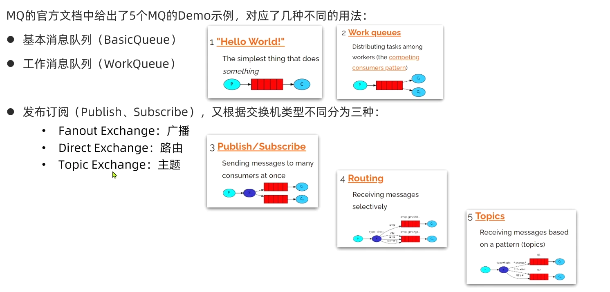

# 一、基本结构


RabbitMQ中的一些角色：

- **publisher**：生产者（消息发送者）
- **consumer**：消费者
- **exchange**：交换机，负责消息路由
- **queue**：队列，存储消息
- **VirtualHost**：虚拟主机，隔离不同租户的exchange、queue、消息


# 二、消息模型



# 三、SpringAMQP

 **SpringAMQP**是基于RabbitMQ封装的一套模板，并且还利用SpringBoot对其实现了自动装配，使用起来非常方便。

SpringAMQP是基于AMQP协议定义的一套API规范。spring-amqp是基础抽象，spring-rabbit是底层的默认实现。

## 1. Maven依赖

```xml
<!--AMQP依赖，包含RabbitMQ-->
<dependency>
    <groupId>org.springframework.boot</groupId>
    <artifactId>spring-boot-starter-amqp</artifactId>
</dependency>
```

## 2. yml配置

消息发布者和消息接收者都需要在application.yml中配置RabbitMQ的地址等信息：

```yaml
spring:
  rabbitmq:
    host: 192.168.134.130 # rabbitmq服务主机名
    port: 5672 # 端口
    virtual-host: / # 虚拟主机
    username: milk # 用户名
    password: 123456 # 密码
```


## 2. BasicQueue模型（基本用法）

**publisher**

发送消息，使用 **RabbitTemplate对象**

```java
//在需要发送消息的地方注入RabbitTemplate对象。
@Autowired
private RabbitTemplate rabbitTemplate;

@Test
public void testSimpleQueue() {
    // 队列名称
    String queueName = "simple.queue";
    // 消息
    String message = "hello, spring amqp!";
    // 发送消息
    rabbitTemplate.convertAndSend(queueName, message);
}
```


**consumer**

在consumer服务中新建一个类 SpringRabbitListener（叫什么名都可以，一般叫做xxListener）：

```java
@Component	//注册为bean	
public class SpringRabbitListener {
    @RabbitListener(queues = "simple.queue")	//使用该注解指明监听消息队列
    public void listenSimpleQueueMessage(String msg) throws InterruptedException {
        System.out.println("spring 消费者接收到消息：【" + msg + "】");
    }
}
```

被 **@RabbitListener** 注解的方法就是监听消息的方法，当有消息到达就会执行该方法体，其String类型的参数就是消息内容。


## 3. WorkQueue模型


**publisher**

这种模型发送消息的方式跟BasicQueue模型是一样的，只不过这种模型中的消息发布者发布消息的速率一般比较高，所以需要多个消费者来消费。

```java
// 模拟发送大量消息
for (int i = 0; i < 50; i++) {
    rabbitTemplate.convertAndSend(queueName, message + i);
    Thread.sleep(20);
}
```


**comsumer**

这种模型接收消息的方法也是同BasicQueue模型一样，都是使用 @RabbitListener 注解

```java
@RabbitListener(queues = "simple.queue")
public void listenWorkQueue1(String msg) throws InterruptedException {
    System.out.println("消费者1接收到消息：【" + msg + "】" + LocalTime.now());
    Thread.sleep(20);			//模拟消费者处理速度不一样
}

@RabbitListener(queues = "simple.queue")
public void listenWorkQueue2(String msg) throws InterruptedException {
    System.err.println("消费者2........接收到消息：【" + msg + "】" + LocalTime.now());
    Thread.sleep(200);
}
```


### 配置能者多劳（prefetch）

rabbitmq有一个预取机制，如果消息队列中有消息堆积，那么rabbitmq会把消息队列中的消息按照轮询机制预取给每个消费者。

也就是说消息是**平均分配**给每个消费者，并没有考虑到消费者的处理能力。

在consumer服务中配置预取数量：

```yaml
spring:
  rabbitmq:
    listener:
      simple:
        prefetch: 1 # 每次只能获取一条消息，处理完成才能获取下一个消息，这样处理速度快的就能处理更多消息。
```


## 4. 发布/订阅模型


Exchange（交换机）有以下**3种类型**：

- **Fanout**：广播，将消息交给所有绑定到交换机的队列
- **Direct**：定向，把消息交给符合指定**routing key** 的队列
- **Topic**：话题/通配符，把消息交给符合**routing pattern**（路由模式） 的队列

**Exchange只负责转发消息，不具备存储消息的能力**，因此如果没有任何队列与Exchange绑定，或者没有符合路由规则的队列，那么**消息会丢失**！


### 基于注解声明队列和交换机


### 4.1 FanoutExchange


1）  可以有多个队列

2）  每个队列都要**绑定**到Exchange（交换机）

3）  生产者发送的消息，只能发送到交换机，交换机来决定要发给哪个队列，生产者无法决定

4）  交换机把消息发送给**绑定到该交换机的<u>所有</u>队列**

5）  订阅队列的消费者都能拿到消息


**publisher**

```java
// 交换机名称
String exchangeName = "itcast.fanout";
// 消息
String message = "hello, everyone!";
//发送消息，参数依次是：交换机名称，RoutingKey，消息
rabbitTemplate.convertAndSend(exchangeName, null, message);
```


**consumer**

**在<u>consumer中</u>声明队列和交换机及其绑定关系**

#### 基于@Bean声明队列和交换机

以FanoutExchange为例：

```java
@Configuration	//使用一个配置类
public class FanoutConfig {

    //声明交换机，返回值为交换机类型 
    @Bean
    public FanoutExchange fanoutExchange(){
        return new FanoutExchange("itcast.fanout");
    }

	//声明队列
    @Bean
    public Queue fanoutQueue1(){
        return new Queue("fanout.queue1");
    }

	// 绑定队列到交换机上，这里的参数名要和上面定义的方法名一致。因为Bean对象的名称就是方法名
    @Bean
    public Binding bindingQueue1(Queue fanoutQueue1, FanoutExchange fanoutExchange){
        return BindingBuilder.bind(fanoutQueue1).to(fanoutExchange);
    }

	// 第2个队列
    @Bean
    public Queue fanoutQueue2(){
        return new Queue("fanout.queue2");
    }

	//绑定队列到交换机上
    @Bean
    public Binding bindingQueue2(Queue fanoutQueue2, FanoutExchange fanoutExchange){
        return BindingBuilder.bind(fanoutQueue2).to(fanoutExchange);
    }
}
```

消息接收：

```java
@RabbitListener(queues = "fanout.queue1")
public void listenFanoutQueue1(String msg) {
    System.out.println("消费者1接收到Fanout.queue1消息：【" + msg + "】");
}

@RabbitListener(queues = "fanout.queue2")
public void listenFanoutQueue2(String msg) {
    System.out.println("消费者2接收到Fanout.queue2消息：【" + msg + "】");
}
```


### 4.2 DirectExchange


- **队列与交换机的绑定**，不仅要指定交换机，还要指定一个**BindingKey**
- 消息的发送方在向 Exchange**发送消息时**，也必须指定 **消息的RoutingKey**。
- Exchange不再把消息交给每一个绑定的队列，而是根据 **消息的RoutingKey** 进行判断，只有**队列的BindingKey** 与 **消息的Routingkey** 完全一致，才会接收到消息
- 每个队列可以指定多个Binding


**publisher**

```java
// 发送消息。 指定 routingkey
rabbitTemplate.convertAndSend(exchangeName, "red", message);
```


**consumer**

#### 基于注解声明队列和交换机

```java
@RabbitListener(bindings = @QueueBinding(
    value = @Queue(name = "direct.queue1"),				//1.绑定队列
    exchange = @Exchange(name = "itcast.direct", type = ExchangeTypes.DIRECT), 		//2.绑定交换机，type 为交换机的类型。
    key = {"red", "blue"}				//3.指定BindingKey
))
public void listenDirectQueue1(String msg){
    System.out.println("消费者接收到direct.queue1的消息：【" + msg + "】");
}
```

#### @RabbitListener

- **bindings**：是一个**@QueueBinding**的数组。

- **queues**：String数组，用于声明监听的队列。


**@QueueBinding**

用于声明队列和交换机的绑定关系以及 bindingkey

- **value**：**@Queue类型**，用于声明队列
- **exchange**：**@Exchange类型**，用于声明交换机
- **key**：String数组，指定队列的bindingkey


### 4.3 TopicExchange

`Topic`类型的`Exchange`与`Direct`相比，都是可以根据`RoutingKey`把消息路由到不同的队列。只不过`TopicExchange`可以让队列在指定 **BindingKey** 的时候使用**通配符**！

队列的**BindingKey** 一般都是由一个或多个单词组成，多个单词之间以 `.` 分割，例如： `item.insert` 。

而使用 TopicExchange时，可以使用通配符：

**通配符规则：**

`#`：匹配一个或多个词

`*`：匹配一个词


上图中，所有以 `china.` 开头的routingkey的消息都会发送到queue1

而以 `.news` 结尾的routingkey的消息都会发送到queue2


**publisher**

```java
//routingkey为 china.news。
rabbitTemplate.convertAndSend(exchangeName, "china.news", message);
```

**consumer**

```java
@RabbitListener(bindings = @QueueBinding(
    value = @Queue(name = "topic.queue1"),		//队列名
    exchange = @Exchange(name = "itcast.topic", type = ExchangeTypes.TOPIC),		//交换机名，交换机类型
    key = "china.#"			//bindingkey，使用了通配符
))
public void listenTopicQueue1(String msg){
    System.out.println("消费者接收到topic.queue1的消息：【" + msg + "】");
}
```


## 5. 消息转换器

上述中发送消息的方法：`convertAndSend` 中的消息参数的类型其实是一个 Object类型，也就是说不仅仅可以传送String类型的消息，可以传入任意Java对象。

Spring会把发送的消息对象序列化为字节发送给MQ，接收消息的时候，还会把字节反序列化为Java对象。

**默认**情况下Spring采用的序列化方式是JDK序列化。

我们可以配置其他的序列化方式，下面以 JSON格式的序列化方式为例。


**配置JSON转换器**

Spring对消息对象的处理是由 `org.springframework.amqp.support.converter.MessageConverter接口` 来处理的，其默认实现是 `SimpleMessageConverter` ，基于 JDK 的 `ObjectOutputStream` 来完成序列化的。

如果想把对象序列化为JSON格式，只需要定义一个**MessageConverter类型**的Bean即可。


在publisher和consumer的**启动类**中添加一个Bean：

```java
import org.springframework.amqp.support.converter.Jackson2JsonMessageConverter;
import org.springframework.amqp.support.converter.MessageConverter;	//一定要注意是amqp这个包中的MessageConverter

@Bean
public MessageConverter jsonMessageConverter(){
    return new Jackson2JsonMessageConverter();
}
```

这样消息发送方可以这样发送消息：

```java
@Test
public void testSendMsg(){
    String queueName = "simple.queue";
    User user = new User("张三",18,new String[]{"足球","篮球"});
    rabbitTemplate.convertAndSend(queueName,user);	//可以传入一个对象
}
```

接收方可以这样接收消息：

```java
    @RabbitListener(queues = "simple.queue")
    public void listenWorkQueue1(Map<String,Object> user){	//用Map类型的参数接收对象类型的消息。
        System.out.println(user);
        System.out.println(user.get("hobby").getClass());
        System.out.println("消费者接收到消息:" + user );
    }
```


# 四、消息可靠性

RabbitMQ有四种保证消息可靠性的机制：

- 生产者确认机制
- 消息持久化
- 消费者确认机制
- 失败重试机制

## 1. 生产者消息确认

RabbitMQ提供了**publisher confirm**机制来避免消息发送到MQ过程中丢失。这种机制必须给每个消息指定一个**全局唯一ID**。消息发送到MQ以后，会返回一个结果给<u>发送者</u>，表示消息是否处理成功。

返回结果有两种方式：

- **publisher-confirm**，发送者确认
  - 消息成功投递到交换机，返回ack
  - 消息未投递到交换机，返回nack
- **publisher-return**，发送者回执
  - 消息投递到交换机了，但是没有路由到队列。返回ACK，及路由失败原因。

### 1.1 配置发布者消息确认

首先，修改**publisher服务**中的application.yml文件，添加下面的内容：

```yaml
spring:
  rabbitmq:
    publisher-confirm-type: correlated
    publisher-returns: true
    template:
      mandatory: true   
```

说明：

- `publish-confirm-type`：开启publisher-confirm，这里支持两种类型：
  - `simple`：同步等待confirm结果，直到超时
  - `correlated`：异步回调，定义`ConfirmCallback方法`，MQ返回结果时会回调这个`ConfirmCallback方法`
- `publish-returns`：开启publish-return功能，同样是基于回调机制，不过是定义`ReturnCallback`
- `template.mandatory`：定义<u>消息路由失败</u>时的策略。`true`，则调用`ReturnCallback`；`false`：则直接丢弃消息

### 1.2 定义Return回调

**每个RabbitTemplate只能配置一个ReturnCallback（全局唯一）**，因此需要在项目加载时配置：

修改publisher服务，添加一个类：

```java
package cn.itcast.mq.config;

import lombok.extern.slf4j.Slf4j;
import org.springframework.amqp.rabbit.core.RabbitTemplate;
import org.springframework.beans.BeansException;
import org.springframework.context.ApplicationContext;
import org.springframework.context.ApplicationContextAware;
import org.springframework.context.annotation.Configuration;

@Slf4j
@Configuration
public class CommonConfig implements ApplicationContextAware {
    @Override
    public void setApplicationContext(ApplicationContext applicationContext) throws BeansException {
        // 获取RabbitTemplate
        RabbitTemplate rabbitTemplate = applicationContext.getBean(RabbitTemplate.class);
        // 设置ReturnCallback
        rabbitTemplate.setReturnCallback((message, replyCode, replyText, exchange, routingKey) -> {
            // 投递到队列失败，记录日志
            log.info("消息发送到队列失败，应答码{}，失败原因{}，交换机{}，路由键{},消息{}",
                     replyCode, replyText, exchange, routingKey, message.toString());
            // 如果有业务需要，可以重发消息
        });
    }
}
```

`ApplicationContextAware` 接口是 Spring容器 ApplicationContext 的一个通知接口，它会在ApplicationContext 初始化之后把ApplicationContext对象传递给`setApplicationContext`方法，然后我们就可以在这个方法中获取 `RabbitTemplate`对象，从而添加`ReturnCallback`，使其全局生效。

### 1.3 定义ConfirmCallback

ConfirmCallback可以在<u>发送消息时</u>指定，因为每个业务处理confirm成功或失败的逻辑不一定相同。

在publisher服务的cn.itcast.mq.spring.SpringAmqpTest类中，定义一个单元测试方法：

```java
public void testSendMessage2SimpleQueue() throws InterruptedException {
    // 1.消息体
    String message = "hello, spring amqp!";
    // 2.全局唯一的消息ID，需要封装到CorrelationData中
    CorrelationData correlationData = new CorrelationData(UUID.randomUUID().toString());
    // 3.添加callback。addCallback方法有两个参数，第一个是成功时的回调函数，另一个是失败时的回调函数，都是函数式接口，所以传递的lambda表达式
    correlationData.getFuture().addCallback(
        //收到confirm
        result -> {
            if(result.isAck()){
                // 3.1.ack，消息投递到交换机成功
                log.debug("消息投递到交换机成功, ID:{}", correlationData.getId());
            }else{
                // 3.2.nack，消息投递到交换机失败
                log.error("消息投递到交换机失败, ID:{}, 原因{}",correlationData.getId(), result.getReason());
            }
        },
        //如果没有收到confirm确认，那么就会产生异常
        ex -> log.error("消息发送异常, ID:{}, 原因{}",correlationData.getId(),ex.getMessage())
    );
    
    // 4.发送消息。参数依次是： 交换机 routingkey 消息 correlationData 
    // 由于我们配置的comfirm类型是 correlated，所以需要传递一个correlationData，它包括 全局唯一的消息ID 还有 ConfirmCallback
    rabbitTemplate.convertAndSend("task.direct", "task", message, correlationData);

    // 休眠一会儿，等待ack回执
    Thread.sleep(2000);
}
```

## 2. 消息持久化

**生产者确认**可以确保消息投递到RabbitMQ的队列中，但是消息发送到RabbitMQ以后，如果突然宕机，也可能导致消息丢失。

要想确保消息在RabbitMQ中安全保存，必须开启消息持久化机制。

- **交换机持久化**
- **队列持久化**
- **消息持久化**

### 2.1 交换机持久化

RabbitMQ中交换机**默认是非持久化的**，mq重启后就丢失。

SpringAMQP中可以通过代码指定交换机持久化：

```java
@Bean
public DirectExchange simpleExchange(){
    // 三个参数：交换机名称、是否持久化、当没有queue与其绑定时是否自动删除
    return new DirectExchange("simple.direct", true, false);
}
```

**事实上，默认情况下，由SpringAMQP声明的交换机都是持久化的**。

### 2.2 队列持久化

RabbitMQ中队列**默认是非持久化**的，mq重启后就丢失。

SpringAMQP中可以通过代码指定交换机持久化：

```java
@Bean
public Queue simpleQueue(){
    // 使用QueueBuilder构建队列，durable就是持久化的
    return QueueBuilder.durable("simple.queue").build();
}
```

**但是，默认情况下，由SpringAMQP声明的队列都是持久化的。**

### 2.3 消息持久化

利用SpringAMQP发送消息时，可以设置消息的属性（MessageProperties），指定**delivery-mode**：

- 1：非持久化
- 2：持久化

用java代码指定：


**默认情况下，SpringAMQP发出的任何消息都是持久化的，不用特意指定。**


## 3. 消费者消息确认

RabbitMQ是**阅后即焚**机制，RabbitMQ确认消息被消费者消费后会立刻删除。

而RabbitMQ是通过**消费者回执**来确认消费者是否成功处理消息的：消费者获取消息后，应该向RabbitMQ发送ACK回执，表明自己已经处理消息。

设想这样的场景：

- 1）RabbitMQ投递消息给消费者
- 2）消费者获取消息后，返回ACK给RabbitMQ
- 3）RabbitMQ删除消息
- 4）消费者宕机，消息尚未处理

这样，消息就丢失了。因此消费者返回ACK的时机非常重要。

### 3.1 三种确认模式

而SpringAMQP则允许配置**三种确认模式**：

- **manual**：手动ack，需要在业务代码结束后，调用api发送ack。

- **auto**（推荐）：自动ack，由SpringAmqp监测listener代码是否出现异常，没有异常则返回ack；抛出异常则返回nack。

- **none**：关闭ack，MQ假定消费者获取消息后会成功处理，因此消息投递后立即被删除

一般，我们都是使用默认的auto即可。

消费者如果向MQ返回ack，那么MQ会把消息删除，如果返回nack，那么消息会重新进入队列中。

### 3.2 配置消费者消息确认

在consumer服务中的 application.yml 文件中配置：

```yml
spring:
  rabbitmq:
    listener:
      simple:
        acknowledge-mode: none # 这里填写三种模式：none manual auto
```


## 4. 消费失败重试机制

当消费者出现异常后，消息会不断requeue（重入队）到队列，再重新发送给消费者，然后再次异常，再次requeue，无限循环，导致mq的消息处理飙升，带来不必要的压力。

### 4.1 消费者本地重试

我们可以利用**SpringAmqp的retry机制**，在消费者出现异常时利用<u>本地重试</u>，而不是无限制地requeue到mq队列。

修改**consumer**服务的application.yml文件，添加内容：

```yaml
spring:
  rabbitmq:
    listener:
      simple:
        retry:
          enabled: true # 开启消费者失败重试
          initial-interval: 1000 # 初始的失败等待时长为1秒
          multiplier: 1 # 失败的等待时长倍数，下次等待时长 = multiplier * last-interval
          max-attempts: 3 # 最大重试次数
          stateless: true # true无状态（默认状态）；false有状态。如果业务中包含事务，这里改为false
```

开启消费者失败重试后，默认情况下：

- 消息处理过程中出现异常，不会requeue到队列，而是在消费者本地重试，也就是说消费者本地也会暂存消息。

- **重试达到最大次数后，SpringAmqp会返回reject给MQ，并且抛出`AmqpRejectAndDontRequeueException`异常，MQ会把消息直接丢弃**。

  

### 4.2 失败策略

在开启重试模式后，重试次数耗尽，如果消息依然失败，失败后执行的策略是通过 **MessageRecovery接口** 处理的，它包含三种不同的实现：

- **RejectAndDontRequeueRecoverer**：重试耗尽后，向MQ返回reject，并且抛出异常，MQ会直接丢弃消息。**默认**就是这种方式

- **ImmediateRequeueMessageRecoverer**：重试耗尽后，返回nack，消息重新入队。

- **RepublishMessageRecoverer（推荐）**：重试耗尽后，将失败消息投递到指定的交换机。


比较优雅的一种处理方案是 **RepublishMessageRecoverer**，失败后将消息投递到一个指定的，专门存放异常消息的队列，后续由人工集中处理。

在**consumer**中添加如下配置类：

```java
@Configuration
public class ErrorMessageConfig {
    //声明存放异常消息的队列和交换机
    @Bean
    public DirectExchange errorMessageExchange(){
        return new DirectExchange("error.direct");
    }
    @Bean
    public Queue errorQueue(){
        return new Queue("error.queue", true);
    }
    @Bean
    public Binding errorBinding(Queue errorQueue, DirectExchange errorMessageExchange){
        return BindingBuilder.bind(errorQueue).to(errorMessageExchange).with("error");
    }
	
    //定义一个RepublishMessageRecoverer
    @Bean
    public MessageRecoverer republishMessageRecoverer(RabbitTemplate rabbitTemplate){
        //指定交换机的名字和routingkey
        return new RepublishMessageRecoverer(rabbitTemplate, "error.direct", "error");
    }
}
```


# 五、死信交换机

死信交换机也可以用于提高消息的可靠性。

## 1. 概念

当一个队列中的消息满足下列情况之一时，可以成为 **死信（dead letter）**：

- 消息被消费者reject或者返回nack，并且消息的requeue参数设置为false
- 消息是一个过期消息，超时无人消费
- 要投递的队列消息满了，无法投递

如果这个<u>包含死信的队列</u>配置了`dead-letter-exchange参数`，指定了一个交换机，那么队列中的死信就会投递到这个交换机中，而这个交换机称为**死信交换机**（Dead Letter Exchange，简称DLX）。


**队列将死信投递给死信交换机时，必须指定两个信息**：

- 死信交换机名称。给队列设置 `dead-letter-exchange参数` 
- 死信交换机发送到死信队列使用的RoutingKey。给队列设置 `dead-letter-routing-key参数` 


## 2. 消息的TTL

一个队列中的消息如果超时（TTL结束）未消费，则会变为死信，TTL超时分为两种情况：

- 消息所在的队列设置了超时时间。要给队列设置超时时间，需要在声明队列时配置`x-message-ttl`属性。
- 消息本身设置了超时时间。

消息到达队列的那一刻就开始计时。

如果一个消息跟队列都同时设置了TTL，以两者中小的那一个来计算。


## 3. 死信交换机实现延迟队列

利用TTL结合死信交换机，我们可以实现消息发出后，消费者延迟收到消息的效果。这种消息模式就称为**延迟队列（Delay Queue）模式**。

步骤如下：

### 3.1 声明死信交换机


在**consumer**服务中，定义一个消费者，让它监听死信交换机，这样就能实现延时收到消息了。

声明死信交换机、死信队列及其绑定关系：

```java
@RabbitListener(bindings = @QueueBinding(
    value = @Queue(name = "dl.ttl.queue", durable = "true"),
    exchange = @Exchange(name = "dl.ttl.direct"),
    key = "dl"
))
public void listenDlQueue(String msg){
    log.info("接收到 dl.ttl.queue的延迟消息：{}", msg);
}
```

### 3.2 给队列指定死信交换机和TTL


```java
@Bean
public Queue ttlQueue(){
    return QueueBuilder.durable("ttl.queue") // 指定队列名称，并持久化
        .ttl(5000) // 设置队列中消息的超时时间，5秒
        .deadLetterExchange("dl.ttl.direct") // 指定死信交换机
        .deadLetterRoutingKey("dl")			//指定死信RoutingKey
        .build();
}
```

注意，这个队列设定了死信交换机为`dl.ttl.direct`

声明普通的Direct交换机，将ttl队列与该交换机绑定：

```java
@Bean
public DirectExchange ttlExchange(){
    return new DirectExchange("ttl.direct");
}
@Bean
public Binding ttlBinding(){
    return BindingBuilder.bind(ttlQueue()).to(ttlExchange()).with("ttl");
}
```

### 3.3 发送消息

由于我们给队列设置了TTL，所以在发送消息时就不需要指定消息的TTL了。

```java
@Test
public void testTTLQueue() {
    // 创建消息
    String message = "hello, ttl queue";
    // 消息ID，需要封装到CorrelationData中
    CorrelationData correlationData = new CorrelationData(UUID.randomUUID().toString());
    // 发送消息
    rabbitTemplate.convertAndSend("ttl.direct", "ttl", message, correlationData);
    // 记录日志
    log.debug("发送消息成功");
}
```

#### 设置消息的TTL

在发送消息时，也可以指定TTL （通过 `setExpiration方法`）：

```java
@Test
public void testTTLMsg() {
    // 创建消息
    Message message = MessageBuilder
        .withBody("hello, ttl message".getBytes(StandardCharsets.UTF_8))
        .setExpiration("5000")
        .build();
    // 消息ID，需要封装到CorrelationData中
    CorrelationData correlationData = new CorrelationData(UUID.randomUUID().toString());
    // 发送消息
    rabbitTemplate.convertAndSend("ttl.direct", "ttl", message, correlationData);
    log.debug("发送消息成功");
}
```


## 4. DelayExchange

RabbitMQ的官方推出了一个插件，原生支持延迟队列效果。

这个插件就是**DelayExchange插件**。参见笔记。


# 六、惰性队列

使用惰性队列可以解决生产者发送消息速度超过消费者处理速度而导致的消息堆积问题。

## 1. 概念

从RabbitMQ的3.6.0版本开始，就增加了 **Lazy Queues** 的概念，也就是惰性队列。惰性队列的特征如下：

- 接收到消息后<u>直接存入磁盘</u>而非内存
- 消费者要消费消息时才会从磁盘中读取并加载到内存
- 支持数百万条的消息存储

## 2. 基于控制页面或命令行设置lazy-queue

而要设置一个队列为惰性队列，只需要在**声明队列**时，指定 `x-queue-mode参数` 为 `lazy` 即可。


也可以通过命令行将一个运行中的队列修改为惰性队列：

```sh
rabbitmqctl set_policy Lazy "^lazy-queue$" '{"queue-mode":"lazy"}' --apply-to queues  
```

命令解读：

- `rabbitmqctl` ：RabbitMQ的命令行工具
- `set_policy` ：添加一个策略
- `Lazy` ：策略名称，可以自定义
- `"^lazy-queue$"` ：用正则表达式匹配队列的名字
- `'{"queue-mode":"lazy"}'` ：设置队列模式为lazy模式
- `--apply-to queues  `：策略的作用对象，是所有的队列


## 3. 基于@Bean声明lazy-queue


## 4. 基于@RabbitListener声明LazyQueue


# 七、RabbitMQ集群

## 1. 集群分类

RabbitMQ的集群有三种模式：

- **普通集群**：是一种分布式集群，将队列分散到集群的各个节点，从而提高整个集群的并发能力。

- **镜像集群**：是一种主从集群，普通集群的基础上，添加了主从备份功能，提高集群的数据可用性。

- **仲裁队列**：镜像集群虽然支持主从，但主从同步并不是强一致的，某些情况下可能有数据丢失的风险。因此在RabbitMQ的3.8版本以后，推出了新的功能：**仲裁队列**来代替镜像集群，底层采用Raft协议确保主从的数据一致性。


## 2. 普通集群（默认）

普通集群，或者叫**标准集群（classic cluster）**，具备下列特征：

- 会在集群的各个节点间**共享**部分数据，包括：**交换机、队列元信息**。**不包含队列以及队列中的消息。**交换机是每个节点所共享的，而队列是不共享的，每个节点只有其他节点中的队列的”引用“。
- 当访问集群某节点时，如果队列不在该节点，会把消息从消息队列所在节点传递到当前节点并返回。
- 队列所在节点宕机，队列中的消息就会丢失

例如我们有2个MQ：mq1，和mq2，如果你的消息在mq1，而你连接到了mq2，那么mq2会去mq1拉取消息，然后返回给你。如果mq1宕机，消息就会丢失。

**部署见笔记**


## 3. 镜像集群

镜像模式：与普通模式不同，队列会在各个mq的镜像节点之间同步，因此你连接到任何一个镜像节点，均可获取到消息。而且如果一个节点宕机，并不会导致数据丢失。不过，这种方式增加了数据同步的带宽消耗。

镜像集群：本质是**主从模式**，具备下面的特征：

- **交换机、队列、队列中的消息** 会在各个mq的镜像节点之间同步备份。
- 创建队列的节点被称为该队列的**主节点，**备份该队列的其它节点叫做该队列的**镜像**节点。
- 一个队列的主节点可能是另一个队列的镜像节点
- 所有操作都是主节点完成，然后同步给镜像节点。用户发送给队列的一切请求，例如发送消息、消息回执默认都会在主节点完成，如果是从节点接收到请求，也会路由到主节点去完成。**镜像节点仅仅起到备份数据作用**。当主节点接收到消费者的ACK时，所有镜像都会删除节点中的消息。
- 主宕机后，镜像节点会替代成新的主
- 不具备负载均衡功能，因为所有操作都会有主节点完成（但是不同队列，其主节点可以不同，可以利用这个提高吞吐量）

**部署见笔记**


## 4. 仲裁队列

仲裁队列：仲裁队列是3.8版本以后才有的新功能，用来替代镜像队列，具备下列特征：

- 与镜像队列一样，都是**主从模式**，支持主从数据同步
- 使用非常简单，没有复杂的配置
- 主从同步基于Raft协议，强一致

### 4.1 部署

先按照普通集群的部署方式部署。

然后在任意节点控制台添加一个队列，一定要选择队列类型为**Quorum类型**。


在任意控制台查看队列：


可以看到，仲裁队列的 + 2字样。代表这个队列有2个镜像节点。

因为仲裁队列默认的镜像数为5。如果你的集群有7个节点，那么镜像数肯定是5；而我们集群只有3个节点，因此镜像数量就是3.

### 4.3 Java代码创建仲裁队列

我们可以在Java代码中通过如下代码创建一个仲裁队列。

```java
@Bean
public Queue quorumQueue() {
    return QueueBuilder
        .durable("quorum.queue") // 持久化
        .quorum() // 仲裁队列
        .build();
}
```

如果要使用MQ集群，那么需要修改一下微服务的配置文件：

### 4.4 SpringAMQP连接MQ集群配置

注意，这里用addresses来代替host、port方式

```java
spring:
  rabbitmq:
    addresses: 192.168.150.105:8071, 192.168.150.105:8072, 192.168.150.105:8073
    username: itcast
    password: 123321
    virtual-host: /
```

