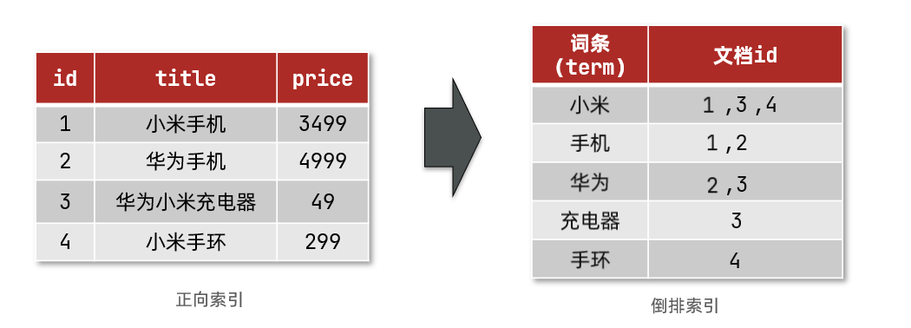
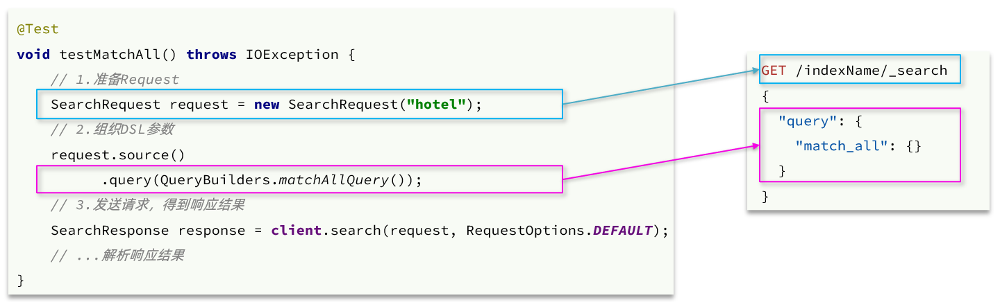
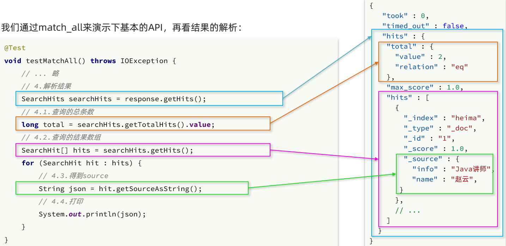
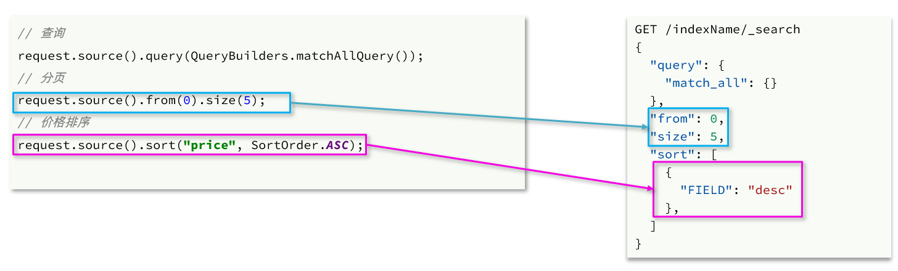

# 一、倒排索引

倒排索引中有两个非常重要的概念：

- **文档（Document）**：用来搜索的数据，其中的**每一条数据**就是一个文档。例如一个网页、一个商品信息
- **词条（Term）**：对文档数据或用户搜索数据，利用某种算法分词，得到的具备含义的词语就是词条。例如：我是中国人，就可以分为：我、是、中国人、中国、国人这样的几个词条


**创建倒排索引**是对正向索引的一种特殊处理，流程如下：

- 将每一个文档的数据利用算法分词，得到一个个**词条**
- 创建索引表，每行数据包括词条、词条所在文档id、文档位置等信息。对于每一个文档，如果它分成的词条已经在索引表中，那么把该文档的id添加到已经存在的词条的文档id中。
- 因为词条唯一性，可以**给词条创建索引**，例如hash表结构索引




**正向索引**是最传统的，根据id索引的方式。但<u>根据词条查询</u>时，必须先逐条获取每个文档，然后判断文档中是否包含所需要的词条，是**根据文档找词条的过程**。

而**倒排索引**则相反，是先找到用户要搜索的词条，根据词条得到包含词条的文档的id，然后根据id获取文档。是**根据词条找文档的过程**。


倒排索引的**搜索流程**如下（以搜索"华为手机"为例）：

1）用户输入条件`"华为手机"`进行搜索。

2）对用户输入内容**分词**，得到词条：`华为`、`手机`。

3）拿着词条在倒排索引中查找，可以得到包含词条的文档id：1、2、3。

4）拿着文档id到正向索引中查找具体文档。

如图：


虽然要先查询倒排索引，再查询倒排索引，但是无论是词条、还是文档id都建立了索引，查询速度非常快！无需全表扫描。


# 二、概念

Elasticsearch中有很多独有的概念，与MySQL中略有差别，但也有相似之处。

MySQL与Elasticsearch类比

| **MySQL** | **Elasticsearch** | **说明**                                                     |
| --------- | ----------------- | ------------------------------------------------------------ |
| Table     | Index             | **索引(index)**，就是<u>文档的集合</u>，类似数据库的表(Table) |
| Row       | Document          | **文档（Document）**，就是一条条的数据，类似数据库中的行（Row），文档都是JSON格式 |
| Column    | Field             | **字段（Field）**，就是JSON文档中的字段，类似数据库中的列（Column） |
| Schema    | Mapping           | **Mapping（映射）**是索引中文档的约束，例如字段类型约束。类似数据库的表结构（Schema） |
| SQL语句   | DSL语句           | **DSL**是Elasticsearch提供的JSON风格的请求语句，用来操作Elasticsearch，实现CRUD |

例如：

MySQL中的商品表       对应       ES中Index


在企业中，往往是两者结合使用：

- **对安全性要求较高的写操作**，使用MySQL实现
- **对查询性能要求较高的搜索需求**，使用Elasticsearch实现
- 两者再基于某种方式，实现数据的同步，保证一致性


# 三、分词器（analyzer）

分词器就是用于把一段文本进行切分，划分为多个词条。

ES在创建倒排索引时，需要对文档分词；在搜索时，也需要对用户的输入内容分词。


但是默认的分词规则对中文处理并不友好。处理中文分词，一般会使用 **[IK分词器](https://github.com/medcl/elasticsearch-analysis-ik)** 。

IK分词器安装与配置词典见笔记。

IK分词器包含两种模式：

* `ik_smart`：最少切分。内存占用更少
* `ik_max_word`：最细切分。产生的分词更多，匹配更精确


如果要实现自动补全，还需要安装拼音分词器。


分词器是以插件的方式提供的。

ES中**分词器（analyzer）**的组成包含三部分：

- **character filters**：在tokenizer之前对文本进行处理。例如删除字符、替换字符
- **tokenizer**：将文本按照一定的规则切割成词条（term）。例如keyword，就是不分词。例如ik_smart就属于tokenizer
- **tokenizer filter**：将tokenizer输出的词条做进一步处理。例如大小写转换、同义词处理、拼音处理等


文档分词时会依次由这三部分来处理文档：


# 四、基本CRUD操作

ES中通过**Restful风格**请求操作索引库，文档。请求内容用 **DSL语句** 表示。

也就是说，要对索引库进行相应的操作，只需要写出 请求方式，请求路径，请求体（DSL语句）即可。


## 1. 索引库操作

索引库就类似数据库表，mapping映射就类似表的结构。

### 1.1 mapping映射属性

**mapping是对索引库中文档的约束**，常见的mapping属性包括：

- **type**：字段数据类型，常见的简单类型有：
  - 字符串：text（可分词的文本）、keyword（精确值，例如：品牌、国家、ip地址）
  - 数值：long、integer、short、byte、double、float
  - 布尔：boolean
  - 日期：date
  - 对象：object
  - 地理坐标，里面包含经度、纬度：geo_point
- **index**：是否创建索引，**默认为true**
- **analyzer**：使用哪种分词器
- **properties**：该字段的子字段
- **copy_to** ：把该字段的值拷贝到另一个字段


### 1.2 创建索引库和映射

**基本语法：**

- 请求方式：PUT
- 请求路径：/索引库名，可以自定义
- 请求体：mapping映射DSL

格式：

```json
PUT /索引库名称
{
  "mappings": {		 
    "properties": {
      "字段名":{
        "type": "text",		
        "analyzer": "ik_smart"
      },
      "字段名2":{
        "type": "keyword",
        "index": "false"
      },
      "字段名3":{
        "type": "object",
        "properties": {
          "子字段名": {
            "type": "keyword"
          }
        }
      },
      // ...略
    }
  },
  "settings":{
      //创建索引库时，还可以配置分词器等设置，后面会讲。
  }
}
```

**示例：**

```
PUT /hotel
{
  "mappings": {			//固定写法
    "properties": {		//固定写法，properties对象里面写索引库的字段结构
      "id": {
        "type": "keyword"
      },
      "name":{
        "type": "text",
        "analyzer": "ik_max_word",
        "copy_to": "all"		//把name字段的值拷贝到 all字段上
      },
      "address":{
        "type": "keyword",
        "index": false
      },
      "price":{
        "type": "integer"
      },
      "score":{
        "type": "integer"
      },
      "brand":{
        "type": "keyword",
        "copy_to": "all"
      },
      "city":{
        "type": "keyword",
        "copy_to": "all"
      },
      "starName":{
        "type": "keyword"
      },
      "business":{
        "type": "keyword"
      },
      "location":{
        "type": "geo_point"		//location字段的类型为 geo_point，是一种地理坐标点类型。
      },
      "pic":{
        "type": "keyword",
        "index": false
      },
      "all":{
        "type": "text",
        "analyzer": "ik_max_word"
      }
    }
  }
}
```


### 1.3 查询索引库的mapping

```
GET /索引库名/_mapping
```

### 1.4 查询索引库

```
GET /索引库名
```

### 1.5 修改索引库（添加字段）

**因此索引库一旦创建，无法修改mapping。**

虽然无法修改mapping中已有的字段，但是**却允许添加新的字段到mapping中**

**语法说明**：

```json
PUT /索引库名/_mapping
{
  "properties": {
    "新字段名":{
      "type": "integer"	 
    }
  }
}
```

### 1.6 删除索引库

```
DELETE /索引库名
```


## 2. 文档操作

### 2.1 新增文档

```json
POST /索引库名/_doc/文档id
{
    "字段1": "值1",
    "字段2": 值2,
    "字段3": {
        "子属性1": "值3",
        "子属性2": "值4"
    },
    // ...
}
```

注：文档id也可以不指定，如果没有指定 ES会自动生成。

### 2.2 查询文档

```json
GET /索引库名称/_doc/id
```

### 2.3 删除文档

```js
DELETE /索引库名/_doc/id值
```

### 2.4 修改文档

修改有两种方式：

- **全量修改**：直接覆盖原来的文档
- **增量修改**：修改文档中的部分字段


**全量修改是覆盖原来的文档**，其本质是：

- 根据指定的id删除文档
- 新增一个相同id的文档

**注意**：如果根据id删除时，id不存在，第二步的新增也会执行，也就从修改变成了新增操作了。

```
PUT /索引库名/_doc/文档id
{
    "字段1": "值1",
    "字段2": "值2",
    // ... 略
}
```


**增量修改**是只修改指定id匹配的文档中的部分字段。

```
POST /索引库名/_update/文档id
{
    //这个doc是固定名称
    "doc": {
         "字段名": "新的值",
    }
}
```


# 五、查询（搜索）文档

这里的查询是指**搜索**，根据条件来搜索相应的文档。跟根据ID查询文档不同。

## 1. DSL查询（搜索）文档

### ①DSL搜索基本语法

```json
GET /索引库名/_search
{
  "query": {
    "查询类型": {
      "查询条件": "条件值"
    }
  }
}
```

### ②查询所有（match_all）

```
GET /indexName/_search
{
  "query": {
    "match_all": {		//查询类型为 match_all
    }
  }
}
```

### ③全文检索查询（match）

类似于SQL中的模糊查询。

- 对用户搜索的内容做分词，得到词条
- 根据词条去倒排索引库中匹配，得到文档id
- 根据文档id找到文档，返回给用户

比如百度的搜索框。

参与搜索的字段必须是可分词的**text类型**的字段。


常见的全文检索查询包括：

- **match**查询：单字段查询
- **multi_match**查询：多字段查询，任意一个字段符合条件就算符合查询条件

**match**查询语法如下：

```json
GET /indexName/_search
{
  "query": {
    "match": {		
      "FIELD": "TEXT"		TEXT一般就是用户输入的内容，FIELD是字段名。
    }
  }
}
```

**mulit_match**语法如下：

```json
GET /indexName/_search
{
  "query": {
    "multi_match": {
      "query": "TEXT",
      "fields": ["FIELD1", " FIELD2"]
    }
  }
}
```

注：搜索字段越多，对查询性能影响越大，**因此建议采用copy_to，然后单字段查询的方式。**


### ③精准查询

精确查询一般是查找**keyword、数值、日期、boolean**等类型字段。所以**不会**对搜索条件分词。


#### **term查询**

查询时，用户输入的内容跟字段值**完全匹配**时才认为符合条件。

```
// term查询
GET /indexName/_search
{
  "query": {
    "term": {
      "FIELD": {
        "value": "VALUE"
      }
    }
  }
}

等同于：
GET /indexName/_search
{
  "query": {
    "term": {
      "FIELD":"VALUE"
    }
  }
}
```

#### range查询

范围查询，一般应用在对数值类型做范围过滤的时候。比如做价格范围过滤。

基本语法：

```json
// range查询
GET /indexName/_search
{
  "query": {
    "range": {
      "FIELD": {
        "gte": 10, // 这里的gte代表大于等于，gt则代表大于
        "lte": 20 // lte代表小于等于，lt则代表小于
      }
    }
  }
}
```

### ④地理坐标查询

所谓的地理坐标查询，其实就是根据经纬度查询

#### **geo_bounding_box**查询

查询坐标落在某个矩形范围的所有文档

```json
// geo_bounding_box查询
GET /indexName/_search
{
  "query": {
    "geo_bounding_box": {
      "FIELD": {		//FIELD 为文档中属于geo_point类型的字段名
        "top_left": { // 左上点
          "lat": 31.1,		//纬度
          "lon": 121.5		//经度
        },
        "bottom_right": { // 右下点
          "lat": 30.9,
          "lon": 121.7
        }
      }
    }
  }
}
```

#### geo_distance

在地图上找一个点作为圆心，以指定距离为半径，画一个圆，落在圆内的坐标都算符合条件

```json
// geo_distance 查询
GET /indexName/_search
{
  "query": {
    "geo_distance": {
      "distance": "15km", // 半径
      "FIELD": "31.21,121.5" // 圆心的 纬度，经度 
      //FIELD 为文档中属于geo_point类型的字段名
    }
  }
}
```


### ⑤复合查询

**复合（compound）查询**：复合查询可以将其它简单查询组合起来，实现更复杂的搜索逻辑。


#### function_score 查询

**相关性算分：**当我们利用match查询时，文档结果会根据与搜索词条的关联度打分（**_score**），返回结果时按照分值**降序排列**。这个分数是ES根据一定的算法自动算出的。

而function_score 查询就可以控制默认的打分，从而影响结果的排序。


function score的运行流程如下：

1）根据**原始条件**查询搜索文档，并且计算相关性算分，称为**原始算分**（query score）

2）根据**过滤条件**，过滤文档

3）符合**过滤条件**的文档，基于**算分函数**运算，得到**函数算分**（function score）

4）将**原始算分**（query score）和**函数算分**（function score）基于**加权模式**做运算，得到最终结果，作为相关性算分。

因此，其中的关键点是：

- **过滤条件**：决定哪些文档的算分被修改
- **算分函数**：决定函数算分的算法
- **加权模式**：决定最终算分结果

示例：

```json
GET /hotel/_search
{
  "query": {
    "function_score": {
      "query": {  .... }, // 原始查询，可以是任意条件，
      "functions": [ // 算分函数
        {
          "filter": { // 满足的条件，品牌必须是如家
            "term": {	//这里使用 term查询
              "brand": "如家"
            }
          },
          "weight": 10 // 算分权重为10
        }
      ],
      "boost_mode": "sum" // 加权模式，求和
    }
  }
}
```


#### bool查询

布尔查询是一个或多个查询子句的组合，每一个子句就是一个**子查询**。子查询的组合方式有：

- **must**：必须匹配每个子查询，类似“与”
- **should**：选择性匹配子查询，类似“或”
- **must_not**：必须不匹配，**不参与算分**，类似“非”
- **filter**：必须匹配，**不参与算分**

需要注意的是，搜索时，参与**算分的字段越多，查询的性能也越差**。因此这种多条件查询时，建议这样做：

- 搜索框的关键字搜索，是全文检索查询，使用must查询，参与算分
- 其它过滤条件，采用filter查询。不参与算分

eg：

```json
GET /hotel/_search
{
  "query": {
    "bool": {
      "must": [
          //查询子句写在这里面，可以有多个查询子句。
        {"term": {"city": "上海" }} 
      ],
      "should": [
        {"term": {"brand": "皇冠假日" }},
        {"term": {"brand": "华美达" }}
      ],
      "must_not": [
        { "range": { "price": { "lte": 500 } }}
      ],
      "filter": [
        { "range": {"score": { "gte": 45 } }}
      ]
    }
  }
}
```

注：以上四个子查询是 `and` 的关系。


# 六、搜索结果处理

## ① 排序

elasticsearch**默认是根据相关度算分（_score）来排序**，但是也支持自定义方式对搜索[结果排序](https://www.elastic.co/guide/en/elasticsearch/reference/current/sort-search-results.html)。可以排序字段类型有：**keyword类型、数值类型、地理坐标类型、日期类型** 等。

**普通字段排序**

keyword、数值、日期类型排序的语法基本一致。

**语法**：

```json
GET /indexName/_search
{
  "query": {
    "match_all": {}
  },
  "sort": [				//"sort"是一个数组，可以指定多种排序方式，类似mysql里的排序方式
    {
      "FIELD1": "desc"  // 排序字段、排序方式ASC、DESC
    },
    {
      "FIELD2": "asc"   //如果FIELD1相等则按照FIELD2排序
    }
  ]
}
```


**地理坐标排序**

**语法说明**：

```json
GET /indexName/_search
{
  "query": {
    "match_all": {}
  },
  "sort": [
    {
      "_geo_distance" : {
          "FIELD" : "纬度，经度", // 文档中geo_point类型的字段名、目标坐标点
          "order" : "asc", // 排序方式
          "unit" : "km" // 排序的距离单位
      }
    }
  ]
}
```

这个查询的含义是：

- 指定一个坐标，作为目标点
- **计算每一个文档中，指定字段（必须是**geo_point类型）的坐标 到目标点的距离是多少
- 根据距离排序


## ② 分页

**基本分页**

类似于mysql中的`limit ?, ?`

```json
GET /hotel/_search
{
  "query": {
    "match_all": {}
  },
  "from": 0, // 分页开始的位置，默认为0		
  "size": 10, // 期望获取的文档总数
  "sort": [
    {"price": "asc"}
  ]
}
```

**深度分页问题**

假如 from 990 size 10

elasticsearch内部分页时，必须先查询 0~1000条，然后截取其中的990 ~ 1000的这10条，如果ES是集群，要想获取整个集群的TOP1000，必须先查询出每个节点的TOP1000，汇总结果后，重新排名，重新截取TOP1000。

**当查询分页深度较大时，汇总数据过多，而ES采用的集群方式，就会对内存和CPU会产生非常大的压力，因此elasticsearch会禁止from+ size 超过10000的请求。**

针对深度分页，ES提供了两种解决方案，[官方文档](https://www.elastic.co/guide/en/elasticsearch/reference/current/paginate-search-results.html)：

- **search after**：分页时需要排序，原理是从上一次的排序值开始，查询下一页数据。官方推荐使用的方式。
- **scroll**：原理将排序后的文档id形成快照，保存在内存。官方已经不推荐使用。


## ③ 关键词高亮

我们希望在搜索结果中给我们搜索的关键词高亮显示。

高亮显示的实现分为两步：

1）给文档中的所有关键字都添加一个标签，例如`<em>`标签。这一步es可以帮我们实现。

2）页面给`<em>`标签编写CSS样式


**高亮一定要使用全文检索查询**

**高亮的语法**：

```json
GET /hotel/_search
{
  "query": {
    "match": {
      "FIELD": "TEXT" // 查询条件，高亮一定要使用全文检索查询
    }
  },
  "highlight": {
    "fields": { 
      "FIELD": {		//需要高亮的字段名
        "pre_tags": "<em>",  // 用来标记高亮字段的前置标签。一般可以不加这两个属性，因为ES默认会添加em标签
        "post_tags": "</em>" // 用来标记高亮字段的后置标签
      }
    }
  }
}
```

**注意：**

- 高亮是对关键字高亮，因此**搜索条件必须带有关键字**，而不能是范围这样的查询。
- 默认情况下，**高亮的字段，必须与搜索指定的字段一致**，否则无法高亮
- 如果要对非搜索字段高亮，则需要添加一个属性：**required_field_match=false**


# 七、ES Rest Client

ES官方提供了各种不同语言的客户端，用来操作ES。**这些客户端的本质就是组装DSL语句，通过http请求发送给ES**。

其中的**Java Rest Client**又包括两种：

- Java Low Level Rest Client
- Java High Level Rest Client

我们学习的是**Java HighLevel Rest Client**客户端API

## 1. 引入依赖

引入es的RestHighLevelClient依赖：

```xml
<dependency>
    <groupId>org.elasticsearch.client</groupId>
    <artifactId>elasticsearch-rest-high-level-client</artifactId>
    这个版本一定要和ES的版本一致
    <version>7.12.1</version>	
</dependency>
```

> 注：spring-boot-starter-parent已经帮我们做了ES Rest Client的版本管理。

## 2. 初始化RestHighLevelClient

在Elasticsearch提供的API中，与Elasticsearch一切交互都封装在**RestHighLevelClient类**中。

```java
RestHighLevelClient client = new RestHighLevelClient(RestClient.builder(
    	//如果是es集群的话，这里需要写多个url
        HttpHost.create("http://192.168.150.101:9200")
));
```


## 3. CRUD通用步骤

使用RestHighLevelClient来操作索引库和文档通用步骤：

1）创建xxxRequest对象。

2）添加请求体，其实就是DSL的JSON参数部分。

3）发送请求。

例如：


## 4. 操作索引库

### ①创建索引库

```java
// 1.创建Request对象
CreateIndexRequest request = new CreateIndexRequest("hotel");
// 2.准备请求体：DSL语句
request.source(MAPPING_TEMPLATE, XContentType.JSON);
// 3.发送请求
client.indices().create(request, RequestOptions.DEFAULT);
```

### ②删除索引库

```java
// 1.创建Request对象
DeleteIndexRequest request = new DeleteIndexRequest("hotel");
// 2.发送请求
client.indices().delete(request, RequestOptions.DEFAULT);
```

### ③判断索引库是否存在

```java
// 1.创建Request对象
GetIndexRequest request = new GetIndexRequest("hotel");
// 2.发送请求
boolean exists = client.indices().exists(request, RequestOptions.DEFAULT);
```


## 5. 操作文档

### ①新增文档

**通常我们要将数据库中的酒店数据查询出来，写入elasticsearch中。**

也就是说，我们先从数据库中查询到数据，把数据映射为Java对象，再把Java对象序列化为JSON字符串，这个JSON字符串就是新增文档的DSL。

数据库中的一行----->Java对象----->DSL（文档JSON字符串）

```java
// 1.从数据库中查数据并封装成Java对象。
Hotel hotel = hotelService.getById(61083L);
HotelDoc hotelDoc = new HotelDoc(hotel);

// 2.将JAVA对象转为json
String json = JSON.toJSONString(hotelDoc);

// 1.准备Request对象
IndexRequest request = new IndexRequest("hotel").id(hotelDoc.getId().toString());
// 2.准备请求体：DSL语句
request.source(json, XContentType.JSON);
// 3.发送请求
client.index(request, RequestOptions.DEFAULT);
```

### ②根据文档ID查询文档


**GetResponse对象** 是对右边的结果JSON字符串的封装。

通过 `getSourceAsString方法` 可以获取到文档数据的JSON字符串，只需要把它反序列化为Java对象即可：

```java
// 1.准备Request
GetRequest request = new GetRequest("hotel", "61082");
// 2.发送请求，得到响应
GetResponse response = client.get(request, RequestOptions.DEFAULT);
// 3.解析响应结果
String json = response.getSourceAsString();
HotelDoc hotelDoc = JSON.parseObject(json, HotelDoc.class);
```

### ③删除文档

```java
// 1.准备Request
DeleteRequest request = new DeleteRequest("hotel", "61083");
// 2.发送请求
client.delete(request, RequestOptions.DEFAULT);
```

### ④修改文档

**全量修改**

在RestClient的API中，**全量修改与新增文档的API完全一致**，判断依据是ID：

- 如果新增时，ID已经存在，则修改
- 如果新增时，ID不存在，则新增


**增量修改**


注意`UpdateRequest#doc方法`的api，它接受可变参数，每对参数表示一个键值对，用逗号分隔

### ⑤批量操作文档

批量操作文档使用 **BulkRequest**，其本质就是将多个普通的CRUD请求组合在一起发送。

其中提供了一个**add方法**，用来添加其他请求：

- IndexRequest，也就是新增
- UpdateRequest，也就是修改
- DeleteRequest，也就是删除


以批量添加文档为例：

```java
// 从数据库查询数据
List<HotelDoc> hotelDocs = hotelService.list();

// 1.创建Request
BulkRequest request = new BulkRequest();
// 2.准备参数，添加多个新增的Request
for (HotelDoc hotelDoc : hotelDocs) {
    //add方法添加批量操作的Request
    request.add(new IndexRequest("hotel")
    .id(hotelDoc.getId().toString())
    .source(JSON.toJSONString(hotelDoc), XContentType.JSON));
}
// 3.发送请求
client.bulk(request, RequestOptions.DEFAULT);
```


## 6. 搜索

### ① 代码框架（match_all查询）

基本步骤包括：

1）准备Request对象。搜索文档使用的是 **SearchRequest** 对象。

2）准备请求体。对于不同的查询，只有这一步骤不同，其他都是相同的。

3）发起请求

4）解析响应


#### 发起查询请求

我们以**match_all**查询为例：



代码解读：

- 第一步，创建`SearchRequest`对象，指定索引库名

- 第二步，利用`request.source()`构建DSL，DSL中可以包含查询、分页、排序、高亮等
  - `query()`：代表查询条件，利用`QueryBuilders.matchAllQuery()`构建一个**match_all查询**的DSL
- 第三步，利用**client.search()**发送请求，得到响应

这里关键的API有两个，一个是`request.source()`，其中包含了查询、排序、分页、高亮等所有功能：


另一个是`QueryBuilders`，其中包含match、term、function_score、bool等各种查询：


#### 解析响应

**client.search()**方法返回的是一个 **SearchResponse**对象，该对象是对ES的查询结果JSON字符串的解析和封装。

所以SearchResponse中API也是像JSON一样有层次的，只需要对照ES的响应JSON字符串逐层解析即可。



#### 完整代码

```java
@Test
void testMatchAll() throws IOException {
    // 1.准备Request
    SearchRequest request = new SearchRequest("hotel");
    // 2.准备DSL
    request.source()
        .query(QueryBuilders.matchAllQuery());
    // 3.发送请求
    SearchResponse response = client.search(request, RequestOptions.DEFAULT);

    // 4.解析响应
    handleResponse(response);
}

private void handleResponse(SearchResponse response) {
    // 4.解析响应
    SearchHits searchHits = response.getHits();
    // 4.1.获取总条数
    long total = searchHits.getTotalHits().value;
    System.out.println("共搜索到" + total + "条数据");
    // 4.2.文档数组
    SearchHit[] hits = searchHits.getHits();
    // 4.3.遍历
    for (SearchHit hit : hits) {
        // 获取文档source
        String json = hit.getSourceAsString();
        // 反序列化
        HotelDoc hotelDoc = JSON.parseObject(json, HotelDoc.class);
        System.out.println("hotelDoc = " + hotelDoc);
    }
}
```

**注：下面的API介绍，只有第2步有所不同，其他的步骤如果没有特别声明，都是同上面的一样**


### ② 全文检索查询

全文检索的**match**和**multi_match**查询与match_all的API基本一致。差别是查询条件，也就是query的部分。

因此，Java代码上的差异主要是`request.source().query()`中的参数了。同样是利用QueryBuilders提供的方法：

 

```java
request.source()
       .query(QueryBuilders.matchQuery("all", "如家"));
```


### ③ 精确查询

只有query方法参数有差别。


### ④ bool查询

布尔查询是用**BoolQueryBuilder**的`must、filter`等方法组合其它查询，代码示例如下：

```java
// 准备BoolQueryBuilder对象
BoolQueryBuilder boolQuery = QueryBuilders.boolQuery();
// 添加must子查询
boolQuery.must(QueryBuilders.termQuery("city", "杭州"));
// 添加filter子查询
boolQuery.filter(QueryBuilders.rangeQuery("price").lte(250));
// 传入BoolQueryBuilder对象
request.source().query(boolQuery);
```


### ⑤ 排序、分页

搜索结果的*排序和分页*是与query同级的参数，因此同样是使用**request.source()**来设置。




### ⑥ 地理坐标排序


### ⑦ 高亮

高亮的代码与之前代码差异较大，有两点：

- 查询的DSL：其中除了查询条件，还需要添加高亮条件，同样是与query同级。
- 结果解析：结果除了要解析_source文档数据，还要解析高亮结果


高亮请求的构建API如下：


高亮查询必须使用全文检索查询，并且要有搜索关键字，将来才可以对关键字高亮。

完整代码如下：

```java
@Test
void testHighlight() throws IOException {
    // 1.准备Request
    SearchRequest request = new SearchRequest("hotel");
    // 2.准备DSL
    // 2.1.query
    request.source().query(QueryBuilders.matchQuery("all", "如家"));
    // 2.2.高亮
    request.source().highlighter(new HighlightBuilder().field("name").requireFieldMatch(false));
    // 3.发送请求
    SearchResponse response = client.search(request, RequestOptions.DEFAULT);
    // 4.解析响应
    handleResponse(response);
}
```

#### 高亮结果解析


```java
private void handleResponse(SearchResponse response) {
    // 4.解析响应
    SearchHits searchHits = response.getHits();
    // 4.1.获取总条数
    long total = searchHits.getTotalHits().value;
    System.out.println("共搜索到" + total + "条数据");
    // 4.2.文档数组
    SearchHit[] hits = searchHits.getHits();
    // 4.3.遍历
    for (SearchHit hit : hits) {
        // 获取文档source
        String json = hit.getSourceAsString();
        // 反序列化
        HotelDoc hotelDoc = JSON.parseObject(json, HotelDoc.class);
        // 获取高亮结果
        Map<String, HighlightField> highlightFields = hit.getHighlightFields();
        if (!CollectionUtils.isEmpty(highlightFields)) {
            // 根据字段名获取高亮结果
            HighlightField highlightField = highlightFields.get("name");
            if (highlightField != null) {
                // 获取高亮值
                String name = highlightField.getFragments()[0].string();
                // 覆盖非高亮结果
                hotelDoc.setName(name);
            }
        }
        System.out.println("hotelDoc = " + hotelDoc);
    }
}
```


### ⑧ function_score查询

function_score查询 DSL结构如下：


对应的JavaAPI如下：


> 注：`sourceBuilder`就是  `request.source()`


# 八、数据聚合

## 1.  聚合的种类

聚合常见的有三类：

- **桶（Bucket）**聚合：用来对文档做分组
  - **TermAggregation**：按照文档字段值分组，例如按照品牌值分组、按照国家分组
  - **Date Histogram**：按照日期阶梯分组，例如一周为一组，或者一月为一组

- **度量（Metric）**聚合：用以计算一些值，比如：最大值、最小值、平均值等
  - Avg：求平均值
  - Max：求最大值
  - Min：求最小值
  - Stats：同时求max、min、avg、sum等
- **管道（pipeline）**聚合：其它聚合的结果为基础做聚合


**注意：**参加聚合的字段必须是keyword、日期、数值、布尔类型


## 2. DSL实现聚合

### 2.1 Bucket聚合

Bucket聚合类似于 MySQL中的 group by。

#### 语法

语法如下：

```json
GET /hotel/_search
{
  "size": 0,  // 设置size为0，结果中不包含文档，只包含聚合结果
  "aggs": { // 定义聚合
    "AGGNAME": { //1.给聚合起个名字，可以任意。例如brandAgg
      "terms": { // 2.聚合的类型。此处按照品牌值聚合，所以选择term
        "field": "brand", // 3.参与聚合的字段
        "size": 20 // 希望获取的聚合结果数量
      }
    }
  }
}
```

结果如图：


#### 聚合结果排序

默认情况下，Bucket聚合会统计Bucket内的文档数量，记为`_count`，并且按照`_count`降序排序。这个排列顺序是指 上图中 buckets数组中的排列顺序。

我们可以指定`order`属性，自定义聚合的排序方式：

```json
GET /hotel/_search
{
  "size": 0, 
  "aggs": {
    "brandAgg": {
      "terms": {
        "field": "brand",
        "order": {
          "_count": "asc" // 按照_count升序排列
        },
        "size": 20
      }
    }
  }
}
```

#### 限定聚合范围

默认情况下，Bucket聚合是对索引库的所有文档做聚合，但真实场景下，用户会输入搜索条件，因此聚合必须是对搜索结果聚合。那么聚合必须添加限定条件。

**我们可以限定要聚合的文档范围，只要添加query条件即可**：

```json
GET /hotel/_search
{
  "query": {
    "range": {
      "price": {
        "lte": 200 // 只对200元以下的文档聚合
      }
    }
  }, 
  "size": 0, 
  "aggs": {
    "brandAgg": {
      "terms": {
        "field": "brand",
        "size": 20
      }
    }
  }
}
```


### 2.2 Metric聚合

Metric聚合可以是Bucket聚合的子聚合，也就是分组后对每组分别计算 min、max等。

如果不是Bucket的子聚合，则是对所有结果计算。

语法如下：

```json
GET /hotel/_search
{
  "size": 0, 
  "aggs": {
    "brandAgg": { 
      "terms": { 
        "field": "brand", 
        "size": 20,
        "order":{
            "score_stats.avg": "desc"	//可以按照对子聚合的结果进行排序。
        }
      },
      "aggs": { // 是brands聚合的子聚合，也就是分组后对每组分别计算
        "score_stats": { // 聚合名称
          "stats": { // 聚合类型，这里stats可以计算min、max、avg等
            "field": "score" // 聚合字段，这里是score
          }
        }
      }
    }
  }
}
```


## 3. RestAPI实现聚合

聚合条件与query条件同级别，因此需要使用request.source()来指定聚合条件。

如果要指定聚合的范围，那么只需要通过 request.source().query() 来指定聚合的范围即可。

聚合条件的语法：


聚合的结果也与查询结果不同，API也比较特殊。不过同样是JSON逐层解析：


# 九、自动补全

配置分词器等参见笔记

ES提供了 [Completion Suggester](https://www.elastic.co/guide/en/elasticsearch/reference/7.6/search-suggesters.html)查询 来实现自动补全功能。这个查询会匹配以用户输入内容开头的词条并返回。为了提高补全查询的效率，对于文档中字段的类型有一些约束：

- 参与补全查询的字段必须是**completion类型**。

- 字段的内容一般是用来补全的多个词条形成的数组。

## 1. DSL语句

自动补全查询的DSL语句如下：

```json
// 自动补全查询
GET /test/_search
{
  "suggest": {
    "titleSuggest": {	//查询的名称，可以任意
      "text": "s", // 要查询的关键字
      "completion": {
        "field": "title", // 补全查询的字段
        "skip_duplicates": true, // 跳过重复的
        "size": 10 // 获取前10条结果
      }
    }
  }
}
```

## 2. RestClient API


自动补全的结果也比较特殊，解析的代码如下：


注意 ：图中 getSuggestion（）方法参数应该与返回结果中的 suggest名一致，图里面的  “hotelSuggestion” 应该是 “title_suggest” 。


# 十、数据同步

ES和数据库（MySQL）之间需要进行数据同步。

例如ES中的酒店数据来自于MySQL数据库，因此MySQL数据发生改变时，ES也必须跟着改变，这个就是ES与MySQL之间的**数据同步**。

常见的数据同步方案有三种：

## 1. **同步调用**


基本步骤如下：

- hotel-demo对外提供接口，用来修改elasticsearch中的数据
- 酒店管理服务在完成数据库操作后，直接调用hotel-demo提供的接口。

## 2. 异步通知


流程如下：

- hotel-admin对mysql数据库数据完成增、删、改后，发送MQ消息
- hotel-demo监听MQ，接收到消息后完成elasticsearch数据修改

## 3. 监听binlog


流程如下：

- 给mysql开启binlog功能
- mysql完成增、删、改操作都会记录在binlog中
- hotel-demo基于**canal**监听binlog变化，实时更新elasticsearch中的内容


# 十一、集群

见笔记

