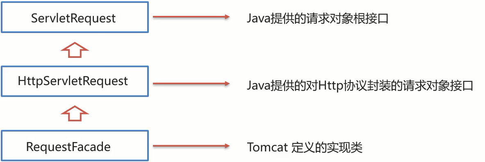

# JavaWeb

关于 Html、JavaScrpit、CSS相关基础知识，参看笔记中写的。

## 一、Servlet

### maven依赖

```xml
<dependency>
    <groupId>javax.servlet</groupId>
    <artifactId>javax.servlet-api</artifactId>
    <version>3.1.0</version>
    <!--
      此处为什么需要添加该标签?
      provided指的是在编译和测试过程中有效,最后生成的war包时不会加入
       因为Tomcat的lib目录中已经有servlet-api这个jar包，如果在生成war包的时候生效就会和Tomcat中的jar包冲突，导致报错
    -->
    <scope>provided</scope>
</dependency>
```

### Servlet接口

```java
import javax.servlet.*;
import java.io.IOException;

@WebServlet("/demo") //Servlet 的访问路径
public class ServletDemo1 implements Servlet {
	//每次发送请求访问Servlet就会调用这个方法
    public void service(ServletRequest servletRequest, ServletResponse servletResponse) throws ServletException, IOException {
        System.out.println("servlet hello world~");
    }
    //初始化方法
    public void init(ServletConfig servletConfig) throws ServletException {

    }
	//该方法一般把init方法中的ServletConfig作为返回值，即在实现类中声明一个ServletConfig变量，在init方法中把tomcat服务器传入的ServletConfig对象赋值给它，再在getServletConfig方法中将其返回。
    public ServletConfig getServletConfig() {
        return null;
    }
	//该方法用来返回Servlet的相关信息，没有什么太大的用处，一般我们返回一个空字符串即可
    public String getServletInfo() {
        return null;
    }
	
    //Servlet销毁时调用的方法
    public void destroy() {

    }
}
```

### 生命周期

**Servlet由web服务器创建，Servlet方法由web服务器调用**

Servlet运行在Servlet容器(web服务器)中，其生命周期由容器来管理，分为4个阶段：

**1.加载和实例化：**

​	默认情况，**Servlet会在第一次访问被容器创建**，但是如果创建Servlet比较耗时的话，那么我们会把Servlet的创建放到服务器启动的时候来创建，可以通过以下注解来实现：

```java
@WebServlet(urlPatterns = "/demo1",loadOnStartup = 1)
loadOnstartup的取值有两类情况
	（1）负整数:第一次访问时创建Servlet对象
	（2）0或正整数:服务器启动时创建Servlet对象，数字越小优先级越高
```

**2.初始化：**

​	在Servlet实例化之后，容器将调用Servlet的**init()方法**初始化这个对象，完成一些如加载配置文件、创建连接等初始化的工作。该方法**只调用一次**

**3.请求处理：**

​	**每次**请求Servlet时，Servlet容器都会调用Servlet的**service()**方法对请求进行处理

**4.服务终止：**

​	当需要释放内存或者容器关闭时，容器就会调用Servlet实例的**destroy()方法**完成资源的释放。在destroy()方法调用之后，容器会释放这个Servlet实例，该实例随后会被Java的垃圾收集器所回收。


### HttpServlet


因为我们将来开发B/S架构的web项目，都是针对HTTP协议，当客户端发送请求时使用的HTTP方法不同时，应该做区别处理，而直接在原始的Servlet中对不同的方法进行处理写代码会比较繁琐，所以我们会通过继承**HttpServlet类**来分别处理 GET方法 和 POST方法：

```java
@WebServlet("/demo4")
public class ServletDemo4 extends HttpServlet {
    @Override
    protected void doGet(HttpServletRequest req, HttpServletResponse resp) throws ServletException, IOException {
        //TODO GET 请求方式处理逻辑
        System.out.println("get...");
    }
    @Override
    protected void doPost(HttpServletRequest req, HttpServletResponse resp) throws ServletException, IOException {
        //TODO Post 请求方式处理逻辑
        System.out.println("post...");
    }
}
```

HttpServlet还有doHead、doPut等其他方法，可以按需求重写即可。

HttpServlet内部原理就是在service方法中根据请求方法的不同来调用响应的doxxx方法。


### URLPattern

**一个Servlet,可以配置多个urlPattern。**例如：`@WebServlet(urlPatterns = {"/demo1","/demo2"})`

Servlet的url配置有四种方式：

**1.精确匹配**

`@WebServlet(urlPatterns = "/demo")`


**2.目录匹配**

`@WebServlet(urlPatterns = "/user/*")`

`/*` 表示 零或多个层级访问目录

**精确匹配比目录匹配优先级要高**


**3.扩展名匹配**

`@WebServlet(urlPatterns = "*.任意后缀")`

**如果路径配置的不是扩展名，那么在路径的前面就必须要加`/`否则会报错**


**4.任意匹配**

`@WebServlet(urlPatterns = "/")` 或者 `@WebServlet(urlPatterns = "/*")`

`/`和`/*`的区别：

1. 当我们的项目中的Servlet配置了 "/",会覆盖掉tomcat中的DefaultServlet,当其他的url-pattern都匹配不上时都会走这个Servlet。

2. 当我们的项目中配置了"/*",意味着匹配任意访问路径。

3. **DefaultServlet**是用来处理**静态资源**，如果配置了"/"会把默认的覆盖掉，就会引发请求静态资源的时候没有走默认的而是走了自定义的Servlet类，最终导致静态资源不能被访问


### HttpServletRequest接口



ServletRequest和HttpServletRequest都是Java提供的，ServletRequest和HttpServletRequest是继承关系，并且两个都是**接口**。

RequestFacade类实现了HttpServletRequest接口，也间接实现了ServletRequest接口。

常用方法：

#### 获取请求行

请求行包含三块内容，分别是`请求方式`、`请求资源路径`、`HTTP协议及版本`


对于这三部分内容，request对象都提供了对应的API方法来获取，具体如下:

* 获取请求方式: `GET`

```
String getMethod()
```

* 获取虚拟目录(项目访问路径): `/request-demo`

```
String getContextPath()
```

* 获取URL(统一资源定位符): `http://localhost:8080/request-demo/req1`

```
StringBuffer getRequestURL()
```

* 获取URI(统一资源标识符): `/request-demo/req1`

```
String getRequestURI()
```

* 获取请求参数**(GET方式，且未经解析**): `username=zhangsan&password=123`

```
String getQueryString()
```


#### 获取请求头

`String getHeader(String name)` 用于获取请求头，name为键的名字


#### 获取请求体

获取**字节输入流**，如果前端发送的是字节数据，比如传递的是文件数据，则使用该方法

```
ServletInputStream getInputStream()
该方法可以获取字节
```

获取**字符输入流**，如果前端发送的是纯文本数据，则使用该方法

```
BufferedReader getReader()
```


#### 获取请求参数

对于请求参数的获取,常用的有以下两种:

* GET方式:

```
String getQueryString()	//获取的
```

* POST方式:

```
BufferedReader getReader();
```

但这两种方式获取到的都是**原生字符串**，没有解析过的


下面这三个方法就直接对请求参数进行了解析和封装，并且GET和POST方法都适用

获取所有参数Map集合

**Map<String,String[]> getParameterMap()**


根据名称获取参数值（数组）

**String[] getParameterValues(String name)**


根据名称获取参数值(单个值) **常用**

**String getParameter(String name)**


如果获取的POST请求参数出现乱码，可以如下设置：

```
httpServletRequest.setCharacterEncoding("UTF-8");
注意:设置的编码要和请求体中编码保持一致,并且一定要在获取Reader或者获取参数值之前调用
```


#### 请求转发（Forward）

ServletA 把请求转发给 ServletB：

```java
//ServletA 中的doGet() 或者 doPost()中调用
request.getRequestDispatcher("/b").forward(request,response);
//getRequestDispatcher的参数为ServletB的uri。不需要加项目的虚拟目录
```


通过请求转发，还可以在资源间共享数据，可以把数据保存在request对象中，然后转发给另一个资源。

需要使用request对象提供的三个方法:

* 存储数据到request域中 

```
void setAttribute(String name,Object o);
```

* 根据key获取值

```
Object getAttribute(String name);
```

* 根据key删除该键值对

```
void removeAttribute(String name);
```


### HttpServletResponse接口

Reponse的继承体系和Request的继承体系也非常相似:


#### 设置响应行

`void setStatus(int sc);` 设置状态码

HttpServletResponse接口中定义了很多常量状态码

例如：`HttpServletResponse.SC_OK //200`


#### 设置响应头

`void setHeader(String name,String value);` 设置响应头键值对

`response.setContentType("text/html;charset=utf-8");` 设置ContentType响应头


#### 设置响应体

对于响应体，是通过字符、字节输出流的方式写入响应体。

获取**字符输出流**:

```
PrintWriter getWriter();
```

获取**字节输出流**

```
ServletOutputStream getOutputStream();
```

**注意：**

如果要输出中文字符，必须在获取Writer之前调用 `response.setCharacterEncoding("UTF-8");` 或者`response.setContentType("text/html;charset=utf-8");` 


#### 设置重定向

重定向的实现方式：

1.设置重定向状态码

`response.setStatus(302)`

2.设置location响应头

`response.setHeader("Location","重定向的url")` 


重定向还有一种简化方式：

`response.sendRedirect("urlOfRedir")`  该方法会发送302状态码和Location响应头


**关于Location的值**：

1. 重定向的url可以是**绝对url** ，例如 `http://www.baidu.com`


2. 也可以是相对url

   - **如果相对url以 `/`开头**，那么它表示相对于 servlet容器的根（即 tomcat服务器的根）

     例如 `/Web/b` 就表示重定向到 `http://localhost:8080/Web/b`。

   - **如果相对url不以 `/` 开头**，那么表示相对于当前请求的URI。

     例如当前请求为 `http://localhost:8080/Web/a` ，location的值为 `b` ，那么就会重定向到 `http://localhost:8080/Web/b`


#### 重定向和请求转发的路径问题

假如当前项目的虚拟目录为 `/Web` （也就是通过 `request.getContextPath()` 获得的路径）

那么配置路径（url）的时候，对于不同的情况需要判断是否加上这个虚拟目录：

* 浏览器使用:需要加虚拟目录(项目访问路径)
* 服务端使用:不需要加虚拟目录

对于转发来说，因为是在服务端进行的，所以不需要加虚拟目录

对于重定向来说，路径最终是由浏览器来发送请求，就需要添加虚拟目录。（当然也可以不加）


例如：

* `<a href='url'>` 超链接，从浏览器发送，需要加虚拟目录
* `<form action='url'>` 表单，从浏览器发送，需要加
* req.getRequestDispatcher("path") 转发，是从服务器内部跳转，不需要加
* resp.sendRedirect("url") 重定向，是由浏览器进行跳转，可以加，也可以不加。


如果使用 sendRedirect 时，需要使用加上虚拟目录的方式来指定 location，由于虚拟目录可以通过 tomcat 进行配置，可能会发生改变，那么可以使用以下方法：

```java
String contextPath = request.getContextPath(); 	//动态获取虚拟目录
response.sendRedirect(contextPath+"/resp2"); //字符串拼接
```


**下文中 request 和 response 都是指 HttpServletRequest和 HttpServletResponse的对象**

### Cookie

**一、向客户端发送Cookie**

* 创建Cookie对象，并设置数据

```
Cookie cookie = new Cookie("key","value");
```

* 发送Cookie到客户端：使用**response对象**

```
response.addCookie(cookie);
```


**二、 从请求中获取Cookie**

- 获取客户端携带的所有Cookie，使用**request对象**

```
Cookie[] cookies = request.getCookies();
```

- 遍历数组，获取每一个Cookie对象：

```
for(Cookie cookie : cookies)
```

- 使用Cookie对象方法获取数据

```
cookie.getName();
cookie.getValue();
```


**三、Cookie原理**

服务器端通过设置**响应头** **Set-Cookie: name1=value1; name2=value2...** 向客户端发送Cookie。

客户端收到Cookie后，每次请求会携带**请求头** **Cookie: name1=value1; name2=value2...** ，里面就是cookie的内容，每个cookie 用 `;` 分割开。


**四、设置存活时间**

**默认情况下，Cookie存储在内存中，当浏览器关闭，内存释放，则Cookie被销毁。**

可以通过 `cookie.setMaxAge(int seconds)` 来设置Cookie的存活时间：

1. 正数：将Cookie写入浏览器所在电脑的硬盘，持久化存储。到时间自动删除

2. 负数：默认值，Cookie在当前浏览器内存中，当浏览器关闭，则Cookie被销毁

3. 零：删除对应Cookie


**五、存储中文字符**

Cookie不能直接存储中文字符。

如果需要在Cookie中存放中文字符，可以使用 **URLEncoder** 进行编码，之后获取该Cookie的时候，使用 **URLDecoder** 进行解码。

```java
String value = "张三";
//对中文进行URL编码
value = URLEncoder.encode(value, "UTF-8");
System.out.println("存储数据："+value);
//将编码后的值存入Cookie中
Cookie cookie = new Cookie("username",value);
      
//2. 发送Cookie，response
response.addCookie(cookie);
```


### Session

**一、Session原理**

**Session是基于Cookie来实现的**

当客户端第一次访问服务器时，request.getSession()会使服务器会为该次请求创建一个 session对象，每个session对象有一个session id，然后服务器会向客户端发送一个 cookie ：


里面包含了sessionid。**并且这个cookie的存活时间为 关闭浏览器就会清除**

当客户端在同一会话中（**不关闭浏览器就算同一次会话**，因为关闭就会清除session id所在的cookie）再次访问该服务器上的资源时，就会发送这个带有 sessionid的Cookie请求头。服务器再次调用request.getSession()方法就可以通过Cookie中的sessionid，查看其内存中是否有该sessionid对应的对象，如果已经存在，就直接返回该session对象，如果不存在，则会新创建一个session对象。


**二、Session的钝化与活化**

* **钝化**：在服务器**正常关闭**后，Tomcat会自动将Session对象写入硬盘的文件`SESSIONS.ser`中

* **活化**：再次启动服务器后，从文件中加载数据到Session对象中
  * 数据加载到Session对象中后，`SESSIONS.ser`文件会被删除掉

所以，如果浏览器不关闭，并且在服务器重启的这段时间内session没有过期，那么客户端在服务器重启后再次请求，该请求所关联的session对象依然是重启前的那一个。

但是如果浏览器关闭后再次请求服务器，服务器这是会创建新的一个 Session对象，并返回该对象的 session id。

**注意:**

* session数据存储在服务器内存，服务器正常关闭后，session数据会被持久化，服务器重启后又会重新加载到内存。

* 浏览器被关闭启动后，重新建立的连接就已经是一个全新的会话，获取的session也是一个新的对象

* session的数据要想共享，浏览器不能关闭，所以session数据不能长期保存数据
* cookie是存储在客户端，是可以长期保存


**三、Session的销毁**

session的销毁会有两种方式:

**1.过期自动销毁**

**默认情况下，客户端如果没有任何操作，30分钟后会自动销毁**

* 对于这个失效时间，是可以通过配置进行修改的

  * 在项目的**WEB-INF/web.xml**中配置

    ```xml
    <?xml version="1.0" encoding="UTF-8"?>
    <web-app xmlns="http://xmlns.jcp.org/xml/ns/javaee"
             xmlns:xsi="http://www.w3.org/2001/XMLSchema-instance"
             xsi:schemaLocation="http://xmlns.jcp.org/xml/ns/javaee http://xmlns.jcp.org/xml/ns/javaee/web-app_3_1.xsd"
             version="3.1">
    	
        单位为分钟
        <session-config>
            <session-timeout>100</session-timeout>
        </session-config>
    </web-app>
    ```

**2.主动销毁**

调用Session对象的**invalidate()方法**进行销毁

`session.invalidate();`

该销毁方法一般会在用户退出的时候，需要将session销毁掉。


## 二、Filter

### 创建Filter

使用Filter只需要实现 **Filter接口** 并添加 **@WebFilter注解** 即可

```java
import javax.servlet.*;
import javax.servlet.annotation.WebFilter;
import java.io.IOException;

@WebFilter("/*")    //表示这是一个Filter，并且对所有请求路径进行过滤。可以指定多个urlPatterns。
public class FilterDemo implements Filter {
    @Override
    public void init(FilterConfig filterConfig) throws ServletException {
    }

    @Override
    public void doFilter(ServletRequest request, ServletResponse response, FilterChain chain) throws IOException, ServletException {
        //在这里面写过滤逻辑
        
        //1.放行前需要做的事

        //2.放行。如果不放行则不需要调用该方法
        chain.doFilter(request,response);
        
        //3.放行后需要做的事
    }

    @Override
    public void destroy() {
    }
}
```


### 执行流程


放行请求之后，资源访问完后，会回到doFilter方法中，执行 `chain.doFilter(request,response);` 后的代码。


综上所述，`doFilter方法` 的通用逻辑结构如下：

```java
public void doFilter(ServletRequest request, ServletResponse response, FilterChain chain) throws IOException, ServletException {
        //放行前，对request中的数据进行处理

        //放行
        chain.doFilter(request,response);

        //放行后，资源访问成功后，对response中的数据进行处理
    }
```


### 过滤路径的配置

通过 **@WebFilter("path")** 注解来配置需要进行过滤的资源的路径

@WebFilter注解的value属性是String[]类型，所以可以配置多个过滤路径，例如：

`@WebFilter({"/servletA","/a.jsp"})`

**1.拦截具体的资源**

例如：`/index.jsp`  只拦截访问`index.jsp`的请求。

**2.目录拦截**

例如：`/user/*`  拦截对以`/user`开头的资源的所有请求

**3.后缀名拦截**

例如：`*.jsp`  拦截对后缀名为 jsp的资源的请求

**4.拦截所有**

例如： `/*` 拦截对该Web项目上所有资源的请求


### 过滤器链

一个Web应用，可以配置多个过滤器，这些过滤器构成一个过滤器链：


上图中的过滤器链执行是按照以下流程执行：

1. 执行 `Filter1` 的放行前逻辑代码
2. 执行 `Filter1` 的放行代码
3. 执行 `Filter2` 的放行前逻辑代码
4. 执行 `Filter2` 的放行代码
5. 访问到资源
6. 执行 `Filter2` 的放行后逻辑代码
7. 执行 `Filter1` 的放行后逻辑代码

**注意：** 注解配置的Filter，优先级按照**过滤器的类名字符串**来排序。例如上图中 Filter1在 Filter2的前面。


## 三、AJAX

### 原生AJAX

```js
//创建核心对象
var xhttp;
if (window.XMLHttpRequest) {
    xhttp = new XMLHttpRequest();
} else {
    // code for IE6, IE5
    xhttp = new ActiveXObject("Microsoft.XMLHTTP");
}

//发送请求
xhttp.open("GET","http://localhost/Web/ajaxServlet",true); //注意，url要写绝对url
xhttp.send();


//获取响应
xhttp.onreadystatechange = function(){
    if(this.readyState == 4 && this.status == 200){
        document.getElementById("demo").innerHTML = this.responseText;
    }
}
```


### Axios框架

- **GET方法**

  - 使用 **axios(config)**，config是一个js对象

  ```javascript
  axios({
    method: "get",
    url: "url"
   }).then(function (response) {
      //处理响应
      response.data;	//服务器相应的数据
    });
  ```

  - 使用 **axios.get(url[,config])**

  ```javascript
  axios.get("url").then(function(response){
  	//处理响应
  });
  ```

  

- **POST方法**

  - 使用 **axios(config)**，config是一个js对象

  ```javascript
  axios({
    method: "post",
    url: "url",
    data:"data"	//data可以是一个字符串，也可以是一个js对象
   }).then(function (response) {
      //处理响应
      response.data;	//服务器相应的数据
    });
  ```

  - 使用 **axios.post(url[, data[, config]])**

  ```javascript
  axios.post("url","data").then(function(response){
  	//处理响应
  });
  ```

## 四、JSON

`JSON` 字符串的**键要求必须使用双引号**括起来，而值根据要表示的类型确定。

### JSON 值

JSON 值可以是：

- 数字（整数或浮点数）

  `{ "age":30 }`

- 字符串（在双引号中）

- 逻辑值（true 或 false）

  `{ "flag":true }`

- 数组（在中括号中）

  ```json
  {
      "sites": [
          { "name":"百度" , "url":"www.baidu.com" }, 
          { "name":"google" , "url":"www.google.com" }, 
          { "name":"微博" , "url":"www.weibo.com" }
      ]
  }
  ```

- 对象（在大括号中）

- null

  `{ "void":null }`


## 五、Vue

### 基本用法

1. **新建 HTML 页面，引入 Vue.js文件**

   ```html
   <script src="js/vue.js"></script>
   ```

2. **在JS代码区域，创建Vue核心对象，进行数据绑定**

   ```js
   new Vue({
       el: "#app",
       data() {	 // data() 是 ECMAScript 6 版本的新的写法，等同于下面注释的
           return {
               username: ""
           }
       }
       /*data: function () {
           return {
               username:""
           }
       }*/
   });
   ```

   创建 Vue 对象时，需要传递一个 js 对象，而该对象中需要如下属性：

   * `el` ： 它的值为一个选择器表达式，用来指定哪些标签受 Vue 管理。 `#app` 表示id属性为 `app`的标签受到Vue管理。
   * `data` ：用来定义数据模型
   * `methods` ：用来定义函数。

3. **编写视图**

   ```html
   <div id="app">
       <input name="username" v-model="username" >
       {{username}}
   </div>
   ```

   `{{}}` 是 Vue 中定义的 `插值表达式` ，在里面写数据模型，到时候会将该模型的数据值展示在这个位置。


### **Vue指令**

**指令：**HTML 标签上带有 v- 前缀的特殊属性，不同指令具有不同含义。

**v-bind**

该指令可以给标签原有属性绑定模型数据。这样模型数据发生变化，标签属性值也随之发生变化

```html
<body>
    <div id="app">
        <a :href="url">百度一下</a>	等价于 <a v-bind:href="url">百度一下</a>
        <input v-model="url"/>
    </div>

    <script>
        new Vue({
            el:"#app",
            data(){
                return {
                    url:"https://www.baidu.com"
                }
            }
        });
    </script>
</body>
```


**v-model**

该指令可以给表单项标签绑定模型数据。这样就能实现双向绑定效果。例如上述代码中的：

```
<input v-model="url"/>
```

这样，当用户输入相应的字符串后，`url`的值也会响应变化。


**v-on** 

为HTML标签绑定事件。

语法： `v-on:事件="方法名()"`  等价于 `@事件="方法名()"` 。

**注意**：`v-on:` 后面的事件名称是原生事件属性名去掉on。

例如：

* 单击事件 ： 事件属性名是 onclick，而在vue中使用是 `v-on:click`
* 失去焦点事件：事件属性名是 onblur，而在vue中使用时 `v-on:blur`


例如：`<input type="button" value="一个按钮" v-on:click="show()">` 

​		等价于：`<input type="button" value="一个按钮" @click="show()">`

同时，需要在 Vue对象中的 `methods` 属性中，定义一个方法：

```js
new Vue({
    el: "#app",
    methods: {
    	/* ** */
        show(){
            alert("点击了按钮");
        }
        /* ** */
    }
});
```


**条件判断指令（v-if、v-show)**


```html
<body>
<div id="app">
    根据count的值来决定渲染哪个元素。
    <div v-if="count == 3">div1</div>
    <div v-else-if="count == 4">div2</div>
    <div v-else>div3</div>
    
    <hr>
    绑定数据模型
    <input v-model="count">
    
    不管count值为多少浏览器都会渲染该元素，只不过当条件表达式为false时，会把该元素的
    style属性设置为 "display: none"
    <div v-show="count == 3">div v-show</div>
</div>

<script src="js/vue.js"></script>
<script>
    //1. 创建Vue核心对象
    new Vue({
        el:"#app",
        data(){
            return {
                count:3
            }
        }
    });
</script>
</body>
```


**v-for**

它用来遍历数据模型

该指令使用的格式如下：

```html
<标签 v-for="变量名 in 集合模型数据">
    {{变量名}}
</标签>
```

如果在页面需要使用到集合模型数据的索引，就需要使用如下格式：

```html
<标签 v-for="(变量名,索引变量名) in 集合模型数据">
    <!--索引变量是从0开始，所以要表示序号的话，需要手动的加1-->
   {{索引变量 + 1}} {{变量名}}
</标签>
```

eg：

```html
<body>
<div id="app">
    <div v-for="addr in addrs">
        {{addr}} <br>
    </div>

    <hr>
    <div v-for="(addr,i) in addrs">
        {{i+1}}--{{addr}} <br>
    </div>
</div>

<script src="js/vue.js"></script>
<script>

    //1. 创建Vue核心对象
    new Vue({
        el:"#app",
        data(){
            return {
                addrs:["北京","上海","西安"]
            }
        }
    });
</script>
</body>
```


### mounted函数

Vue对象生命周期有八个阶段：每触发一个生命周期事件，会自动执行一个生命周期方法，这些生命周期方法也被称为钩子方法。

我们需要了解mounted函数：

`mounted`：**挂载完成，Vue初始化成功，HTML页面渲染成功。**而以后**我们会在该方法中发送异步请求，加载数据。**

eg:

```js
new Vue({
    el: "#app",
    data(){
        return{
            brands:[]
        }
    },
    mounted(){
        // 页面加载完成后，发送异步请求，查询数据
        var _this = this;
        axios({
            method:"get",
            url:"http://localhost:8080/brand-demo/selectAllServlet"
        }).then(function (resp) {
            _this.brands = resp.data;
        })
    }
})
```

