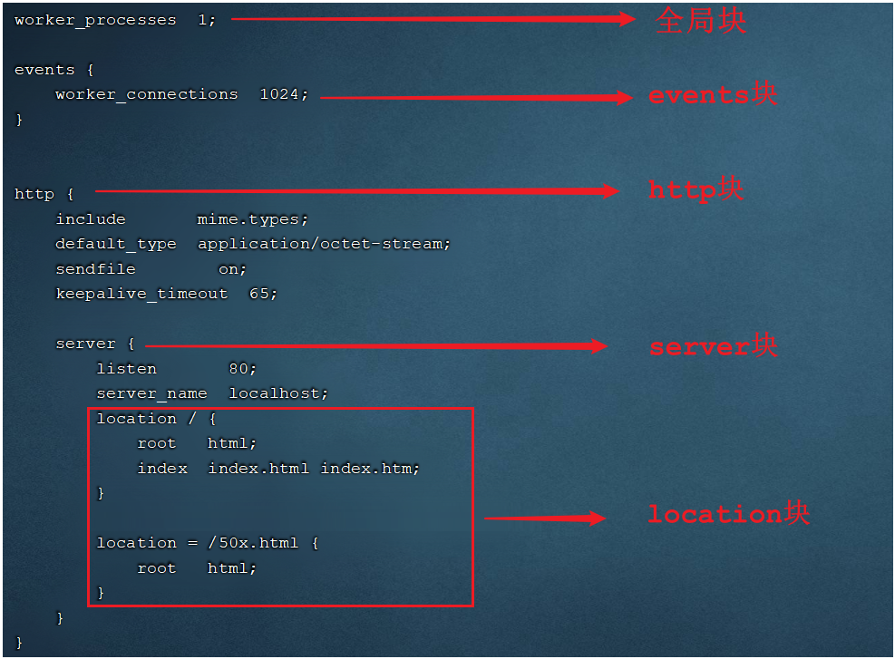
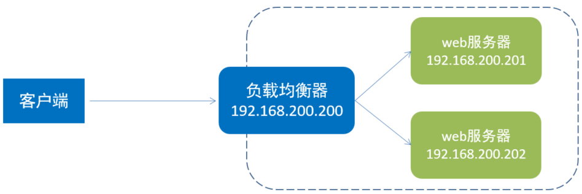
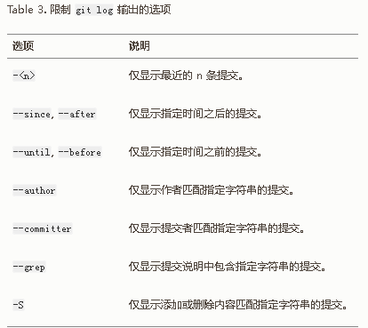
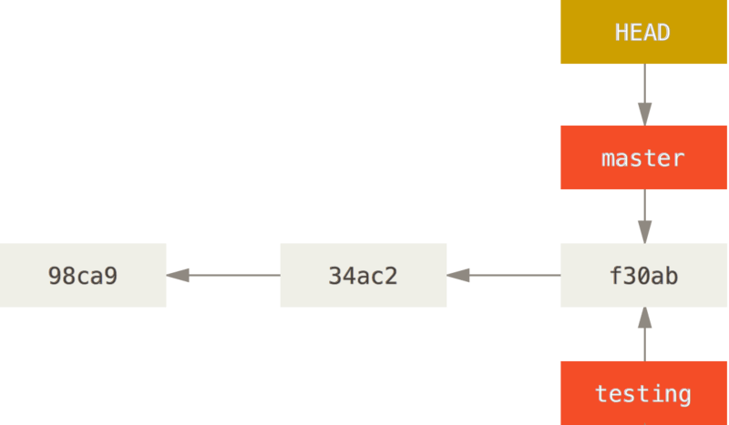
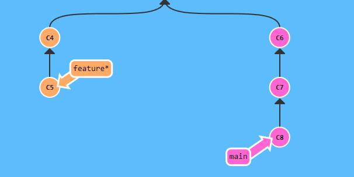
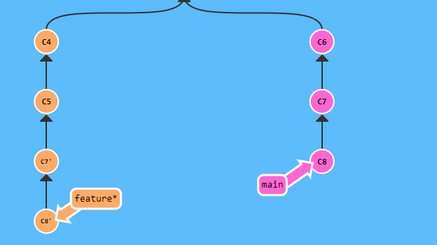
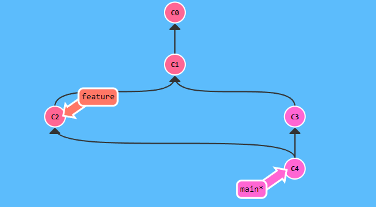

# 一、Linux

以CentOS7为例

## 1. 配置网卡

```sh
cd /etc/sysconfig/network-scripts
vi ifcfg-ens33 
```

ifcfg-ens33：

```
TYPE=Ethernet
PROXY_METHOD=none
BROWSER_ONLY=no
BOOTPROTO=static		#静态IP地址
IPADDR="192.168.136.130"  #IP地址
NETMASK="255.255.255.0"	  #子网掩码
GATEWAY="192.168.136.2"		#默认网关
DNS1="192.168.136.2"	#DNS服务器
DEFROUTE=yes
IPV4_FAILURE_FATAL=no
IPV6INIT=yes
IPV6_AUTOCONF=yes
IPV6_DEFROUTE=yes
IPV6_FAILURE_FATAL=no
IPV6_ADDR_GEN_MODE=stable-privacy
NAME=ens33
UUID=51cad41e-267d-4d69-90ce-2800e733ec05
DEVICE=ens33
ONBOOT=yes	#启动系统时初始化网卡
ZONE=public
```

配置完后：

```sh
systemctl restart network #重启网络
```


## 2. 目录说明

`~`	**表示当前用户的主目录**，例如root的就是 `/root` ， 其他的就是 `/home/用户名`
`.` 	表示目前所在的目录
`..` 	表示目前目录位置的上级目录

## 3. 命令

### cat

作用: 用于显示文件内容

语法: `cat [-n] fileName`

说明:
	`-n`:  输出行号

cat 指令会一次性查看文件的所有内容

### more

作用: 以分页的形式显示文件内容

语法: `more fileName`

操作说明:

​    `回车键` 	向下滚动一行
​    `空格键` 	向下滚动一屏
​    `b` 		返回上一屏
​    `q`或者`Ctrl+C`	退出more

### tail

作用: 查看文件末尾的内容，默认是查看文件最后 10 行的内容。

语法: `tail [-f] fileName`

说明:
	`-f` : 动态读取文件末尾内容并显示，通常用于日志文件的内容输出
	`-{number}` 显示文件最后 {number} 行的内容

### mkdir

语法: `mkdir [-p] dirName`

说明: 
	`-p`: 确保目录名称存在，不存在的就创建一个。通过此选项，可以实现多级目录同时创建

### rmdir

作用: 删除**空目录**

语法: `rmdir [-p] dirName`

说明:
	`-p`: 当子目录被删除后使父目录为空目录的话，则一并删除

### rm

作用: 删除文件或者目录

语法: `rm [-rfd] name`

说明: 
    `-r`:  将目录及目录中所有文件（目录）逐一删除，即递归删除

​    `-f`:  无需确认，强制删除

​	`-d`: 等于 `rmdir`

### cp

作用: 用于复制文件或目录

语法: `cp [-r] source dest`

说明: 
	`-r`: 如果复制的是目录需要使用此选项，此时将复制该目录下所有的子目录和文件

### mv

作用: 为文件或目录改名、或将文件或目录移动到其它位置

语法: `mv source dest`

举例: 
    `mv hello.txt hi.txt`                 将hello.txt**改名**为hi.txt
    `mv hi.txt itheima/`                  将文件hi.txt**移动**到itheima目录中
    `mv hi.txt itheima/hello.txt`   		将hi.txt**移动**到itheima目录中，**并改名**为hello.txt

*    `mv itcast/ itheima/`                 如果itheima目录不存在，将itcast目录改名为itheima
*    `mv itcast/ itheima/`                 如果itheima目录存在，将itcast目录移动到itheima目录中

### tar（打包压缩）

语法: `tar  [-zcxvf]  fileName  [files]`

​    包文件后缀为`.tar`表示只是完成了打包，并没有压缩

​    包文件后缀为`.tar.gz`表示打包的同时还进行了压缩

说明:
    `-z`: 压缩或者解压
    `-c`: c代表的是create，打包
    `-x`: x代表的是extract，拆包 

**-c 和 -x 互斥**

​    `-v`: v代表的是verbose，显示命令的执行过程

​    `-f`: f代表的是file，用于指定包文件的名称（`fileName` 参数表示的文件名）

​	`-C path`: 把提取出的文件提取到 path 指定的目录处

eg：
打包：`tar -cvf hello.tar ./*`		  		将当前目录下所有文件打包，打包后的文件名为hello.tar

压缩： `tar -zcvf hello.tar.gz ./*`		  	将当前目录下所有文件打包并压缩，打包后的文件名为hello.tar.gz

解包：`tar -xvf hello.tar`		  			将hello.tar文件进行解包，并将解包后的文件放在当前目录

解压： `tar -zxvf hello.tar.gz`		  		将hello.tar.gz文件进行解压，并将解压后的文件放在当前目录

解压到指定目录：`tar -zxvf hello.tar.gz -C /usr/local`     将hello.tar.gz文件进行解压，并将解压后的文件放在/usr/local目录

### vim

vim在进行文本编辑时共分为三种模式，分别是 **命令模式（Command mode），插入模式（Insert mode）和底行模式（Last line mode）**。

**命令模式**

通过vim命令打开文件后，默认进入命令模式

| 命令模式指令 | 含义                              |
| ------------ | --------------------------------- |
| gg           | 定位到文本内容的第一行            |
| G            | 定位到文本内容的最后一行          |
| dd           | 删除光标所在行的数据              |
| ndd          | 删除当前光标所在行及之后的n行数据 |
| u            | 撤销操作                          |
| shift+zz     | 保存并退出                        |
| i 或 a 或 o  | 进入插入模式                      |


   底行模式

​	A. 底行模式下可以通过命令对文件内容进行查找、显示行号、退出等操作

​	B. 在命令模式下按下 `:` 或者 `/` 任意一个，可以进入底行模式

​	C. 通过 `/` 方式进入底行模式后，可以对文件内容进行查找

​	D. 通过 `:` 方式进入底行模式后，可以输入`wq`（保存并退出）、`q!`（不保存退出）、`set nu`（显示行号）

| 底行模式命令 | 含义                                 |
| ------------ | ------------------------------------ |
| :wq          | 保存并退出                           |
| :q!          | 不保存退出                           |
| :set nu      | 显示行号                             |
| :set nonu    | 取消行号显示                         |
| :n           | 定位到第n行, 如 :10 就是定位到第10行 |

### find

作用: 在指定目录下查找文件

语法: `find dirName -option fileName`

举例:
    `find  .  –name "*.java"`			在当前目录及其子目录下查找.java结尾文件
    `find  /itcast  -name “*.java"`	在/itcast目录及其子目录下查找.java结尾的文件

### grep

作用: 从指定文件中查找指定的文本内容

语法: `grep PATTERN fileName`

PATTERN支持正则表达式

### ps

**指令：** ps

**作用：** 主要是查看服务器的进程信息

**选项含义：**
`-e`：等价于 ‘-A’ ，表示列出全部的进程
`-f`：显示全部的列（显示全字段）

惯用法：

```  
ps -ef | grep pname  #查看服务器中名为 pname 的进程。
```

`|` 在Linux中称为管道符，可以将前一个命令的结果输出给后一个命令作为输入

### systemctl

`systemctl` 是管理Linux中服务的命令，可以对服务进行启动、停止、重启、查看状态等操作

例如：

```sh
systemctl restart network #重启网络
```


### 防火墙操作命令（firewall-cmd）

| 操作                         | 指令                                                         | 备注                 |
| ---------------------------- | ------------------------------------------------------------ | -------------------- |
| 查看防火墙状态               | `systemctl status firewalld` 或者 `firewall-cmd --state`     |                      |
| 暂时关闭防火墙               | `systemctl stop firewalld`                                   |                      |
| 永久关闭防火墙(禁用开机自启) | `systemctl disable firewalld`                                | ==下次启动,才生效==  |
| 暂时开启防火墙               | `systemctl start firewalld`                                  |                      |
| 永久开启防火墙(启用开机自启) | `systemctl enable firewalld`                                 | ==下次启动,才生效==  |
| 开放指定端口                 | `firewall-cmd --zone=public --add-port=8080/tcp --permanent` | ==需要重新加载生效== |
| 关闭指定端口                 | `firewall-cmd --zone=public --remove-port=8080/tcp --permanent` | ==需要重新加载生效== |
| 立即生效(重新加载)           | `firewall-cmd --reload`                                      |                      |
| 查看开放端口                 | `firewall-cmd --zone=public --list-ports`                    |                      |

### kill

结束进程命令，惯用法 

```
ps -ef|grep pname #查看进程的pid
kill -9 pid #强制杀死进程
```

### rpm（包管理器）

**不能自行解决库依赖问题**

**RPM：**全称为 **Red-Hat Package Manager**，RPM软件包管理器，是红帽Linux用于管理和安装软件的工具。

```sh
rpm -qa							查询当前系统中安装的所有软件
rpm -qa | grep mysql			查询当前系统中安装的名称带mysql的软件
```

```
rpm -e --nodeps  软件名称         卸载软件
```

### yum（包管理器）

一种在线软件安装方式，本质上还是rpm安装，自动下载安装包并安装，安装过程中**自动解决库依赖问题**(安装过程需要联网)

```
yum list 软件名 				查看软件包
yum install 软件名				安装软件
```

### netstat

 netstat命令 用来打印Linux中网络系统的状态信息，可让你得知整个Linux系统的网络情况。

​	-l或--listening：显示监听中的服务器的Socket；
​	-n或--numeric：直接使用ip地址，而不通过域名服务器；
​	-p或--programs：显示正在使用Socket的程序识别码和程序名称；
​	-t或--tcp：显示TCP传输协议的连线状况；
​	-u或--udp：显示UDP传输协议的连线状况；

```sh
netstat -tunlp					查看所有进程的网络状态
netstat -tunlp | grep mysql		查看mysql的网络状态
```

### nohup

英文全称 no hang up（不挂起），用于不挂断地运行指定命令，退出终端不会影响程序的运行

**语法格式：** `nohup Command [Arg…] [&]`

**参数说明：**

​	`Command`：要执行的命令

​	`Arg`：一些参数，可以指定输出文件

​	`&`：让命令在后台运行

**举例：**

​	`nohup java -jar xxx.jar &> hello.log &`

​	上述指令的含义为： 后台运行 java -jar 命令，并将日志输出到hello.log文件。注意：其中的 `&>` 是固定搭配

### chmod

1). **chmod**（英文全拼：change mode）命令是控制用户对文件的权限的命令

2). Linux中的权限分为三种 ：**读(r)、写(w)、执行(x)**

3). Linux文件权限分为三级 : **文件所有者（Owner）、用户组（Group）、其它用户（Other Users）**

4). 只有**文件的所有者**和**超级用户**可以修改文件或目录的权限

5). 要执行Shell脚本需要有对此脚本文件的执行权限(x)，如果没有则不能执行

```
chmod +rw file      为所有用户授予写读权限
chmod -x file       为所有用户取消执行权限
chmod 777 file      为所有用户授予读、写、执行权限
```

三个数字分别代表不同用户的权限

- 第1位表示**文件拥有者**的权限 
- 第2位表示**同组用户**的权限
- 第3位表示**其他用户**的权限

每位数字表示对应的 rwx位的八进制数。例如： 6=110=rw-


## 4. /etc/profile

`/etc/profile` 是配置文件，可以在这里面配置环境变量等配置。

```sh
JAVA_HOME=/usr/local/jdk1.8.0_171
export PATH=$JAVA_HOME/bin:$PATH 	#类似于windows中的path。
```

PATH中的值用 `:` 分隔。

**注：**

修改了该文件后，应该使用 `source /etc/profile` 让配置生效。

### export

用于设置环境变量

而 `JAVA_HOME=/usr/local/jdk1.8.0_171` 表示自定义变量

**环境变量可以在其进程的子进程中继续有效，而自定义变量则无效。**


# 二、Nginx

## 1. 常用命令

### 查看版本 nginx -v

### 检查配置文件 nginx -t

### 启动 nginx

​	启动之后，我们可以直接访问Nginx的80端口：`http://服务器ip`

### 停止 nginx -s stop

### 重新加载 nginx -s reload

​	当修改了Nginx配置文件后，需要重新加载才能生效


## 2. 应用

### 2.1 配置文件结构

nginx的配置文件(conf/nginx.conf)整体上分为三部分: **全局块**、**events块**、**http块**。这三块的分别配置什么样的信息呢，看下表： 

| 区域     | 职责                                     |
| -------- | ---------------------------------------- |
| 全局块   | 配置和nginx运行相关的全局配置            |
| events块 | 配置和网络连接相关的配置                 |
| http块   | 配置代理、缓存、日志记录、虚拟主机等配置 |



在全局块、events块以及http块中，我们**经常配置的是http块**。

在http块中可以包含多个**server块**,每个server块可以配置多个**location块**。

结构如下：

```
1. 全局块
2. events块
3. http块
----3.1 http全局块
----3.2 server块
--------3.2.1 server全局块
--------3.2.2 location块
```


### 2.2 部署静态资源

将静态资源部署到Nginx非常简单，只需要将文件复制到Nginx安装目录下的**html目录**中即可。

下面是配置文件中的server块的内容：

**server** {
    **listen** 80;				#监听端口	
    **server_name** localhost;	#服务器名称
    **location** / {			#匹配客户端请求url
        **root** html;			#指定静态资源根目录
        **index** index.html;	#指定默认首页
    }
}


### 2.3 配置反向代理

在nginx中，我们可以在**nginx.conf**中的 **http块** 内配置反向代理: 

```properties
server {
    listen 82;
    server_name localhost;
    location / {
        proxy_pass http://192.168.200.201:8080; 	#反向代理配置，将请求转发到指定服务
    }
}
```

上述配置的含义为: 当我们访问nginx的82端口时，根据反向代理配置，会将请求转发到 http://192.168.200.201:8080 对应的服务上。


### 2.4 配置均衡负载



**3). 在nginx中配置负载均衡**

打开nginx的配置文件**nginx.conf** 中的 **http块**并增加如下配置: 

```properties
#upstream指令可以定义一组服务器
upstream targetserver{	
    server 192.168.200.201:8080;
    server 192.168.200.201:8081;
}

server {
    listen       8080;
    server_name  localhost;
    location / {
        proxy_pass http://targetserver;
    }
}
```

**默认的负载均衡策略是轮询。**

处理上述默认的轮询策略以外，在Nginx中还提供了其他的负载均衡策略，如下： 

| **名称**   | **说明**         | 特点                                                         |
| ---------- | ---------------- | ------------------------------------------------------------ |
| 轮询       | 默认方式         |                                                              |
| weight     | 权重方式         | 根据权重分发请求,权重大的分配到请求的概率大                  |
| ip_hash    | 依据ip分配方式   | 根据客户端请求的IP地址计算hash值， 根据hash值来分发请求, 同一个IP发起的请求, 会发转发到同一个服务器上 |
| least_conn | 依据最少连接方式 | 哪个服务器当前处理的连接少, 请求优先转发到这台服务器         |
| url_hash   | 依据url分配方式  | 根据客户端请求url的hash值，来分发请求, 同一个url请求, 会发转发到同一个服务器上 |
| fair       | 依据响应时间方式 | 优先把请求分发给处理请求时间短的服务器                       |

例如权重的配置： 

```properties
#upstream指令可以定义一组服务器
upstream targetserver{	
    server 192.168.200.201:8080 weight=10;
    server 192.168.200.201:8081 weight=5;
}
```

上述配置的weight权重是相对的，在上述的配置中，效果就是，在大数据量的请求下，最终8080接收的请求数是8081的两倍。


# 三、Git

## 1. 常用命令

熟悉的命令：

```sh
git init
git add fileName
git commit -m "message"
git status
```


### `git commit -a`

把所有已经跟踪过的文件暂存起来一并提交，跳过 `git add`再加入暂存区的步骤


### `git commit --amend`

有时候我们提交完了才发现漏掉了几个文件没有添加，或者提交信息写错了，又或者发现代码少写了一行。 此时，可以运行带有 `--amend` 选项的提交命令来重新提交。这个命令会将暂存区中的文件提交。 如果自上次提交以来你还未做任何修改（例如，在上次提交后马上执行了此命令）， 那么快照会保持不变，而你所修改的只是提交信息。

​	例如，你提交后发现忘记了暂存某些需要的修改，可以像下面这样操作：

```console
$ git commit -m 'initial commit'
$ git add forgotten_file
$ git commit --amend
```

**最终你只会有一个提交**——第二次提交将**代替**第一次提交的结果。


### **git reset**(重点)

常用法：

1. `git reset` = `git reset --mixed`

   取消暂存暂存区中的所有文件

2. `git reset filename` 

   取消暂存 filename 文件。不会修改工作目录。

3. `git reset --hard`

   丢弃**所有文件**自上次提交以来的工作目录中的修改和暂存区中的内容

   如果只想丢弃对**某个文件**的修改：`git checkout --filename`

4. `git reset --hard 提交hash/HEAD~`

   把 HEAD 指向某次提交（快照）或者前一次提交，并且把工作目录以及暂存区也指向该次提交。

5. `git reset --soft 提交hash/HEAD~ `

   把 HEAD 指向某次提交（快照），暂存区和工作目录不变。

**原理：**

​	`reset` 命令会以特定的顺序重写三棵树，在你指定以下选项时停止：

1. 移动 HEAD 分支的指向 **（若指定了 `--soft`，则到此停止）**
2. 使索引变成 HEAD **（若指定 `--mixed` 或者 默认情况（`git reset`），则到此停止）**
3. 使工作目录变成索引**（若指定`--hard`）**


### `git clone` 

克隆远程仓库

`git clone  <url>`

clone命令默认为该远程仓库命名为 `origin`，然后创建一个指向它的主分支（master或者main）的指针，并且在本地将其命名为`origin/master(或者main)`。 Git 也会创建一个与 origin 的主分支在指向同一个地方的本地主分支。

也可以给远程仓库另取一个名：

`git clone <url> newName`


### `git rm` 

​	在工作目录以及git仓库中一并删除（可恢复）。

​	如果要删除之前修改过或已经放到暂存区的文件，则必须使用强制删除选项 `-f`

`git rm --cached filename`

​	让文件保留在磁盘，但是并不想让 Git 继续跟踪。 当你忘记添加 `.gitignore` 文件，不小心把一个很大的日志文件或一堆 `.a` 这样的编译生成文件添加到暂存区时，这一做法尤其有用。 为达到这一目的，使用 `--cached` 选项


### 	`git mv file_from file_to`

​	运行 `git mv` 就相当于运行了下面三条命令：

```console
$ mv README.md README
$ git rm README.md
$ git add README
```


### 查看日志`git log`

不传入任何参数的默认情况下，查看提交历史：hash、作者名字、电邮、提交时间、提交说明。

| 选项              | 说明                                                         |
| :---------------- | ------------------------------------------------------------ |
| `-p`              | 按补丁格式显示每个提交引入的差异。                           |
| `-{n}`            | :只显示最近n条提交，例如：`git log -2`                       |
| `--stat`          | `-stat` 选项在每次提交的下面列出所有被修改过的文件、有多少文件被修改了以及被修改过的文件的哪些行被移除或是添加了。 在每次提交的最后还有一个总结。 |
| `--name-only`     | 仅在提交信息后显示已修改的文件清单。                         |
| `--name-status`   | 显示新增、修改、删除的文件清单。                             |
| `--abbrev-commit` | 仅显示 SHA-1 校验和所有 40 个字符中的前几个字符。            |
| `--relative-date` | 使用相对时间而不是完整格式显示日期（比如“2 weeks ago”）。    |
| `--graph`         | 在日志旁以 ASCII 图形显示分支与合并历史。                    |
| `--pretty`        | 使用其他格式显示历史提交信息。`--pretty=(oneline|short|full|fuller)` |
| `--oneline`       | `--pretty=oneline --abbrev-commit` 合用的简写。              |
| `--decorate`      | 查看各个分支指向的提交                                       |

过滤提交历史结果：




### 远程仓库(`git remote`)

- `git remote`

​	   它会列出你指定的每一个远程仓库的名字。

​	   选项 `-v`，会显示需要读写远程仓库名字与其对应的 URL。

- `git remote add <shortname> <url>`

​		添加一个新的远程 Git 仓库。`shortname`就代表这个仓库的 `url` 的简写

- `git fetch <shortname>`

​		这个命令会访问远程仓库，从中拉取所有你还没有的数据，不合并本地分支。

​		执行完成后，你将会拥有那个远程仓库中所有分支的引用，可以随时合并或查看。

​		必须注意 `git fetch` 命令只会将数据下载到你的本地仓库——它并不会自动合并或修改你当前的工作。 

- `git pull`

​		拉取远程仓库的内容并且把 本地分支的跟踪分支  合并到 本地分支。相当于：`git fetch 远程仓库 + git merge 远程分支`。

​		**跟踪分支**又叫**上游分支**：例如，当克隆一个仓库时，它通常会自动地创建一个跟踪 `origin/master` 的 `master` 分支。这个`origin/master`就叫上游分支。

​		所以当我们运行 `git pull`的时候，就会拉取远程仓库中内容，并且把 `origin/master` 合并到 本地的 `master`。

- `git push`

​		把本地分支推送到它的上游分支

**注意：** `git pull` 和 `git push` 都需要设置了上游分支才能够有效果。


- `git push <remote> <branchName>`

​		把本地分支branchName推送到远程仓库的branchName分支中，远程仓库如果没有branchName分支，则新建一个。

​		它其实是：`git push <remote> <localbranch>:<remotebranch>`的简写，因为localbranch和remotebranch一样所以简写了。例如：`git push origin serverfix:awesomebranch` 把本地的 `serverfix` 分支推送到远程仓库上的 `awesomebranch` 分支。

- `git remote show <remote>`

​		查看某一个远程仓库的更多信息

- `git remote rename <oldname> <newname>`

​		重命名远程仓库

- `git remote remove/rm <remote>`

​		移除远程仓库


### 分支

**Git 的分支，其实本质上仅仅是指向提交对象的可变指针。而 HEAD 也只是指针而已**

主分支 master或者main，只是一个约定的名字，跟其他分支没有任何区别。



#### git branch

本地分支：

- `git branch <branchName>`

  创建分支。仅仅是创建，并没有切换过去

- `git branch -d <branchName>`

  删除分支。`-D` 是强制删除

- `git branch -v`

  查看每一个分支的最后一次提交。

- `git branch --merged/--no-merged`

  查看哪些分支合并(没有合并)到了当前分支。

  `git branch --merged/--no-merged branchName` 则是查看branchName所指的分支的合并状态。

远程分支：

- `git branch (-u|--set-upstream-to) <remote>/<branch>`

  为当前分支设置它的上游分支为`<remote>/<branch>`

  `git branch (-u|--set-upstream-to) <remote>/<branch> <localBranch>`

  为本地分支 `localBranch` 设置上游分支。

- `git branch -vv`

  查看本地分支及其跟踪分支的情况。

  

**注意：**

**合并到** 的含义：

例如当前 HEAD 所指的分支为 master，运行 `git merge hotfix` ，就是指：**hotfix合并到master**。合并后master指向了合并后的提交，而hotfix不变。


#### git merge

- `git merge <branchName>`

  把 branchName分支 合并到 当前分支。

​		**快进（fast -forward）**：当你试图合并两个分支时， 如果顺着一个分支走下去能够到达另一个分支，那么 Git 在合并两者的时候， 只会简单的将指针向前推进（指针右移）。git默认是打开了 快进 模式 ，如果要强制禁用快进模式，请使用：`git merge --no-ff`。这样git 会创建一个新的提交来合并。

​		如果合并时遇到冲突，在解决冲突后，使用 git add把解决冲突后的文件标记为冲突已解决，并使用git commit继续合并分支。


#### git revert

- `git revert <commit>`

  这个命令会生成一个新的提交，这个新提交会撤销`commit`引入的修改，相当于没有提交 `commit` 的时候。

  例如：`C1<---- C2<---- C3`是提交树，当前HEAD指向C3。当我们运行 `git revert C3`

  那么会生成一个新的提交 `C1<---- C2<---- C3<---- C3'` ，`C3'` 和 `C2` 的内容完全一致。

  相当于抛弃掉了`C3` 中所做的修改。

- `git revert -m 1/2 <commit>`

  上述命令中 `C3` 的父提交只有一个，如果C3是两个分支合并过来的。那么就需要加上 `-m`选项，指定恢复哪一个父提交的版本， `-m 1` 指的是运行 `git merge`所在的分支，而 `-m 2` 指的就是 `git merge` 后面的参数所指的分支。


#### 切换分支`git checkout`

- `git checkout <branchName>` 

  分支切换。令HEAD指向某分支。**分支切换会改变你工作目录中的文件**

- `git checkout -b <newbranchname>`

  创建新分支的同时切换过去

- `git checkout -b <branch> <remote>/<branch>`

  创建一个新本地分支`<branch>`并且该分支跟踪远程仓库 `<remote>` 的 `<branch>` 分支，并切换到这个新创建的分支。

  该命令简写：`git checkout --track origin/serverfix` 。


#### 删除远程分支

`git push <remote> --delete <branch>`

删除远程仓库中的分支。


#### git rebase

`git rebase <branchName>`

把 `当前分支` 变基到 `branchName` 分支上。例如 `(test)git merge main` ，`main分支`不变，`test分支`变成了 `main`的后继提交。

例如：


```sh
$ git checkout feature
$ git rebase master
```


​		`C'` 和 `D'` 与 `C` `D` 的内容一样，只是提交id不同。

**rebase 和 merge 的区别：**

​	这两种整合方法的最终结果没有任何区别，但是变基使得提交历史更加整洁。 你在查看一个经过变基的分支的历史记录时会发现，尽管实际的开发工作是并行的， 但它们看上去就像是串行的一样，提交历史是一条直线没有分叉。


`git rebase <basebranch> <topicbranch>`

把 topicbranch 变基到 basebranch。这样就不需要先 checkout到topicbranch分支再rebase了。


### git cherry-pick

`git cherry-pick <commit>...`

它会提取该提交的补丁，之后尝试将其重新应用到当前分支上。效果相当于把commit代表的提交”合并“到当前分支。



`git cherry-prick c7 c8` :




### 打标签`git tag`

`git tag` 

​		这个命令以字母顺序列出标签

`git tag -l(--list) <模式>`

​		按照特定的模式查找标签．例如：`git tag -l "v1.8.5*"`

`git tag -a <tag> -m <message>`

​		附注标签

`git tag <tag>`

​		轻量标签

`git tag (-a) <tag> <hash>`

​		给某次提交打标签

`git push <remote> <tagname> `

​		推送标签．注：`git push` 命令并不会传送标签到远程仓库服务器上。 

​		`git push <remote> --tags`  这将会把所有不在远程仓库服务器上的标签全部推送。

`git tag -d <tag>`

​		删除标签

​		`git push <remote> --delete <tagname>` 删除远程仓库中的标签

`git checkout <tag>`

​		查看某个标签的内容。


### 查看差别`git diff`

git diff 显示的是文件增量的结果，显示的是从 A 到 B应该做的修改。例如下文中：“查看 **INDEX**  和 **WD** 的区别”，指的是 INDEX中的内容到 WD中的内容应该做哪些修改。

1.`git diff`（不加参数） 

​	查看 **INDEX**  和 **WD** 的区别

2.`git diff --cached` （不加参数） 

​	查看 **HEAD** 和 **INDEX** 的区别

3.`git diff HEAD` 

​	查看 **HEAD** 与  **WD** 两者的差别

4.`git diff <commit/branch>` 

​	查看 对应的 commit 或者 branch 与 **WD**的区别

​	例如： `git diff test` 就是查看 test 分支与 **WD** 的区别

5.`git diff <file>` 

​	查看 **INDEX**  和 **WD** 的区别 ，但是仅查看file 文件的改动

6.`git diff HEAD [--] <file>`   

​	查看 **HEAD** 与  **WD**，但是仅查看 file 文件的改动。

7.`git diff A B`

​	 A 和 B 为提交hash 或者分支。查看 A提交 和 B提交 的区别。如果后面加上 `-- file` 则仅查看 file文件的区别。

​	注意：这和 `git diff B A`  显示的内容是不同的。

​	例如 `git diff HEAD~ HEAD`，查看 **HEAD~** 和 **HEAD** 的区别。


### git stash

`git stash [push]` = `git stash push` 会把工作目录和暂存区中的内容保存到一个栈中，之后可以恢复出来。保存之后，会把工作目录和暂存区中的内容恢复至HEAD状态。

`git stash list` 查看栈中存放的内容。

`git stash apply` 恢复栈顶中存放的工作目录和暂存区的内容。

`git stash apply stash@{n}` 恢复栈中存放的指定位置的内容。`stash@{0}` 指的是栈顶。

> 上述两个命令会让之前在暂存区中的内容恢复到工作目录中，不会加入到暂存区。如果希望恢复后，原来在暂存区中的内容也加入到暂存区，那么加上 `--index` 选项

**apply 命令在恢复栈中存放的快照之后，不会把快照从栈中删除。**

`git stash drop stash@{n}`  移除贮藏

`git stash pop` 应用贮藏并移除


`git stash --include-untracked(-u)`   默认情况下，`git stash` 只会贮藏已修改和暂存的 **已跟踪** 文件。 如果指定 `--include-untracked` 或 `-u` 选项，Git 也会贮藏任何未跟踪文件。 

`git stash branch <branchName>` 创建一个分支，然后从栈中弹出贮藏并且恢复

## 2. .gitignore 文件

格式：

- 所有空行或者以 **#** 开头的行都会被 Git 忽略。

- 匹配模式可以以（**/**）开头防止递归。

  ```
  # 只忽略当前目录下的 TODO 文件，而不忽略 subdir/TODO
  /TODO
  ```

- 匹配模式可以以（**/**）结尾指定目录。

  ```
  # 忽略任何目录下名为 build 的文件夹
  build/
  ```

- 要忽略指定模式以外的文件或目录，可以在模式前加上叹号（**!**）取反。

  ```
  # 跟踪所有的 lib.a
  !lib.a
  ```

- 星号（`*`）匹配零个或多个任意字符

  ```
  # 忽略所有的 .a 文件
  *.a
  ```

- `[abc]` 匹配任何一个列在方括号中的字符 （这个例子要么匹配一个 a，要么匹配一个 b，要么匹配一个 c） 

- 问号（`?`）只匹配一个任意字符

- 如果在方括号中使用短划线分隔两个字符， 表示所有在这两个字符范围内的都可以匹配（比如 `[0-9]` 表示匹配所有 0 到 9 的数字）。 

- 使用两个星号（`**`）表示匹配任意中间目录，比如 `a/**/z` 可以匹配 `a/z` 、 `a/b/z` 或 `a/b/c/z` 等。

  ```
  # 忽略 doc/ 目录及其所有子目录下的 .pdf 文件
  doc/**/*.pdf
  ```


## 3. 祖先引用（`^` 和 `~`) 

`^`  表示双亲。

`~`  表示直接祖先。

他们都用于表示某个提交的祖先。

例如：




`HEAD~` 指的是 C3  

`HEAD~1` 表示 `HEAD` 的第1个直接祖先，等价于 `HEAD~` 

`HEAD~3` 表示 `HEAD` 的第3个直接祖先，等价于 `HEAD~~~` ，指的是C0


`HEAD^` 表示的是 `HEAD` 的第1个父提交。它等价于 `HEAD^1` 。本例中指：C3。

> **注：** 合并提交的第一父提交是你合并时所在分支（`main`），而第二父提交是你所合并的分支（`feature`）。

`HEAD^2` 表示的是 `HEAD` 的第2个父提交。指的是C2。

> 如果是 `C3^2` 会提示不存在。


# 四、Docker

查看docker的帮助信息 命令 ：`docker --help`

查看某条命令的帮助信息 命令：`docker command --help`

## 1. 镜像操作

镜像名称一般分两部分组成：`[repository]:[tag]`。

在没有指定tag时，**默认是latest**，代表最新版本的镜像

- `docker pull 镜像名` 拉取镜像
- `docker images` 查看镜像
- `docker save -o [保存的目标文件名称一般为tar文件] [镜像名称]`   导出镜像到磁盘 
- `docker load -i [镜像文件名]`    从文件名加载本地镜像
- `docker rmi 镜像名`       删除镜像

## 2. 容器操作

容器有三个状态：

- **运行**：进程正常运行
- **暂停**：进程暂停，CPU不再运行，并不释放内存
- **停止**：进程终止，回收进程占用的内存、CPU等资源

命令：

**创建并运行容器**

创建并运行nginx容器的命令：

```sh
docker run --name containerName -p 80:80 -d -v html:/root/html nginx:latest
```

选项：

- `--name` : 给容器起一个名字，比如叫做mn

- `-p` ：将宿主机端口与容器端口映射，冒号**左侧是宿主机端口**，**右侧是容器端口**

- `-d`：后台运行容器

- `-v`：把数据卷或者宿主机目录与容器内目录映射

  **语法**：

  - `-v [volume名称]:[容器内目录]` 。如果该数据卷不存在，则会自动创建一个

  - `-v [宿主机目录]:[容器内目录]`
  - `-v [宿主机文件]:[容器内文件]`

- `-e` ：设置环境变量。例如：`-e MYSQL_ROOT_PASSWORD=123456`


**查看容器状态**

启动后可以使用 `docker ps`命令**查看容器状态**。该命令默认只会查看正在运行中的容器，如果需要查看所有容器，加上 `-a` 选项


**查看日志**

使用 `docker logs containerName` **查看容器输出的日志** ，如果加上 `-f` 选项，那么会跟踪日志的输出。


**进入容器**

**步骤**：

1）进入容器。进入我们刚刚创建的nginx容器的命令为：

```sh
docker exec -it mn bash
```

命令解读：

- `docker exec` ：进入容器内部，执行一个命令

- `-it` : 给当前进入的容器创建一个标准输入、输出终端，允许我们与容器交互

- `mn` ：要进入的容器的名称

- `bash`：进入容器后执行的命令，bash是一个linux终端交互命令

**注：**要想退出容器回到linux命令行中，可以在容器的命令行中输入`exit` 命令即可


**停止、启动容器**

-  `docker stop containerName` ：停止容器
- `docker start containerName`： 启动容器


**启动容器**

停止容器运行后，要想启动容器，使用 `docker start containerName`


**暂停、恢复容器**

- `docker pause containerName`：让一个运行的容器暂停
- `docker unpause containerName`：让一个容器从暂停状态恢复运行


**删除容器**

如果想删除一个容器，使用 `docker rm containerName`。该命令默认无法删除正在运行中的容器，如果要删除正在运行中的容器，加上 `-f` 选项


## 3. 数据卷操作

数据卷操作的基本语法如下：

```sh
docker volume [COMMAND]
```

**创建数据卷**

```sh
docker volume create volumeName
```


**查看所有数据卷**

```sh
docker volume ls
```


**查看数据卷详细信息**

```sh
docker volume inspect volumeName
```


**删除所有未使用的数据卷**

`docker volume prune`


**删除指定数据卷**

`docker volume rm volumeName`


## 4. 自定义镜像

### 4.1 镜像结构

我们以MySQL为例，来看看镜像的组成结构：


简单来说，镜像就是在系统函数库、运行环境基础上，添加应用程序文件、配置文件、依赖文件等组合，然后编写好启动脚本打包在一起形成的文件。

### 4.2 Dockerfile

**Dockerfile**就是一个文本文件，其中包含一个个的**指令(Instruction)**，用指令来说明要执行什么操作来构建镜像。每一个指令都会形成一层Layer。


使用这个文件就可以自定义构建镜像。

1. Dockerfile的本质是一个文件，通过指令描述镜像的构建过程

2. Dockerfile的**第一行必须是FROM**，从一个基础镜像来构建

3. 基础镜像可以是基本操作系统，如Ubuntu。也可以是其他人制作好的镜像，例如：java:8-alpine

eg：

Dockerfile

```dockerfile
# 指定基础镜像
FROM ubuntu:16.04
# 配置环境变量，JDK的安装目录
ENV JAVA_DIR=/usr/local

# 拷贝jdk和java项目的包到镜像的指定目录
COPY ./jdk8.tar.gz $JAVA_DIR/
COPY ./docker-demo.jar /tmp/app.jar

# 安装JDK
RUN cd $JAVA_DIR \
 && tar -xf ./jdk8.tar.gz \
 && mv ./jdk1.8.0_144 ./java8

# 配置环境变量
ENV JAVA_HOME=$JAVA_DIR/java8
ENV PATH=$PATH:$JAVA_HOME/bin

# 暴露端口
EXPOSE 8090
# 入口，java项目的启动命令
ENTRYPOINT java -jar /tmp/app.jar
```

### 4.3 创建镜像命令

进入到Dockerfile所在的目录，使用 **docker build命令**即可创建自定义镜像：

```sh
docker build -t javaweb:1.0 .
```

说明：

`-tag, -t`：镜像的名字及标签。

`.`：表示在当前目录下查找Dockerfile文件。


## 5. Docker-Compose

**Docker Compose**可以基于**Compose文件**帮我们快速的部署**分布式应用**，而无需手动一个个创建和运行容器！

安装docker-compose参见笔记。


**Compose文件**

**Compose文件**是一个**yml格式**的文本文件，通过指令定义集群中的每个容器如何运行。格式如下：

```yaml
version: "3.8"
services:
  mysql:	#容器名
    image: mysql:5.7.25
    environment:
      MYSQL_ROOT_PASSWORD: 123 
    volumes:
      - "/tmp/mysql/data:/var/lib/mysql"
      - "/tmp/mysql/conf/hmy.cnf:/etc/mysql/conf.d/hmy.cnf"
  web:
    build: .
    ports:
      - "8090:8090"

```

上面的Compose文件就描述一个项目，其中包含两个**容器**：

- `mysql`：一个基于`mysql:5.7.25`镜像构建的容器，并且挂载了两个目录
- `web`：一个基于`docker build` **临时构建**的镜像容器，映射端口是8090


其实DockerCompose文件可以看做是将多个**docker run命令**写到一个文件，只是语法稍有差异。

当我们要部署这些容器时，进入Compose文件所在的目录，运行如下命令：

```
docker-compose up -d
```


## 6. 容器互联

可以通过 `docker network create 网络名` 创建一个网络。

然后在创建容器的时候，指定 `--network 网络名` 选项，把容器加入到网络中。

处在同一网络中的容器，可以直接使用容器名当作ip地址来使用。
