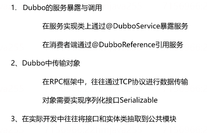

# 一、Feign

Feign是一个声明式的http客户端

## 1. Maven依赖

引入 SpringCloud的dependencyManagement：

```xml
 <dependencyManagement>
     <dependencies>
         <!-- springCloud -->
         <dependency>
             <groupId>org.springframework.cloud</groupId>
             <artifactId>spring-cloud-dependencies</artifactId>
             <version>Hoxton.SR8</version>
             <type>pom</type>
             <scope>import</scope>
         </dependency>
     </dependencies>
</dependencyManagement>
```

再引入feign的依赖：

```xml
<dependency>
    <groupId>org.springframework.cloud</groupId>
    <artifactId>spring-cloud-starter-openfeign</artifactId>
</dependency>
```

## 2. 基本用法

**①在启动类上添加 <u>@EnableFeignClients</u> 注解**

​	**basePackages属性：** 指定FeignClient所在的包    `@EnableFeignClients(basePackages = "cn.itcast.feign.clients")`

​	**clients属性**：指定需要加载的FeignClient的 Class对象    @EnableFeignClients(clients = {UserClient.class})

**②编写Feign客户端**

在服务消费者（order-service）中新建一个接口，内容如下：

```java
@FeignClient("userservice")			//服务提供者名称
public interface UserClient {		
    @GetMapping("/user/{id}")		//请求方式和路径
    User findById(@PathVariable("id") Long id);	//请求参数以及返回值类型
}
```

这个客户端主要是基于SpringMVC的注解来声明远程调用的信息，比如：

- 服务名称：userservice
- 请求方式：GET
- 请求路径：/user/{id}
- 请求参数：Long id
- 返回值类型：User

**③在需要发送Http请求来调用服务消费者的地方注入上面的接口、调用方法即可**


## 3. 自定义配置

Feign可以支持很多的自定义配置，如下表所示：

| 类型                   | 作用             | 说明                                                   |
| ---------------------- | ---------------- | ------------------------------------------------------ |
| **feign.Logger.Level** | 修改日志级别     | 包含四种不同的级别：`NONE、BASIC、HEADERS、FULL`       |
| feign.codec.Decoder    | 响应结果的解析器 | http远程调用的结果做解析，例如解析json字符串为java对象 |
| feign.codec.Encoder    | 请求参数编码     | 将请求参数编码，便于通过http请求发送                   |
| feign.Contract         | 支持的注解格式   | 默认是SpringMVC的注解                                  |
| feign.Retryer          | 失败重试机制     | 请求失败的重试机制，默认是没有，不过会使用Ribbon的重试 |

一般情况下，默认值就能满足我们使用，如果要自定义时，有两种方式。

下面以配置日志级别为例来演示如何自定义配置。

### 3.1 配置文件方式

基于配置文件修改feign的日志级别可以针对单个服务：

```yaml
feign:  
  client:
    config: 
      userservice: # 针对某个微服务的配置
        loggerLevel: FULL #  日志级别 
```

也可以针对所有服务：

```yaml
feign:  
  client:
    config: 
      default: # 这里用default就是全局配置，如果是写服务名称，则是针对某个微服务的配置
        loggerLevel: FULL #  日志级别 
```

而日志的级别分为四种：

- NONE：不记录任何日志信息，这是默认值。
- BASIC：仅记录请求的方法，URL以及响应状态码和执行时间
- HEADERS：在BASIC的基础上，额外记录了请求和响应的头信息
- FULL：记录所有请求和响应的明细，包括头信息、请求体、元数据。

### 3.2 Java代码方式

先声明一个类，然后声明一个**Logger.Level**的对象：

```java
public class DefaultFeignConfiguration  {
    @Bean
    public Logger.Level feignLogLevel(){
        return Logger.Level.BASIC; // 日志级别为BASIC
    }
}
```

如果要**全局生效**，将其放到**启动类**的**@EnableFeignClients**这个注解中：

```java
@EnableFeignClients(defaultConfiguration = DefaultFeignConfiguration .class) 
```

如果是**局部生效**，则把它放到对应的**@FeignClient**这个注解中：

```java
@FeignClient(value = "userservice", configuration = DefaultFeignConfiguration .class) 
```


## 4. Feign使用优化

1.**日志级别尽量用basic**

2.**使用HttpClient或OKHttp代替URLConnection**

​	以HttpClient为例

​	①  引入feign-httpClient依赖

```xml
<!--httpClient的依赖 -->
<dependency>
    <groupId>io.github.openfeign</groupId>
    <artifactId>feign-httpclient</artifactId>
</dependency>
```

​	②  配置文件开启httpClient功能，设置连接池参数

```yaml
feign:
  client:
    config:
      default: # default全局的配置
        loggerLevel: BASIC # 日志级别，BASIC就是基本的请求和响应信息
  httpclient:
    enabled: true # 开启feign对HttpClient的支持
    max-connections: 200 # 最大的连接数
    max-connections-per-route: 50 # 每个路径的最大连接数
```


# 二、Dubbo

## 1. Dubbo的基本架构


节点角色说明：

| 节点     | 角色说明                                 |
| -------- | ---------------------------------------- |
| Provider | 暴露服务的服务提供方。                   |
| Consumer | 调用远程服务的服务消费方。               |
| Registry | 服务注册与发现的注册中心。               |
| Monitor  | 统计服务的调用次数和调用时间的监控中心。 |


## 2. Dubbo基本用法

### 2.1 服务提供者

1）引入依赖

```xml
<!--dubbo的起步依赖-->
<dependency>
    <groupId>org.apache.dubbo</groupId>
    <artifactId>dubbo-spring-boot-starter</artifactId>
    <version>2.7.8</version>
</dependency>

<dependency>
    <groupId>org.apache.dubbo</groupId>
    <artifactId>dubbo-registry-nacos</artifactId>
    <version>2.7.8</version>
</dependency>
依赖省略了spring-boot-starter-web等
```

2）在提供服务的类上加上 **@DubboService注解**

```java
package cn.itcast.user.service;

//使用该注解暴露dubbo服务，这样服务消费者才能调用该服务
@DubboService
public class UserServiceImpl implements UserService {

    @Autowired
    private UserMapper userMapper;

	//根据id查询用户名称
    public String queryUsername(Long id) {
        return userMapper.findById(id).getUsername();
    }
}
```

3）配置文件

```yml
server:
  port: 18081
spring:
  datasource:
    url: jdbc:mysql://localhost:3306/dubbo-demo?useSSL=false&serverTimezone=Asia/Shanghai
    username: root
    password: 123456
    driver-class-name: com.mysql.cj.jdbc.Driver
  application:
    name: user-service

#配置dubbo提供者
dubbo:
  #dubbo协议和访问端口
  protocol:
    name: dubbo
    port: 20881	#端口号设置为-1表示自动绑定端口
  #注册中心的地址
  registry:
    address: nacos://localhost:8848
  #dubbo注解的包扫描，扫描@DubboService所在的包
  scan:
    base-packages: cn.itcast.user.service
```

### 2.2 服务消费者

1）引入依赖

```xml
<!--dubbo的起步依赖-->
<dependency>
    <groupId>org.apache.dubbo</groupId>
    <artifactId>dubbo-spring-boot-starter</artifactId>
    <version>2.7.8</version>
</dependency>

这个是注册中心的依赖
<dependency>
    <groupId>org.apache.dubbo</groupId>
    <artifactId>dubbo-registry-nacos</artifactId>
    <version>2.7.8</version>
</dependency>

依赖省略了spring-boot-starter-web等
```

2）在需要使用服务提供者的地方使用**@DubboReference注解** 注入服务提供者对象：

```java
@RestController
@RequestMapping("order")
public class OrderController {
    @Autowired
    private OrderService orderService;

    @DubboReference		//引入dubbo服务
    private UserService userService;

    @GetMapping("{orderId}")
    public Order queryOrderByUserId(@PathVariable("orderId") Long orderId) 	  {
        //根据id查询订单
        Order order = orderService.queryOrderById(orderId);
        //获取用户id
        Long userId = order.getUserId();
        //使用dubbo远程调用userservice 查询用户
        User user = userService.queryById(userId);
        //设置用户对象
        order.setUser(user);
        return order;
    }
}
```

3）配置文件

```yml
server:
  port: 18080
spring:
  application:
    name: order-service
#配置dubbo服务消费者，这里只需要指定注册中心的地址即可
dubbo:
  registry:
    address: nacos://127.0.0.1:8848
```

### 2.3 Dubbo最佳实践


（1）将接口抽取为独立api模块，该模块存放api接口类（比如UserService接口），该模块依赖一个实体类模块，实体类模块中定义了接口所需要的实体类。

​	**注意：如果要用dubbo来传输Java对象，Java对象必须实现Serializable接口。**

（2）服务提供者和服务消费者都引入 api模块，服务提供者实现api接口（UserServiceImpl机上@DubboService注解），服务消费者引用服务提供者（@DubboReference）。


**总结：**




## 3. Dubbo高级特性

### 3.1 超时与重试

**全局配置超时与重试**

在consumer的配置文件中配置：

```yml
dubbo:
  registry:
    address: nacos://127.0.0.1:8848
  consumer:
    timeout: 3000	//设置超时时间，ms
    retries: 0		//设置重试次数
```

这样，对所有provider的调用都添加超时与重试机制。


**对个别provider配置**

如果只是想对调用某一个provider时设置超时与重试，那么只需要在 **@DubboReference注解** 中添加 **retries属性** 或者 **timeout属性**。

### 3.2 启动检查

为了保障服务的正常可用，Dubbo **默认**会在启动时检查依赖的服务是否可用，不可用时会抛出异常。

在consumer模块中关闭启动检查：

```yml
dubbo:
  registry:
    address: nacos://127.0.0.1:8848
  consumer:
    check: false #关闭消费者启动检查
```

### 3.3 多版本

```
@DubboService(version = “2.0.0”)	//指定version属性
```

```
//引用远程服务
@DubboReference(version = "2.0.0")	//指定version属性
```

### 3.4 负载均衡

```java
@DubboReference(loadbalance = "roundrobin")	//使用loadbalance属性指定消费者调用提供者的负载均衡策略
```

Dubbo提供了4种负载均衡策略，帮助**消费者找到最优提供者**并调用

* **Random** ：**按权重随机**，**默认值**。按权重设置随机概率。

* **RoundRobin** ：**按权重轮询**

* **LeastActive**：选择最少活跃调用数。活跃调用数就是当前某个提供者正在被多少个消费者调用。相同活跃数的随机。

* **ConsistentHash**：一致性 Hash，相同参数的请求总是发到同一提供者。


## 4.SpringCloud整合Dubbo

SpringCloud Alibaba内置了Dubbo的整合

1）依赖

消费者和提供者都引入SpringCloudAlibaba的dependencyManagement：

```xml
<dependencyManagement>
    <dependencies>
        <!--SpringCloud Alibaba-->
        <dependency>
            <groupId>com.alibaba.cloud</groupId>
            <artifactId>spring-cloud-alibaba-dependencies</artifactId>
            <version>2.2.6.RELEASE</version>
            <type>pom</type>
            <scope>import</scope>
        </dependency>
    </dependencies>
</dependencyManagement>
```

再引入nacos注册中心和Dubbo依赖

```xml
<!--nacos注册中心的依赖-->
<dependency>
    <groupId>com.alibaba.cloud</groupId>
    <artifactId>spring-cloud-starter-alibaba-nacos-discovery</artifactId>
</dependency>

<!--springcloud alibaba dubbo依赖   -->
<dependency>
    <groupId>com.alibaba.cloud</groupId>
    <artifactId>spring-cloud-starter-dubbo</artifactId>
</dependency>
```

2）服务提供者配置

使用**@DubboService**暴露服务。并且如下配置：

```yml
spring:
  application:
    name: user-service #服务名称
  cloud:
    nacos:
      discovery:
        server-addr: localhost:8848 #Nacos地址
#配置dubbo，注册中心，暴露的端口和协议，dubbo注解的包扫描
dubbo:
  protocol:
    name: dubbo
    port: 20881
  registry:
    address: spring-cloud://localhost   #使用SpringCloud中的注册中心
  scan:
    base-packages: cn.itcast.user.service  #dubbo中包扫描
```

3）服务消费者配置

使用**@DubboReference**引用服务。并且如下配置：

```yml
spring:
  application:
    name: order-service
  cloud:
    nacos:
      discovery:
        server-addr: localhost:8848 #Nacos地址
#dubbo配置
dubbo:
  registry:
    address: spring-cloud://localhost  #使用spring cloud的注册中心
  consumer:
    check: false   #dubbo默认有启动检查，把它关闭
    retries: 0     #dubbo内置的重试机制，设置不重试
```


# 三、Feign、Dubbo对比

RPC（Dubbo）和 REST（Feign）的对比

| 类型     | RPC                            | Rest         |
| -------- | ------------------------------ | ------------ |
| 耦合性   | 强耦合                         | 松耦合       |
| 消息协议 | 二进制                         | 文本  Json   |
| 通信协议 | TCP                            | HTTP         |
| 对外开放 | 一般作为内部各个系统的通信框架 | 对接外部系统 |

