# Java基础

## HashMap原理是什么，在jdk1.7和1.8中有什么区别

HashMap 根据键的 hashCode 值存储数据，大多数情况下可以直接定位到它的值，因而具有很快的访问速度，但遍历顺序却是不确定的。 

HashMap最多只允许一条记录的键为null，允许多条记录的值为 null。

HashMap 非线程安全，即任一时刻可以有多个线程同时写 HashMap，可能会导致数据的不一致。如果需要满足线程安全，可以用 Collections 的 synchronizedMap 方法使 HashMap 具有线程安全的能力，或者使用 ConcurrentHashMap。我们用下面这张图来介绍

HashMap 的结构。

**JAVA7** 实现 


大方向上，HashMap 里面是一个数组，然后数组中每个元素是一个单向链表。上图中，每个绿色

的实体是嵌套类 Entry 的实例，Entry 包含四个属性：key, value, hash 值和用于单向链表的 next。 

1. capacity：当前数组容量，始终保持 2^n，可以扩容，扩容后数组大小为当前的 2 倍。 

2. loadFactor：负载因子，默认为 0.75。 

3. threshold：扩容的阈值，等于 capacity * loadFactor 

**JAVA8实现 **

Java8 对 HashMap 进行了一些修改，最大的不同就是利用了红黑树，所以其由 **数组+链表+红黑树** 组成。 

根据 Java7 HashMap 的介绍，我们知道，查找的时候，根据 hash 值我们能够快速定位到数组的具体下标，但是之后的话，需要顺着链表一个个比较下去才能找到我们需要的，时间复杂度取决

于链表的长度，为 O(n)。为了降低这部分的开销，在 Java8 中，当链表中的元素超过了 8 个以后，会将链表转换为红黑树，在这些位置进行查找的时候可以降低时间复杂度为 O(logN)。 

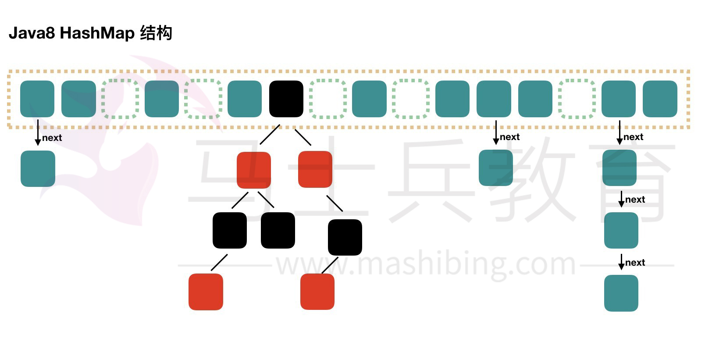


## ArrayList和LinkedList有什么区别

ArrayList和LinkedList都实现了List接口，他们有以下的不同点：
ArrayList是基于索引的数据接口，它的底层是数组。它可以以O(1)时间复杂度对元素进行随机访问。与此对应，LinkedList是以元素列表的形式存储它的数据，每一个元素都和它的前一个和后一个元素链接在一起，在这种情况下，查找某个元素的时间复杂度是O(n)。
相对于ArrayList，LinkedList的插入，添加，删除操作速度更快，因为当元素被添加到集合任意位置的时候，不需要像数组那样重新计算大小或者是更新索引。
LinkedList比ArrayList更占内存，因为LinkedList为每一个节点存储了两个引用，一个指向前一个元素，一个指向下一个元素。
也可以参考ArrayList vs. LinkedList。

1) 因为 Array 是基于索引 (index) 的数据结构，它使用索引在数组中搜索和读取数据是很快的。 Array 获取数据的时间复杂度是 O(1), 但是要删除数据却是开销很大的，因为这需要重排数组中的所有数据。

2) 相对于 ArrayList ， LinkedList 插入是更快的。因为 LinkedList 不像 ArrayList 一样，不需要改变数组的大小，也不需要在数组装满的时候要将所有的数据重新装入一个新的数组，这是 ArrayList 最坏的一种情况，时间复杂度是 O(n) ，而 LinkedList 中插入或删除的时间复杂度仅为 O(1) 。 ArrayList 在插入数据时还需要更新索引（除了插入数组的尾部）。

3) 类似于插入数据，删除数据时， LinkedList 也优于 ArrayList 。

4) LinkedList 需要更多的内存，因为 ArrayList 的每个索引的位置是实际的数据，而 LinkedList 中的每个节点中存储的是实际的数据和前后节点的位置 ( 一个 LinkedList 实例存储了两个值： Node<E> first 和 Node<E> last 分别表示链表的其实节点和尾节点，每个 Node 实例存储了三个值： E item,Node next,Node pre) 。

什么场景下更适宜使用 LinkedList，而不用ArrayList

1) 你的应用不会随机访问数据 。因为如果你需要LinkedList中的第n个元素的时候，你需要从第一个元素顺序数到第n个数据，然后读取数据。

2) 你的应用更多的插入和删除元素，更少的读取数据 。因为插入和删除元素不涉及重排数据，所以它要比ArrayList要快。

换句话说，ArrayList的实现用的是数组，LinkedList是基于链表，ArrayList适合查找，LinkedList适合增删

 以上就是关于 ArrayList和LinkedList的差别。你需要一个不同步的基于索引的数据访问时，请尽量使用ArrayList。ArrayList很快，也很容易使用。但是要记得要给定一个合适的初始大小，尽可能的减少更改数组的大小。

##  高并发中的集合有哪些问题 

**第一代线程安全集合类 **

Vector、Hashtable 

是怎么保证线程安排的： 使用synchronized修饰方法*

缺点：效率低下 

**第二代线程非安全集合类**

ArrayList、HashMap

线程不安全，但是性能好，用来替代Vector、Hashtable             

使用ArrayList、HashMap，需要线程安全怎么办呢？ 

使用 Collections.*synchronizedList*(list); Collections.*synchronizedMap*(m); 

底层使用synchronized代码块锁 虽然也是锁住了所有的代码，但是锁在方法里边，并所在方法外边性能可以理解为稍有提高吧。毕竟进方法本身就要分配资源的 

 

**第三代线程安全集合类**

在大量并发情况下如何提高集合的效率和安全呢？ 

java.util.concurrent.* 

ConcurrentHashMap：

CopyOnWriteArrayList ：

CopyOnWriteArraySet：   注意 不是CopyOnWriteHashSet*

底层大都采用Lock锁（1.8的ConcurrentHashMap不使用Lock锁），保证安全的同时，性能也很高。       


##  jdk1.8的新特性有哪些 

### 一、接口的默认方法

Java 8允许我们给接口添加一个非抽象的方法实现，只需要使用 default关键字即可，这个特征又叫做扩展方法，示例如下：

### 二、Lambda 表达式

#### 函数式接口

Lambda表达式是如何在java的类型系统中表示的呢？每一个lambda表达式都对应一个类型，通常是接口类型。而“函数式接口”是指仅仅只包含一个抽象方法的接口，每一个该类型的lambda表达式都会被匹配到这个抽象方法。因为 默认方法 不算抽象方法，所以你也可以给你的函数式接口添加默认方法。

我们可以将lambda表达式当作任意只包含一个抽象方法的接口类型，确保你的接口一定达到这个要求，你只需要给你的接口添加 @FunctionalInterface 注解，编译器如果发现你标注了这个注解的接口有多于一个抽象方法的时候会报错的。

#### 方法与构造函数引用

#### Lambda 作用域

#### 访问局部变量

我们可以直接在lambda表达式中访问外层的局部变量：

代码如下:

final int num = 1; Converter<Integer, String> stringConverter = (from) -> String.valueOf(from + num);

stringConverter.convert(2); // 3

但是和匿名对象不同的是，这里的变量num可以不用声明为final，该代码同样正确：

代码如下:

int num = 1; Converter<Integer, String> stringConverter = (from) -> String.valueOf(from + num);

stringConverter.convert(2); // 3

不过这里的num必须不可被后面的代码修改（即隐性的具有final的语义），例如下面的就无法编译：

代码如下:

int num = 1; Converter<Integer, String> stringConverter = (from) -> String.valueOf(from + num); num = 3;

在lambda表达式中试图修改num同样是不允许的。

#### 访问对象字段与静态变量

和本地变量不同的是，lambda内部对于**实例的字段以及静态变量**是即可读又可写。

### 八、访问接口的默认方法

还记得第一节中的formula例子么，接口Formula定义了一个默认方法sqrt可以直接被formula的实例包括匿名对象访问到，但是在lambda表达式中这个是不行的。 Lambda表达式中是无法访问到默认方法的，以下代码将无法编译：

代码如下:

Formula formula = (a) -> sqrt( a * 100); Built-in Functional Interfaces

JDK 1.8 API包含了很多内建的函数式接口，在老Java中常用到的比如Comparator或者Runnable接口，这些接口都增加了@FunctionalInterface注解以便能用在lambda上。 Java 8 API同样还提供了很多全新的函数式接口来让工作更加方便，有一些接口是来自Google Guava库里的，即便你对这些很熟悉了，还是有必要看看这些是如何扩展到lambda上使用的。

**Predicate****接口**

Predicate 接口只有一个参数，返回boolean类型。该接口包含多种默认方法来将Predicate组合成其他复杂的逻辑（比如：与，或，非）：

代码如下:

Predicate<String> predicate = (s) -> s.length() > 0;

predicate.test("foo"); // true predicate.negate().test("foo"); // false

Predicate<Boolean> nonNull = Objects::nonNull; Predicate<Boolean> isNull = Objects::isNull;

Predicate<String> isEmpty = String::isEmpty; Predicate<String> isNotEmpty = isEmpty.negate();

**Function** **接口**

Function 接口有一个参数并且返回一个结果，并附带了一些可以和其他函数组合的默认方法（compose, andThen）：

代码如下:

Function<String, Integer> toInteger = Integer::valueOf; Function<String, String> backToString = toInteger.andThen(String::valueOf);

backToString.apply("123"); // "123"

**Supplier** **接口** Supplier 接口返回一个任意范型的值，和Function接口不同的是该接口没有任何参数

代码如下:

Supplier<Person> personSupplier = Person::new; personSupplier.get(); // new Person

**Consumer** **接口** Consumer 接口表示执行在单个参数上的操作。

代码如下:

Consumer<Person> greeter = (p) -> System.out.println("Hello, " + p.firstName); greeter.accept(new Person("Luke", "Skywalker"));

**Comparator** **接口** Comparator 是老Java中的经典接口， Java 8在此之上添加了多种默认方法：

代码如下:

Comparator<Person> comparator = (p1, p2) -> p1.firstName.compareTo(p2.firstName);

Person p1 = new Person("John", "Doe"); Person p2 = new Person("Alice", "Wonderland");

comparator.compare(p1, p2); // > 0 comparator.reversed().compare(p1, p2); // < 0

**Optional** **接口**

Optional 不是函数是接口，这是个用来防止NullPointerException异常的辅助类型，这是下一届中将要用到的重要概念，现在先简单的看看这个接口能干什么：

Optional 被定义为一个简单的容器，其值可能是null或者不是null。在Java 8之前一般某个函数应该返回非空对象但是偶尔却可能返回了null，而在Java 8中，不推荐你返回null而是返回Optional。

代码如下:

Optional<String> optional = Optional.of("bam");

optional.isPresent(); // true optional.get(); // "bam" optional.orElse("fallback"); // "bam"

optional.ifPresent((s) -> System.out.println(s.charAt(0))); // "b"

**Stream** **接口**

java.util.Stream 表示能应用在一组元素上一次执行的操作序列。Stream 操作分为中间操作或者最终操作两种，最终操作返回一特定类型的计算结果，而中间操作返回Stream本身，这样你就可以将多个操作依次串起来。Stream 的创建需要指定一个数据源，比如 java.util.Collection的子类，List或者Set， Map不支持。Stream的操作可以串行执行或者并行执行。

首先看看Stream是怎么用，首先创建实例代码的用到的数据List：

代码如下:

List<String> stringCollection = new ArrayList<>(); stringCollection.add("ddd2"); stringCollection.add("aaa2"); stringCollection.add("bbb1"); stringCollection.add("aaa1"); stringCollection.add("bbb3"); stringCollection.add("ccc"); stringCollection.add("bbb2"); stringCollection.add("ddd1");

Java 8扩展了集合类，可以通过 Collection.stream() 或者 Collection.parallelStream() 来创建一个Stream。下面几节将详细解释常用的Stream操作：

**Filter** **过滤**

过滤通过一个predicate接口来过滤并只保留符合条件的元素，该操作属于中间操作，所以我们可以在过滤后的结果来应用其他Stream操作（比如forEach）。forEach需要一个函数来对过滤后的元素依次执行。forEach是一个最终操作，所以我们不能在forEach之后来执行其他Stream操作。

代码如下:

stringCollection .stream() .filter((s) -> s.startsWith("a")) .forEach(System.out::println);

// "aaa2", "aaa1"

**Sort** **排序**

排序是一个中间操作，返回的是排序好后的Stream。如果你不指定一个自定义的Comparator则会使用默认排序。

代码如下:

stringCollection .stream() .sorted() .filter((s) -> s.startsWith("a")) .forEach(System.out::println);

// "aaa1", "aaa2"

需要注意的是，排序只创建了一个排列好后的Stream，而不会影响原有的数据源，排序之后原数据stringCollection是不会被修改的：

代码如下:

System.out.println(stringCollection); // ddd2, aaa2, bbb1, aaa1, bbb3, ccc, bbb2, ddd1

**Map** **映射** 中间操作map会将元素根据指定的Function接口来依次将元素转成另外的对象，下面的示例展示了将字符串转换为大写字符串。你也可以通过map来讲对象转换成其他类型，map返回的Stream类型是根据你map传递进去的函数的返回值决定的。

代码如下:

stringCollection .stream() .map(String::toUpperCase) .sorted((a, b) -> b.compareTo(a)) .forEach(System.out::println);

// "DDD2", "DDD1", "CCC", "BBB3", "BBB2", "AAA2", "AAA1"

**Match** **匹配**

Stream提供了多种匹配操作，允许检测指定的Predicate是否匹配整个Stream。所有的匹配操作都是最终操作，并返回一个boolean类型的值。

代码如下:

boolean anyStartsWithA = stringCollection .stream() .anyMatch((s) -> s.startsWith("a"));

System.out.println(anyStartsWithA); // true

boolean allStartsWithA = stringCollection .stream() .allMatch((s) -> s.startsWith("a"));

System.out.println(allStartsWithA); // false

boolean noneStartsWithZ = stringCollection .stream() .noneMatch((s) -> s.startsWith("z"));

System.out.println(noneStartsWithZ); // true

**Count** **计数** 计数是一个最终操作，返回Stream中元素的个数，返回值类型是long。

代码如下:

long startsWithB = stringCollection .stream() .filter((s) -> s.startsWith("b")) .count();

System.out.println(startsWithB); // 3

**Reduce** **规约**

这是一个最终操作，允许通过指定的函数来讲stream中的多个元素规约为一个元素，规越后的结果是通过Optional接口表示的：

代码如下:

Optional<String> reduced = stringCollection .stream() .sorted() .reduce((s1, s2) -> s1 + "#" + s2);

reduced.ifPresent(System.out::println); // "aaa1#aaa2#bbb1#bbb2#bbb3#ccc#ddd1#ddd2"

**并行****Streams**

前面提到过Stream有串行和并行两种，串行Stream上的操作是在一个线程中依次完成，而并行Stream则是在多个线程上同时执行。

下面的例子展示了是如何通过并行Stream来提升性能：

首先我们创建一个没有重复元素的大表：

代码如下:

int max = 1000000; List<String> values = new ArrayList<>(max); for (int i = 0; i < max; i++) { UUID uuid = UUID.randomUUID(); values.add(uuid.toString()); }

然后我们计算一下排序这个Stream要耗时多久， 串行排序：

代码如下:

long t0 = System.nanoTime();

long count = values.stream().sorted().count(); System.out.println(count);

long t1 = System.nanoTime();

long millis = TimeUnit.NANOSECONDS.toMillis(t1 - t0); System.out.println(String.format("sequential sort took: %d ms", millis));

// 串行耗时: 899 ms 并行排序：

代码如下:

long t0 = System.nanoTime();

long count = values.parallelStream().sorted().count(); System.out.println(count);

long t1 = System.nanoTime();

long millis = TimeUnit.NANOSECONDS.toMillis(t1 - t0); System.out.println(String.format("parallel sort took: %d ms", millis));

// 并行排序耗时: 472 ms 上面两个代码几乎是一样的，但是并行版的快了50%之多，唯一需要做的改动就是将stream()改为parallelStream()。

**Map**

前面提到过，Map类型不支持stream，不过Map提供了一些新的有用的方法来处理一些日常任务。

代码如下:

Map<Integer, String> map = new HashMap<>();

for (int i = 0; i < 10; i++) { map.putIfAbsent(i, "val" + i); }

map.forEach((id, val) -> System.out.println(val)); 以上代码很容易理解， putIfAbsent 不需要我们做额外的存在性检查，而forEach则接收一个Consumer接口来对map里的每一个键值对进行操作。

下面的例子展示了map上的其他有用的函数：

代码如下:

map.computeIfPresent(3, (num, val) -> val + num); map.get(3); // val33

map.computeIfPresent(9, (num, val) -> null); map.containsKey(9); // false

map.computeIfAbsent(23, num -> "val" + num); map.containsKey(23); // true

map.computeIfAbsent(3, num -> "bam"); map.get(3); // val33

接下来展示如何在Map里删除一个键值全都匹配的项：

代码如下:

map.remove(3, "val3"); map.get(3); // val33

map.remove(3, "val33"); map.get(3); // null

另外一个有用的方法：

代码如下:

map.getOrDefault(42, "not found"); // not found

对Map的元素做合并也变得很容易了：

代码如下:

map.merge(9, "val9", (value, newValue) -> value.concat(newValue)); map.get(9); // val9

map.merge(9, "concat", (value, newValue) -> value.concat(newValue)); map.get(9); // val9concat

Merge做的事情是如果键名不存在则插入，否则则对原键对应的值做合并操作并重新插入到map中。

### 九、Date API

Java 8 在包java.time下包含了一组全新的时间日期API。新的日期API和开源的Joda-Time库差不多，但又不完全一样，下面的例子展示了这组新API里最重要的一些部分：

**Clock** **时钟**

Clock类提供了访问当前日期和时间的方法，Clock是时区敏感的，可以用来取代 System.currentTimeMillis() 来获取当前的微秒数。某一个特定的时间点也可以使用Instant类来表示，Instant类也可以用来创建老的java.util.Date对象。

代码如下:

Clock clock = Clock.systemDefaultZone(); long millis = clock.millis();

Instant instant = clock.instant(); Date legacyDate = Date.from(instant); // legacy java.util.Date

**Timezones** **时区**

在新API中时区使用ZoneId来表示。时区可以很方便的使用静态方法of来获取到。 时区定义了到UTS时间的时间差，在Instant时间点对象到本地日期对象之间转换的时候是极其重要的。

代码如下:

System.out.println(ZoneId.getAvailableZoneIds()); // prints all available timezone ids

ZoneId zone1 = ZoneId.of("Europe/Berlin"); ZoneId zone2 = ZoneId.of("Brazil/East"); System.out.println(zone1.getRules()); System.out.println(zone2.getRules());

// ZoneRules[currentStandardOffset=+01:00] // ZoneRules[currentStandardOffset=-03:00]

**LocalTime** **本地时间**

LocalTime 定义了一个没有时区信息的时间，例如 晚上10点，或者 17:30:15。下面的例子使用前面代码创建的时区创建了两个本地时间。之后比较时间并以小时和分钟为单位计算两个时间的时间差：

代码如下:

LocalTime now1 = LocalTime.now(zone1); LocalTime now2 = LocalTime.now(zone2);

System.out.println(now1.isBefore(now2)); // false

long hoursBetween = ChronoUnit.HOURS.between(now1, now2); long minutesBetween = ChronoUnit.MINUTES.between(now1, now2);

System.out.println(hoursBetween); // -3 System.out.println(minutesBetween); // -239

LocalTime 提供了多种工厂方法来简化对象的创建，包括解析时间字符串。

代码如下:

LocalTime late = LocalTime.of(23, 59, 59); System.out.println(late); // 23:59:59

DateTimeFormatter germanFormatter = DateTimeFormatter .ofLocalizedTime(FormatStyle.SHORT) .withLocale(Locale.GERMAN);

LocalTime leetTime = LocalTime.parse("13:37", germanFormatter); System.out.println(leetTime); // 13:37

**LocalDate** **本地日期**

LocalDate 表示了一个确切的日期，比如 2014-03-11。该对象值是不可变的，用起来和LocalTime基本一致。下面的例子展示了如何给Date对象加减天/月/年。另外要注意的是这些对象是不可变的，操作返回的总是一个新实例。

代码如下:

LocalDate today = LocalDate.now(); LocalDate tomorrow = today.plus(1, ChronoUnit.DAYS); LocalDate yesterday = tomorrow.minusDays(2);

LocalDate independenceDay = LocalDate.of(2014, Month.JULY, 4); DayOfWeek dayOfWeek = independenceDay.getDayOfWeek();

System.out.println(dayOfWeek); // FRIDAY 从字符串解析一个LocalDate类型和解析LocalTime一样简单：

代码如下:

DateTimeFormatter germanFormatter = DateTimeFormatter .ofLocalizedDate(FormatStyle.MEDIUM) .withLocale(Locale.GERMAN);

LocalDate xmas = LocalDate.parse("24.12.2014", germanFormatter); System.out.println(xmas); // 2014-12-24

**LocalDateTime** **本地日期时间**

LocalDateTime 同时表示了时间和日期，相当于前两节内容合并到一个对象上了。LocalDateTime和LocalTime还有LocalDate一样，都是不可变的。LocalDateTime提供了一些能访问具体字段的方法。

代码如下:

LocalDateTime sylvester = LocalDateTime.of(2014, Month.DECEMBER, 31, 23, 59, 59);

DayOfWeek dayOfWeek = sylvester.getDayOfWeek(); System.out.println(dayOfWeek); // WEDNESDAY

Month month = sylvester.getMonth(); System.out.println(month); // DECEMBER

long minuteOfDay = sylvester.getLong(ChronoField.MINUTE_OF_DAY); System.out.println(minuteOfDay); // 1439

只要附加上时区信息，就可以将其转换为一个时间点Instant对象，Instant时间点对象可以很容易的转换为老式的java.util.Date。

代码如下:

Instant instant = sylvester .atZone(ZoneId.systemDefault()) .toInstant();

Date legacyDate = Date.from(instant); System.out.println(legacyDate); // Wed Dec 31 23:59:59 CET 2014

格式化LocalDateTime和格式化时间和日期一样的，除了使用预定义好的格式外，我们也可以自己定义格式：

代码如下:

DateTimeFormatter formatter = DateTimeFormatter .ofPattern("MMM dd, yyyy - HH:mm");

LocalDateTime parsed = LocalDateTime.parse("Nov 03, 2014 - 07:13", formatter); String string = formatter.format(parsed); System.out.println(string); // Nov 03, 2014 - 07:13

和java.text.NumberFormat不一样的是新版的DateTimeFormatter是不可变的，所以它是线程安全的。


## Java中重写和重载有哪些区别

方法的重载和重写都是实现多态的方式，区别在于前者实现的是编译时的多态性，而后者实现的是运行时的多态

性。重载发生在一个类中，同名的方法如果有不同的参数列表（参数类型不同、参数个数不同或者二者都不同）则视为

重载；重写发生在子类与父类之间，重写要求子类被重写方法与父类被重写方法有相同的返回类型，比父类被重写方

法更好访问，不能比父类被重写方法声明更多的异常（里氏代换原则）。重载对返回类型没有特殊的要求。

**方法重载的规则**：

1.方法名一致，参数列表中参数的顺序，类型，个数不同。

2.重载与方法的返回值无关，存在于父类和子类，同类中。

3.可以抛出不同的异常，可以有不同修饰符


**方法重写的规则**：

1.参数列表必须完全与被重写方法的一致，返回类型必须完全与被重写方法的返回类型一致。

2.构造方法不能被重写，声明为 final 的方法不能被重写，声明为 static 的方法不能被重写，但是能够被再次

声明。

3.访问权限不能比父类中被重写的方法的访问权限更低。

4.重写的方法能够抛出任何非强制异常（UncheckedException，也叫非运行时异常），无论被重写的方法是

否抛出异常。但是，重写的方法不能抛出新的强制性异常，或者比被重写方法声明的更广泛的强制性异常，反之则

可以。


## 接口和抽象类有哪些区别

不同：

抽象类：

1.抽象类中可以定义构造器

2.可以有抽象方法和具体方法

3.接口中的成员全都是 public 的

4.抽象类中可以定义成员变量

5.有抽象方法的类必须被声明为抽象类，而抽象类未必要有抽象方法

7.一个类只能继承一个抽象类

接口：

1.接口中不能定义构造器

2.方法全部都是抽象方法

3.抽象类中的成员可以是 private、默认、protected、public

4.接口中定义的成员变量实际上都是常量

6.一个类可以实现多个接口

相同：

1.不能够实例化

2.可以将抽象类和接口类型作为引用类型

3.一个类如果继承了某个抽象类或者实现了某个接口都需要对其中的抽象方法全部进行实现，否则该类仍然需要被声明为抽象类


## 怎样声明一个类不会被继承，什么场景下会用

如果一个类被final修饰，此类不可以有子类，不能被其它类继承，如果一个中的所有方法都没有重写的需要，当前类没有子类也罢，就可以使用final修饰类。


## Java中==和equals有哪些区别

equals 和== 最大的区别是一个是方法一个是运算符。

==：如果比较的对象是基本数据类型，则比较的是数值是否相等；如果比较的是引用数据类型，则比较的是对象

的地址值是否相等。

equals()：用来比较方法两个对象的内容是否相等。

注意：equals 方法不能用于基本数据类型的变量，如果没有对 equals 方法进行重写，则比较的是引用类型的变

量所指向的对象的地址。


## String、StringBuffer、StringBuilder区别及使用场景

Java 平台提供了两种类型的字符串：String 和 StringBuffer/StringBuilder，它们都可以储存和操作字符串，区别

如下。

1）String 是只读字符串，也就意味着 String 引用的字符串内容是不能被改变的。初学者可能会有这样的误解：

```
String str = “abc”；
str = “bcd”;
```

如上，字符串 str 明明是可以改变的呀！其实不然，str 仅仅是一个引用对象，它指向一个字符串对象“abc”。第

二行代码的含义是让 str 重新指向了一个新的字符串“bcd”对象，而“abc”对象并没有任何改变，只不过该对象已

经成为一个不可及对象罢了。

2）StringBuffer/StringBuilder 表示的字符串对象可以直接进行修改。

3）StringBuilder 是 Java5 中引入的，它和 StringBuffer 的方法完全相同，区别在于它是在单线程环境下使用的，

因为它的所有方法都没有被 synchronized 修饰，因此它的效率理论上也比 StringBuffer 要高。


##  Java代理的几种实现方式 


第一种:静态代理,只能静态地代理某些类或者某些方法,不推荐使用,功能比较弱,但是编码简单

> 静态代理实现步骤:
>
> 1. 定义一个接口及其实现类；
> 2. 创建一个代理类同样实现这个接口
> 3. 将目标对象注入进代理类，然后在代理类的对应方法调用目标类中的对应方法。这样的话，我们就可以通过代理类屏蔽对目标对象的访问，并且可以在目标方法执行前后做一些自己想做的事情。

第二种:动态代理,包含Proxy代理和CGLIB动态代理

### Proxy代理是JDK内置的动态代理

​         特点:面向接口的,不需要导入三方依赖的动态代理,可以对多个不同的接口进行增强,通过反射读取注解时,只能读取到接口上的注解

​         原理:面向接口,只能对实现类在实现接口中定义的方法进行增强

定义接口和实现

```
package com.proxy;

public interface UserService {
    public String getName(int id);

    public Integer getAge(int id);
}
```

```
package com.proxy;

public class UserServiceImpl implements UserService {
    @Override
    public String getName(int id) {
        System.out.println("------getName------");
        return "riemann";
    }

    @Override
    public Integer getAge(int id) {
        System.out.println("------getAge------");
        return 26;
    }
}
```

```
package com.proxy;

import java.lang.reflect.InvocationHandler;
import java.lang.reflect.Method;

public class MyInvocationHandler implements InvocationHandler {

    public Object target;

    MyInvocationHandler() {
        super();
    }

    MyInvocationHandler(Object target) {
        super();
        this.target = target;
    }

    @Override
    public Object invoke(Object proxy, Method method, Object[] args) throws Throwable {
        if ("getName".equals(method.getName())) {
            System.out.println("++++++before " + method.getName() + "++++++");
            Object result = method.invoke(target, args);
            System.out.println("++++++after " + method.getName() + "++++++");
            return result;
        } else {
            Object result = method.invoke(target, args);
            return result;
        }
    }
}
```

```
package com.proxy;

import java.lang.reflect.InvocationHandler;
import java.lang.reflect.Proxy;

public class Main1 {
    public static void main(String[] args) {
        UserService userService = new UserServiceImpl();
        InvocationHandler invocationHandler = new MyInvocationHandler(userService);
        UserService userServiceProxy = (UserService) Proxy.newProxyInstance(userService.getClass().getClassLoader(),
                userService.getClass().getInterfaces(),invocationHandler);
        System.out.println(userServiceProxy.getName(1));
        System.out.println(userServiceProxy.getAge(1));
    }
}
```


### CGLIB动态代理

​        特点:面向父类的动态代理,需要导入第三方依赖

​        原理:面向父类,底层通过子类继承父类并重写方法的形式实现增强

Proxy和CGLIB是非常重要的代理模式,是springAOP底层实现的主要两种方式

CGLIB的核心类：
`net.sf.cglib.proxy.Enhancer` – 主要的增强类
`net.sf.cglib.proxy.MethodInterceptor` – 主要的方法拦截类，它是Callback接口的子接口，需要用户实现
`net.sf.cglib.proxy.MethodProxy` – JDK的java.lang.reflect.Method类的代理类，可以方便的实现对源对象方法的调用,如使用：
`Object o = methodProxy.invokeSuper(proxy, args);`//虽然第一个参数是被代理对象，也不会出现死循环的问题。

`net.sf.cglib.proxy.MethodInterceptor`接口是最通用的回调（callback）类型，它经常被基于代理的AOP用来实现拦截（intercept）方法的调用。这个接口只定义了一个方法
`public Object intercept(Object object, java.lang.reflect.Method method,`
`Object[] args, MethodProxy proxy) throws Throwable;`

第一个参数是代理对象，第二和第三个参数分别是拦截的方法和方法的参数。原来的方法可能通过使用java.lang.reflect.Method对象的一般反射调用，或者使用 net.sf.cglib.proxy.MethodProxy对象调用。net.sf.cglib.proxy.MethodProxy通常被首选使用，因为它更快。

```
package com.proxy.cglib;

import net.sf.cglib.proxy.MethodInterceptor;
import net.sf.cglib.proxy.MethodProxy;
import java.lang.reflect.Method;
 
public class CglibProxy implements MethodInterceptor {
    @Override
    public Object intercept(Object o, Method method, Object[] args, MethodProxy methodProxy) throws Throwable {
        System.out.println("++++++before " + methodProxy.getSuperName() + "++++++");
        System.out.println(method.getName());
        Object o1 = methodProxy.invokeSuper(o, args);
        System.out.println("++++++before " + methodProxy.getSuperName() + "++++++");
        return o1;
    }
}

```

```
package com.proxy.cglib;
 
import com.test3.service.UserService;
import com.test3.service.impl.UserServiceImpl;
import net.sf.cglib.proxy.Enhancer;
 
public class Main2 {
    public static void main(String[] args) {
        CglibProxy cglibProxy = new CglibProxy();
 
        Enhancer enhancer = new Enhancer();
        enhancer.setSuperclass(UserServiceImpl.class);
        enhancer.setCallback(cglibProxy);
 
        UserService o = (UserService)enhancer.create();
        o.getName(1);
        o.getAge(1);
    }
}
```


##  hashcode和equals如何使用 

equals()源自于java.lang.Object,该方法用来简单验证两个对象的相等性。Object类中定义的默认实现只检查两个对象的对象引用，以验证它们的相等性。 通过重写该方法,可以自定义验证对象相等新的规则,如果你使用ORM处理一些对象的话，你要确保在hashCode()和equals()对象中使用getter和setter而不是直接引用成员变量 

hashCode()源自于java.lang.Object ,该方法用于获取给定对象的唯一的整数(散列码)。当这个对象需要存储在哈希表这样的数据结构时，这个整数用于确定桶的位置。默认情况下，对象的hashCode()方法返回对象所在内存地址的整数表示。hashCode()是HashTable、HashMap和HashSet使用的。默认的，Object类的hashCode()方法返回这个对象存储的内存地址的编号。

hash散列算法,使得在hash表中查找一个记录速度变O(1). 每个记录都有自己的hashcode,散列算法按照hashcode把记录放置在合适的位置. 在查找一个记录,首先先通过hashcode快速定位记录的位置.然后再通过equals来比较是否相等。如果hashcode没找到，则不equal，元素不存在于哈希表中；即使找到了，也只需执行hashcode相同的几个元素的equal，如果不equal，还是不存在哈希表中。

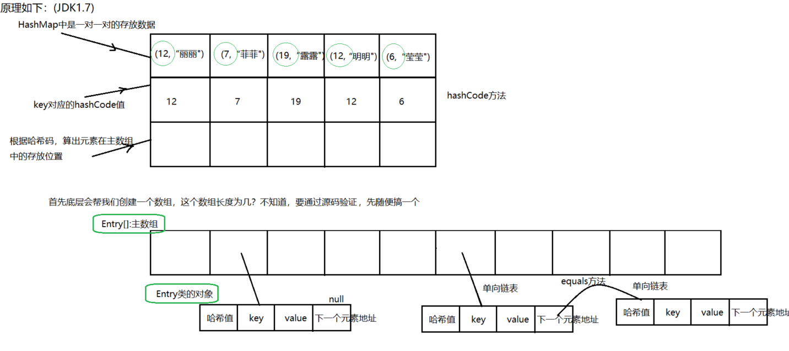

## HashMap和HashTable的区别及底层实现 

### HashMap和HashTable对比

1. HashTable线程同步，HashMap非线程同步。
2. HashTable不允许<键,值>有空值，HashMap允许<键,值>有空值。
3. HashTable使用Enumeration，HashMap使用Iterator。
4. HashTable中hash数组的默认大小是11，增加方式的old*2+1，HashMap中hash数组的默认大小是16，增长方式是2的指数倍。

5.HashMap jdk1.8之前list + 链表 jdk1.8之后list + 链表,当链表长度到8时，转化为红黑树

6.HashMap链表插入节点的方式 在Java1.7中，插入链表节点使用**头插法**。Java1.8中变成了**尾插法**  

7.Java1.8的hash()中，将hash值高位（前16位）参与到取模的运算中，使得计算结果的不确定性增强，降低发生哈希碰撞的概率

### HashMap扩容优化:

扩容以后,1.7对元素进行rehash算法,计算原来每个元素在扩容之后的哈希表中的位置,1.8借助2倍扩容机制,元素不需要进行重新计算位置

JDK 1.8 在扩容时并没有像 JDK 1.7 那样，重新计算每个元素的哈希值，而是通过高位运算**（e.hash & oldCap）**来确定元素是否需要移动，比如 key1 的信息如下：

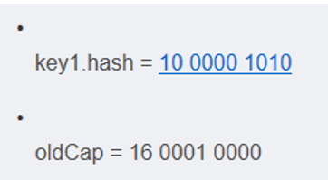

使用 e.hash & oldCap 得到的结果，高一位为 0，当结果为 0 时表示元素在扩容时位置不会发生任何变化，而 key 2 信息如下

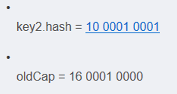

 

  

高一位为 1，当结果为 1 时，表示元素在扩容时位置发生了变化，新的下标位置等于原下标位置 + 原数组长度**hashmap,****不必像1.7一样全部重新计算位置**

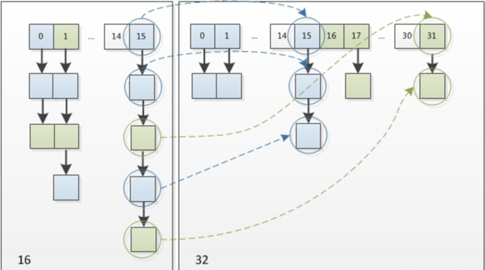


## 为什么hashmap扩容的时候是两倍？

查看源代码

在存入元素时,放入元素位置有一个 (n-1)&hash 的一个算法,和hash&(newCap-1),这里用到了一个&位运算符


 为了使计算桶的下标时更方便，变成 按位与预算即可。

  


## hashmap线程安全的方式？

HashMap不是线程安全的,往往在写程序时需要通过一些方法来回避.其实JDK原生的提供了2种方法让HashMap支持线程安全.

方法一:**通过Collections.synchronizedMap()返回一个新的Map**,这个新的map就是线程安全的. 这个要求大家习惯基于接口编程,因为返回的并不是HashMap,而是一个Map的实现.

方法二:重新改写了HashMap,具体的可以查看**java.util.concurrent.ConcurrentHashMap**. 这个方法比方法一有了很大的改进.


方法一特点: 

通过Collections.synchronizedMap()来封装所有不安全的HashMap的方法,就连toString, hashCode都进行了封装. 封装的关键点有2处,1)使用了经典的synchronized来进行互斥, 2)使用了代理模式new了一个新的类,这个类同样实现了Map接口.在Hashmap上面,synchronized锁住的是对象,所以第一个申请的得到锁,其他线程将进入阻塞,等待唤醒. **优点:代码实现十分简单,一看就懂.缺点:从锁的角度来看,方法一直接使用了锁住方法,基本上是锁住了尽可能大的代码块.性能会比较差.**

方法二特点:

重新写了HashMap,比较大的改变有如下几点.使用了新的锁机制,把HashMap进行了拆分,拆分成了多个独立的块,这样在高并发的情况下减少了锁冲突的可能,使用的是NonfairSync. 这个特性调用CAS指令来确保原子性与互斥性.当如果多个线程恰好操作到同一个segment上面,那么只会有一个线程得到运行.

优点:**需要互斥的代码段比较少,性能会比较好. ConcurrentHashMap把整个Map切分成了多个块,发生锁碰撞的几率大大降低,性能会比较好. 缺点:代码繁琐**


## Java异常处理方式

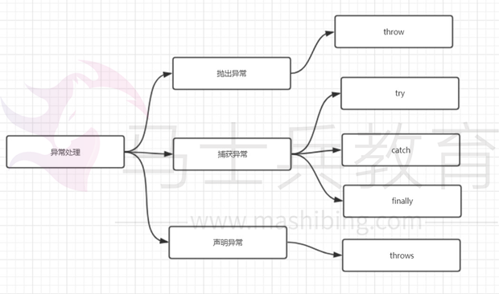

在 Java 中，每个异常都是一个对象，它是 Throwable 类或其子类的实例。当一个方法出现异常后便抛出一个异常对象，该对象中包含有异常信息，调用这个对象的方法可以捕获到这个异常并可以对其进行处理。Java 的异常处理是通过 5 个关键词来实现的：try、 catch、throw、throws 和 finally。

在Java应用中，异常的处理机制分为声明异常，抛出异常和捕获异常。

throw和throws的区别：
（1）位置不同：
throw：方法内部
throws: 方法的签名处，方法的声明处

（2）内容不同：
throw+异常对象（检查异常，运行时异常）
throws+异常的类型（可以多个类型，用，拼接）

（3）作用不同：
throw：异常出现的源头，制造异常。
throws:在方法的声明处，告诉方法的调用者，这个方法中可能会出现我声明的这些异常。然后调用者对这个异常进行处理：
要么自己处理要么再继续向外抛出异常

### 1.throws声明异常

通常，应该捕获那些知道如何处理的异常，将不知道如何处理的异常继续传递下去。传递异常可以在方法签名处使用 throws 关键字声明可能会抛出的异常。注意

**非检查异常（Error、RuntimeException 或它们的子类）不可使用 throws 关键字来声明要抛出的异常。**

​       一个方法出现编译时异常，就需要 try-catch/ throws 处理，否则会导致编译错误

### 2.throw抛出异常

如果你觉得解决不了某些异常问题，且不需要调用者处理，那么你可以抛出异常。 throw关键字作用是在方法内部抛出一个Throwable类型的异常。任何Java代码都可以通过throw语句抛出异常。

### 3.trycatch捕获异常

程序通常在运行之前不报错，但是运行后可能会出现某些未知的错误，但是还不想直接抛出到上一级，那么就需要通过try…catch…的形式进行异常捕获，之后根据不同的异常情况来进行相应的处理。如何选择异常类型

可以根据下图来选择是捕获异常，声明异常还是抛出异常


##  自定义异常在生产中如何应用 

 Java虽然提供了丰富的异常处理类，但是在项目中还会经常使用自定义异常，其主要原因是Java提供的异常类在某些情况下还是不能满足实际需球。例如以下情况：
  1、系统中有些错误是符合Java语法，但不符合业务逻辑。

  2、在分层的软件结构中，通常是在表现层统一对系统其他层次的异常进行捕获处理。 


# Spring

## 如何实现一个IOC容器?

​		IOC(Inversion of Control),意思是控制反转，不是什么技术，而是一种设计思想，**IOC意味着将你设计好的对象交给容器控制，而不是传统的在你的对象内部直接控制。**

​		在传统的程序设计中，我们直接在对象内部通过new进行对象创建，是程序主动去创建依赖对象，而IOC是有专门的容器来进行对象的创建，即IOC容器来控制对象的创建。

​		在传统的应用程序中，我们是在对象中主动控制去直接获取依赖对象，这个是正转，反转是由容器来帮忙创建及注入依赖对象，在这个过程过程中，由容器帮我们查找级注入依赖对象，对象只是被动的接受依赖对象。

​		1、先准备一个基本的容器对象，包含一些map结构的集合，用来方便后续过程中存储具体的对象

​		2、进行配置文件的读取工作或者注解的解析工作，将需要创建的bean对象都封装成BeanDefinition对象存储在容器中

​		3、容器将封装好的BeanDefinition对象通过反射的方式进行实例化，完成对象的实例化工作

​		4、进行对象的初始化操作，也就是给类中的对应属性值就行设置，也就是进行依赖注入，完成整个对象的创建，变成一个完整的bean对象，存储在容器的某个map结构中

​		5、通过容器对象来获取对象，进行对象的获取和逻辑处理工作

​		6、提供销毁操作，当对象不用或者容器关闭的时候，将无用的对象进行销毁


## 你觉得Spring的核心是什么？

​		spring是一个开源框架。

​		spring是为了简化企业开发而生的，使得开发变得更加优雅和简洁。

​		spring是一个**IOC**和**AOP**的容器框架。

​				IOC：控制反转

​				AOP：面向切面编程

​				容器：包含并管理应用对象的生命周期，就好比用桶装水一样，spring就是桶，而对象就是水

## 说一下使用spring的优势？

​		1、Spring通过DI、AOP和消除样板式代码来**简化企业级Java开发**

​		2、**Spring框架之外还存在一个构建在核心框架之上的庞大生态圈**，它将Spring扩展到不同的领域，如Web服务、REST、移动开发以及NoSQL

​		3、低侵入式设计，代码的污染极低

​		4、**独立于各种应用服务器**，基于Spring框架的应用，可以真正实现Write Once,Run Anywhere的承诺

​		5、Spring的**IoC容器**降低了业务对象替换的复杂性，提高了组件之间的解耦

​		6、Spring的**AOP**支持允许将一些通用任务如安全、事务、日志等进行集中式处理，从而提供了更好的复用

​		7、Spring的**ORM和DAO**提供了与第三方持久层框架的的良好整合，并简化了底层的数据库访问

​		8、Spring的**高度开放性**，并不强制应用完全依赖于Spring，开发者可自由选用Spring框架的部分或全部

## Spring是如何简化开发的？

​		基于POJO的轻量级和最小侵入性编程

​		通过依赖注入和面向接口实现松耦合

​		基于切面和惯例进行声明式编程

​		通过切面和模板减少样板式代码


## 说说你对Aop的理解？

​		AOP全称叫做 Aspect Oriented Programming  面向切面编程。它是为解耦而生的，解耦是程序员编码开发过程中一直追求的境界，AOP在业务类的隔离上，绝对是做到了解耦，在这里面有几个核心的概念：

- **切面（Aspect**）: **指关注点模块化，这个关注点可能会横切多个对象。**事务管理是企业级Java应用中有关横切关注点的例子。 在Spring AOP中，切面可以使用通用类基于模式的方式（schema-based approach）或者在普通类中以`@Aspect`注解（@AspectJ 注解方式）来实现。

- **连接点（Join point）**: **在程序执行过程中某个特定的点**，例如某个方法调用的时间点或者处理异常的时间点。**在Spring AOP中，一个连接点总是代表一个方法的执行**。

- **通知（Advice）**: **在切面的某个特定的连接点上执行的动作**。通知有多种类型，包括“around”, “before” and “after”等等。通知的类型将在后面的章节进行讨论。 许多AOP框架，包括Spring在内，都是以拦截器做通知模型的，并维护着一个以连接点为中心的拦截器链。

- **切点（Pointcut）**: **匹配连接点的断言**。通知和切点表达式相关联，并在满足这个切点的连接点上运行（例如，当执行某个特定名称的方法时）。切点表达式如何和连接点匹配是AOP的核心：Spring默认使用AspectJ切点语义。

- **引入（Introduction）**: **声明额外的方法或者某个类型的字段。**Spring允许引入新的接口（以及一个对应的实现）到任何被通知的对象上。例如，可以使用引入来使bean实现 `IsModified`接口， 以便简化缓存机制（在AspectJ社区，引入也被称为内部类型声明（inter））。

- **目标对象（Target object）**: 被一个或者多个切面所通知的对象。也被称作被通知（advised）对象。既然Spring AOP是通过运行时代理实现的，那么这个对象永远是一个被代理（proxied）的对象。

- **AOP代理（AOP proxy）**:AOP框架创建的对象，用来实现切面契约（aspect contract）（包括通知方法执行等功能）。在Spring中，AOP代理可以是JDK动态代理或CGLIB代理。

- **织入（Weaving）**: 把切面连接到其它的应用程序类型或者对象上，并创建一个被被通知的对象的过程。这个过程可以在编译时（例如使用AspectJ编译器）、类加载时或运行时中完成。 Spring和其他纯Java AOP框架一样，是在运行时完成织入的。

  这些概念都太学术了，如果更简单的解释呢，其实非常简单：

  **任何一个系统都是由不同的组件组成的，每个组件负责一块特定的功能，当然会存在很多组件是跟业务无关的，例如日志、事务、权限等核心服务组件，这些核心服务组件经常融入到具体的业务逻辑中，如果我们为每一个具体业务逻辑操作都添加这样的代码，很明显代码冗余太多，因此我们需要将这些公共的代码逻辑抽象出来变成一个切面，然后织入到目标对象（具体业务）中去，AOP正是基于这样的一个思路实现的，通过动态代理的方式，将需要注入切面的对象进行代理，在进行调用的时候，将公共的逻辑直接添加进去，而不需要修改原有业务的逻辑代码，只需要在原来的业务逻辑基础之上做一些增强功能即可。**


## 说说你对IOC的理解？

1、谁控制谁：在之前的编码过程中，都是需要什么对象自己去创建什么对象，有程序员自己来控制对象，而有了IOC容器之后，就会变成由IOC容器来控制对象，
2、控制什么：在实现过程中所需要的对象及需要依赖的对象
3、什么是反转：在没有IOC容器之前我们都是在对象中主动去创建依赖的对象，这是正转的，而有了IOC之后，依赖的对象直接由IOC容器创建后注入到对象中，由主动创建变成了被动接受，这是反转
4、哪些方面被反转：依赖的对象


## BeanFactory和ApplicationContext有什么区别

相同：

- Spring提供了两种不同的IOC 容器，一个是BeanFactory，另外一个是ApplicationContext，它们都是Java  interface，ApplicationContext继承于BeanFactory(ApplicationContext继承ListableBeanFactory。
- 它们都可以用来配置XML属性，也支持属性的自动注入。
- 而ListableBeanFactory继承BeanFactory)，BeanFactory 和 ApplicationContext 都提供了一种方式，使用getBean("bean name")获取bean。

**不同：**

- 当你调用getBean()方法时，BeanFactory才实例化bean**（懒加载）**，而ApplicationContext 在启动容器的时候实例化单例bean，不会等待调用getBean()方法时再实例化。
- BeanFactory不**支持国际化**，即i18n，但ApplicationContext提供了对它的支持。
- BeanFactory与ApplicationContext之间的另一个区别是**ApplicationContext能够将事件发布到注册为监听器的bean。**
- BeanFactory 的一个核心实现是XMLBeanFactory 而ApplicationContext  的一个核心实现是ClassPathXmlApplicationContext，Web容器的环境我们使用WebApplicationContext并且增加了getServletContext 方法。
- 如果使用自动注入并使用BeanFactory，则需要使用API注册AutoWiredBeanPostProcessor，如果使用ApplicationContext，则可以使用XML进行配置。
- **简而言之，BeanFactory提供基本的IOC和DI功能，而ApplicationContext提供高级功能，BeanFactory可用于测试和非生产使用，但ApplicationContext是功能更丰富的容器实现**，应该优于BeanFactory

## 简述spring bean的生命周期？


1. 实例化

2. 属性注入

3. 如果Bean实现BeanName**Aware接口**执行setBeanName方法

   如果Bean实现BeanFactoryAware接口或者ApplicationContextAware接口，调用setBeanFactory或setApplicationContext方法。

4. 如果Bean实现了**BeanPostProcessor接口**，调用**postProcessBeforeInitialization方法**

5. 如果Bean实现**InitializingBean接口**执行
   afterPropertiesSet方法

6. 如果在xml配置文件中指定了**init-method方法**，执行它

7. 如果Bean实现了**BeanPostProcessor接口**，执行**postProcessAfterInitialization方法**

8. 注册必要的Destruction相关回调接口

   ​	为了方便对象的销毁，在此处调用注销的回调接口，方便对象进行销毁操作

9. 使用Bean

10. 如果Bean实现**DisposableBean**执行
    destroy方法

11. 如果在xml配置文件中指定了**destroy-method方法**，执行它


## spring支持的bean作用域有哪些？

① singleton

使用该属性定义Bean时，IOC容器仅创建一个Bean实例，IOC容器每次返回的是同一个Bean实例。

② prototype

使用该属性定义Bean时，IOC容器可以创建多个Bean实例，每次返回的都是一个新的实例。

③ request

该属性仅对HTTP请求产生作用，使用该属性定义Bean时，每次HTTP请求都会创建一个新的Bean，适用于WebApplicationContext环境。

④ session

该属性仅用于HTTP Session，同一个Session共享一个Bean实例。不同Session使用不同的实例。

⑤ global-session

该属性仅用于HTTP Session，同session作用域不同的是，所有的Session共享一个Bean实例。

## Spring框架中的单例Bean是线程安全的么？

​	**不是**		

**Spring中的Bean对象默认是单例的，框架并没有对bean进行多线程的封装处理**

​		**如果Bean是有状态的，那么就需要开发人员自己来保证线程安全的保证，最简单的办法就是改变bean的作用域把singleton改成prototype，这样每次请求bean对象就相当于是创建新的对象来保证线程的安全**

​		有状态就是有数据存储的功能

​		无状态就是不会存储数据，你想一下，我们的controller，service和dao本身并不是线程安全的，只是调用里面的方法，而且多线程调用一个实例的方法，会在内存中复制遍历，这是自己线程的工作内存，是最安全的。

​		因此在进行使用的时候，不要在bean中声明任何有状态的实例变量或者类变量，如果必须如此，也推荐大家使用ThreadLocal把变量变成线程私有，如果bean的实例变量或者类变量需要在多个线程之间共享，那么就只能使用synchronized，lock，cas等这些实现线程同步的方法了。

## spring框架中使用了哪些设计模式及应用场景

​		1**.工厂模式**，在各种BeanFactory以及ApplicationContext创建中都用到了

​		2.**模版模式**，在各种BeanFactory以及ApplicationContext实现中也都用到了

​		3**.代理模式**，Spring AOP 利用了 AspectJ AOP实现的! AspectJ AOP 的底层用了动态代理

​		4.**策略模式**，加载资源文件的方式，使用了不同的方法，比如：ClassPathResourece，FileSystemResource，ServletContextResource，UrlResource但他们都有共同的接口Resource；在Aop的实现中，采用了两种不同的方式，JDK动态代理和CGLIB代理

​		5.**单例模式**，比如在创建bean的时候。

​		6.**观察者模式**，spring中的ApplicationEvent，ApplicationListener,ApplicationEventPublisher

​		7.**适配器模式**，MethodBeforeAdviceAdapter,ThrowsAdviceAdapter,AfterReturningAdapter

​		8.**装饰者模式**，源码中类型带Wrapper或者Decorator的都是

## spring事务的实现方式原理是什么？

​		**在使用Spring框架的时候，可以有两种事务的实现方式，一种是编程式事务，用户自己通过代码来控制事务的处理逻辑，还有一种是声明式事务，通过@Transactional注解来实现。**

​		其实**事务操作是AOP的一个核心体现**，当一个方法添加@Transactional注解之后，spring会基于这个类生成一个代理对象，会将这个代理对象作为bean，当使用这个代理对象的方法的时候，如果有事务处理，那么会先把事务的自动提交给关闭，然后去执行具体的业务逻辑，如果执行逻辑没有出现异常，那么代理逻辑就会直接提交，如果出现任何异常情况，那么直接进行回滚操作，当然用户可以控制对哪些异常进行回滚操作。


## spring事务的隔离级别有哪些？

​	spring中的事务隔离级别就是数据库的隔离级别，有以下几种：

​	read uncommitted

​	read committed

​	repeatable read

​	serializable

​	**在进行配置的时候，如果数据库和spring代码中的隔离级别不同，那么以spring的配置为主。**

## spring的事务传播机制是什么？

​		**多个事务方法相互调用时，事务如何在这些方法之间进行传播**,spring中提供了7中不同的传播特性，来保证事务的正常执行：

​		**REQUIRED**：默认的传播特性，如果当前没有事务，则新建一个事务，如果当前存在事务，则加入这个事务

​		**SUPPORTS**：当前存在事务，则加入当前事务，如果当前没有事务，则以非事务的方式执行

​		**MANDATORY**：当前存在事务，则加入当前事务，如果当前事务不存在，则抛出异常

​		**REQUIRES_NEW**：创建一个新事务，如果存在当前事务，则挂起该事务

​		**NOT_SUPPORTED**：以非事务方式执行，如果存在当前事务，则挂起当前事务

​		**NEVER**：不使用事务，如果当前事务存在，则抛出异常

​		**NESTED**：如果当前事务存在，则在嵌套事务中执行，否则REQUIRED的操作一样


​		NESTED和REQUIRES_NEW的区别：

​		REQUIRES_NEW是新建一个事务并且新开始的这个事务与原有事务无关，而NESTED则是当前存在事务时会开启一个嵌套事务，在NESTED情况下，父事务回滚时，子事务也会回滚，而REQUIRES_NEW情况下，原有事务回滚，不会影响新开启的事务

​		NESTED和REQUIRED的区别：

​		REQUIRED情况下，调用方存在事务时，则被调用方和调用方使用同一个事务，那么被调用方出现异常时，由于共用一个事务，所以无论是否catch异常，事务都会回滚，而在NESTED情况下，被调用方发生异常时，调用方可以catch其异常，这样只有子事务回滚，父事务不会回滚。

## spring事务什么时候会失效？

​		1、bean对象没有被spring容器管理

​		2、方法的访问修饰符不是public

​		3、自身调用问题

​		4、数据源没有配置事务管理器

​		5、数据库不支持事务

​		6、异常被捕获

​		7、异常类型错误或者配置错误

## 什么的是bean的自动装配，它有哪些方式？

​		**bean的自动装配指的是bean的属性值在进行注入的时候通过某种特定的规则和方式去容器中查找，并设置到具体的对象属性中**，主要有五种方式：

​		`no` – 缺省情况下，自动配置是通过“ref”属性手动设定，在项目中最常用
​		`byName` – 根据属性名称自动装配。如果一个bean的名称和其他bean属性的名称是一样的，将会自装配它。
​		`byType` – 按数据类型自动装配，如果bean的数据类型是用其它bean属性的数据类型，兼容并自动装配它。
​		`constructor` – 在构造函数参数的byType方式。
​		`autodetect` – 如果找到默认的构造函数，使用“自动装配用构造”; 否则，使用“按类型自动装配”。


## spring、springmvc、springboot的区别是什么？

​	spring和springMvc：

1. spring是一个一站式的轻量级的java开发框架，核心是控制反转（IOC）和面向切面（AOP），针对于开发的WEB层(springMvc)、业务层(Ioc)、持久层(jdbcTemplate)等都提供了多种配置解决方案；

2. springMvc是spring基础之上的一个MVC框架，主要处理web开发的路径映射和视图渲染，属于spring框架中WEB层开发的一部分；

  springMvc和springBoot：

  1、springMvc属于一个企业WEB开发的MVC框架，涵盖面包括前端视图开发、文件配置、后台接口逻辑开发等，XML、config等配置相对比较繁琐复杂；

  2、springBoot框架相对于springMvc框架来说，更专注于开发微服务后台接口，不开发前端视图，同时遵循默认优于配置，简化了插件配置流程，不需要配置xml，相对springmvc，大大简化了配置流程；

  **总结：**

  **1、Spring 框架就像一个家族，有众多衍生产品例如 boot、security、jpa等等。但他们的基础都是Spring的ioc、aop等. ioc 提供了依赖注入的容器， aop解决了面向横切面编程，然后在此两者的基础上实现了其他延伸产品的高级功能；**

  **2、springMvc主要解决WEB开发的问题，是基于Servlet 的一个MVC框架，通过XML配置，统一开发前端视图和后端逻辑；**

  **3、由于Spring的配置非常复杂，各种XML、JavaConfig、servlet处理起来比较繁琐，为了简化开发者的使用，从而创造性地推出了springBoot框架，约定大于配置，简化了springMvc的配置流程；但区别于springMvc的是，springBoot专注于单体微服务接口开发，和前端解耦，虽然springBoot也可以做成springMvc前后台一起开发，但是这就有点不符合springBoot框架的初衷了；**


## springmvc工作流程是什么？

​		当发起请求时被前置的控制器拦截到请求，根据请求参数生成代理请求，找到请求对应的实际控制器，控制器处理请求，创建数据模型，访问数据库，将模型响应给中心控制器，控制器使用模型与视图渲染视图结果，将结果返回给中心控制器，再将结果返回给请求者。


1、DispatcherServlet表示前置控制器，是整个SpringMVC的控制中心。用户发出请求，DispatcherServlet接收请求并拦截请求。
2、HandlerMapping为处理器映射。DispatcherServlet调用HandlerMapping,HandlerMapping根据请求url查找Handler。
3、返回处理器执行链，根据url查找控制器，并且将解析后的信息传递给DispatcherServlet
4、HandlerAdapter表示处理器适配器，其按照特定的规则去执行Handler。
5、执行handler找到具体的处理器
6、Controller将具体的执行信息返回给HandlerAdapter,如ModelAndView。
7、HandlerAdapter将视图逻辑名或模型传递给DispatcherServlet。
8、DispatcherServlet调用视图解析器(ViewResolver)来解析HandlerAdapter传递的逻辑视图名。
9、视图解析器将解析的逻辑视图名传给DispatcherServlet。
10、DispatcherServlet根据视图解析器解析的视图结果，调用具体的视图，进行试图渲染
11、将响应数据返回给客户端

## （不熟）springmvc的九大组件有哪些？

1.**HandlerMapping**
根据request找到相应的处理器。因为Handler（Controller）有两种形式，一种是基于类的Handler，另一种是基于Method的Handler（也就是我们常用的）

2.**HandlerAdapter**
调用Handler的适配器。如果把Handler（Controller）当做工具的话，那么HandlerAdapter就相当于干活的工人

3.**HandlerExceptionResolver**
对异常的处理

4.**ViewResolver**
用来将String类型的视图名和Locale解析为View类型的视图

5.RequestToViewNameTranslator
有的Handler（Controller）处理完后没有设置返回类型，比如是void方法，这时就需要从request中获取viewName

6.LocaleResolver
从request中解析出Locale。Locale表示一个区域，比如zh-cn，对不同的区域的用户，显示不同的结果，这就是i18n（SpringMVC中有具体的拦截器LocaleChangeInterceptor）

7.ThemeResolver
主题解析，这种类似于我们手机更换主题，不同的UI，css等

8.MultipartResolver
处理上传请求，将普通的request封装成MultipartHttpServletRequest

9.FlashMapManager
用于管理FlashMap，FlashMap用于在redirect重定向中传递参数


## springboot自动配置原理是什么？

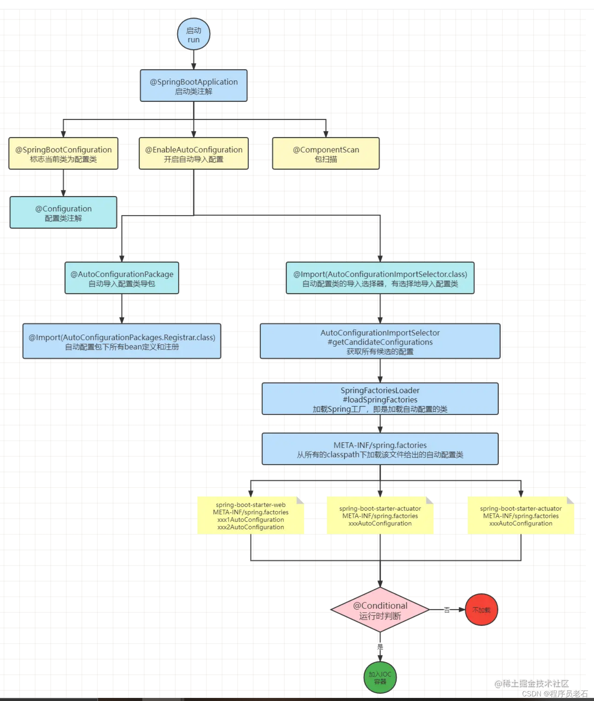


启动类的@SpringBootApplication注解由@SpringBootConfiguration，@EnableAutoConfiguration，@ComponentScan三个注解组成，三个注解共同完成自动装配；

- **@SpringBootConfiguration 注解标记启动类为配置类**
- **@ComponentScan 注解实现启动时扫描启动类所在的包以及子包下所有标记为bean的类由IOC容器注册为bean**
- **@EnableAutoConfiguration通过 @Import 注解导入 AutoConfigurationImportSelector类，然后通过AutoConfigurationImportSelector 类的 selectImports 方法去读取需要被自动装配的组件依赖下的META-INF/spring.factories文件配置的组件的类全名，并按照一定的规则过滤掉不符合要求的组件的类全名，将剩余读取到的各个组件的类全名集合返回给IOC容器并将这些组件注册为bean**


## 如何理解springboot中的starter？

​		使用spring+springmvc框架进行开发的时候，如果需要引入mybatis框架，那么需要在xml中定义需要的bean对象，这个过程很明显是很麻烦的，如果需要引入额外的其他组件，那么也需要进行复杂的配置，因此在springboot中引入了starter

​		

​		**starter就是起步依赖，它把某些功能（例如我们要使用MyBatis）所需要的全部其他依赖组件依赖进来，然后基于SpringBoot的自动配置机制，把相应的依赖组件配置好并注册到IOC容器中，这样我们只需要引入这个starter依赖，再进行一些简单的属性配置，就可以直接使用这些已经配置好的功能组件。使得开发者可以不需要去关心各组件的版本冲突，也不需要进行繁琐的配置工作，达到开箱即用的效果。**

**具体实现方法就是：写一个@Configuration的配置类，把依赖组件的bean定义在其中，然后在starter包的META-INF/spring.factories中写入该配置类，那么springboot程序在启动的时候就会按照约定来加载该配置类，从而把依赖组件的bean注册到IOC容器中**

​	

## 什么是嵌入式服务器，为什么使用嵌入式服务器？

​		在springboot框架中，大家应该发现了有一个内嵌的tomcat，在之前的开发流程中，每次写好代码之后必须要将项目部署到一个额外的web服务器中，只有这样才可以运行，这个明显要麻烦很多，而使用springboot的时候，你会发现在启动项目的时候可以直接按照java应用程序的方式来启动项目，不需要额外的环境支持，也不需要tomcat服务器，这是因为在springboot框架中内置了tomcat.jar，来通过main方法启动容器，达到一键开发部署的方式，不需要额外的任何其他操作。


# MyBatis

## mybatis的优缺点有哪些？

1、Mybait的优点：

（1）简单易学，容易上手（相比于Hibernate）  基于SQL编程；
（2）JDBC相比，减少了50%以上的代码量，**消除了JDBC大量冗余的代码**，不需要手动开关连接；
（3）**很好的与各种数据库兼容**（因为MyBatis使用JDBC来连接数据库，所以只要JDBC支持的数据库MyBatis都支持，而JDBC提供了可扩展性，所以只要这个数据库有针对Java的jar包就可以就可以与MyBatis兼容），开发人员不需要考虑数据库的差异性。
（4）**提供了很多第三方插件**（分页插件 / 逆向工程）；
（5）**能够与Spring很好的集成**；
（6）**MyBatis相当灵活**，不会对应用程序或者数据库的现有设计强加任何影响，S**QL写在XML里，从程序代码中彻底分离，解除sql与程序代码的耦合**，便于统一管理和优化，并可重用。
（7）提供XML标签，**支持编写动态SQL语句**。
（8）提供映射标签，**支持**对象与数据库的**ORM字段关系映射**。
（9）提供对象关系映射标签，支持对象关系组建维护。
2、MyBatis框架的缺点：

（1）**SQL语句的编写工作量较大**，尤其是字段多、关联表多时，更是如此，对开发人员编写SQL语句的功底有一定要求。
（2）**SQL语句依赖于数据库，导致数据库移植性差**，不能随意更换数据库。

## mybatis和hibernate有什么区别？

**Hibernate的优点：**

1、hibernate是全自动，hibernate完全可以通过对象关系模型实现对数据库的操作，拥有完整的JavaBean对象与数据库的映射结构来自动生成sql。

2、功能强大，数据库无关性好，O/R映射能力强，需要写的代码很少，开发速度很快。

3、有更好的二级缓存机制，可以使用第三方缓存。

4、数据库移植性良好。

5、hibernate拥有完整的日志系统，hibernate日志系统非常健全，涉及广泛，包括sql记录、关系异常、优化警告、缓存提示、脏数据警告等

**Hibernate的缺点：**

1、学习门槛高，精通门槛更高，程序员如何设计O/R映射，在性能和对象模型之间如何取得平衡，以及怎样用好Hibernate方面需要的经验和能力都很强才行

2、hibernate的sql很多都是自动生成的，无法直接维护sql；虽然有hql查询，但功能还是不及sql强大，见到报表等变态需求时，hql查询要虚，也就是说hql查询是有局限的；hibernate虽然也支持原生sql查询，但开发模式上却与orm不同，需要转换思维，因此使用上有些不方便。总之写sql的灵活度上hibernate不及mybatis。

**Mybatis的优点：**

1、易于上手和掌握，提供了数据库查询的自动对象绑定功能，而且延续了很好的SQL使用经验，对于没有那么高的对象模型要求的项目来说，相当完美。

2、sql写在xml里，便于统一管理和优化， 解除sql与程序代码的耦合。

3、提供映射标签，支持对象与数据库的orm字段关系映射

4、 提供对象关系映射标签，支持对象关系组建维护

5、提供xml标签，支持编写动态sql。

6、速度相对于Hibernate的速度较快

**Mybatis的缺点：**

1、关联表多时，字段多的时候，sql工作量很大。

2、sql依赖于数据库，导致数据库移植性差。

3、由于xml里标签id必须唯一，导致DAO中方法不支持方法重载。

4、对象关系映射标签和字段映射标签仅仅是对映射关系的描述，具体实现仍然依赖于sql。

5、DAO层过于简单，对象组装的工作量较大。

6、不支持级联更新、级联删除。

7、Mybatis的日志除了基本记录功能外，其它功能薄弱很多。

8、编写动态sql时,不方便调试，尤其逻辑复杂时。

9、提供的写动态sql的xml标签功能简单，编写动态sql仍然受限，且可读性低。

## mybatis中#{}和${}的区别是什么？

a、#{}是预编译处理，${}是字符串替换。
b、Mybatis 在处理#{}时，会将 sql 中的#{}替换为?号，调用 PreparedStatement 的 set 方法来赋值；
c、Mybatis 在处理${}时，就是把${}替换成变量的值。
d、使用#{}可以有效的防止 SQL 注入，提高系统安全性


## 简述一下mybatis插件运行原理及开发流程？

mybatis只支持针对**ParameterHandler**、**ResultSetHandler**、**StatementHandler**、**Executor**这四种接口的插件，mybatis使用jdk的动态代理，为需要拦截的接口生成代理对象以实现接口方法拦截功能，每当执行这四种接口对象的方法时，就会进入拦截方法，具体就是InvocationHandler的invoke方法，拦截那些你指定需要拦截的方法。

编写插件：实现Mybatis的Interceptor接口并复写intercept方法，然后给插件编写注解，指定要拦截哪一个接口的哪些方法，在配置文件中配置编写的插件即可。

```java
@Intercepts({@Signature(type = StatementHandler.class,method = "parameterize",args = Statement.class)})
```


# MySQL

## 索引的基本原理

1、为什么要有索引?
一般的应用系统，读写比例在10:1左右，而且插入操作和一般的更新操作很少出现性能问题，在生产环境中，我们遇到最多的，也是最容易出问题的，还是一些复杂的查询操作，因此对查询语句的优化显然是重中之重。说起加速查询，就不得不提到索引了。
2、什么是索引？
索引在MySQL中也叫是一种“键”，是存储引擎用于快速找到记录的一种数据结构。索引对于良好的性能
非常关键，尤其是当表中的数据量越来越大时，索引对于性能的影响愈发重要。
索引优化应该是对查询性能优化最有效的手段了。**索引能够轻易将查询性能提高好几个数量级。**
索引相当于字典的音序表，如果要查某个字，如果不使用音序表，则需要从几百页中逐页去查。	

3、索引的原理

索引的目的在于提高查询效率，与我们查阅图书所用的目录是一个道理：先定位到章，然后定位到该章下的一个小节，然后找到页数。相似的例子还有：查字典，查火车车次，飞机航班等

本质都是：通过不断地缩小想要获取数据的范围来筛选出最终想要的结果，同时把随机的事件变成顺序的事件，也就是说，有了这种索引机制，我们可以总是用同一种查找方式来锁定数据。

数据库也是一样，但显然要复杂的多，因为不仅面临着等值查询，还有范围查询(>、<、between、in)、模糊查询(like)、并集查询(or)等等。数据库应该选择怎么样的方式来应对所有的问题呢？我们回想字典的例子，能不能把数据分成段，然后分段查询呢？最简单的如果1000条数据，1到100分成第一段，101到200分成第二段，201到300分成第三段…这样查第250条数据，只要找第三段就可以了，一下子去除了90%的无效数据。但如果是1千万的记录呢，分成几段比较好？按照搜索树的模型，其平均复杂度是lgN，具有不错的查询性能。但这里我们忽略了一个关键的问题，复杂度模型是基于每次相同的操作成本来考虑的。而数据库实现比较复杂，一方面数据是保存在磁盘上的，另外一方面为了提高性能，每次又可以把部分数据读入内存来计算，因为我们知道访问磁盘的成本大概是访问内存的十万倍左右，所以简单的搜索树难以满足复杂的应用场景。

4、索引的数据结构

**MySQL主要用到两种结构：B+ Tree索引和Hash索引**
**Inodb存储引擎 默认是 B+Tree索引**
**Memory 存储引擎 默认 Hash索引；**
MySQL中，只有Memory(Memory表只存在内存中，断电会消失，适用于临时表)存储引擎显示支持Hash索引，是Memory表的默认索引类型，尽管Memory表也可以使用B+Tree索引。Hash索引把数据以hash形式组织起来，因此当查找某一条记录的时候，速度非常快。但是因为hash结构，每个键只对应一个值，而且是散列的方式分布。所以它并不支持范围查找和排序等功能。
**B+Tree是mysql使用最频繁的一个索引数据结构，是InnoDB和MyISAM存储引擎模式的索引类型。相对Hash索引，B+Tree在查找单条记录的速度比不上Hash索引，但是因为更适合排序等操作，所以它更受欢迎。毕竟不可能只对数据库进行单条记录的操作。**
**对比：**
**hash类型的索引：查询单条快，范围查询慢**
**btree类型的索引：b+树，层数越多，数据量指数级增长（我们就用它，因为innodb默认支持它）**


## mysql聚簇和非聚簇索引的区别是什么？

​		mysql的索引类型跟存储引擎是相关的，innodb存储引擎数据文件跟索引文件全部放在ibd文件中，而myisam的数据文件放在myd文件中，索引放在myi文件中，其实区分聚簇索引和非聚簇索引非常简单，**只要判断数据跟索引是否存储在一起就可以了。**

​		innodb存储引擎在进行数据插入的时候，数据必须要跟索引放在一起，如果有主键就使用主键，没有主键就使用唯一键，没有唯一键就使用6字节的rowid，因此跟数据绑定在一起的就是聚簇索引，而为了避免数据冗余存储，其他的索引的叶子节点中存储的都是数据的key，因此innodb中既有聚簇索引也有非聚簇索引，而myisam中只有非聚簇索引。


## mysql索引结构有哪些，各自的优劣是什么？

索引的数据结构和具体存储引擎的实现有关，mysql中使用较多的索引有hash索引，B+树索引，innodb的索引实现为B+树，memory存储引擎为hash索引。

**B+树**是一个平衡的多叉树，从根节点到每个叶子节点的高度差值不超过1，而且同层级的二节点间有指针相关连接，在B+树上的常规检索，从根节点到叶子节点的搜索效率基本相当，不会出现大幅波动，而且基于索引的顺序扫描时，也可以利用双向指针快速左右移动，效率非常高。因为，B+树索引被广泛应用于数据库、文件系统等场景。

**散列表**就是采用一定的哈希算法，把键值换算成新的哈希值，检索时不需要类似B+树那样从根节点到叶子节点逐级查找，只需一次哈希算法即可立刻定位到相应的位置，速度非常快。


B+树 范围查找、排序等效率高

散列表 查找单个数据效率高。不支持利用索引进行范围查找、排序、模糊查询等。


哈希索引也不支持多列联合索引的最左匹配规则

B+树索引的关键字检索效率比较平均，不像B树那样波动大，在有大量重复键值情况下，哈希索引的效率也是极低的，因此存在哈希碰撞问题。


## 索引的设计原则有哪些？

​		在进行索引设计的时候，**应该保证索引字段占用的空间越小越好**，这只是一个大的方向，还有一些细节点需要注意下：

​		1、适合索引的列是出现在where字句中的列，或者连接子句中指定的列

​		2、基数较小的表，索引效果差，没必要创建索引

​		3、在选择索引列的时候，越短越好，可以指定某些列的一部分，没必要用全部字段的值

​		4、重复数据多的字段不要创建索引

​		5、定义有外键的数据列一定要创建索引

​		6、更新频繁的字段不要有索引

​		7、创建索引的列不要过多，可以创建组合索引，但是组合索引的列的个数不建议太多

​		8、大文本、大对象不要创建索引


## mysql锁的类型有哪些？

基于锁的属性分类：共享锁、排他锁。

基于锁的粒度分类：行级锁（innodb ）、表级锁（ innodb 、myisam）、页级锁（ innodb引擎）、记录锁、间隙锁、临键锁。

基于锁的状态分类：意向共享锁、意向排它锁。

 

 共享锁（share lock）： 共享锁又称读锁，简称 S 锁；**当一个事务为数据加上读锁之后，其他事务只能对该数据加读锁，而不能对数据加写锁，直到所有的读锁释放之后其他事务才能对其进行加持写锁**。共享锁的特性主要是为了支持并发的读取数据，读取数据的时候不支持修改。

 排他锁（exclusive lock）：排他锁又称写锁，简称 X 锁；当一个事务为数据加上写锁时，其他请求将不能再为数据加任何锁，直到该锁释放之后，其他事务才能对数据进行加锁。排他锁的目的是在数据修改时候，不允许其他人同时修改，也不允许其他人读取，避免了出现脏数据和脏读的问题。


表锁（table lock）：表锁是指上锁的时候锁住的是整个表，当下一个事务访问该表的时候，必须等前一个事务释放了锁才能进行对表进行访问；特点：粒度大，加锁简单，容易冲突；


页锁：页级锁是 MysQL 中锁定粒度介于行级锁和表级锁中间的一种锁．表级锁速度快，但冲突多，行级冲突少，但速度慢。所以取了折衷的页级，**一次锁定相邻的一组记录**。特点：开销和加锁时间界于表锁和行锁之间，会出现死锁；锁定粒度界于表锁和行锁之间，并发度一般。


行锁：行锁是指上锁的时候锁住的是表的<u>某一行或多行记录</u>，其他事务访问同一张表时，只有被锁住的记录不能访问，其他的记录可正常访问，特点：粒度小，加锁比表锁麻烦，不容易冲突，相比表锁支持的并发要高

行锁有如下类型：

​	**记录锁（Record lock）**:行锁的一种。记录锁只是锁住<u>表中的某一条记录</u>，记录锁是说事务在加锁后锁住的只是表的某一条记录。

​	例如：select * from t where id=1 for update;

​	 它会在 id=1 的索引记录上加锁，以阻止其他事务更新，删除 id=1 的这一行。


​	**间隙锁：**是属于行锁的一种，**使用间隙锁锁住的是一个区间，而不单单是这个区间中的每一条数据**。间隙锁只会出现在REPEATABLE_READ（重复读）的事务隔离级别中，用于防止出现幻读的情况。他并不会锁住区间的边界记录。例如：

```
SELECT * FROM table WHERE id BETWEN 1 AND 10 FOR UPDATE;
```

即全部在`（1，10）`区间内的记录行都会被锁住，id 为2-9 的数据行的插入会被阻塞，可是 1 和 10 两条记录行并不会被锁住。

​	**临键锁（Next-Key lock)**：也属于行锁的一种，并且它是INNODB的行锁默认算法，总结来说它就是**记录锁和间隙锁的组合**，也就是说即会锁住记录也会锁住一段间隙。临键锁会把查询出来的记录锁住，同时也会把该范围查询内的所有间隙空间也会锁住，再之它会把相邻的下一个区间也会锁住。每个数据行上的`非唯一索引列`上都会存在一把**临键锁**，当某个事务持有该数据行的**临键锁**时，会锁住一段**左开右闭区间**的数据。需要强调的一点是，`InnoDB` 中`行级锁`是基于索引实现的，**临键锁**只与`非唯一索引列`有关，在`唯一索引列`（包括`主键列`）上不存在**临键锁**。


## mysql执行计划怎么看？

​       在企业的应用场景中，为了知道优化SQL语句的执行，需要查看SQL语句的具体执行过程，以加快SQL语句的执行效率。

​       可以使用explain+SQL语句来模拟优化器执行SQL查询语句，从而知道mysql是如何处理sql语句的。

​	   官网地址： https://dev.mysql.com/doc/refman/5.7/en/explain-output.html 

1、执行计划中包含的信息

| Column        | Meaning                                        |
| ------------- | ---------------------------------------------- |
| id            | The `SELECT` identifier                        |
| select_type   | The `SELECT` type                              |
| table         | The table for the output row                   |
| partitions    | The matching partitions                        |
| type          | The join type                                  |
| possible_keys | The possible indexes to choose                 |
| key           | The index actually chosen                      |
| key_len       | The length of the chosen key                   |
| ref           | The columns compared to the index              |
| rows          | Estimate of rows to be examined                |
| filtered      | Percentage of rows filtered by table condition |
| extra         | Additional information                         |

**id**

select查询的序列号，包含一组数字，表示查询中执行select子句或者操作表的顺序

id号分为三种情况：

​		1、如果id相同，那么执行顺序从上到下

```sql
explain select * from emp e join dept d on e.deptno = d.deptno join salgrade sg on e.sal between sg.losal and sg.hisal;
```

​		2、如果id不同，如果是子查询，id的序号会递增，id值越大优先级越高，越先被执行

```sql
explain select * from emp e where e.deptno in (select d.deptno from dept d where d.dname = 'SALES');
```

​		3、id相同和不同的，同时存在：相同的可以认为是一组，从上往下顺序执行，在所有组中，id值越大，优先级越高，越先执行

```sql
explain select * from emp e join dept d on e.deptno = d.deptno join salgrade sg on e.sal between sg.losal and sg.hisal where e.deptno in (select d.deptno from dept d where d.dname = 'SALES');
```

**select_type**

主要用来分辨查询的类型，是普通查询还是联合查询还是子查询

| `select_type` Value  | Meaning                                                      |
| -------------------- | ------------------------------------------------------------ |
| SIMPLE               | Simple SELECT (not using UNION or subqueries)                |
| PRIMARY              | Outermost SELECT                                             |
| UNION                | Second or later SELECT statement in a UNION                  |
| DEPENDENT UNION      | Second or later SELECT statement in a UNION, dependent on outer query |
| UNION RESULT         | Result of a UNION.                                           |
| SUBQUERY             | First SELECT in subquery                                     |
| DEPENDENT SUBQUERY   | First SELECT in subquery, dependent on outer query           |
| DERIVED              | Derived table                                                |
| UNCACHEABLE SUBQUERY | A subquery for which the result cannot be cached and must be re-evaluated for each row of the outer query |
| UNCACHEABLE UNION    | The second or later select in a UNION that belongs to an uncacheable subquery (see UNCACHEABLE SUBQUERY) |

```sql
--sample:简单的查询，不包含子查询和union
explain select * from emp;

--primary:查询中若包含任何复杂的子查询，最外层查询则被标记为Primary
explain select staname,ename supname from (select ename staname,mgr from emp) t join emp on t.mgr=emp.empno ;

--union:若第二个select出现在union之后，则被标记为union
explain select * from emp where deptno = 10 union select * from emp where sal >2000;

--dependent union:跟union类似，此处的depentent表示union或union all联合而成的结果会受外部表影响
explain select * from emp e where e.empno  in ( select empno from emp where deptno = 10 union select empno from emp where sal >2000)

--union result:从union表获取结果的select
explain select * from emp where deptno = 10 union select * from emp where sal >2000;

--subquery:在select或者where列表中包含子查询
explain select * from emp where sal > (select avg(sal) from emp) ;

--dependent subquery:subquery的子查询要受到外部表查询的影响
explain select * from emp e where e.deptno in (select distinct deptno from dept);

--DERIVED: from子句中出现的子查询，也叫做派生类，
explain select staname,ename supname from (select ename staname,mgr from emp) t join emp on t.mgr=emp.empno ;

--UNCACHEABLE SUBQUERY：表示使用子查询的结果不能被缓存
 explain select * from emp where empno = (select empno from emp where deptno=@@sort_buffer_size);
 
--uncacheable union:表示union的查询结果不能被缓存：sql语句未验证
```

**table**

对应行正在访问哪一个表，表名或者别名，可能是临时表或者union合并结果集
		1、如果是具体的表名，则表明从实际的物理表中获取数据，当然也可以是表的别名

​		2、表名是derivedN的形式，表示使用了id为N的查询产生的衍生表

​		3、当有union result的时候，表名是union n1,n2等的形式，n1,n2表示参与union的id

**type**

type显示的是访问类型，访问类型表示我是以何种方式去访问我们的数据，最容易想的是全表扫描，直接暴力的遍历一张表去寻找需要的数据，效率非常低下，访问的类型有很多，效率从最好到最坏依次是：

system > const > eq_ref > **ref** > fulltext > ref_or_null > index_merge > unique_subquery > index_subquery > **range** > index > ALL 

一般情况下，得保证查询至少达到range级别，最好能达到ref

```sql
--all:全表扫描，一般情况下出现这样的sql语句而且数据量比较大的话那么就需要进行优化。
explain select * from emp;

--index：全索引扫描这个比all的效率要好，主要有两种情况，一种是当前的查询时覆盖索引，即我们需要的数据在索引中就可以索取，或者是使用了索引进行排序，这样就避免数据的重排序
explain  select empno from emp;

--range：表示利用索引查询的时候限制了范围，在指定范围内进行查询，这样避免了index的全索引扫描，适用的操作符： =, <>, >, >=, <, <=, IS NULL, BETWEEN, LIKE, or IN() 
explain select * from emp where empno between 7000 and 7500;

--index_subquery：利用索引来关联子查询，不再扫描全表
explain select * from emp where emp.job in (select job from t_job);

--unique_subquery:该连接类型类似与index_subquery,使用的是唯一索引
 explain select * from emp e where e.deptno in (select distinct deptno from dept);
 
--index_merge：在查询过程中需要多个索引组合使用，没有模拟出来
explain select * from rental where rental_date like '2005-05-26 07:12:2%' and inventory_id=3926 and customer_id=321\G

--ref_or_null：对于某个字段即需要关联条件，也需要null值的情况下，查询优化器会选择这种访问方式
explain select * from emp e where  e.mgr is null or e.mgr=7369;

--ref：使用了非唯一性索引进行数据的查找
 create index idx_3 on emp(deptno);
 explain select * from emp e,dept d where e.deptno =d.deptno;

--eq_ref ：使用唯一性索引进行数据查找
explain select * from emp,emp2 where emp.empno = emp2.empno;

--const：这个表至多有一个匹配行，
explain select * from emp where empno = 7369;
 
--system：表只有一行记录（等于系统表），这是const类型的特例，平时不会出现
```

 **possible_keys** 

​        显示可能应用在这张表中的索引，一个或多个，查询涉及到的字段上若存在索引，则该索引将被列出，但不一定被查询实际使用

```sql
explain select * from emp,dept where emp.deptno = dept.deptno and emp.deptno = 10;
```

**key**

​		实际使用的索引，如果为null，则没有使用索引，查询中若使用了覆盖索引，则该索引和查询的select字段重叠。

```sql
explain select * from emp,dept where emp.deptno = dept.deptno and emp.deptno = 10;
```

**key_len**

表示索引中使用的字节数，可以通过key_len计算查询中使用的索引长度，在不损失精度的情况下长度越短越好。

```sql
explain select * from emp,dept where emp.deptno = dept.deptno and emp.deptno = 10;
```

**ref**

显示索引的哪一列被使用了，如果可能的话，是一个常数

```sql
explain select * from emp,dept where emp.deptno = dept.deptno and emp.deptno = 10;
```

**rows**

根据表的统计信息及索引使用情况，大致估算出找出所需记录需要读取的行数，此参数很重要，直接反应的sql找了多少数据，在完成目的的情况下越少越好

```sql
explain select * from emp;
```

**extra**

包含额外的信息。

```sql
--using filesort:说明mysql无法利用索引进行排序，只能利用排序算法进行排序，会消耗额外的位置
explain select * from emp order by sal;

--using temporary:建立临时表来保存中间结果，查询完成之后把临时表删除
explain select ename,count(*) from emp where deptno = 10 group by ename;

--using index:这个表示当前的查询时覆盖索引的，直接从索引中读取数据，而不用访问数据表。如果同时出现using where 表名索引被用来执行索引键值的查找，如果没有，表面索引被用来读取数据，而不是真的查找
explain select deptno,count(*) from emp group by deptno limit 10;

--using where:使用where进行条件过滤
explain select * from t_user where id = 1;

--using join buffer:使用连接缓存，情况没有模拟出来

--impossible where：where语句的结果总是false
explain select * from emp where empno = 7469;
```


## 事务的基本特性是什么？

事务四大特征：原子性，一致性，隔离性和持久性。

1. 原子性（Atomicity）
   **一个原子事务要么完整执行，要么干脆不执行**。这意味着，工作单元中的每项任务都必须正确执行。如果有任一任务执行失败，则整个工作单元或事务就会被终止。即此前对数据所作的任何修改都将被撤销。如果所有任务都被成功执行，事务就会被提交，即对数据所作的修改将会是永久性的。
2. 一致性（Consistency）
   一致性代表了底层数据存储的完整性。它必须由事务系统和应用开发人员共同来保证。**事务系统通过保证事务的原子性，隔离性和持久性来满足这一要求;** 应用开发人员则需要保证数据库有适当的约束(主键，引用完整性等)，并且工作单元中所实现的业务逻辑不会导致数据的不一致(即，数据预期所表达的现实业务情况不相一致)。例如，在一次转账过程中，从某一账户中扣除的金额必须与另一账户中存入的金额相等。支付宝账号100 你读到余额要取，有人向你转100 但是事物没提交（这时候你读到的余额应该是100，而不是200） 这种就是一致性
3. 隔离性（Isolation）
   隔离性意味着事务必须在不干扰其他进程或事务的前提下独立执行。换言之，在事务或工作单元执行完毕之前，其所访问的数据不能受系统其他部分的影响。
4. 持久性（Durability）
   持久性表示在某个事务的执行过程中，对数据所作的所有改动都必须在事务成功结束前保存至某种物理存储设备。这样可以保证，所作的修改在任何系统瘫痪时不至于丢失。


## MySQL的隔离级别有哪些？

MySQL定义了四种隔离级别，包括一些具体规则，用于限定事务内外哪些改变是可见的，哪些改变是不可见的。低级别的隔离一般支持更高的并发处理，并且拥有更低的系统开销。

**REPEATABLE READ 可重复读**
**MySQL数据库默认的隔离级别。**该级别解决了READ UNCOMMITTED隔离级别导致的问题。它保证同一事务的多个实例在并发读取事务时，会“看到同样的”数据行。不过，这会导致另外一个棘手问题“幻读”。InnoDB和Falcon存储引擎通过多版本并发控制机制解决了幻读问题。

**READ COMMITTED 读取提交内容**
大多数数据库系统的默认隔离级别（但是不是MySQL的默认隔离级别），满足了隔离的早先简单定义：一个事务开始时，只能“看见”已经提交事务所做的改变，一个事务从开始到提交前，所做的任何数据改变都是不可见的，除非已经提交。这种隔离级别会出现所谓的“不可重复读”。这意味着用户运行同一个语句两次，看到的结果是不同的。

**READ UNCOMMITTED 读取未提交内容**
在这个隔离级别，所有事务都可以“看到”未提交事务的执行结果。读取未提交数据，也被称为“脏读”

**SERIALIZABLE 可串行化**
该级别是最高级别的隔离级。它通过强制事务排序，使之不可能相互冲突，从而解决幻读问题。简而言之，SERIALIZABLE是在每个读的数据行上加锁。在这个级别，可能导致大量的超时Timeout和锁竞争Lock Contention现象，实际应用中很少使用到这个级别，但如果用户的应用为了数据的稳定性，需要强制减少并发的话，也可以选择这种隔离级。

1. 脏读

脏读是指一个事务读取了另一个事务执行过程中未提交的数据。


2. 不可重复读

不可重复读是指对于数据库中的某个数据，一个事务执行过程中多次查询返回不同查询结果，这就是在事务执行过程中，数据被其他事务提交修改了。
不可重复读同脏读的区别在于，脏读是一个事务读取了另一未完成的事务执行过程中的数据，而不可重复读是一个事务执行过程中，另一事务提交并修改了当前事务正在读取的数据。

3. 虚读(幻读)

幻读是事务非独立执行时发生的一种现象，例如事务T1批量对一个表中某一列列值为1的数据修改为2的变更，但是在这时，事务T2对这张表插入了一条列值为1的数据，并完成提交。此时，如果事务T1查看刚刚完成操作的数据，发现还有一条列值为1的数据没有进行修改，而这条数据其实是T2刚刚提交插入的，这就是幻读。

不可重复读是针对某一条数据多次读出的结果不同（更新操作），而幻读是指读出来的数据会出现多了几条或者少了几条（插入或者删除操作）


## 怎么处理MySQL的慢查询？

1、开启慢查询日志，准确定位到哪个sql语句出现了问题

2、分析sql语句，看看是否load了额外的数据，可能是查询了多余的行并且抛弃掉了，可能是加载了许多结果中并不需要的列，对语句进行分析以及重写

3、分析语句的执行计划，然后获得其使用索引的情况，之后修改语句或者修改索引，使得语句可以尽可能的命中索引

4、如果对语句的优化已经无法进行，可以考虑表中的数据量是否太大，如果是的话可以进行横向或者纵向的分表。


## ACID是靠什么保证的？

**原子性**由undolog日志来保证，它记录了需要回滚的日志信息，事务回滚时撤销已经执行成功的sql

**一致性**是由其他三大特性保证，程序代码要保证业务上的一致性

**隔离性**是由MVCC来保证

**持久性**由redolog来保证，mysql修改数据的时候会在redolog中记录一份日志数据，就算数据没有保存成功，只要日志保存成功了，数据仍然不会丢失


## 什么是MVCC？

1、MVCC

​		MVCC，全称Multi-Version Concurrency Control，即多版本并发控制。MVCC是一种并发控制的方法，一般在数据库管理系统中，实现对数据库的并发访问，在编程语言中实现事务内存。

2、当前读

​		像select lock in share mode(共享锁), select for update ; update, insert ,delete(排他锁)这些操作都是一种当前读，为什么叫当前读？就是它读取的是记录的最新版本，读取时还要保证其他并发事务不能修改当前记录，会对读取的记录进行加锁。

3、快照读（提高数据库的并发查询能力）

​		像不加锁的select操作就是快照读，即不加锁的非阻塞读；快照读的前提是隔离级别不是串行级别，串行级别下的快照读会退化成当前读；之所以出现快照读的情况，是基于提高并发性能的考虑，快照读的实现是基于多版本并发控制，即MVCC,可以认为MVCC是行锁的一个变种，但它在很多情况下，避免了加锁操作，降低了开销；既然是基于多版本，即快照读可能读到的并不一定是数据的最新版本，而有可能是之前的历史版本

4、当前读、快照读、MVCC关系

​		MVCC多版本并发控制指的是维持一个数据的多个版本，使得读写操作没有冲突，快照读是MySQL为实现MVCC的一个非阻塞读功能。


## MVCC解决的问题是什么？

​		数据库并发场景有三种，分别为：

​		1、读读：不存在任何问题，也不需要并发控制

​		2、读写：有线程安全问题，可能会造成事务隔离性问题，可能遇到脏读、幻读、不可重复读

​		3、写写：有线程安全问题，可能存在更新丢失问题

​		MVCC是一种用来解决读写冲突的无锁并发控制，也就是为事务分配单项增长的时间戳，为每个修改保存一个版本，版本与事务时间戳关联，读操作只读该事务开始前的数据库的快照，**所以MVCC可以为数据库解决一下问题：**

​		**1、在并发读写数据库时，可以做到在读操作时不用阻塞写操作，写操作也不用阻塞读操作，提高了数据库并发读写的性能**

​		**2、解决脏读、幻读、不可重复读等事务隔离问题，但是不能解决更新丢失问题**


## （没看懂）MVCC实现原理是什么？

​		mvcc的实现原理主要依赖于 记录中的三个隐藏字段、undolog、read view来实现的。

​		**隐藏字段**

​		每行记录除了我们自定义的字段外，还有数据库隐式定义的`DB_TRX_ID,DB_ROLL_PTR,DB_ROW_ID`等字段

​		DB_TRX_ID

​		6字节，最近修改事务id，记录创建这条记录或者最后一次修改该记录的事务id

​		DB_ROLL_PTR

​		7字节，回滚指针，指向这条记录的上一个版本,用于配合undolog，指向上一个旧版本

​		DB_ROW_JD

​		6字节，隐藏的主键，如果数据表没有主键，那么innodb会自动生成一个6字节的row_id

​		记录如图所示：


​		在上图中，DB_ROW_ID是数据库默认为该行记录生成的唯一隐式主键，DB_TRX_ID是当前操作该记录的事务ID，DB_ROLL_PTR是一个回滚指针，用于配合undo日志，指向上一个旧版本

​		**undo log**

​		undolog被称之为回滚日志，表示在进行insert，delete，update操作的时候产生的方便回滚的日志

​		当进行insert操作的时候，产生的undolog只在事务回滚的时候需要，并且在事务提交之后可以被立刻丢弃

​		当进行update和delete操作的时候，产生的undolog不仅仅在事务回滚的时候需要，在快照读的时候也需要，所以不能随便删除，只有在快照读或事务回滚不涉及该日志时，对应的日志才会被purge线程统一清除（当数据发生更新和删除操作的时候都只是设置一下老记录的deleted_bit，并不是真正的将过时的记录删除，因为为了节省磁盘空间，innodb有专门的purge线程来清除deleted_bit为true的记录，如果某个记录的deleted_id为true，并且DB_TRX_ID相对于purge线程的read view 可见，那么这条记录一定时可以被清除的）

​		**下面我们来看一下undolog生成的记录链**

​		1、假设有一个事务编号为1的事务向表中插入一条记录，那么此时行数据的状态为：


​		2、假设有第二个事务编号为2对该记录的name做出修改，改为lisi

​		在事务2修改该行记录数据时，数据库会对该行加排他锁

​		然后把该行数据拷贝到undolog中，作为 旧记录，即在undolog中有当前行的拷贝副本

​		拷贝完毕后，修改该行name为lisi，并且修改隐藏字段的事务id为当前事务2的id，回滚指针指向拷贝到undolog的副本记录中

​		事务提交后，释放锁


​		3、假设有第三个事务编号为3对该记录的age做了修改，改为32

​		在事务3修改该行数据的时，数据库会对该行加排他锁

​		然后把该行数据拷贝到undolog中，作为旧纪录，发现该行记录已经有undolog了，那么最新的旧数据作为链表的表头，插在该行记录的undolog最前面

​		修改该行age为32岁，并且修改隐藏字段的事务id为当前事务3的id，回滚指针指向刚刚拷贝的undolog的副本记录

​		事务提交，释放锁


​		从上述的一系列图中，大家可以发现，不同事务或者相同事务的对同一记录的修改，会导致该记录的undolog生成一条记录版本线性表，即链表，undolog的链首就是最新的旧记录，链尾就是最早的旧记录。

​		**Read View**

​		上面的流程如果看明白了，那么大家需要再深入理解下read view的概念了。

​		**Read View是事务进行快照读操作的时候生产的读视图，在该事务执行快照读的那一刻，会生成一个数据系统当前的快照，记录并维护系统当前活跃事务的id，事务的id值是递增的。**

​		其实Read View的最大作用是用来做可见性判断的，也就是说当某个事务在执行快照读的时候，对该记录创建一个Read View的视图，把它当作条件去判断当前事务能够看到哪个版本的数据，有可能读取到的是最新的数据，也有可能读取的是当前行记录的undolog中某个版本的数据

​		Read View遵循的可见性算法主要是将要被修改的数据的最新记录中的DB_TRX_ID（当前事务id）取出来，与系统当前其他活跃事务的id去对比，如果DB_TRX_ID跟Read View的属性做了比较，不符合可见性，那么就通过DB_ROLL_PTR回滚指针去取出undolog中的DB_TRX_ID做比较，即遍历链表中的DB_TRX_ID，直到找到满足条件的DB_TRX_ID,这个DB_TRX_ID所在的旧记录就是当前事务能看到的最新老版本数据。

​		Read View的可见性规则如下所示：

​		首先要知道Read View中的三个全局属性：

​		trx_list:一个数值列表，用来维护Read View生成时刻系统正活跃的事务ID（1,2,3）

​		up_limit_id:记录trx_list列表中事务ID最小的ID（1）

​		low_limit_id:Read View生成时刻系统尚未分配的下一个事务ID，（4）

​		具体的比较规则如下：

​		1、首先比较DB_TRX_ID < up_limit_id,如果小于，则当前事务能看到DB_TRX_ID所在的记录，如果大于等于进入下一个判断

​		2、接下来判断DB_TRX_ID >= low_limit_id,如果大于等于则代表DB_TRX_ID所在的记录在Read View生成后才出现的，那么对于当前事务肯定不可见，如果小于，则进入下一步判断

​		3、判断DB_TRX_ID是否在活跃事务中，如果在，则代表在Read View生成时刻，这个事务还是活跃状态，还没有commit，修改的数据，当前事务也是看不到，如果不在，则说明这个事务在Read View生成之前就已经开始commit，那么修改的结果是能够看见的。

7、MVCC的整体处理流程

假设有四个事务同时在执行，如下图所示：

| 事务1    | 事务2    | 事务3    | 事务4        |
| -------- | -------- | -------- | ------------ |
| 事务开始 | 事务开始 | 事务开始 | 事务开始     |
| ......   | ......   | ......   | 修改且已提交 |
| 进行中   | 快照读   | 进行中   |              |
| ......   | ......   | ......   |              |

从上述表格中，我们可以看到，当事务2对某行数据执行了快照读，数据库为该行数据生成一个Read View视图，可以看到事务1和事务3还在活跃状态，事务4在事务2快照读的前一刻提交了更新，所以，在Read View中记录了系统当前活跃事务1，3，维护在一个列表中。同时可以看到up_limit_id的值为1，而low_limit_id为5，如下图所示：

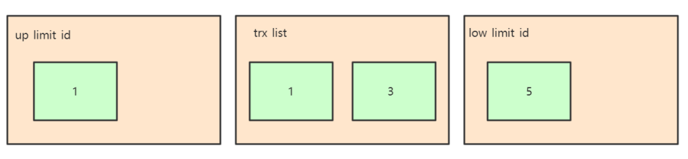

在上述的例子中，只有事务4修改过该行记录，并在事务2进行快照读前，就提交了事务，所以该行当前数据的undolog如下所示：

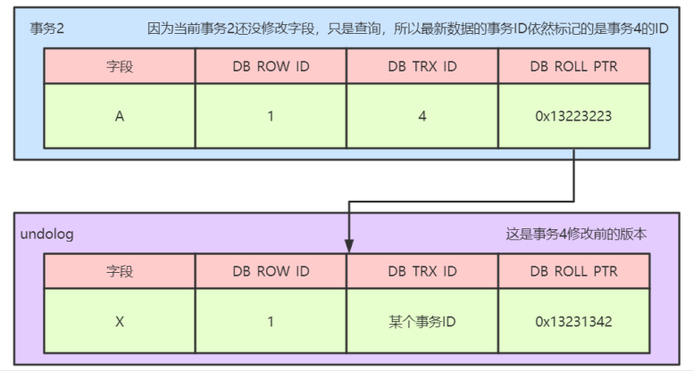


​		当事务2在快照读该行记录的是，会拿着该行记录的DB_TRX_ID去跟up_limit_id,lower_limit_id和活跃事务列表进行比较，判读事务2能看到该行记录的版本是哪个。

​		具体流程如下：先拿该行记录的事务ID（4）去跟Read View中的up_limit_id相比较，判断是否小于，通过对比发现不小于，所以不符合条件，继续判断4是否大于等于low_limit_id,通过比较发现也不大于，所以不符合条件，判断事务4是否处理trx_list列表中，发现不再次列表中，那么符合可见性条件，所以事务4修改后提交的最新结果对事务2 的快照是可见的，因此，事务2读取到的最新数据记录是事务4所提交的版本，而事务4提交的版本也是全局角度的最新版本。如下图所示：


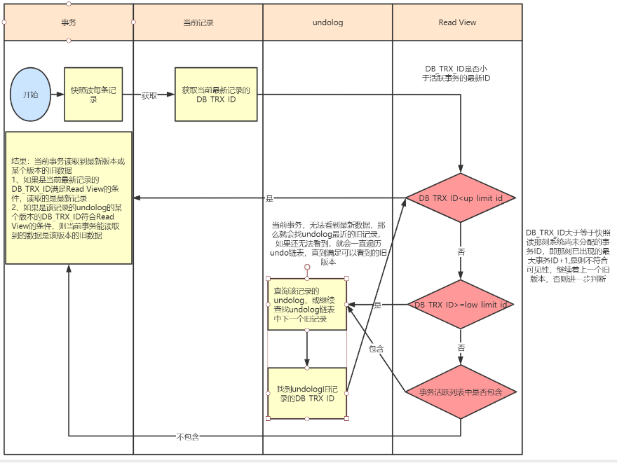

当上述的内容都看明白了的话，那么大家就应该能够搞清楚这几个核心概念之间的关系了，下面我们讲一个不同的隔离级别下的快照读的不同。

8、RC、RR级别下的InnoDB快照读有什么不同

​		因为Read View生成时机的不同，从而造成RC、RR级别下快照读的结果的不同

​		1、在RR级别下的某个事务的对某条记录的第一次快照读会创建一个快照即Read View,将当前系统活跃的其他事务记录起来，此后在调用快照读的时候，还是使用的是同一个Read View,所以只要当前事务在其他事务提交更新之前使用过快照读，那么之后的快照读使用的都是同一个Read View,所以对之后的修改不可见

​		2、在RR级别下，快照读生成Read View时，Read View会记录此时所有其他活动和事务的快照，这些事务的修改对于当前事务都是不可见的，而早于Read View创建的事务所做的修改均是可见

​		3、在RC级别下，事务中，每次快照读都会新生成一个快照和Read View,这就是我们在RC级别下的事务中可以看到别的事务提交的更新的原因。

​		**总结：在RC隔离级别下，是每个快照读都会生成并获取最新的Read View,而在RR隔离级别下，则是同一个事务中的第一个快照读才会创建Read View，之后的快照读获取的都是同一个Read View.**


## 什么是mysql的主从复制？

​		**MySQL 主从复制是指数据可以从一个MySQL数据库服务器主节点复制到一个或多个从节点。**MySQL 默认采用异步复制方式，这样从节点不用一直访问主服务器来更新自己的数据，数据的更新可以在远程连接上进行，从节点可以复制主数据库中的所有数据库或者特定的数据库，或者特定的表。

## mysql为什么需要主从同步？

1、在业务复杂的系统中，有这么一个情景，有一句sql语句需要锁表，导致暂时不能使用读的服务，那么就很影响运行中的业务，使用主从复制，让主库负责写，从库负责读，这样，即使主库出现了锁表的情景，通过读从库也可以保证业务的正常运作。

2、做数据的热备

3、架构的扩展。业务量越来越大，I/O访问频率过高，单机无法满足，此时做多库的存储，降低磁盘I/O访问的频率，提高单个机器的I/O性能。


## mysql复制原理是什么？

​		（1）master服务器将数据的改变记录二进制binlog日志，当master上的数据发生改变时，则将其改变写入二进制日志中；		

​		（2）slave服务器会在一定时间间隔内对master的binlog日志进行探测其是否发生改变，如果发生改变，则开始一个I/OThread请求master的binlog

​		（3）同时主节点为每个I/O线程启动一个dump线程，用于向其发送binlog，并保存至从节点本地的中继日志中，从节点将启动SQL线程从中继日志中读取binlog，在本地重放，使得其数据和主节点的保持一致，最后I/OThread和SQLThread将进入睡眠状态，等待下一次被唤醒。

**也就是说：**

- **从库会生成两个线程,一个I/O线程,一个SQL线程;**
- **I/O线程会去请求主库的binlog,并将得到的binlog写到本地的relay-log(中继日志)文件中;**
- **主库会生成一个log dump线程,用来给从库I/O线程传binlog;**
- **SQL线程,会读取relay log文件中的日志,并解析成sql语句逐一执行;**

注意：

1--master将操作语句记录到binlog日志中，然后授予slave远程连接的权限（master一定要开启binlog二进制日志功能；通常为了数据安全考虑，slave也开启binlog功能）。
2--slave开启两个线程：IO线程和SQL线程。其中：IO线程负责读取master的binlog内容到中继日志relay log里；SQL线程负责从relay log日志里读出binlog内容，并更新到slave的数据库里，这样就能保证slave数据和master数据保持一致了。
3--Mysql复制至少需要两个Mysql的服务，当然Mysql服务可以分布在不同的服务器上，也可以在一台服务器上启动多个服务。
4--Mysql复制最好确保master和slave服务器上的Mysql版本相同（如果不能满足版本一致，那么要保证master主节点的版本低于slave从节点的版本）
5--master和slave两节点间时间需同步


具体步骤：

1、从库通过手工执行change  master to 语句连接主库，提供了连接的用户一切条件（user 、password、port、ip），并且让从库知道，二进制日志的起点位置（file名 position 号）；    start  slave

2、从库的IO线程和主库的dump线程建立连接。

3、从库根据change  master  to 语句提供的file名和position号，IO线程向主库发起binlog的请求。

4、主库dump线程根据从库的请求，将本地binlog以events的方式发给从库IO线程。

5、从库IO线程接收binlog  events，并存放到本地relay-log中，传送过来的信息，会记录到master.info中

6、从库SQL线程应用relay-log，并且把应用过的记录到relay-log.info中，默认情况下，已经应用过的relay 会自动被清理purge


## 简述Myisam和Innodb的区别？

1 是否支持行锁（innodb支持）
2 是否支持外键（innodb支持）
4 是否支持事务（innodb支持）
5 是否支持崩溃时异常恢复（innodb支持）
6 innodb读的效率低于MYISAM
7 innodb写的效率高优于MYISAM
8 MYISAM会有一个变量记录行的总数，而innodb需要扫描全表才能获取行的总数
9 清空整个表的时候，Innodb是一行一行的删除，MYISAM则会新建表

MyISAM存储引擎: 

特点：

1 独立于操作系统，当建立一个MyISAM存储引擎的表时，就会在本地磁盘建立三个文件，例如我建立tb_demo表，那么会生成以下三个文件tb_demo.frm,tb_demo.MYD,tb_demo.MYI
2 不支持事务，
3 支持表锁和全文索引
4 MyISAM存储引擎表由MYD和MYI组成，MYD用来存放数据文件，MYI用来存放索引文件。MySQL数据库只缓存其索引文件，数据文件的缓存交给操作系统本身来完成；
5 MySQL5.0版本开始，MyISAM默认支持256T的单表数据；
6.选择密集型的表：MYISAM存储引擎在筛选大量数据时非常迅速，这是他最突出的优点
7.读的效率优于InnoDB
8.写的效率低于InnoDB
9.适合查询以及插入为主的应用
10.清空整个表的时候，MYISAM则会新建表


## 简述mysql中索引类型有哪些，以及对数据库的性能的影响？

**普通索引**：允许被索引的数据列包含重复的值

**唯一索引**：可以保证数据记录的唯一性

**主键索引**：是一种特殊的唯一索引，在一张表中只能定义一个主键索引，主键用于唯一标识一条记录，使用关键字primary key来创建

**联合索引**：索引可以覆盖多个数据列

**全文索引**：通过建立倒排索引，可以极大的提升检索效率，解决判断字段是否包含的问题，是目前搜索引擎使用的一种关键技术

**索引可以极大地提高数据的查询速度**

**但是会降低插入、删除、更新表的速度，因为在执行这些写操作的时候，还要操作索引文件**

**索引需要占物理空间，除了数据表占数据空间之外，每一个索引还要占一定的物理空间**，如果要建立聚簇索引，那么需要的空间就会更大，如果非聚簇索引很多，一旦聚簇索引改变，那么所有非聚簇索引都会跟着变


# JVM

## 什么是字节码？

因为JVM针对各种操作系统和平台都进行了定制，无论在什么平台，都可以通过javac命令将一个.java文件编译成固定格式的字节码（.class文件）供JVM使用。之所以被称为字节码，是因为**.class文件是由十六进制值组成的，JVM以两个十六进制值为一组，就是以字节为单位进行读取**
格式如下
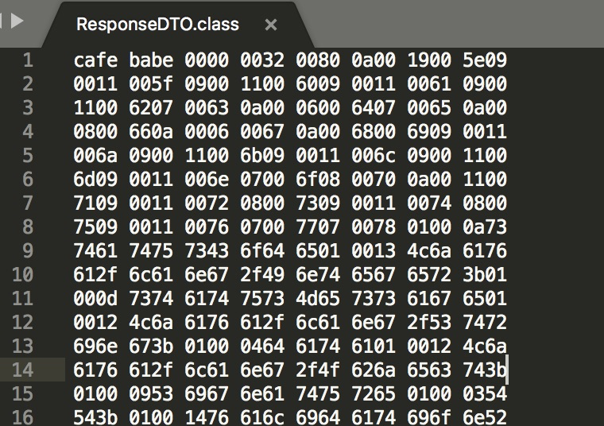

## （不确定考不考）字节码的组成结构是什么？

JVM对字节码的规范是有要求的，要求每一个字节码文件都要有十部分固定的顺序组成，如下图：
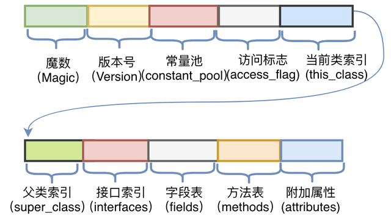

1. 魔数

所有的.class文件的前4个字节都是魔数，魔数以一个固定值：0xCAFEBABE，放在文件的开头

2. 版本号

版本号是魔术之后的4个字节，前两个字节表示次版本号（Minor Version），后两个字节表示主版本号（Major Version），上面的0000 0032，次版本号0000转为十进制是0，主版本号0032 转为十进制50，对应下图的版本映射关系，可以看到对应的java版本号是1.6


3. 常量池

紧接着主版本号之后的字节为常量池入口

常量池中有两类常量：字面量和符号引用，**字面量**是代码中申明为Final的常量值，**符号引用**是如类和接口的全局限定名、字段的名称和描述符、方法的名称和描述符。

常量池整体分为两个部分：常量池计数器以及常量池数据区
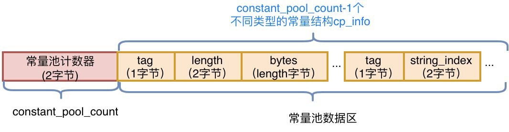

4. 访问标志

常量池结束后的两个字节，描述的是类还是接口，以及是否被Public、Abstract、Final等修饰符修饰，JVM规范规定了9种访问标示（Access_Flag）JVM是通过按位或操作来描述所有的访问标示的，比如类的修饰符是Public Final，则对应的访问修饰符的值为ACC_PUBLIC | ACC_FINAL，即0x0001 | 0x0010=0x0011
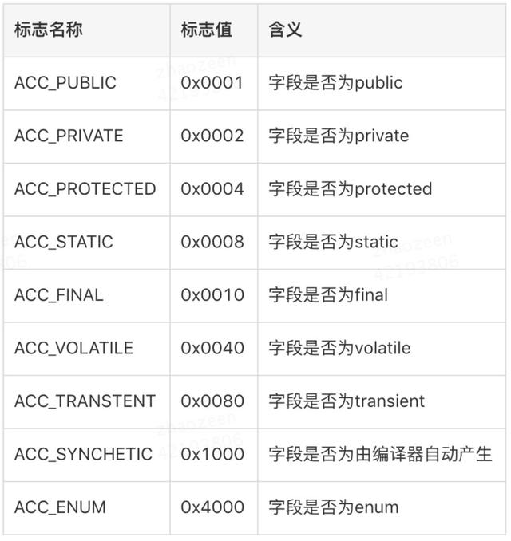


5. 当前类索引

访问标志后的两个字节，描述的是当前类的全限定名，这两个字节保存的值是常量池中的索引值，根据索引值就能在常量池中找到这个类的全限定名
​


6. 父类索引

当前类名后的两个字节，描述的父类的全限定名，也是保存的常量池中的索引值

7. 接口索引

父类名称后的两个字节，是接口计数器，描述了该类或者父类实现的接口数量，紧接着的n个字节是所有接口名称的字符串常量的索引值

8. 字段表

用于描述类和接口中声明的变量，包含类级别的变量和实例变量，但是不包含方法内部声明的局部变量，字段表也分为两个部分，第一部分是两个字节，描述字段个数，第二部分是每个字段的详细信息fields_info
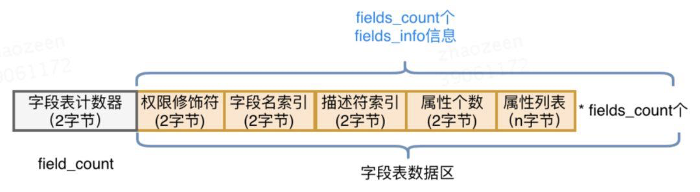

9. 方法表

字段表结束后为方法表，方法表也分为两个部分，第一个部分是两个字节表述方法的个数，第二部分是每个方法的详细信息
方法的访问信息比较复杂，包括方法的访问标志、方法名、方法的描述符和方法的属性：


10. 附加属性

字节码的最后一部分，该项存放了在该文件中类或接口所定义属性的基本信息。


## 类的生命周期

首先类加载的机制过程分为5个部分：加载、验证、准备、解析、初始化
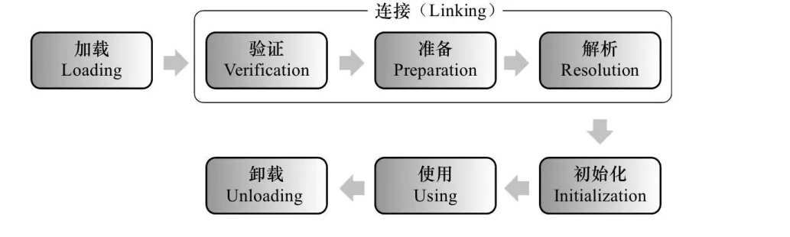


**类加载过程的三个阶段**

1. **加载**
   1. 将类的字节码载入方法区，并创建 类名.class 对象

   2. 如果此类的父类没有加载，先加载父类
   3. 加载是懒惰执行
   4. **访问使用static final 修饰的变量不会触发类加载**
2. **链接**
   1. 验证 – 验证类是否符合 Class 规范，合法性、安全性检查
   2. 准备 – 为 static 变量分配空间，设置默认值，static final 修饰的<u>基本类型</u>变量赋值
   3. 解析 – 将常量池的<u>符号引用</u>解析为<u>直接引用</u>
3. **初始化**
   1. 静态代码块、static 修饰的变量赋值、static final 修饰的<u>引用类型</u>变量赋值，会被**合并**成一个 `<cinit>` 方法，在初始化时被调用
   2. 初始化是懒惰执行


我们现在主要分析**类的初始化过程**：

1. 类的初始化阶段，是真正开始执行类中定义的java程序代码(字节码)并按程序员的意图去初始化类变量的过程。更直接地说，初始化阶段就是执行类构造器<clinit>()方法的过程。**<clinit>()方法是由编译器自动收集类中的所有类变量的赋值动作和静态代码块static{}中的语句合并产生的**，其中编译器收集的顺序是由语句在源文件中出现的顺序所决定。
1. 关于类初始化的顺序**（静态变量、静态初始化块：决于它们在类中出现的先后顺序）>（变量、初始化块：决于它们在类中出现的先后顺序）>构造器**
1. 关于类初始化的详细过程，参见 Java虚拟机规范一书中，其中类初始化过程如下：
   1. 每个类都有一个初始化锁LC，进程获取LC，这个操作会导致当前线程一直等待，直到获取到LC锁
   1. 如果C正在被其他线程初始化，当前线程会释放LC进去阻塞状态，并等待C初始化完成。此时当前线程需要重试这一过程。执行初始化过程时，线程的中断状态不受影响
   1. 如果C正在被本线程初始化，即递归初始化，释放LC并且正常返回
   1. 如果C已经被初始化完成，释放LC并且正常返回
   1. 如果C处于错误状态，表明不可能再完成初始化，释放LC并抛出异常NoClassDefFoundError异常
   1. 否则，将C标记为正在被本线程初始化，释放LC；然后，初始化那些final且为基础类型的类成员变量
   1. 如果C是类而不是接口，且C的父类Super Class（SC）和各个接口SI_n（按照implements子句中的顺序来）还没有初始化，那么就在SC上面递归地进行完整的初始化过程，如果有必要，需要先验证和准备SC ；如果SC或SIn初始化过程中抛出异常，则获取LC，将C标记为错误状态，并通知所有正在等待的线程，然后释放LC，然后再抛出同样的异常。
   1. 从C的classloader处获取assertion断言机制是否被打开
   1. 接下来，按照文本顺序执行类变量初始化和静态代码块，或接口的字段初始化，把它们当作是一个个单独的代码块。
   1. 如果执行正常，那就获取LC，标记C对象为已初始化，并通知所有正在等待的线程，然后释放LC，正常退出整个过程
   1. 否则，如果抛出了异常E那么会中断退出。若E不是Error，则以E为参数创建新的异常ExceptionInInitializerError作为E。如果因为OutOfMemoryError导致无法创建ExceptionInInitializerError，则将OutOfMemoryError作为E。
   1. 获取LC，将C标记为错误状态，通知所有等待的线程，释放LC，并抛出异常E。

可以看到 JLS确实规定了父类先初始化、static块和类变量赋值按照文本顺序来


## JVM内存模型如何分配的？

## 


### JVM性能调优的原则有哪些？

1. 多数的Java应用不需要在服务器上进行GC优化，虚拟机内部已有很多优化来保证应用的稳定运行，所以不要为了调优而调优，不当的调优可能适得其反
1. **在应用上线之前，先考虑将机器的JVM参数设置到最优（适合）**
1. **在进行GC优化之前，需要确认项目的架构和代码等已经没有优化空间。**我们不能指望一个系统架构有缺陷或者代码层次优化没有穷尽的应用，通过GC优化令其性能达到一个质的飞跃
1. GC优化是一个系统而复杂的工作，没有万能的调优策略可以满足所有的性能指标。GC优化必须建立在我们深入理解各种垃圾回收器的基础上，才能有事半功倍的效果
1. 处理吞吐量和延迟问题时，垃圾处理器能使用的内存越大**，即java堆空间越大垃圾收集效果越好**，应用运行也越流畅。这称之为GC内存最大化原则
1. **在这三个属性（吞吐量、延迟、内存）中选择其中两个进行jvm调优**，称之为GC调优3选2


### 什么情况下需要JVM调优？


- Heap内存（老年代）持续上涨达到设置的最大内存值
- Full GC 次数频繁
- GC 停顿（Stop World）时间过长（超过1秒，具体值按应用场景而定）
- 应用出现OutOfMemory 等内存异常
- 应用出现OutOfDirectMemoryError等内存异常（ failed to allocate 16777216 byte(s) of direct memory (used: 1056964615, max: 1073741824)）
- 应用中有使用本地缓存且占用大量内存空间
- 系统吞吐量与响应性能不高或下降
- 应用的CPU占用过高不下或内存占用过高不下


### 在JVM调优时，你关注哪些指标？

1. **吞吐量：**用户代码时间 / （用户代码执行时间 + 垃圾回收时间）。是评价垃圾收集器能力的重要指标之一，是不考虑垃圾收集引起的停顿时间或内存消耗，垃圾收集器能支撑应用程序达到的最高性能指标。吞吐量越高算法越好。
2. **低延迟：**STW越短，响应时间越好。评价垃圾收集器能力的重要指标，度量标准是缩短由于垃圾收集引起的停顿时间或完全消除因垃圾收集所引起的停顿，避免应用程序运行时发生抖动。暂停时间越短算法越好
3. 在设计（或使用）GC 算法时，我们必须确定我们的目标：一个 GC 算法只可能针对两个目标之一（即只专注于最大吞吐量或最小暂停时间），或尝试找到一个二者的折衷
4. MinorGC尽可能多的收集垃圾对象。我们把这个称作MinorGC原则，遵守这一原则可以降低应用程序FullGC 的发生频率。FullGC 较耗时，是应用程序无法达到延迟要求或吞吐量的罪魁祸首
5. 堆大小调整的着手点、分析点：
   1. 统计Minor GC 持续时间
   1. 统计Minor GC 的次数
   1. 统计Full GC的最长持续时间
   1. 统计最差情况下Full GC频率
   1. 统计GC持续时间和频率对优化堆的大小是主要着手点
   1. 我们按照业务系统对延迟和吞吐量的需求，在按照这些分析我们可以进行各个区大小的调整
6. 一般来说吞吐量优先的垃圾回收器：-XX:+UseParallelGC  -XX:+UseParallelOldGC，即常规的（PS/PO）
7. 响应时间优先的垃圾回收器：CMS、G1


## JVM常用参数有哪些？

1. **Xms** 是指设定程序启动时堆内存大小。

2. **Xmx** 是表示java堆可以扩展到的最大值。如果程序运行需要占用更多的内存，超出了这个设置值，就会抛出OutOfMemory异常

   通常将-Xms和-Xmx设置成一样的，因为当堆不够用而发生扩容时，会发生内存抖动影响程序运行时的稳定性。

3. **Xss** 是指设定每个线程的栈大小。这个就要依据你的程序，看一个线程大约需要占用多少内存，可能会有多少线程同时运行等

4. **-Xmn、-XX:NewSize/-XX:MaxNewSize、-XX:NewRatio **

   1. 高优先级：-XX:NewSize/-XX:MaxNewSize 
   1. 中优先级：-Xmn（默认等效 -Xmn=-XX:NewSize=-XX:MaxNewSize=?） 
   1. 低优先级：-XX:NewRatio 


   -Xmn 设置年轻代大小，相当于同时配置-XX:NewSize和-XX:MaxNewSize为一样的值
   -XX:NewSize 设置年轻代大小(for 1.3/1.4)
   -XX:MaxNewSize 年轻代最大值(for 1.3/1.4)
   -XX:NewRatio 年轻代与年老代的比值(除去持久代)
   -XX:SurvivorRatio    Eden区与Survivor区的比值
   -XX:PretenureSizeThreshold 当创建的对象超过指定大小时，直接把对象分配在老年代。
   -XX:MaxTenuringThreshold设定对象在Survivor复制的最大年龄阈值，超过阈值转移到
   老年代  

5. 如果想在日志中追踪类加载与类卸载的情况，可以使用启动参数  **-XX:TraceClassLoading**

   **-XX:TraceClassUnloading** 


## JVM常用性能调优工具有哪些？

1. **MAT**
   1. 提示可能的内存泄露的点
   1. 

2. **jvisualvm**
3. **jconsole**
4. **Arthas**
5. show-busy-java-threads
   1. [https://github.com/oldratlee/useful-scripts/blob/master/docs/java.md#-show-busy-java-threads](https://github.com/oldratlee/useful-scripts/blob/master/docs/java.md#-show-busy-java-threads)​
      #### 


### 线上排查问题的一般流程是怎么样的？

1. CPU占用过高排查流程
   1. 利用 top 命令可以查出占 CPU 最高的的进程pid ，如果pid为 9876
   1. 然后查看该进程下占用最高的线程id【top -Hp 9876】
   1. 假设占用率最高的线程 ID 为 6900，将其转换为 16 进制形式 (因为 java native 线程以 16 进制形式输出) 【printf '%x\n' 6900】
   1. 利用 jstack 打印出 java 线程调用栈信息【jstack 9876 | grep '0x1af4' -A 50 --color】，这样就可以更好定位问题
2. 内存占用过高排查流程
   1. 查找进程id: 【top -d 2 -c】
   1. 查看JVM堆内存分配情况：jmap -heap pid
   1. 查看占用内存比较多的对象 jmap -histo pid | head -n 100
   1. 查看占用内存比较多的存活对象 jmap -histo:live pid | head -n 100


## 线上元空间内存泄露优化方案有哪些？

1. 需要注意的一点是 Java8以及Java8+的JVM已经将永久代废弃了，取而代之的是元空间，且元空间是不是在JVM堆中的，而属于堆外内存，受最大物理内存限制。最佳实践就是我们在启动参数中最好设置上 -XX:MetaspaceSize=1024m -XX:MaxMetaspaceSize=1024m。具体的值根据情况设置。为避免动态申请，可以直接都设置为最大值

1. 元空间主要存放的是类元数据，而且metaspace判断类元数据是否可以回收，是根据加载这些类元数据的Classloader是否可以回收来判断的，只要Classloader不能回收，通过其加载的类元数据就不会被回收。所以线上有时候会出现一种问题，由于框架中，往往大量采用类似ASM、javassist等工具进行字节码增强，生成代理类。如果项目中由主线程频繁生成动态代理类，那么就会导致元空间迅速占满，无法回收

   

## java类加载器有哪些？

**Bootstrap类加载器**

**启动类加载器**主要加载的是**JVM自身需要的类**，**这个类加载器使用C++语言实现的，没有父类，是虚拟机自身的一部分，**它负责将 **<JAVA_HOME>/lib路径下的核心类库**或**-Xbootclasspath参数指定的路径下的jar包**加载到内存中，注意必由于虚拟机是按照文件名识别加载jar包的，如rt.jar，如果文件名不被虚拟机识别，即使把jar包丢到lib目录下也是没有作用的(出于安全考虑，Bootstrap**启动类加载器只加载包名为java、javax、sun等开头**

**Extention 类加载器**

扩展类加载器是指Sun公司实现的sun.misc.Launcher$ExtClassLoader类，**由Java语言实现的**，父类加载器为null，是Launcher的静态内部类，它负责加载**<JAVA_HOME>/lib/ext目录下**或者由系统变量**-Djava.ext.dir指定位路径中的类库**，开发者可以直接使用标准扩展类加载器


**Application类加载器**

称应用程序加载器是指 Sun公司实现的sun.misc.Launcher$AppClassLoader。父类加载器为ExtClassLoader，它负责加载**系统类路径java -classpath**或**-D java.class.path 指定路径下的类库**，也就是我们经常用到的**classpath路径**，开发者可以直接使用系统类加载器，一般情况下该类加载是程序中默认的类加载器，通过ClassLoader#getSystemClassLoader()方法可以获取到该类加载器
**​**

**Custom自定义类加载器**

应用程序可以自定义类加载器，父类加载器为AppClassLoader


## 双亲委派机制是什么？

## 

双亲委派机制
双亲委派模式是在Java 1.2后引入的，其工作原理的是，**如果一个类加载器收到了类加载请求，它并不会自己先去加载**，而是把这个**请求委托给父类的加载器去执行**，**如果父类加载器还存在其父类加载器**，则**进一步向上委托，依次递归**，**请求最终将到达顶层的启动类加载器**，**如果父类加载器可以完成类加载任务，就成功返回，倘若父类加载器无法完成此加载任务，子加载器才会尝试自己去加载，这就是双亲委派模式。**

**双亲委派的好处**

   - 每一个类都只会被加载一次，避免了重复加载
   - 每一个类都会被尽可能的加载（从引导类加载器往下，每个加载器都可能会根据优先次序尝试加载它）
   - 有效避免了某些恶意类的加载（比如自定义了Java.lang.Object类，一般而言在双亲委派模型下会加载系统的Object类而不是自定义的Object类）


另外，可以多讲一下，如何破坏双亲委派模型

1. 双亲委派模型的第一次“被破坏”是重写自定义加载器的loadClass(),jdk不推荐。一般都只是重写findClass()，这样可以保持双亲委派机制.而loadClass方法加载规则由自己定义，就可以随心所欲的加载类
1. 双亲委派模型的第二次“被破坏”是ServiceLoader和Thread.setContextClassLoader()。即线程上下文类加载器（contextClassLoader）。双亲委派模型很好地解决了各个类加载器的基础类统一问题(越基础的类由越上层的加载器进行加载)，基础类之所以被称为“基础”，是因为它们总是作为被调用代码调用的API。但是，如果基础类又要调用用户的代码，那该怎么办呢？线程上下文类加载器就出现了。
   1. SPI。这个类加载器可以通过java.lang.Thread类的setContextClassLoader()方法进行设置，如果创建线程时还未设置，它将会从父线程中继承一个；如果在应用程序的全局范围内都没有设置过，那么这个类加载器默认就是应用程序类加载器。了有线程上下文类加载器，JNDI服务使用这个线程上下文类加载器去加载所需要的SPI代码，也就是父类加载器请求子类加载器去完成类加载动作，这种行为实际上就是打通了双亲委派模型的层次结构来逆向使用类加载器，已经违背了双亲委派模型，但这也是无可奈何的事情。Java中所有涉及SPI的加载动作基本上都采用这种方式，例如JNDI,JDBC,JCE,JAXB和JBI等。
   1. 线程上下文类加载器默认情况下就是AppClassLoader，那为什么不直接通过getSystemClassLoader()获取类加载器来加载classpath路径下的类的呢？其实是可行的，但这种直接使用getSystemClassLoader()方法获取AppClassLoader加载类有一个缺点，那就是代码部署到不同服务时会出现问题，如把代码部署到Java Web应用服务或者EJB之类的服务将会出问题，因为这些服务使用的线程上下文类加载器并非AppClassLoader，而是Java Web应用服自家的类加载器，类加载器不同。，所以我们应用该少用getSystemClassLoader()。总之不同的服务使用的可能默认ClassLoader是不同的，但使用线程上下文类加载器总能获取到与当前程序执行相同的ClassLoader，从而避免不必要的问题
1. 双亲委派模型的第三次“被破坏”是由于用户对程序动态性的追求导致的，这里所说的“动态性”指的是当前一些非常“热门”的名词：代码热替换、模块热部署等，简答的说就是机器不用重启，只要部署上就能用。


## GC如何判断对象可以被回收？

1. **引用计数法（已被淘汰的算法）**
   1. 每一个对象有一个引用属性，新增一个引用时加一，引用释放时减一，计数为0的时候可以回收。

但是这种计算方法，有一个致命的问题，无法解决循环引用的问题

2. **可达性分析算法（根引用）**

   1. 从GcRoot开始向下搜索，搜索所走过的路径被称为引用链，当**一个对象到GcRoot没有任何引用链相连时**，则证明此对象是不可用的，那么虚拟机就可以判定回收。
   1. 那么GcRoot有哪些？即那些一定不会被回收的对象，如正执行方法内局部变量引用的对象、静态变量引用的对象
      1. 虚拟机栈中引用的对象
      1. 方法区中静态属性引用的对象。
      1. 方法区中常量引用的对象
      1. 本地方法栈中（即一般说的native方法）引用的对象

3. 此外，不同的引用类型的回收机制是不一样的

   1. 强引用：通过关键字new的对象就是强引用对象，强引用指向的对象任何时候都不会被回收，宁愿OOM也不会回收。通过 GC Root 的引用链，如果强引用不到该对象，该对象才能被回收

   1. 软引用：如果仅有软引用该对象时，首次垃圾回收不会回收该对象，如果内存仍不足，再次回收时才会释放对象 `SoftReference a = new SoftReference(new A());`软引用自身需要配合引用队列来释放

   1. 弱引用：如果一个对象仅被弱引用所引用，那么在GC时，只要发现弱引用对象，就会被回收。WeakReference a = new WeakReference(new A());弱引用自身需要配合引用队列来释放

   1. 虚引用：PhantomReference a = new PhantomReference(new A(), referenceQueue);只要gc就会被回收

      必须配合引用队列一起使用，当虚引用所引用的对象被回收时，由 Reference Handler 线程将虚引用对象入队，这样就可以知道哪些对象被回收，从而对它们关联的资源做进一步处理


## 如何回收内存对象，有哪些回收算法？ 

**1.标记-清除（Mark-Sweep）算法**  

1. 标记阶段：沿着 GC Root 对象的引用链找，直接或间接引用到的对象加上标记
2. 清除阶段：释放未加标记的对象占用的内存


它的主要不足有两个：

- 效率问题，标记和清除两个过程的效率都不高。

- 空间问题，标记清除之后会产生大量不连续的内存碎片，空间碎片太多可能会导致以后在程序运行过程中需要分配较大对象时，无法找到足够的连续内存而不得不提前触发另一次垃圾收集动作。

  

**2.标记复制算法**

解释：

1. 将整个内存分成两个大小相等的区域，from 和 to，其中 to 总是处于空闲，from 存储新创建的对象
2. 标记阶段与前面的算法类似
3. 在找出存活对象后，会将它们从 from 复制到 to 区域，复制的过程中自然完成了碎片整理
4. 复制完成后，交换 from 和 to 的位置即可


**复制算法的代价是将内存缩小为了原来的一半，减少了实际可用的内存**。现在的商业虚拟机都采用这种收集算法来回收新生代，IBM公司的专门研究表明，新生代中的对象98%是“朝生夕死”的，所以并不需要按照1:1的比例来划分内存空间，而是将内存分为一块较大的Eden空间和两块较小的Survivor空间，每次使用Eden和其中一块Survivor。当回收时，将Eden和Survivor中还存活着的对象一次性地复制到另外一块Survivor空间上，最后清理掉Eden和刚才用过的Survivor空间。HotSpot虚拟机默认Eden和Survivor的大小比例是8:1，也就是每次新生代中可用内存空间为整个新生代容量的90%（80%+10%），只有10%的内存会被“浪费”。当然，98%的对象可回收只是一般场景下的数据，我们没有办法保证每次回收都只有不多于10%的对象存活，当Survivor空间不够用时，需要依赖其他内存（这里指老年代）进行分配担保（Handle Promotion)。


**3.标记-整理算法**

复制收集算法在对象存活率较高时就要进行较多的复制操作，效率将会变低。更关键的是，如果不想浪费50%的空间，就需要有额外的空间进行分配担保，以应对被使用的内存中所有对象都100%存活的极端情况，所以在老年代一般不能直接选用这种算法。根据老年代的特点，有人提出了另外一种标记-整理（Mark-Compact）算法，

**标记过程仍然与标记-清除算法一样，但后续步骤不是直接对可回收对象进行清理，而是让所有存活的对象都向一端移动，然后直接清理掉端边界以外的内存。**


**缺点是性能上较慢**


**4.分代收集算法**

当前商业虚拟机的垃圾收集都采用分代收集（Generational Collection）算法，**一般是把Java堆分为新生代和老年代，这样就可以根据各个年代的特点采用最适当的收集算法。**

**新生代选用标记复制算法**，只需要付出少量存活对象的复制成本就可以完成收集。老年代中因为对象存活率高、没有额外空间对它进行分配担保，**老年代必须使用标记—清除或者标记—整理算法来进行回收。**


##  jvm有哪些垃圾回收器，实际中如何选择？ 


图中展示了7种作用于不同分代的收集器，如果两个收集器之间存在连线，则说明它们可以搭配使用。虚拟机所处的区域则表示它是属于新生代还是老年代收集器。
**新生代收集器**（全部的都是复制算法）：Serial、ParNew、Parallel Scavenge
**老年代收集器**：CMS（标记-清理）、Serial Old（标记-整理）、Parallel Old（标记整理）
整堆收集器： G1（一个Region中是标记-清除算法，2个Region之间是复制算法）
同时，先解释几个名词：
1，**并行（Parallel）**：多个垃圾收集线程并行工作，此时用户线程处于等待状态
2，**并发（Concurrent）**：用户线程和垃圾收集线程同时执行
3，**吞吐量**：运行用户代码时间／（运行用户代码时间＋垃圾回收时间）
**1.Serial收集器是最基本的、发展历史最悠久的收集器。**
**特点：**单线程、简单高效（与其他收集器的单线程相比），对于限定单个CPU的环境来说，Serial收集器由于没有线程交互的开销，专心做垃圾收集自然可以获得最高的单线程手机效率。收集器进行垃圾回收时，必须暂停其他所有的工作线程，直到它结束（Stop The World）。
**应用场景**：适用于Client模式下的虚拟机。
**Serial / Serial Old收集器运行示意图**

**2.ParNew收集器其实就是Serial收集器的多线程版本。**
除了使用多线程外其余行为均和Serial收集器一模一样（参数控制、收集算法、Stop The World、对象分配规则、回收策略等）。
**特点**：多线程、ParNew收集器默认开启的收集线程数与CPU的数量相同，在CPU非常多的环境中，可以使用-XX:ParallelGCThreads参数来限制垃圾收集的线程数。
　　　和Serial收集器一样存在Stop The World问题
**应用场景**：ParNew收集器是许多运行在Server模式下的虚拟机中首选的新生代收集器，因为它是除了Serial收集器外，唯一一个能与CMS收集器配合工作的。
_ParNew/Serial Old组合收集器运行示意图如下：_

**3.Parallel Scavenge 收集器与吞吐量关系密切，故也称为吞吐量优先收集器。**
**特点**：属于新生代收集器也是采用复制算法的收集器，又是并行的多线程收集器（与ParNew收集器类似）。
**该收集器的目标是达到一个可控制的吞吐量。还有一个值得关注的点是：GC自适应调节策略（与ParNew收集器最重要的一个区别）**
**GC自适应调节策略**：Parallel Scavenge收集器可设置-XX:+UseAdptiveSizePolicy参数。当开关打开时不需要手动指定新生代的大小（-Xmn）、Eden与Survivor区的比例（-XX:SurvivorRation）、晋升老年代的对象年龄（-XX:PretenureSizeThreshold)等，虚拟机会根据系统的运行状况收集性能监控信息，动态设置这些参数以提供最优的停顿时间和最高的吞吐量，这种调节方式称为GC的自适应调节策略。
Parallel Scavenge收集器使用两个参数控制吞吐量：

- XX:MaxGCPauseMillis 控制最大的垃圾收集停顿时间
- XX:GCRatio 直接设置吞吐量的大小。

**4.Serial Old是Serial收集器的老年代版本。**
**特点**：同样是单线程收集器，采用标记-整理算法。
**应用场景**：主要也是使用在Client模式下的虚拟机中。也可在Server模式下使用。
Server模式下主要的两大用途（在后续中详细讲解···）：

1. 在JDK1.5以及以前的版本中与Parallel Scavenge收集器搭配使用。
1. 作为CMS收集器的后备方案，在并发收集Concurent Mode Failure时使用。

Serial / Serial Old收集器工作过程图（Serial收集器图示相同）：
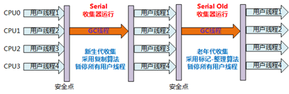
**5.Parallel Old是Parallel Scavenge收集器的老年代版本。**
**特点**：多线程，采用标记-整理算法。
**应用场景**：注重高吞吐量以及CPU资源敏感的场合，都可以优先考虑Parallel Scavenge+Parallel Old 收集器。
_Parallel Scavenge/Parallel Old收集器工作过程图：_
**6.CMS收集器是一种以获取最短回收停顿时间为目标的收集器。**
**特点**：基于标记-清除算法实现。并发收集、低停顿。
**应用场景**：适用于注重服务的响应速度，希望系统停顿时间最短，给用户带来更好的体验等场景下。如web程序、b/s服务。
**CMS收集器的运行过程分为下列4步：**
**初始标记**：标记GC Roots能直接到的对象。速度很快但是仍存在Stop The World问题。
**并发标记**：进行GC Roots Tracing 的过程，找出存活对象且用户线程可并发执行。
**重新标记**：为了修正并发标记期间因用户程序继续运行而导致标记产生变动的那一部分对象的标记记录。仍然存在Stop The World问题。
**并发清除**：对标记的对象进行清除回收。
CMS收集器的内存回收过程是与用户线程一起并发执行的。
 CMS收集器的工作过程图：

CMS收集器的缺点：

- 对CPU资源非常敏感。
- 无法处理浮动垃圾，可能出现Concurrent Model Failure失败而导致另一次Full GC的产生。
- 因为采用标记-清除算法所以会存在空间碎片的问题，导致大对象无法分配空间，不得不提前触发一次Full GC。

**​**

**7.G1收集器一款面向服务端应用的垃圾收集器。**
**特点如下：**
并行与并发：G1能充分利用多CPU、多核环境下的硬件优势，使用多个CPU来缩短Stop-The-World停顿时间。部分收集器原本需要停顿Java线程来执行GC动作，G1收集器仍然可以通过并发的方式让Java程序继续运行。
分代收集：G1能够独自管理整个Java堆，并且采用不同的方式去处理新创建的对象和已经存活了一段时间、熬过多次GC的旧对象以获取更好的收集效果。
空间整合：G1运作期间不会产生空间碎片，收集后能提供规整的可用内存。
可预测的停顿：G1除了追求低停顿外，还能建立可预测的停顿时间模型。能让使用者明确指定在一个长度为M毫秒的时间段内，消耗在垃圾收集上的时间不得超过N毫秒。
**G1收集器运行示意图：**
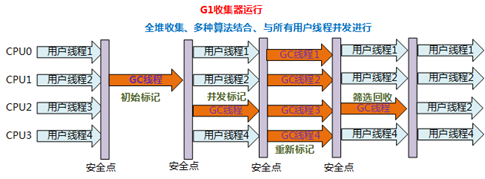
**​**

关于gc的选择
除非应用程序有非常严格的暂停时间要求，否则请先运行应用程序并允许VM选择收集器（如果没有特别要求。使用VM提供给的默认GC就好）。
如有必要，调整堆大小以提高性能。 如果性能仍然不能满足目标，请使用以下准则作为选择收集器的起点：

   - 如果应用程序的数据集较小（最大约100 MB），则选择带有选项-XX：+ UseSerialGC的串行收集器。
   - 如果应用程序将在单个处理器上运行，并且没有暂停时间要求，则选择带有选项-XX：+ UseSerialGC的串行收集器。
   - 如果（a）峰值应用程序性能是第一要务，并且（b）没有暂停时间要求或可接受一秒或更长时间的暂停，则让VM选择收集器或使用-XX：+ UseParallelGC选择并行收集器 。
   - 如果响应时间比整体吞吐量更重要，并且垃圾收集暂停时间必须保持在大约一秒钟以内，则选择具有-XX：+ UseG1GC。（值得注意的是JDK9中CMS已经被Deprecated，不可使用！移除该选项）
   - 如果使用的是jdk8，并且堆内存达到了16G，那么推荐使用G1收集器，来控制每次垃圾收集的时间。
   - 如果响应时间是高优先级，或使用的堆非常大，请使用-XX：UseZGC选择完全并发的收集器。（值得注意的是JDK11开始可以启动ZGC，但是此时ZGC具有实验性质，在JDK15中[202009发布]才取消实验性质的标签，可以直接显示启用，但是JDK15默认GC仍然是G1）


这些准则仅提供选择收集器的起点，**因为性能取决于堆的大小，应用程序维护的实时数据量以及可用处理器的数量和速度。**
如果推荐的收集器没有达到所需的性能，则首先尝试调整堆和新生代大小以达到所需的目标。 如果性能仍然不足，尝试使用其他收集器
**总体原则**：减少STOP THE WORD时间，使用并发收集器（比如CMS+ParNew，G1）来减少暂停时间，加快响应时间，并使用并行收集器来增加多处理器硬件上的总体吞吐量。


### JVM8为什么要增加元空间？

原因：
1、字符串存在永久代中，容易出现性能问题和内存溢出。
2、类及方法的信息等比较难确定其大小，因此对于永久代的大小指定比较困难，太小容易出现永久代溢出，太大则容易导致老年代溢出。
3、永久代会为 GC 带来不必要的复杂度，并且回收效率偏低。

### JVM8中元空间有哪些特点？

1，每个加载器有专门的存储空间。
2，不会单独回收某个类。
3，元空间里的对象的位置是固定的。
4，如果发现某个加载器不再存活了，会把相关的空间整个回收

###  如何解决线上gc频繁的问题？

1. 查看监控，以了解出现问题的时间点以及当前FGC的频率（可对比正常情况看频率是否正常）
1. 了解该时间点之前有没有程序上线、基础组件升级等情况。
1. 了解JVM的参数设置，包括：堆空间各个区域的大小设置，新生代和老年代分别采用了哪些垃圾收集器，然后分析JVM参数设置是否合理。
1. 再对步骤1中列出的可能原因做排除法，其中元空间被打满、内存泄漏、代码显式调用gc方法比较容易排查。
1. 针对大对象或者长生命周期对象导致的FGC，可通过 jmap -histo 命令并结合dump堆内存文件作进一步分析，需要先定位到可疑对象。
1. 通过可疑对象定位到具体代码再次分析，这时候要结合GC原理和JVM参数设置，弄清楚可疑对象是否满足了进入到老年代的条件才能下结论。


### 内存溢出的原因有哪些，如何排查线上问题？

1. java.lang.OutOfMemoryError: ......java heap space.....   堆栈溢出，代码问题的可能性极大
1. java.lang.OutOfMemoryError: GC over head limit exceeded 系统处于高频的GC状态，而且回收的效果依然不佳的情况，就会开始报这个错误，这种情况一般是产生了很多不可以被释放的对象，有可能是引用使用不当导致，或申请大对象导致，但是java heap space的内存溢出有可能提前不会报这个错误，也就是可能内存就直接不够导致，而不是高频GC.
1. java.lang.OutOfMemoryError: PermGen space jdk1.7之前才会出现的问题 ，原因是系统的代码非常多或引用的第三方包非常多、或代码中使用了大量的常量、或通过intern注入常量、或者通过动态代码加载等方法，导致常量池的膨胀
1. java.lang.OutOfMemoryError: Direct buffer memory    直接内存不足，因为jvm垃圾回收不会回收掉直接内存这部分的内存，所以可能原因是直接或间接使用了ByteBuffer中的allocateDirect方法的时候，而没有做clear
1. java.lang.StackOverflowError -     Xss设置的太小了
1. java.lang.OutOfMemoryError: unable to create new native thread 堆外内存不足，无法为线程分配内存区域
1. java.lang.OutOfMemoryError: request {} byte for {}out of swap 地址空间不够


# 多线程

## （不懂）Happens-Before规则是什么？

1. 程序顺序规则：一个线程中的每一个操作，happens-before于该线程中的任意后续操作。
1. 监视器规则：对一个锁的解锁，happens-before于随后对这个锁的加锁。
1. volatile规则：对一个volatile变量的写，happens-before于任意后续对一个volatile变量的读。
1. 传递性：如果A happens-before B，B happens-before C，那么A happens-before C。
1. 线程启动规则：Thread对象的start()方法，happens-before于这个线程的任意后续操作。
1. 线程终止规则：线程中的任意操作，happens-before于该线程的终止监测。我们可以通过Thread.join()方法结束、Thread.isAlive()的返回值等手段检测到线程已经终止执行。
1. 线程中断操作：对线程interrupt()方法的调用，happens-before于被中断线程的代码检测到中断事件的发生，可以通过Thread.interrupted()方法检测到线程是否有中断发生。
1. 对象终结规则：一个对象的初始化完成，happens-before于这个对象的finalize()方法的开始。


## 线程的中断（ thread.interrupt()成员方法)

通常使用这个方法是为了终止线程的执行。


如果线程在**RUNNABLE状态**，interrupt()只是会设置线程的中断标志位，没有任何其它作用。

```java
public class InterruptTest extends Thread{
 
	@Override
	public void run() {
		while (!Thread.currentThread().isInterrupted()) {
            // ... 单次循环代码
			System.out.println("tt");
        }
        System.out.println("done ");	}
	
	public static void main(String[] args) throws InterruptedException {
		Thread thread = new InterruptTest();
		thread.start();
		Thread.sleep(10);//main方法睡眠时间
		thread.interrupt();
	}
}
```


线程处于**WAITING状态**，对线程对象调用interrupt()会使得该线程抛出InterruptedException，需要注意的是，抛出异常后，中断标志位会被清空(线程的中断标志位会由true重置为false，因为线程为了处理异常已经重新处于就绪状态。)

```java
public class InterruptWaitingDemo extends Thread {
    @Override
    public void run() {
        while (!Thread.currentThread().isInterrupted()) {
            try {
                // 模拟任务代码
                Thread.sleep(2000);
            } catch (InterruptedException e) {
                // ... 清理操作
                System.out.println(isInterrupted());//false
                // 重设中断标志位为true
                Thread.currentThread().interrupt();
            }
        }
        System.out.println(isInterrupted());//true
    }
 
    public static void main(String[] args) {
        InterruptWaitingDemo thread = new InterruptWaitingDemo();
        thread.start();
        try {
            Thread.sleep(100);
        } catch (InterruptedException e) {
        }
        thread.interrupt();
    }
}
```


如果线程在**BLOCKED状态**，对线程对象调用interrupt()只是会设置线程的中断标志位，线程依然会处于BLOCKED状态，也就是说，interrupt()并不能使一个在等待锁的线程真正”中断”。


## Java中interrupted 和 isInterruptedd方法的区别？

interrupted()(是Thread类中的静态方法） 和 isInterrupted()（是Thread类的成员方法） 的主要区别是前者会将中断状态清除而后者不会。

Java多线程的中断机制是用内部标识来实现的，调用thread.interrupt()（成员方法） 来中断一个线程就会设置中断标识为true。当中断线程调用静态方法**Thread.interrupted()来检查中断状态时，中断状态会被清零。**  **而非静态方法isInterrupted()用来查询线程的中断状态且不会改变中断状态标识。**简单的说就是任何抛出InterruptedException异常的方法都会将中断状态清零。无论如何，一个线程的中断状态有可能被其它线程调用中断来改
变。  


## 介绍一下线程的生命周期及状态？


java中的线程状态：

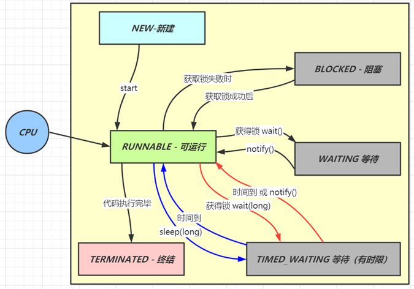


下面的状态是操作系统中划分的状态

**1.创建**
当程序使用new关键字创建了一个线程之后，该线程就处于一个新建状态（初始状态），此时它和其他Java对象一样，仅仅由Java虚拟机为其分配了内存，并初始化了其成员变量值。此时的线程对象没有表现出任何线程的动态特征，程序也不会执行线程的线程执行体。
**2.就绪**
当线程对象调用了Thread.start()方法之后，该线程处于就绪状态。Java虚拟机会为其创建方法调用栈和程序计数器，处于这个状态的线程并没有开始运行，它只是表示该线程可以运行了。从start()源码中看出，start后添加到了线程列表中，接着在native层添加到VM中，至于该线程何时开始运行，取决于JVM里线程调度器的调度(如果OS调度选中了，就会进入到运行状态)。
**3.运行**
当线程对象调用了Thread.start()方法之后，该线程处于就绪状态。添加到了线程列表中，如果OS调度选中了，就会进入到运行状态
**4.阻塞**
阻塞状态是线程因为某种原因放弃CPU使用权，暂时停止运行。直到线程进入就绪状态，才有机会转到运行状态。阻塞的情况大概三种：

- 1、**等待阻塞**：运行的线程执行wait()方法，JVM会把该线程放入等待池中。(wait会释放持有的锁)
- 2、**同步阻塞**：运行的线程在获取对象的同步锁时，若该同步锁被别的线程占用，则JVM会把该线程放入锁池中。
- 3、**其他阻塞**：运行的线程执行sleep()或join()方法，或者发出了I/O请求时，JVM会把该线程置为阻塞状态。当sleep()状态超时、join()等待线程终止或者超时、或者I/O处理完毕时，线程重新转入就绪状态。（注意,sleep是不会释放持有的锁）。
- 线程睡眠：Thread.sleep(long millis)方法，使线程转到阻塞状态。millis参数设定睡眠的时间，以毫秒为单位。当睡眠结束后，就转为就绪（Runnable）状态。sleep()平台移植性好。
- 线程等待：Object类中的wait()方法，导致当前的线程等待，直到其他线程调用此对象的 notify() 方法或 notifyAll() 唤醒方法。这个两个唤醒方法也是Object类中的方法，行为等价于调用 wait(0) 一样。唤醒线程后，就转为就绪（Runnable）状态。
- 线程让步：Thread.yield() 方法，暂停当前正在执行的线程对象，把执行机会让给相同或者更高优先级的线程。
- 线程加入：join()方法，等待其他线程终止。在当前线程中调用另一个线程的join()方法，则当前线程转入阻塞状态，直到另一个线程运行结束，当前线程再由阻塞转为就绪状态。
- 线程I/O：线程执行某些IO操作，因为等待相关的资源而进入了阻塞状态。比如说监听system.in，但是尚且没有收到键盘的输入，则进入阻塞状态。
- 线程唤醒：Object类中的notify()方法，唤醒在此对象监视器上等待的单个线程。如果所有线程都在此对象上等待，则会选择唤醒其中一个线程，选择是任意性的，并在对实现做出决定时发生。类似的方法还有一个notifyAll()，唤醒在此对象监视器上等待的所有线程。

**5.结束**
线程会以以下三种方式之一结束，结束后就处于死亡状态:

- run()方法执行完成，线程正常结束。
- 线程抛出一个未捕获的Exception或Error。
- 直接调用该线程的stop()方法来结束该线程——该方法容易导致死锁，通常不推荐使用

##  线程的sleep、wait、join、yield如何使用？

**sleep**:让线程睡眠，期间会出让cpu，在同步代码块中，**不会释放锁**
**wait**(必须先获得对应的锁才能调用):让线程进入等待状态**,释放当前线程持有的锁资源**，线程只有在notify 或者notifyAll方法调用后才会被唤醒,然后去争夺锁.
**join**:线程之间协同方式,使用场景: 线程A必须等待线程B运行完毕后才可以执行,那么就可以在线程A的代码中加入ThreadB.join();会阻塞调用该方法的线程。
**yield**:让当前正在运行的线程回到可运行状态，以允许具有相同优先级的其他线程获得运行的机会。因此，使用yield()的目的是让具有相同优先级的线程之间能够适当的轮换执行。但是，实际中无法保证yield()达到让步的目的，因为，让步的线程可能被线程调度程序再次选中。


## 创建线程有哪些方式？

1）继承Thread类创建线程
2）实现Runnable接口创建线程
3）使用Callable和Future创建线程
4）使用线程池例如用Executor框架


## 什么是守护线程？

在Java中有两类线程：User Thread(用户线程)、Daemon Thread(守护线程) 
任何一个守护线程都是整个JVM中所有非守护线程的保姆：
**只要当前JVM实例中尚存在任何一个非守护线程没有结束，守护线程就全部工作；只有当最后一个非守护线程结束时，守护线程随着JVM一同结束工作。**

**Daemon的作用是为其他线程的运行提供便利服务，守护线程最典型的应用就是 GC (垃圾回收器)，它就是一个很称职的守护者。**
User和Daemon两者几乎没有区别，唯一的不同之处就在于虚拟机的离开：如果 User Thread已经全部退出运行了，只剩下Daemon Thread存在了，虚拟机也就退出了。 因为没有了被守护者，Daemon也就没有工作可做了，也就没有继续运行程序的必要了。

注意事项:
(1) thread.setDaemon(true)必须在thread.start()之前设置，否则会出现一个IllegalThreadStateException异常。只能在线程未开始运行之前设置为守护线程。
(2) 在Daemon线程中产生的新线程也是Daemon的。
(3) 不要认为所有的应用都可以分配给Daemon来进行读写操作或者计算逻辑，因为这会可能回到数据不一致的状态。


## ThreadLocal的原理是什么，使用场景有哪些？


**每个线程内（Thread类中）有一个**ThreadLocal.ThreadLocalMap类型的成员变量它相当于是一个HashMap，用来存储资源对象

* 调用 set 方法，就是以 ThreadLocal 自己作为 key，资源对象作为 value，放入当前线程的 ThreadLocalMap 集合中
* 调用 get 方法，就是以 ThreadLocal 自己作为 key，到当前线程中查找关联的资源值
* 调用 remove 方法，就是以 ThreadLocal 自己作为 key，移除当前线程关联的资源值

在默认情况下，每个线程中的这两个变量都为null:

```java
ThreadLocal.ThreadLocalMap threadLocals = null;
```

只有当线程第一次调用ThreadLocal的set或者get方法的时候才会创建他们。

```java
public T get() {
        Thread t = Thread.currentThread();
        ThreadLocalMap map = getMap(t);
        if (map != null) {
            ThreadLocalMap.Entry e = map.getEntry(this);
            if (e != null) {
                @SuppressWarnings("unchecked")
                T result = (T)e.value;
                return result;
            }
        }
        return setInitialValue();
}
    
ThreadLocalMap getMap(Thread t) {
        return t.threadLocals;
}
```

* 调用 set 方法，就是以 ThreadLocal 自己作为 key，资源对象作为 value，放入当前线程的 ThreadLocalMap 集合中
* 调用 get 方法，就是以 ThreadLocal 自己作为 key，到当前线程中查找关联的资源值
* 调用 remove 方法，就是以 ThreadLocal 自己作为 key，移除当前线程关联的资源值

```java
public void set(T value) {
        Thread t = Thread.currentThread();
        ThreadLocalMap map = getMap(t);
        if (map != null)
            map.set(this, value);
        else
            createMap(t, value);
}
public void remove() {
         ThreadLocalMap m = getMap(Thread.currentThread());
         if (m != null)
             m.remove(this);
}
```


## ThreadLocal有哪些内存泄露问题，如何避免？

每个Thread都有一个ThreadLocal.ThreadLocalMap的map，**该map的key为ThreadLocal实例，它为一个弱引用**，我们知道弱引用有利于GC回收。如果threadLocal外部强引用（也就是下图中左边部分）被置为null(例如ThreadLocalref=null)的话，ThreadLocal实例就没有一条引用链路可达，很显然在gc(垃圾回收)的时候势必会被回收，因此Entry就存在key为null的情况，无法通过一个Key为null去访问到该Entry的value。但是value依然存在这一条强引用链Current ThreadRef->CurrentThread->ThreadLocalMap->Entry->valueRef->valueMemory，所以Value的内存不会被回收，但是该value永远不能被访问到，这也就产生了内存泄漏。当然，如果线程执行结束后，threadLocal，threadRef会断掉，因此threadLocal,threadLocalMap，entry都会被回收掉。可是，在实际使用中我们都是会用线程池去维护我们的线程，比如在Executors.newFixedThreadPool()时创建线程的时候，为了复用线程是不会结束的，所以threadLocal内存泄漏就值得我们关注。


在前面提过，**在ThreadLocalMap中的setEntry()、getEntry()，如果遇到key == null的情况，会对value设置为null。当然我们也可以显示调用ThreadLocal的remove()方法进行处理。** 下面再对ThreadLocal进行简单的总结：

- ThreadLocal 不是用于解决共享变量的问题的，也不是为了协调线程同步而存在，而是为了方便每个线程处理自己的状态而引入的一个机制。这点至关重要。

- 每个Thread内部都有一个ThreadLocal.ThreadLocalMap类型的成员变量，该成员变量用来存储实际的ThreadLocal变量副本。

- ThreadLocal并不是为线程保存对象的副本，它仅仅只起到一个索引的作用。它的主要目的是为每一个线程隔离一个类的实例，这个实例的作用范围仅限于线程内部。

  

## 为什么要使用线程池？

为了减少创建和销毁线程的开销，让每个线程可以多次使用,可根据系统情况**调整执行**的线程数量防止消耗过多内存，还可以对线程进行统一地管理,所以我们可以使用线程池.


## （看不懂）线程池线程复用的原理是什么？

思考这么一个问题：任务结束后会不会回收线程？
答案是：allowCoreThreadTimeOut控制

```java
/java/util/concurrent/ThreadPoolExecutor.java:1127
final void runWorker(Worker w) {
        Thread wt = Thread.currentThread();
        Runnable task = w.firstTask;
        w.firstTask = null;
        w.unlock(); // allow interrupts
        boolean completedAbruptly = true;
        try {
            while (task != null || (task = getTask()) != null) {...执行任务...}
            completedAbruptly = false;
        } finally {
            processWorkerExit(w, completedAbruptly);
        }
    }
首先线程池内的线程都被包装成了一个个的java.util.concurrent.ThreadPoolExecutor.Worker,然后这个worker会马不停蹄的执行任务,执行完任务之后就会在while循环中去取任务,取到任务就继续执行,取不到任务就跳出while循环(这个时候worker就不能再执行任务了)执行 processWorkerExit方法,这个方法呢就是做清场处理,将当前woker线程从线程池中移除,并且判断是否是异常的进入processWorkerExit方法,如果是非异常情况,就对当前线程池状态(RUNNING,shutdown)和当前工作线程数和当前任务数做判断,是否要加入一个新的线程去完成最后的任务(防止没有线程去做剩下的任务).
那么什么时候会退出while循环呢?取不到任务的时候(getTask() == null).下面看一下getTask方法

private Runnable getTask() {
        boolean timedOut = false; // Did the last poll() time out?

        for (;;) {
            int c = ctl.get();
            int rs = runStateOf(c);

            //(rs == SHUTDOWN && workQueue.isEmpty()) || rs >=STOP
            //若线程池状态是SHUTDOWN 并且 任务队列为空,意味着已经不需要工作线程执行任务了,线程池即将关闭
            //若线程池的状态是 STOP TIDYING TERMINATED,则意味着线程池已经停止处理任何任务了,不在需要线程
            if (rs >= SHUTDOWN && (rs >= STOP || workQueue.isEmpty())) {
            	//把此工作线程从线程池中删除
                decrementWorkerCount();
                return null;
            }

            int wc = workerCountOf(c);

            //allowCoreThreadTimeOut:当没有任务的时候,核心线程数也会被剔除,默认参数是false,官方推荐在创建线程池并且还未使用的时候,设置此值
            //如果当前工作线程数 大于 核心线程数,timed为true
            boolean timed = allowCoreThreadTimeOut || wc > corePoolSize;
			
            //(wc > maximumPoolSize || (timed && timedOut)):当工作线程超过最大线程数,或者 允许超时并且超时过一次了
            //(wc > 1 || workQueue.isEmpty()):工作线程数至少为1个 或者 没有任务了
            //总的来说判断当前工作线程还有没有必要等着拿任务去执行
            //wc > maximumPoolSize && wc>1 : 就是判断当前工作线程是否超过最大值
            //或者 wc > maximumPoolSize && workQueue.isEmpty():工作线程超过最大,基本上不会走到这,
            //		如果走到这,则意味着wc=1 ,只有1个工作线程了,如果此时任务队列是空的,则把最后的线程删除
            //或者(timed && timedOut) && wc>1:如果允许超时并且超时过一次,并且至少有1个线程,则删除线程
            //或者 (timed && timedOut) && workQueue.isEmpty():如果允许超时并且超时过一次,并且此时工作					队列为空，那么妥妥可以把最后一个线程（因为上面的wc>1不满足，则可以得出来wc=1）删除
            if ((wc > maximumPoolSize  || (timed && timedOut))
                && (wc > 1 || workQueue.isEmpty())) {
                if (compareAndDecrementWorkerCount(c))
                	//如果减去工作线程数成功,则返回null出去,也就是说 让工作线程停止while轮训,进行收尾
                    return null;
                continue;
            }

            try {
            	//判断是否要阻塞获取任务
                Runnable r = timed ?
                    workQueue.poll(keepAliveTime, TimeUnit.NANOSECONDS) :
                    workQueue.take();
                if (r != null)
                    return r;
                timedOut = true;
            } catch (InterruptedException retry) {
                timedOut = false;
            }
        }
    }
    
//综上所述,如果allowCoreThreadTimeOut为true,并且在第1次阻塞获取任务失败了,那么当前getTask会返回null,不管是不是核心线程;那么runWorker中将推出while循环,也就意味着当前工作线程被销毁

```

通过上面这个问题可以得出一个结论：当你的线程池参数配置合理的时候，执行完任务的线程是不会被销毁的，而是会从任务队列中取出任务继续执行！


## 如何预防死锁？

1. 首先需要将死锁发生的是个必要条件讲出来:
   1. 互斥条件 
   1. 不可剥夺条件 
   1. 请求和保持条件 
   1. 循环等待条件 
2. 死锁预防，那么就是需要破坏这四个必要条件
   1. 由于资源互斥是资源使用的固有特性，无法改变，我们不讨论
   1. 破坏不可剥夺条件
      1. 一个进程不能获得所需要的全部资源时便处于等待状态，等待期间他占有的资源将被隐式的释放重新加入到系统的资源列表中，可以被其他的进程使用，而等待的进程只有重新获得自己原有的资源以及新申请的资源才可以重新启动，执行
3. 破坏请求与保持条件
   1. 第一种方法静态分配即每个进程在开始执行时就申请他所需要的全部资源
   1. 第二种是动态分配即每个进程在申请所需要的资源时他本身不占用系统资源
4. 破坏循环等待条件
   1. 采用资源有序分配其基本思想是将系统中的所有资源顺序编号，将紧缺的，稀少的采用较大的编号，在申请资源时必须按照编号的顺序进行，一个进程只有获得较小编号的进程才能申请较大编号的进程。


## 描述一下线程安全活跃态问题？

线程安全的活跃性问题可以分为 死锁、活锁、饥饿   

1. 活锁 就是有时线程虽然没有发生阻塞，但是仍然会存在执行不下去的情况，活锁不会阻塞线程，线程会一直重复执行某个相同的操作，并且一直失败重试
   1. 我们开发中使用的异步消息队列就有可能造成活锁的问题，在消息队列的消费端如果没有正确的ack消息，并且执行过程中报错了，就会再次放回消息头，然后再拿出来执行，一直循环往复的失败。这个问题除了正确的ack之外，往往是通过将失败的消息放入到延时队列中，等到一定的延时再进行重试来解决。
   1. 解决活锁的方案很简单，尝试等待一个随机的时间就可以，会按时间轮去重试
2. 饥饿  就是 线程因无法访问所需资源而无法执行下去的情况
   1. 饥饿 分为两种情况：
      1. 一种是其他的线程在临界区做了无限循环或无限制等待资源的操作，让其他的线程一直不能拿到锁进入临界区，对其他线程来说，就进入了饥饿状态
      1. 另一种是因为线程优先级不合理的分配，导致部分线程始终无法获取到CPU资源而一直无法执行
   2. 解决饥饿的问题有几种方案:
      1.  保证资源充足，很多场景下，资源的稀缺性无法解决
      1.  公平分配资源，在并发编程里使用公平锁，例如FIFO策略，线程等待是有顺序的，排在等待队列前面的线程会优先获得资源
      1.  避免持有锁的线程长时间执行，很多场景下，持有锁的线程的执行时间也很难缩短
3. 死锁  线程在对同一把锁进行竞争的时候，未抢占到锁的线程会等待持有锁的线程释放锁后继续抢占，如果两个或两个以上的线程互相持有对方将要抢占的锁，互相等待对方先行释放锁就会进入到一个循环等待的过程，这个过程就叫做死锁


## （不懂）线程安全的竞态条件有哪些？

1. 同一个程序多线程访问同一个资源，如果对资源的访问顺序敏感，就称存在竞态条件，代码区成为临界区。 大多数并发错误一样，竞态条件不总是会产生问题，还需要不恰当的执行时序
1. 最常见的竞态条件为
   1. 先检测后执行执行依赖于检测的结果，而检测结果依赖于多个线程的执行时序，而多个线程的执行时序通常情况下是不固定不可判断的，从而导致执行结果出现各种问题，见一种可能 的解决办法就是：在一个线程修改访问一个状态时，要防止其他线程访问修改，也就是加锁机制，保证原子性
   1. 延迟初始化（典型为单例）


## 程序开多少线程合适？

1. **CPU 密集型程序**，一个程序大部分时间都在用于cpu操作，只有很少量时间用于io，线程等待时间接近0   

   CPU 密集型程序的最佳线程数就是：理论上线程数量 = CPU 核数（逻辑），但是实际上，数量一般会设置为 **CPU 核数（逻辑）+ 1（经验值）**,计算(CPU)密集型的线程恰好在某时因为发生一个缺页或者因其他原因而暂停，刚好有一个“额外”的线程，可以确保在这种情况下CPU周期不会中断工作

2. **I/O 密集型程序** ，大部分时间都在等待I/O 操作，很少进行cpu。线程等待IO时间所占比例越高，需要越多线程；线程CPU时间所占比例越高，需要越少线程

   1. I/O 密集型程序的最佳线程数就是： **最佳线程数 = CPU核心数 \*(1/CPU利用率) **
   1. 如果几乎全是 I/O耗时，那么CPU耗时就无限趋近于0，所以纯理论你就可以说是 2N（N=CPU核数），当然也有说 2N + 1的，1应该是backup
   1. **一般我们说 2N + 1 就即可**


##  synchronized和Lock有哪些区别？

| 区别类型     | synchronized                                                 | Lock                                                         |
| ------------ | ------------------------------------------------------------ | ------------------------------------------------------------ |
| 存在层次     | Java的关键字，编译后会在同步块的前后分别形成monitorenter和monitorexit这个两个字节码指令。在执行monitorenter指令时，首先要尝试获取对象锁。 | 是java.util.concurrent包下的一个接口                         |
| 锁的获取     | 假设A线程获得锁，B线程等待。如果A线程阻塞，B线程会一直等待   | 情况而定，Lock有多个锁获取的方式，大致就是可以尝试获得锁，线程可以不用一直等待(可以通过tryLock判断有没有锁) |
| 锁的释放     | 1、以获取锁的线程执行完同步代码，释放锁2、线程执行发生异常，jvm会让线程释放 | 在finally中必须释放锁，不然容易造成线程死锁                  |
| 锁类型       | 锁可重入、不可中断、非公平                                   | 可重入、可中断 可公平（两者皆可）                            |
| 条件变量数   | 一个                                                         | 多个                                                         |
| 支持锁的场景 | 1.  独占锁                                                   | 1.  公平锁与非公平锁                                         |


## ABA问题遇到过吗，详细说一下？

ABA的问题指的是在CAS更新的过程中，第一次读取到的值是A，然后准备赋值的时候读取到的仍然是
A，按照CAS的原理，该赋值操作会正常执行，但是实际上有可能A的值被其他线程改成了B，然后又被改回了A，这个CAS更新的漏洞就叫做ABA。只是ABA的问题大部分场景下都不影响并发的最终效果。  


## volatile的可见性和禁止指令重排序怎么实现的？

两者都是通过在编译时插入内存屏障指令来实现的


- 可见性：
  **volatile的功能就是被修饰的变量在被修改后可以立即同步到主内存，被修饰的变量在每次是用之前都从主内存中读取。**

- 本质也是通过**内存屏障来实现可见性**
  写内存屏障（Store Memory Barrier）可以促使处理器将当前store buffer（存储缓存）的值写回主存。读内存屏障（Load Memory Barrier）可以促使处理器处理invalidate queue（失效队列）。进而避免由于Store Buffer和Invalidate Queue的非实时性带来的问题。

- 禁止指令重排序：
  volatile是通过**内存屏障来禁止指令重排序**

  首先了解一个概念，**内存屏障**（Memory Barrier）又称内存栅栏，是一个CPU指令，它的作用有两个：

  1. 保证特定操作的顺序
  2. 保证某些变量的内存可见性（利用该特性实现volatile的内存可见性）

  由于编译器和处理器都能执行指令重排的优化，如果在指令间插入一条**Memory Barrier**，相当于告诉CPU和编译器先于这个命令的必须先执行，后于这个命令的必须后执行；

  【写操作之前】插入**StoreStore**屏障，指令后面的要执行前，必须让指令前面的指令都执行完并写到了主存；
  【写操作之后】插入**StoreLoad**屏障，让指令前面的变量刷新到主存，然后后面的才能读；
  禁止CPU对指令的重排序越过这些屏障。也就是说 **通过插入内存屏障禁止在内存屏障前后的指令执行重排序优化**。

  

  JMM内存屏障的策略

   - 在每个 volatile 写操作的前面插入一个 StoreStore 屏障。
   - 在每个 volatile 写操作的后面插入一个 StoreLoad 屏障。
   - 在每个 volatile 读操作的后面插入一个 LoadLoad 屏障。
   - 在每个 volatile 读操作的后面插入一个 LoadStore 屏障。

  

  - | 屏障类型   | 指令示例                   | 说明                                                         |
    | ---------- | -------------------------- | ------------------------------------------------------------ |
    | LoadLoad   | Load1; LoadLoad; Load2     | 保证load1的读取操作在load2及后续读取操作之前执行             |
    | StoreStore | Store1; StoreStore; Store2 | 在store2及其后的写操作执行前，保证store1的写操作已刷新到主内存 |
    | LoadStore  | Load1; LoadStore; Store2   | 在stroe2及其后的写操作执行前，保证load1的读操作已读取结束    |
    | StoreLoad  | Store1; StoreLoad; Load2   | 保证store1的写操作已刷新到主内存之后，load2及其后的读操作才能执行 |


## ConcurrentHashMap底层原理是什么？

1.7
数据结构：
内部主要是一个Segment数组，而数组的每一项又是一个HashEntry数组，元素都存在HashEntry数组里。因为每次锁定的是Segment对象，也就是整个HashEntry数组，所以又叫分段锁。

1.8
数据结构：
与HashMap一样采用：数组+链表+红黑树
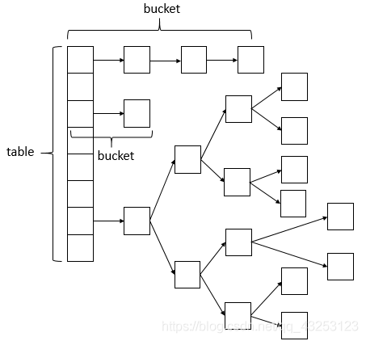
底层原理则是采用锁链表或者红黑树头结点，相比于HashTable的方法锁，粒度更细，**是对数组（table）中的桶（链表或者红黑树）的头结点进行锁定**，这样锁定，只会影响数组（table)当前下标的数据，不会影响其他下标节点的操作，可以提高读写效率。

putVal执行流程：

1. 判断存储的key、value是否为空，若为空，则抛出异常
1. 计算key的hash值，随后死循环（该循环可以确保成功插入，当满足适当条件时，会主动终止），判断table表为空或者长度为0，则初始化table表
1. 根据hash值获取table中该下标对应的节点，如果该节点为空，则根据参数生成新的节点，并以CAS的方式进行更新，并终止死循环。
1. 如果该节点的hash值是MOVED(-1)，表示正在扩容，则辅助对该节点进行转移。
1. 对数组（table）中的节点，即桶的头结点进行锁定，如果该节点的hash大于等于0，表示此桶是链表，然后对该桶进行遍历（死循环），寻找链表中与put的key的hash值相等，并且key相等的元素，然后进行值的替换，如果到链表尾部都没有符合条件的，就新建一个node，然后插入到该桶的尾部，并终止该循环遍历。
1. 如果该节点的hash小于0，并且节点类型是TreeBin，则走红黑树的插入方式。
1. 判断是否达到转化红黑树的阈值，如果达到阈值，则链表转化为红黑树。


# 分布式

## 分布式id生成方案有哪些？

UUID,数据库主键自增，Redis自增ID，雪花算法。

|                       | 描述                                                         | 优点                                                         | 缺点                                                         |
| --------------------- | ------------------------------------------------------------ | ------------------------------------------------------------ | ------------------------------------------------------------ |
| UUID                  | UUID是通用唯一标识码的缩写，其目的是让分布式系统中的所有元素都有唯一的辨识信息，而不需要通过中央控制器来指定唯一标识。 | 1. 降低全局节点的压力，使得主键生成速度更快；<br/>2. 生成的主键全局唯一；<br/>3. 跨服务器合并数据方便。 | 1. UUID占用16个字符，空间占用较多；<br/>2. 不是递增有序的数字，数据写入IO随机性很大，且索引效率下降 |
| 数据库主键自增        | MySQL数据库设置主键且主键自动增长                            | 1. INT和BIGINT类型占用空间较小；<br/>2. 主键自动增长，IO写入连续性好；<br/>3. 数字类型查询速度优于字符串 | 1. 并发性能不高，受限于数据库性能；<br/>2. 分库分表，需要改造，复杂；<br/>3. 自增：数据和数据量泄露 |
| Redis自增             | Redis计数器，原子性自增                                      | 使用内存，并发性能好                                         | 1. 数据丢失；<br/>2. 自增：数据量泄露                        |
| 雪花算法（snowflake） | 大名鼎鼎的雪花算法，分布式ID的经典解决方案                   | 1. 不依赖外部组件；<br/>2. 性能好                            | 时钟回拨                                                     |


## 雪花算法生成的ID由哪些部分组成?

1. 符号位，占用1位。
2. 时间戳，占用41位，可以支持69年的时间跨度。
3. 机器ID，占用10位。
4. 序列号，占用12位。一毫秒可以生成4095个ID。

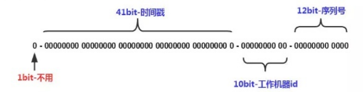


## 分布式锁在项目中有哪些应用场景？

使用分布式锁的场景一般需要满足以下场景：

1. 系统是一个分布式系统,集群集群，java的锁已经锁不住了。
2. 操作共享资源，比如库里唯一的用户数据。
3. 同步访问，即多个进程同时操作共享资源。


## 分布锁有哪些解决方案？

1. Reids的分布式锁，很多大公司会基于Reidis做扩展开发。setnx key value ex 10s，Redisson。

   watch dog.

2. 基于Zookeeper。临时节点，顺序节点。

3. 基于数据库，比如Mysql。主键或唯一索引的唯一性。


## Redis做分布式锁用什么命令？

SETNX
格式：setnx key value 将 key 的值设为 value ，当且仅当 key 不存在。
若给定的 key 已经存在，则 SETNX 不做任何动作,操作失败。

SETNX 是『SET if Not eXists』(如果不存在，则 SET)的简写。

加锁：set key value nx ex 10s

释放锁：delete key


## Redis做分布式锁死锁有哪些情况，如何解决？

情况1：**加锁，没有释放锁。**需要加释放锁的操作。比如delete key。

情况2：**加锁后，程序还没有执行释放锁，程序挂了。**需要用的key的过期机制。


## Redis如何做分布式锁？

假设有两个服务A、B都希望获得锁，执行过程大致如下:

Step1： 服务A为了获得锁，向Redis发起如下命令: `SET key value NX EX 30000` 

key由自己定义，可以是与本次业务有关的id（例如productId）

**value是一串随机值，必须保证全局唯一**（例如"0xx9p03001"）

NX 指的是当且仅当key(也就是案例中的"productId:lock”)在Redis中不存在时，返回执行成功，否则执行失败。

EX 30000 指的是在30秒后，key将被自动删除。

执行命令后返回成功，表明服务成功的获得了锁。

Step2: 服务B为了获得锁，向Redis发起同样的命令: SET productId:lock 0000111 NX  EX 30000
由于Redis内已经存在同名key，且并未过期，因此命令执行失败，服务B未能获得锁。服务B进入循环请求状态，比如每隔1秒钟(自行设置)向Redis发送请求，直到执行成功并获得锁。

Step3: 服务A的业务代码执行时长超过了30秒，导致key超时，因此Redis自动删除了key。此时服务B再次发送命令执行成功，假设本次请求中设置的value值为0000222。**但是由于A的业务还没有完成，其实是不应该由B获得锁的**

Step4: 服务A执行完毕，为了释放锁，服务A会主动向Redis发起删除key的请求。**注意: 在删除key之前，一定要判断服务A持有的value与Redis内存储的value是否一致。**比如当前场景下，Redis中的锁早就不是服务A持有的那一把了，而是由服务2创建，如果贸然使用服务A持有的key来删除锁，则会误将服务2的锁释放掉。

此外，由于  先判断key对应的值是否和自己设置的值一样 和 删除锁 这两个操作需要原子执行，因此一般使用lua脚本，具体如下:

```sql
if redis.call("get", KEYS[1])==ARGV[1] then
	return redis.call("del", KEYS[1])
else
	return 0
end
```


但是以上方案依然无法解决 第3步 中出现的那个 **「锁过期释放，业务没执行完」** 的问题。

解决这个问题可以使用 Redisson框架：

只要线程一加锁成功，就会启动一个`watch dog`看门狗，它是一个后台线程，会每隔10秒检查一下，如果线程A还持有锁，那么就会不断的延长锁key的生存时间。因此，Redisson就是使用Redisson解决了**「锁过期释放，业务没执行完」**问题。


上面的方案是对于Redis单机部署而言的，但生产环境中Redis一般都是集群部署的

如果线程一在Redis的master节点上拿到了锁，但是加锁的key还没同步到slave节点。恰好这时，master节点发生故障，一个slave节点就会升级为master节点。线程二就可以获取同个key的锁啦，但线程一也已经拿到锁了，锁的安全性就没了。


解决这个问题可以使用 Redlock 来实现。

Redlock核心思想如下：

**搞多个Redis master部署**，以保证它们不会同时宕掉。**并且这些master节点是完全相互独立的，相互之间不存在数据同步。**同时，需要确保在这多个master实例上，是与在Redis单实例，使用相同方法来获取和释放锁。

我们假设当前有5个Redis master节点，在5台服务器上面运行这些Redis实例。

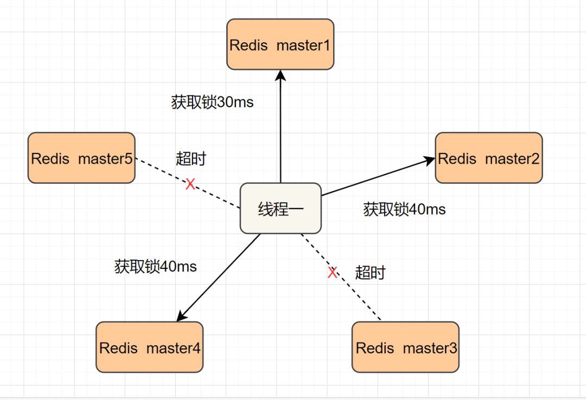

RedLock的实现步骤:如下

- 1.获取当前时间，以毫秒为单位。
- 2.按顺序向5个master节点请求加锁。客户端设置网络连接和响应超时时间，并且超时时间要小于锁的失效时间。（假设锁自动失效时间为10秒，则超时时间一般在5-50毫秒之间，我们就假设超时时间是50ms吧）。如果超时，跳过该master节点，尽快去尝试下一个master节点。
- 3.客户端使用当前时间减去开始获取锁时间（即步骤1记录的时间），得到为获取锁使用的时间。**当且仅当超过一半**（N/2+1，这里是5/2+1=3个节点）的Redis master节点都获得锁，**并且为获得锁使用的时间小于锁失效时间时**，锁才算获取成功。（如上图，10s> 30ms+40ms+50ms+4m0s+50ms）
- 如果取到了锁，key的真正有效时间就变啦，需要减去获取锁所使用的时间。
- 如果获取锁失败（没有在至少N/2+1个master实例取到锁，有或者获取锁时间已经超过了有效时间），客户端要在所有的master节点上解锁（即便有些master节点根本就没有加锁成功，也需要解锁，以防止有些漏网之鱼）。


简化下步骤就是：

- 按顺序向5个master节点请求加锁
- 根据设置的超时时间来判断，是不是要跳过该master节点。
- 如果大于等于3个节点加锁成功，并且使用的时间小于锁的有效期，即可认定加锁成功啦。
- 如果获取锁失败，解锁！

Redisson实现了redLock版本的锁


## （没学过）基于 ZooKeeper 的分布式锁实现原理是什么?

顺序节点特性：

使用 ZooKeeper 的顺序节点特性，假如我们在/lock/目录下创建3个节点，ZK集群会按照发起创建的顺序来创建节点，节点分别为/lock/0000000001、/lock/0000000002、/lock/0000000003，最后一位数是依次递增的，节点名由zk来完成。

临时节点特性：

ZK中还有一种名为临时节点的节点，临时节点由某个客户端创建，当客户端与ZK集群断开连接，则该节点自动被删除。EPHEMERAL_SEQUENTIAL为临时顺序节点。

根据ZK中节点是否存在，可以作为分布式锁的锁状态，以此来实现一个分布式锁，下面是分布式锁的基本逻辑：

1. 客户端1调用create()方法创建名为“/业务ID/lock-”的临时顺序节点。
2. 客户端1调用getChildren(“业务ID”)方法来获取所有已经创建的子节点。
3. 客户端获取到所有子节点path之后，如果发现自己在步骤1中创建的节点是所有节点中序号最小的，就是看自己创建的序列号是否排第一，如果是第一，那么就认为这个客户端1获得了锁，在它前面没有别的客户端拿到锁。
4. 如果创建的节点不是所有节点中需要最小的，那么则监视比自己创建节点的序列号小的最大的节点，进入等待。直到下次监视的子节点变更的时候，再进行子节点的获取，判断是否获取锁。


## ZooKeeper和Reids做分布式锁的区别？

Reids：

1. **Redis只保证最终一致性**，副本间的数据复制是异步进行（Set是写，Get是读，Reids集群一般是读写分离架构，存在主从同步延迟情况），主从切换之后可能有部分数据没有复制过去可能会 **「丢失锁」** 情况，**故强一致性要求的业务不推荐使用Reids，推荐使用zk。**
2. Redis集群各方法的响应时间均为最低。随着并发量和业务数量的提升其响应时间会有明显上升（公网集群影响因素偏大），但是极限qps可以达到最大且基本无异常

ZooKeeper：

1. 使用ZooKeeper集群，锁原理是使用ZooKeeper的临时顺序节点，临时顺序节点的生命周期在Client与集群的Session结束时结束。因此如果某个Client节点存在网络问题，与ZooKeeper集群断开连接，Session超时同样会导致锁被错误的释放（导致被其他线程错误地持有），因此ZooKeeper也无法保证完全一致。
2. ZK具有较好的稳定性；响应时间抖动很小，没有出现异常。但是随着并发量和业务数量的提升其响应时间和qps会明显下降。

总结：

1. Zookeeper每次进行锁操作前都要创建若干节点，完成后要释放节点，会浪费很多时间；
2. 而Redis只是简单的数据操作，没有这个问题。


## MySQL如何做分布式锁？

在Mysql中创建一张表，设置一个 主键或者UNIQUE KEY 这个 KEY 就是要锁的 KEY（例如商品ID），所以同一个 KEY 在mysql表里只能插入一次了，这样对锁的竞争就交给了数据库，处理同一个 KEY 数据库保证了只有一个节点能插入成功，其他节点都会插入失败。

DB分布式锁的实现：通过主键id 或者 唯一索性 的唯一性进行加锁，说白了就是加锁的形式是向一张表中插入一条数据，该条数据的id就是一把分布式锁，例如当一次请求插入了一条id为1的数据，其他想要进行插入数据的并发请求必须等第一次请求执行完成后删除这条id为1的数据才能继续插入，实现了分布式锁的功能。

这样 lock 和 unlock 的思路就很简单了，伪代码：

```
def lock ：
    exec sql: insert into locked—table (xxx) values (xxx)
    if result == true :
        return true
    else :
        return false

def unlock ：
    exec sql: delete from lockedOrder where order_id='order_id'
```


## （限流策略）计数器算法是什么？

​		**计数器算法，是指在指定的时间周期（时间窗口）内累加访问次数，达到设定的阈值时，触发限流策略。**下一个时间周期进行访问时，访问次数清零。此算法无论在单机还是分布式环境下实现都非常简单，使用redis的incr原子自增性，再结合key的过期时间，即可轻松实现。


​		从上图我们来看，我们设置一分钟的阈值是100，在0:00到1:00内请求数是60，当到1:00时，请求数清零，从0开始计算，这时在1:00到2:00之间我们能处理的最大的请求为100，超过100个的请求，系统都拒绝。

​		这个算法有一个临界问题，比如在上图中，在0:00到1:00内，只在0:50有60个请求，而在1:00到2:00之间，只在1:10有60个请求，虽然在两个一分钟的时间内，都没有超过100个请求，但是在0:50到1:10这20秒内，确有120个请求，虽然在每个周期内，都没超过阈值，但是在这20秒内，已经远远超过了我们原来设置的1分钟内100个请求的阈值。


## （限流策略）滑动时间窗口算法是什么？

​		为了解决计数器算法的临界值的问题，发明了滑动窗口算法。在TCP网络通信协议中，就采用滑动时间窗口算法来解决网络拥堵问题。

​		滑动时间窗口是将计数器算法中的实际周期切分成多个小的时间窗口，分别在每个小的时间窗口中记录访问次数，然后根据时间将窗口往前滑动并删除过期的小时间窗口。最终只需要统计滑动窗口范围内的小时间窗口的总的请求数即可。


​		在上图中，假设我们设置一分钟的请求阈值是100，我们将一分钟拆分成4个小时间窗口，这样，每个小的时间窗口只能处理25个请求，我们用虚线方框表示滑动时间窗口，当前窗口的大小是2，也就是在窗口内最多能处理50个请求。随着时间的推移，滑动窗口也随着时间往前移动，比如上图开始时，窗口是0:00到0:30的这个范围，过了15秒后，窗口是0:15到0:45的这个范围，窗口中的请求重新清零，这样就很好的解决了计数器算法的临界值问题。

​		在滑动时间窗口算法中，我们的小窗口划分的越多，滑动窗口的滚动就越平滑，限流的统计就会越精确。


## 漏桶限流算法是什么？

​		漏桶算法的原理就像它的名字一样，我们维持一个漏斗，它有恒定的流出速度，不管水流流入的速度有多快，漏斗出水的速度始终保持不变，类似于消息中间件，不管消息的生产者请求量有多大，消息的处理能力取决于消费者。

​		**漏桶的容量=漏桶的流出速度*可接受的等待时长。**在这个容量范围内的请求可以排队等待系统的处理，超过这个容量的请求，才会被抛弃。

​		在漏桶限流算法中，存在下面几种情况：

1. 当请求速度大于漏桶的流出速度时，也就是请求量大于当前服务所能处理的最大极限值时，触发限流策略。

2. 请求速度小于或等于漏桶的流出速度时，也就是服务的处理能力大于或等于请求量时，正常执行。

   漏桶算法有一个缺点：当系统在短时间内有突发的大流量时，漏桶算法处理不了。


## 令牌桶限流算法是什么？

​		令牌桶算法，是增加一个大小固定的容器，也就是令牌桶，系统以恒定的速率向令牌桶中放入令牌，如果有客户端来请求，先需要从令牌桶中拿一个令牌，拿到令牌，才有资格访问系统，这时令牌桶中少一个令牌。当令牌桶满的时候，再向令牌桶生成令牌时，令牌会被抛弃。

​		在令牌桶算法中，存在以下几种情况：

1. 请求速度大于令牌的生成速度：那么令牌桶中的令牌会被取完，后续再进来的请求，由于拿不到令牌，会被限流。

2. 请求速度等于令牌的生成速度：那么此时系统处于平稳状态。

3. 请求速度小于令牌的生成速度：那么此时系统的访问量远远低于系统的并发能力，请求可以被正常处理。

   在流量较低的情况下，令牌桶可以缓存一定数量的令牌，所以令牌桶可以处理瞬时突发流量。


## 你设计微服务时遵循什么原则？

1. 单一职责原则：让每个服务能独立，有界限的工作，每个服务只关注自己的业务。做到高内聚。
2. 服务自治原则：每个服务要能做到独立开发、独立测试、独立构建、独立部署，独立运行。与其他服务进行解耦。
3. 轻量级通信原则：让每个服务之间的调用是轻量级，并且能够跨平台、跨语言。比如采用RESTful风格，利用消息队列进行通信等。
4. 粒度进化原则：对每个服务的粒度把控，其实没有统一的标准，这个得结合我们解决的具体业务问题。不要过度设计。服务的粒度随着业务和用户的发展而发展。

​	总结一句话，软件是为业务服务的，好的系统不是设计出来的，而是进化出来的。


## CAP定理是什么？

​		CAP定理，又叫布鲁尔定理。指的是：在一个分布式系统中，最多只能同时满足一致性（Consistency）、可用性（Availability）和分区容错性（Partition tolerance）这三项中的两项。

+ C：一致性（Consistency），数据在多个副本中保持一致，可以理解成两个用户访问两个系统A和B，当A系统数据有变化时，及时同步给B系统，让两个用户看到的数据是一致的。

+ A：可用性（Availability），系统对外提供服务必须一直处于可用状态，在任何故障下，客户端都能在合理时间内获得服务端非错误的响应。

+ P：分区容错性（Partition tolerance），在分布式系统中遇到任何网络分区故障，系统仍然能对外提供服务。网络分区，可以这样理解，在分布式系统中，不同的节点分布在不同的子网络中，有可能子网络中只有一个节点，在所有网络正常的情况下，由于某些原因导致这些子节点之间的网络出现故障，导致整个节点环境被切分成了不同的独立区域，这就是网络分区。

  ​	

  我们来详细分析一下CAP，为什么只能满足两个。看下图所示：

  

  

  ​		用户1和用户2分别访问系统A和系统B，系统A和系统B通过网络进行同步数据。理想情况是：用户1访问系统A对数据进行修改，将data1改成了data2，同时用户2访问系统B，拿到的是data2数据。

  ​		但是实际中，由于分布式系统具有八大谬论：

  + 网络相当可靠

  + 延迟为零

  + 传输带宽是无限的

  + 网络相当安全

  + 拓扑结构不会改变

  + 必须要有一名管理员

  + 传输成本为零

  + 网络同质化

  我们知道，只要有网络调用，网络总是不可靠的。我们来一一分析。

  1. 当网络发生故障时，系统A和系统B没法进行数据同步，也就是我们不满足P，同时两个系统依然可以访问，那么此时其实相当于是单机系统，就不是分布式系统了，所以既然我们是分布式系统，P必须满足。
  2. 当P满足时，如果用户1通过系统A对数据进行了修改将data1改成了data2，也要让用户2通过系统B正确的拿到data2，那么此时是满足C，就必须等待网络将系统A和系统B的数据同步好，并且在同步期间，任何人不能访问系统B（让系统不可用），否则数据就不是一致的。此时满足的是CP。
  3. 当P满足时，如果用户1通过系统A对数据进行了修改将data1改成了data2，也要让系统B能继续提供服务，那么此时，只能接受系统A没有将data2同步给系统B（牺牲了一致性）。此时满足的就是AP。

​        我们在前面学过的注册中心Eureka就是满足 的AP，它并不保证C。而Zookeeper是保证CP，它不保证A。在生产中，A和C的选择，没有正确的答案，是取决于自己的业务的。比如12306，是满足CP，因为买票必须满足数据的一致性，不然一个座位多卖了，对铁路运输都是不可以接受的。


## BASE理论是什么？

由于CAP中一致性C和可用性A无法兼得，eBay的架构师，提出了BASE理论，它是通过牺牲数据的强一致性，来获得可用性。它由于如下3种特征：

+ **B**asically **A**vailable（基本可用）：分布式系统在出现不可预知故障的时候，允许损失部分可用性，保证核心功能的可用。

+ **S**oft state（软状态）：软状态也称为弱状态，和硬状态相对，是指允许系统中的数据存在中间状态，并认为该中间状态的存在不会影响系统的整体可用性，即允许系统在不同节点的数据副本之间进行数据同步的过程存在延时。

+ **E**ventually consistent（最终一致性）：最终一致性强调的是系统中所有的数据副本，在经过一段时间的同步后，最终能够达到一个一致的状态。因此，最终一致性的本质是需要系统保证最终数据能够达到一致，而不需要实时保证系统数据的强一致性。

​        BASE理论并没有要求数据的强一致性，而是允许数据在一定的时间段内是不一致的，但在最终某个状态会达到一致。在生产环境中，很多公司，会采用BASE理论来实现数据的一致，因为产品的可用性相比强一致性来说，更加重要。比如在电商平台中，当用户对一个订单发起支付时，往往会调用第三方支付平台，比如支付宝支付或者微信支付，调用第三方成功后，第三方并不能及时通知我方系统，在第三方没有通知我方系统的这段时间内，我们给用户的订单状态显示支付中，等到第三方回调之后，我们再将状态改成已支付。虽然订单状态在短期内存在不一致，但是用户却获得了更好的产品体验。


## 2PC提交协议是什么？

二阶段提交(Two-phaseCommit)是指，在计算机网络以及数据库领域内，为了使基于分布式系统架构下的所有节点在进行事务提交时保持一致性而设计的一种算法(Algorithm)。通常，二阶段提交也被称为是一种协议(Protocol))。在分布式系统中，每个节点虽然可以知晓自己的操作时成功或者失败，却无法知道其他节点的操作的成功或失败。当一个事务跨越多个节点时，为了保持事务的ACID特性，需要引入一个作为协调者的组件来统一掌控所有节点(称作参与者)的操作结果并最终指示这些节点是否要把操作结果进行真正的提交(比如将更新后的数据写入磁盘等等)。因此，**二阶段提交的算法思路可以概括为：参与者将操作成败通知协调者，再由协调者根据所有参与者的反馈情报决定各参与者是否要提交操作还是中止操作。**


所谓的两个阶段是指：第一阶段：**准备阶段(投票阶段)**和第二阶段：**提交阶段（执行阶段）**。

准备阶段

事务协调者(事务管理器)给每个参与者(资源管理器)发送Prepare消息，每个参与者要么直接返回失败(如权限验证失败)，要么在本地执行事务，写本地的redo和undo日志，但不提交，到达一种“万事俱备，只欠东风”的状态。

可以进一步将准备阶段分为以下三个步骤：

> 1）协调者节点向所有参与者节点询问是否可以执行提交操作(vote)，并开始等待各参与者节点的响应。
>
> 2）参与者节点执行询问发起为止的所有事务操作，并将Undo信息和Redo信息写入日志。（注意：若成功这里其实每个参与者已经执行了事务操作）
>
> 3）各参与者节点响应协调者节点发起的询问。如果参与者节点的事务操作实际执行成功，则它返回一个”同意”消息；如果参与者节点的事务操作实际执行失败，则它返回一个”中止”消息。

提交阶段

> 如果协调者收到了参与者的失败消息或者超时，直接给每个参与者发送回滚(Rollback)消息；否则，发送提交(Commit)消息；参与者根据协调者的指令执行提交或者回滚操作，释放所有事务处理过程中使用的锁资源。(注意:必须在最后阶段释放锁资源)
>
> 接下来分两种情况分别讨论提交阶段的过程。
>
> 当协调者节点从所有参与者节点获得的相应消息都为”同意”时:
>
> [](http://www.hollischuang.com/wp-content/uploads/2015/12/success.png)
>
> > 1）协调者节点向所有参与者节点发出”正式提交(commit)”的请求。
> >
> > 2）参与者节点正式完成操作，并释放在整个事务期间内占用的资源。
> >
> > 3）参与者节点向协调者节点发送”完成”消息。
> >
> > 4）协调者节点受到所有参与者节点反馈的”完成”消息后，完成事务。

如果任一参与者节点在第一阶段返回的响应消息为”中止”，或者 协调者节点在第一阶段的询问超时之前无法获取所有参与者节点的响应消息时：

[](http://www.hollischuang.com/wp-content/uploads/2015/12/fail.png)

> 1）协调者节点向所有参与者节点发出”回滚操作(rollback)”的请求。
>
> 2）参与者节点利用之前写入的Undo信息执行回滚，并释放在整个事务期间内占用的资源。
>
> 3）参与者节点向协调者节点发送”回滚完成”消息。
>
> 4）协调者节点受到所有参与者节点反馈的”回滚完成”消息后，取消事务。

　　不管最后结果如何，第二阶段都会结束当前事务。


## 2PC提交协议有什么缺点？

1. **同步阻塞问题**。**执行过程中，所有参与节点都是事务阻塞型的。**当参与者占有公共资源时，其他第三方节点访问公共资源不得不处于阻塞状态。

2. **单点故障**。由于协调者的重要性，**一旦协调者发生故障。参与者会一直阻塞下去。**尤其在第二阶段，协调者发生故障，那么所有的参与者还都处于锁定事务资源的状态中，而无法继续完成事务操作。（如果是协调者挂掉，可以重新选举一个协调者，但是无法解决因为协调者宕机导致的参与者处于阻塞状态的问题）

3. **数据不一致**。在二阶段提交的阶段二中，当协调者向参与者发送commit请求之后，发生了局部网络异常或者在发送commit请求过程中协调者发生了故障，这会导致只有一部分参与者接受到了commit请求。而在这部分参与者接到commit请求之后就会执行commit操作。但是其他部分未接到commit请求的机器则无法执行事务提交。于是整个分布式系统便出现了数据不一致性的现象。

4. 二阶段无法解决的问题：协调者再发出commit消息之后宕机，而唯一接收到这条消息的参与者同时也宕机了。那么即使协调者通过选举协议产生了新的协调者，这条事务的状态也是不确定的，没人知道事务是否被已经提交。


## 3PC提交协议是什么？

**CanCommit阶段**

3PC的CanCommit阶段其实和2PC的准备阶段很像。协调者向参与者发送commit请求，参与者如果可以提交就返回Yes响应，否则返回No响应。

> **1.事务询问 ** 协调者向所有的参与者发送一个包含事务内容的canCommit请求，询问是否可以执行事务提交操作（也就是能否正常执行相应的SQL），并开始等待各参与者的响应。
>
> **2.响应反馈** 参与者接到CanCommit请求之后，正常情况下，如果其自身认为可以顺利执行事务，则返回Yes响应，并进入预备状态。否则反馈No


**PreCommit阶段**

协调者根据参与者的反应情况来决定是否可以进行事务的PreCommit操作。根据响应情况，有以下两种可能。

**假如协调者从所有的参与者获得的反馈都是Yes响应，那么就会执行事务的预执行。**

> **1.发送预提交请求** 协调者向参与者发送PreCommit请求，并进入Prepared阶段。
>
> **2.事务预提交** 参与者接收到PreCommit请求后，会执行事务操作，并将undo和redo信息记录到事务日志中。
>
> **3.响应反馈** 如果参与者成功的执行了事务操作，则返回ACK响应，同时开始等待最终指令。

**假如有任何一个参与者向协调者发送了No响应，或者等待超时之后，协调者都没有接到参与者的响应，那么就执行事务的中断。**

> **1.发送中断请求** 协调者向所有参与者发送abort请求。
>
> **2.中断事务** 参与者收到来自协调者的abort请求之后（或超时之后，仍未收到协调者的请求），执行事务的中断。


因为第二阶段参与者与协调者都引入了超时机制，所以如果参与者没有收到 协调者的`PreCommit`消息，或者协调者没有收到参与者返回的预执行结果状态，那么在超过等待时间后，事务就会中断，这就避免了事务的阻塞。


**doCommit阶段**

该阶段进行真正的事务提交，也可以分为以下两种情况。

**执行提交**

> **1.发送提交请求** 协调者接收到参与者发送的ACK响应，那么他将从预提交状态进入到提交状态。并向所有参与者发送doCommit请求。
>
> **2.事务提交** 参与者接收到doCommit请求之后，执行正式的事务提交。并在完成事务提交之后释放所有事务资源。
>
> **3.响应反馈** 事务提交完之后，向协调者发送Ack响应。
>
> **4.完成事务** 协调者接收到所有参与者的ack响应之后，完成事务。

**中断事务** 协调者没有接收到参与者发送的ACK响应（可能是接受者发送的不是ACK响应，也可能响应超时），那么就会执行中断事务。

> **1.发送中断请求** 协调者向所有参与者发送abort请求
>
> **2.事务回滚** 参与者接收到abort请求之后，利用其在阶段二记录的undo信息来执行事务的回滚操作，并在完成回滚之后释放所有的事务资源。
>
> **3.反馈结果** 参与者完成事务回滚之后，向协调者发送ACK消息
>
> **4.中断事务** 协调者接收到参与者反馈的ACK消息之后，执行事务的中断。


## 2PC和3PC的区别是什么？

1.3pc比2pc多了一个can commit阶段，减少了不必要的资源浪费。因为2pc在第一阶段会占用资源，而3pc在这个阶段不占用资源，只是校验一下sql，如果不能执行，就直接返回，减少了资源占用。

2.引入超时机制。同时在协调者和参与者中都引入超时机制。

2pc:只有协调者有超时机制，超时后，发送回滚指令。

3pc:协调者和参与者都有超时机制。

协调者超时: can commit，pre commit阶段中，如果收不到参与者的反馈，则协调者向参与者发送中断指令。
参与者超时: pre commit阶段，参与者没有收到协调者的preCommit命令，那么就会进行事务的中断; 

​					do commit阶段，如果参与者因为超时或者其他原因没有收到协调者发送的`DoCommit`消息，那么它也会去提交事务


## TCC解决方案是什么?

​		TCC（Try-Confirm-Cancel）是一种常用的分布式事务解决方案，它将一个事务拆分成三个步骤：

+ T（Try）：业务检查阶段，这阶段主要进行业务校验和检查或者资源预留；也可能是直接进行业务操作。

+ C（Confirm）：业务确认阶段，这阶段对Try阶段校验过的业务或者预留的资源进行确认。

+ C（Cancel）：业务回滚阶段，这阶段和上面的C（Confirm）是互斥的，用于释放Try阶段预留的资源或者业务。


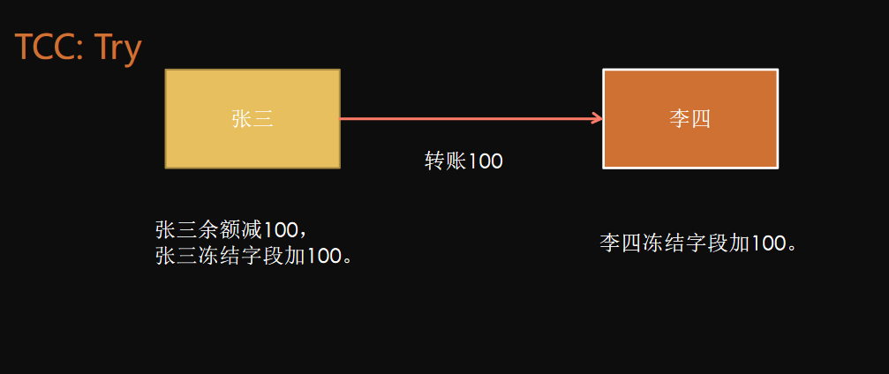


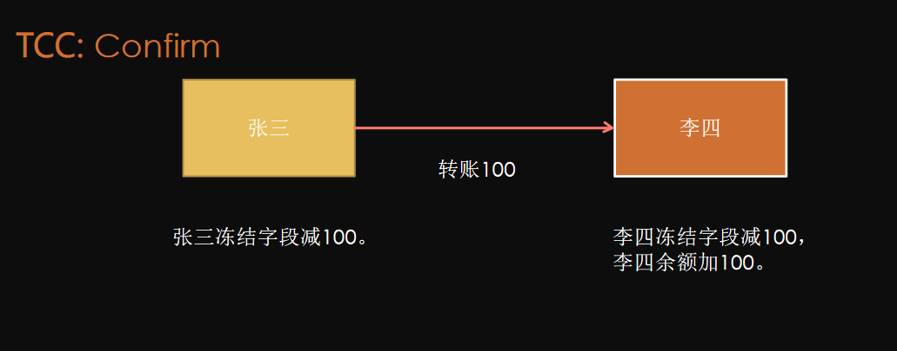


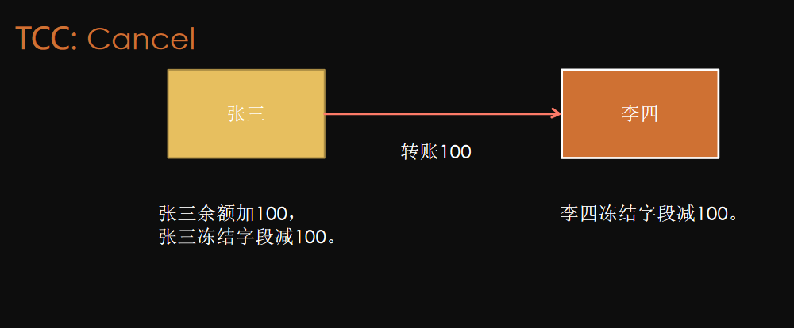


## TCC空回滚是解决什么问题的？

​        **在没有调用TCC资源Try方法的情况下，调用了二阶段的Cancel方法。**

​		比如当Try请求由于网络延迟或故障等原因，没有执行，结果返回了异常，那么此时Cancel就不能正常执行，因为Try没有对数据进行修改，如果Cancel进行了对数据的修改，那就会导致数据不一致。

​		**解决思路**是关键就是要识别出这个空回滚。思路很简单就是需要知道Try阶段是否执行，如果执行了，那就是正常回滚；如果没执行，那就是空回滚。建议事务管理者在发起全局事务时生成全局事务记录，全局事务ID贯穿整个分布式事务调用链条。再额外增加一张**分支事务记录表**，其中有全局事务ID和分支事务ID，第一阶段Try方法里会插入一条记录，表示Try阶段执行了。Cancel接口里读取该记录，如果该记录存在，则正常回滚；如果该记录不存在，则是空回滚。


## 如何解决TCC幂等问题？

为了保证TCC二阶段提交重试机制不会引发数据不一致，要求TCC的二阶段Confirm和Cancel接口保证幂等，这样不会重复使用或者释放资源。如果幂等控制没有做好，很有可能导致数据不一致等严重问题。

**解决思路**在上述 **分支事务记录**中增加执行状态，每次执行前都查询该状态。


## 如何解决TCC中悬挂问题？

**悬挂就是对于一个分布式事务，其二阶段Cancel接口比Try接口先执行。**
		出现原因是在调用分支事务Try时，由于网络发生拥堵，造成了超时，TM就会通知RM回滚该分布式事务，可能回滚完成后，Try请求才到达参与者真正执行，而一个Try方法预留的业务资源，只有该分布式事务才能使用，该分布式事务第一阶段预留的业务资源就再也没有人能够处理了，对于这种情况，我们就称为悬挂，即业务资源预留后无法继续处理。

​		**解决思路**是如果二阶段执行完成，那一阶段就不能再继续执行。在执行一阶段事务时判断在该全局事务下，判断**分支事务记录表**中是否已经有二阶段事务记录，如果有则不执行Try。


### 可靠消息服务方案是什么？

​		可靠消息最终一致性方案指的是：当事务的发起方（事务参与者，消息发送者）执行完本地事务后，同时发出一条消息，事务参与方（事务参与者，消息的消费者）一定能够接受消息并可以成功处理自己的事务。

​		这里面强调两点：

1. 可靠消息：发起方一定得把消息传递到消费者。
2. 最终一致性：最终发起方的业务处理和消费方的业务处理得完成，达成最终一致。

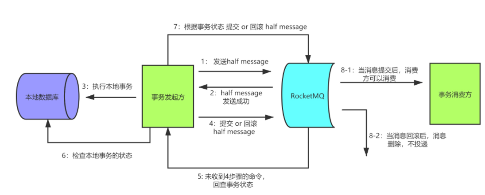


### 最大努力通知方案的关键是什么？

1.  有一定的消息重复通知机制。因为接收通知方（上图中的我方支付系统）可能没有接收到通知，此时要有一定的机制对消息重复通知。
2.  消息校对机制。如果尽最大努力也没有通知到接收方，或者接收方消费消息后要再次消费，此时可由接收方主动向通知方查询消息信息来满足需求。


## 什么是分布式系统中的幂等？

幂等（idempotent、idempotence）是一个数学与计算机学概念，常见于抽象代数中。

**在编程中，一个幂等操作的特点是其任意多次执行所产生的影响均与一次执行的影响相同。**幂等函数，或幂等方法，是指可以使用相同参数重复执行，并能获得相同结果的函数。这些函数不会影响系统状态，也不用担心重复执行会对系统造成改变。

例如，“getUsername()和 setTrue()”函数就是一个幂等函数. 更复杂的操作幂等保证是利用唯一交易号(流水号)实现. 我的理解：幂等就是一个操作，不论执行多少次，产生的效果和返回的结果都是一样的。


操作：查询，set固定值。逻辑删除。set 固定值。

流程：分布式系统中，网络调用，重试机制。


## 幂等有哪些技术解决方案？

1.查询操作

查询一次和查询多次，在数据不变的情况下，查询结果是一样的。select 是天然的幂等操作；

2.删除操作

删除操作也是幂等的，删除一次和多次删除都是把数据删除。(注意可能返回结果不一样，删除的数据不存在，返回 0，删除的数据多条，返回结果多个。

3.唯一索引

防止新增脏数据。比如：支付宝的资金账户，支付宝也有用户账户，每个用户只能有一个资金账户，怎么防止给用户创建多个资金账户，那么给资金账户表中的用户 ID 加唯一索引，所以一个用户新增成功一个资金账户记录。要点：唯一索引或唯一组合索引来防止新增数据存在脏数据（当表存在唯一索引，并发时新增报错时，再查询一次就可以了，数据应该已经存在了，返回结果即可。

4.token 机制

防止页面重复提交。

**业务要求：**页面的数据只能被点击提交一次；

**发生原因：**由于重复点击或者网络重发，或者 nginx 重发等情况会导致数据被重复提交；

**解决办法：**集群环境采用 token 加 redis(redis 单线程的，处理需要排队)；单 JVM 环境：采用 token 加 redis 或 token 加 jvm 锁。

**处理流程：**

1. 数据提交前要向服务的申请 token，token 放到 redis 或 jvm 内存，token 有效时间；
2. 提交后后台校验 token，同时删除 token，生成新的 token 返回。

**token 特点：**要申请，一次有效性，可以限流。

注意：redis 要用删除操作来判断 token，删除成功代表 token 校验通过。


## 对外提供的API如何保证幂等？

举例说明： 银联提供的付款接口：需要接入商户提交付款请求时附带：source 来源，seq 序列号。

source+seq 在数据库里面做唯一索引，防止多次付款(并发时，只能处理一个请求) 。重点：对外提供接口为了支持幂等调用，接口有两个字段必须传，一个是来源 source，一个是来源方序列号 seq，这个两个字段在提供方系统里面做联合唯一索引，这样当第三方调用时，先在本方系统里面查询一下，是否已经处理过，返回相应处理结果；没有处理过，进行相应处理，返回结果。

注意，为了幂等友好，一定要先查询一下，是否处理过该笔业务，不查询直接插入业务系统，会报错，但实际已经处理。


## 缓存数据库一致性问题如何解决？

先做一个说明，从理论上来说，给缓存设置过期时间，是保证最终一致性的解决方案。这种方案下，我们可以对存入缓存的数据设置过期时间，所有的写操作以数据库为准，对缓存操作只是尽最大努力更新即可。也就是说如果数据库写成功，缓存更新失败，那么只要到达过期时间，则后面的读请求自然会从数据库中读取新值然后回填缓存。因此，接下来讨论的思路不依赖于给缓存设置过期时间这个方案。
在这里，我们讨论**三种**更新策略：

1. 先更新缓存，再更新数据库。（不可取）
2. 先更新数据库，再更新缓存。（不可取）
3. 先删除缓存，再更新数据库。（不可取）
4. 先更新数据库，再删除缓存。（可取，有问题待解决）

### 大前提：

先读缓存，如果缓存没有，才从数据库读取。

### (1)先更新数据库，再更新缓存（不可取）

这套方案，大家是普遍反对的。为什么呢？有如下两点原因。
**原因一（线程安全角度）**
同时有请求A和请求B进行更新操作，那么会出现
（1）线程A更新了数据库
（2）线程B更新了数据库
（3）线程B更新了缓存
（4）线程A更新了缓存
这就出现请求A更新缓存应该比请求B更新缓存早才对，但是因为网络等原因，B却比A更早更新了缓存。这就导致了脏数据，因此不考虑。
**原因二（业务场景角度）**
有如下两点：
（1）如果你是一个写数据库场景比较多，而读数据场景比较少的业务需求，采用这种方案就会导致，数据压根还没读到，缓存就被频繁的更新，浪费性能。
（2）如果你写入数据库的值，并不是直接写入缓存的，而是要经过一系列复杂的计算再写入缓存。那么，每次写入数据库后，都再次计算写入缓存的值，无疑是浪费性能的。显然，删除缓存更为适合。

接下来讨论的就是争议最大的，先删缓存，再更新数据库。还是先更新数据库，再删缓存的问题。

### (2)先删缓存，再更新数据库（不可取）

该方案会导致不一致的原因是。同时有一个请求A进行更新操作，另一个请求B进行查询操作。那么会出现如下情形:
（1）请求A进行写操作，删除缓存
（2）请求B查询发现缓存不存在
（3）请求B去数据库查询得到旧值
（4）请求B将旧值写入缓存
（5）请求A将新值写入数据库
上述情况就会导致不一致的情形出现。而且，如果不采用给缓存设置过期时间策略，该数据永远都是脏数据。
那么，**如何解决呢？采用延时双删策略**

（1）先淘汰缓存
（2）再写数据库（这两步和原来一样）
（3）休眠1秒，再次淘汰缓存
这么做，可以将1秒内所造成的缓存脏数据，再次删除。
**那么，这个1秒怎么确定的，具体该休眠多久呢？**
针对上面的情形，读者应该自行评估自己的项目的读数据业务逻辑的耗时。然后写数据的休眠时间则在读数据业务逻辑的耗时基础上，加几百ms即可。这么做的目的，就是确保读请求结束，写请求可以删除读请求造成的缓存脏数据。
**如果你用了mysql的读写分离架构怎么办？**
ok，在这种情况下，造成数据不一致的原因如下，还是两个请求，一个请求A进行更新操作，另一个请求B进行查询操作。
（1）请求A进行写操作，删除缓存
（2）请求A将数据写入数据库了，
（3）请求B查询缓存发现，缓存没有值
（4）请求B去从库查询，这时，还没有完成主从同步，因此查询到的是旧值
（5）请求B将旧值写入缓存
（6）数据库完成主从同步，从库变为新值
上述情形，就是数据不一致的原因。还是使用双删延时策略。只是，睡眠时间修改为在主从同步的延时时间基础上，加几百ms。
**采用这种同步淘汰策略，吞吐量降低怎么办？**
ok，那就将第二次删除作为异步的。自己起一个线程，异步删除。这样，写的请求就不用沉睡一段时间后了，再返回。这么做，加大吞吐量。
**第二次删除,如果删除失败怎么办？**
这是个非常好的问题，因为第二次删除失败，就会出现如下情形。还是有两个请求，一个请求A进行更新操作，另一个请求B进行查询操作，为了方便，假设是单库：
（1）请求A进行写操作，删除缓存
（2）请求B查询发现缓存不存在
（3）请求B去数据库查询得到旧值
（4）请求B将旧值写入缓存
（5）请求A将新值写入数据库
（6）请求A试图去删除，请求B写入对的缓存值，结果失败了。
ok,这也就是说。如果第二次删除缓存失败，会再次出现缓存和数据库不一致的问题。
**如何解决呢？**

### (3)先更新数据库，再删缓存

首先，先说一下。老外提出了一个缓存更新套路，名为[《Cache-Aside pattern》](https://docs.microsoft.com/en-us/azure/architecture/patterns/cache-aside)。其中就指出

- **失效**：应用程序先从cache取数据，没有得到，则从数据库中取数据，成功后，放到缓存中。
- **命中**：应用程序从cache中取数据，取到后返回。
- **更新**：先把数据存到数据库中，成功后，再让缓存失效。

另外，知名社交网站facebook也在论文[《Scaling Memcache at Facebook》](https://www.usenix.org/system/files/conference/nsdi13/nsdi13-final170_update.pdf)中提出，他们用的也是先更新数据库，再删缓存的策略。
**这种情况不存在并发问题么？**
不是的。假设这会有两个请求，一个请求A做查询操作，一个请求B做更新操作，那么会有如下情形产生
（1）缓存刚好失效
（2）请求A查询数据库，得一个旧值
（3）请求B将新值写入数据库
（4）请求B删除缓存
（5）请求A将查到的旧值写入缓存
ok，如果发生上述情况，确实是会发生脏数据。
**然而，发生这种情况的概率又有多少呢？**
发生上述情况有一个先天性条件，就是步骤（3）的写数据库操作比步骤（2）的读数据库操作耗时更短，才有可能使得步骤（4）先于步骤（5）。可是，大家想想，数据库的读操作的速度远快于写操作的（不然做读写分离干嘛，做读写分离的意义就是因为读操作比较快，耗资源少），因此步骤（3）耗时比步骤（2）更短，这一情形很难出现。
假设，有人非要抬杠，有强迫症，一定要解决怎么办？
**如何解决上述并发问题？**
首先，给缓存设有效时间是一种方案。其次，采用策略（2）里给出的异步延时删除策略，保证读请求完成以后，再进行删除操作。
**还有其他造成不一致的原因么？**
有的，这也是缓存更新策略（2）和缓存更新策略（3）都存在的一个问题，如果删缓存失败了怎么办，那不是会有不一致的情况出现么。比如一个写数据请求，然后写入数据库了，删缓存失败了，这会就出现不一致的情况了。这也是缓存更新策略（2）里留下的最后一个疑问。
**如何解决？**
提供一个保障的重试机制即可，这里给出两套方案。
**方案一**：
如下图所示

流程如下所示
（1）更新数据库数据；
（2）缓存因为种种问题删除失败
（3）将需要删除的key发送至消息队列
（4）自己消费消息，获得需要删除的key
（5）继续重试删除操作，直到成功
然而，该方案有一个缺点，对业务线代码造成大量的侵入。于是有了方案二，在方案二中，启动一个订阅程序去订阅数据库的binlog，获得需要操作的数据。在应用程序中，另起一段程序，获得这个订阅程序传来的信息，进行删除缓存操作。
**方案二**：

流程如下图所示：
（1）更新数据库数据
（2）数据库会将操作信息写入binlog日志当中
（3）订阅程序提取出所需要的数据以及key
（4）另起一段非业务代码，获得该信息
（5）尝试删除缓存操作，发现删除失败
（6）将这些信息发送至消息队列
（7）重新从消息队列中获得该数据，重试操作。

**备注说明：**上述的订阅binlog程序在mysql中有现成的中间件叫canal，可以完成订阅binlog日志的功能。至于oracle中，博主目前不知道有没有现成中间件可以使用。另外，重试机制，博主是采用的是消息队列的方式。如果对一致性要求不是很高，直接在程序中另起一个线程，每隔一段时间去重试即可，这些大家可以灵活自由发挥，只是提供一个思路。


## 分布式微服务项目你是如何设计的？

我一般设计成两层：业务层和能力层（中台），业务层接受用户请求，然后通过调用能力层来完成业务逻辑。

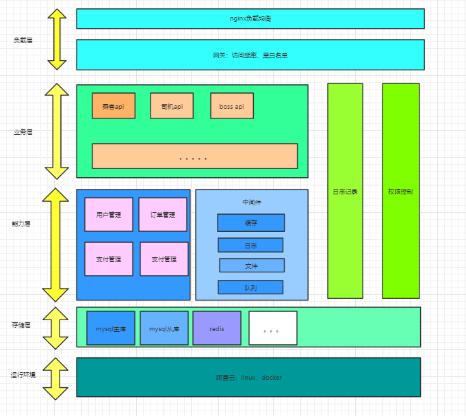


## 认证 (Authentication) 和授权 (Authorization)的区别是什么？

Authentication（认证） 是验证您的身份的凭据（例如用户名/用户ID和密码），通过这个凭据，系统得以知道你就是你，也就是说系统存在你这个用户。所以，Authentication 被称为身份/用户验证。
Authorization（授权） 发生在 Authentication（认证） 之后。授权，它主要掌管我们访问系统的权限。比如有些特定资源只能具有特定权限的人才能访问比如admin，有些对系统资源操作比如删除、添加、更新只能特定人才具有。
这两个一般在我们的系统中被结合在一起使用，目的就是为了保护我们系统的安全性。


## Cookie 和 Session 有什么区别？如何使用Session进行身份验证？

Session 的主要作用就是通过服务端记录用户的状态。 典型的场景是购物车，当你要添加商品到购物车的时候，系统不知道是哪个用户操作的，因为 HTTP 协议是无状态的。服务端给特定的用户创建特定的 Session 之后就可以标识这个用户并且跟踪这个用户了。

Cookie 数据保存在客户端(浏览器端)，Session 数据保存在服务器端。相对来说 Session 安全性更高。如果使用 Cookie 的一些敏感信息不要写入 Cookie 中，最好能将 Cookie 信息加密然后使用到的时候再去服务器端解密。

那么，如何使用Session进行身份验证？

很多时候我们都是通过 SessionID 来实现特定的用户，SessionID 一般会选择存放在 Redis 中。举个例子：用户成功登陆系统，然后返回给客户端具有 SessionID 的 Cookie，当用户向后端发起请求的时候会把 SessionID 带上，这样后端就知道你的身份状态了。关于这种认证方式更详细的过程如下：

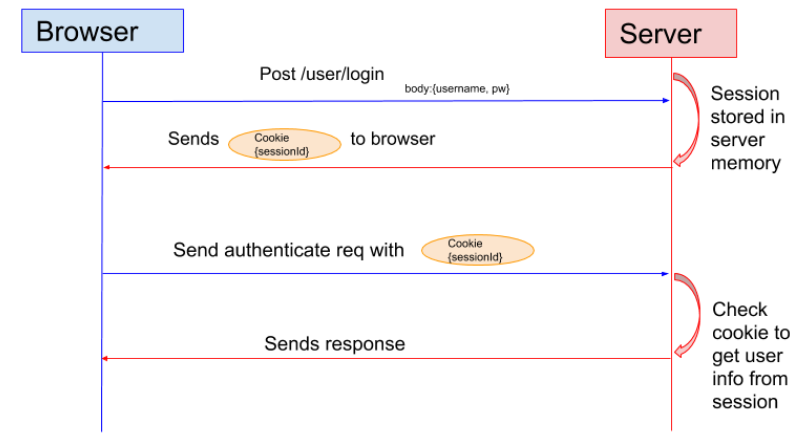

1. 用户向服务器发送用户名和密码用于登陆系统。
2. 服务器验证通过后，服务器为用户创建一个 Session，并将 Session信息存储 起来。
3. 服务器向用户返回一个 SessionID，写入用户的 Cookie。
4. 当用户保持登录状态时，Cookie 将与每个后续请求一起被发送出去。
5. 服务器可以将存储在 Cookie 上的 Session ID 与存储在内存中或者数据库中的 Session 信息进行比较，以验证用户的身份，返回给用户客户端响应信息的时候会附带用户当前的状态。

使用 Session 的时候需要注意下面几个点：

**依赖Session的关键业务一定要确保客户端开启了Cookie。**

**注意Session的过期时间**


## 为什么Cookie 无法防止CSRF攻击，而token可以？

**CSRF（Cross Site Request Forgery）**一般被翻译为 跨站请求伪造 。那么什么是 跨站请求伪造 呢？说简单用你的身份去发送一些对你不友好的请求。举个简单的例子：

小壮登录了某网上银行（所以该网站的cookie中有该用户的信息（比如sessionid）），他来到了网上银行的帖子区，看到一个帖子下面有一个链接写着“科学理财，年盈利率过万”，小壮好奇的点开了这个链接，结果发现自己的账户少了10000元。这是这么回事呢？原来黑客在链接中藏了一个请求，这个请求直接利用小壮的身份（携带了cookie）给银行发送了一个转账请求,也就是通过你的 Cookie 向银行发出请求。

`<a src=http://www.mybank.com/Transfer?bankId=11&money=10000>科学理财，年盈利率过万</>`

进行Session 认证的时候，我们一般使用 Cookie 来存储 SessionId,当我们登陆后后端生成一个SessionId放在Cookie中返回给客户端，服务端通过Redis或者其他存储工具记录保存着这个Sessionid，客户端登录以后每次请求都会带上这个SessionId，服务端通过这个SessionId来标示你这个人。如果别人通过 cookie拿到了 SessionId 后就可以代替你的身份访问系统了。

Session 认证中 Cookie 中的 SessionId是由浏览器发送到服务端的，借助这个特性，攻击者就可以通过让用户误点攻击链接，达到攻击效果。

但是，我们使用 token 的话就不会存在这个问题，在我们登录成功获得 token 之后，一般会选择存放在 **local storage** 中。然后我们在前端通过某些方式（通常是在添加请求头 Authorization）会给每个发到后端的请求加上这个 token,这样就不会出现 CSRF 漏洞的问题。因为，即使有个你点击了非法链接发送了请求到服务端，这个非法请求是不会携带 token 的，所以这个请求将是非法的。


## 什么是 Token?什么是 JWT?如何基于Token进行身份验证？

我们知道 Session 信息需要保存一份在服务器端。这种方式会带来一些麻烦，比如需要我们保证保存 Session 信息服务器的可用性、不适合移动端（依赖Cookie）等等。

有没有一种不需要自己存放 Session 信息就能实现身份验证的方式呢？使用 Token 即可！JWT （JSON Web Token） 就是这种方式的实现，通过这种方式服务器端就不需要保存 Session 数据了，只用在客户端保存服务端返回给客户的 Token 就可以了，扩展性得到提升。

**JWT 本质上就一段签名的 JSON 格式的数据。**由于它是带有签名的，因此接收者便可以验证它的真实性。

下面是 RFC 7519 对 JWT 做的较为正式的定义。

JSON Web Token (JWT) is a compact, URL-safe means of representing claims to be transferred between two parties. The claims in a JWT are encoded as a JSON object that is used as the payload of a JSON Web Signature (JWS) structure or as the plaintext of a JSON Web Encryption (JWE) structure, enabling the claims to be digitally signed or integrity protected with a Message Authentication Code (MAC) and/or encrypted. ——JSON Web Token (JWT)

JWT 由 3 部分构成:

**Header** :描述 JWT 的元数据。定义了生成签名的算法以及 Token 的类型。
**Payload**（负载）:用来存放实际需要传递的数据
**Signature**（签名）：服务器通过Payload、Header和一个密钥(secret)使用 Header 里面指定的签名算法（默认是 HMAC SHA256）生成。
在基于 Token 进行身份验证的的应用程序中，服务器通过Payload、Header和一个密钥(secret)创建令牌（Token）并将 Token 发送给客户端，客户端将 Token 保存在 Cookie 或者 localStorage 里面，以后客户端发出的所有请求都会携带这个令牌。你可以把它放在 Cookie 里面自动发送，但是这样不能跨域，所以更好的做法是放在 HTTP Header 的 Authorization字段中：Authorization: Bearer Token。


用户向服务器发送用户名和密码用于登陆系统。
身份验证服务响应并返回了签名的 JWT，上面包含了用户是谁的内容。
用户以后每次向后端发请求都在Header中带上 JWT。
服务端检查 JWT 并从中获取用户相关信息。


## 分布式架构下，Session 共享有什么方案?

1. **不要有session**：但是确实在某些场景下，是可以没有session的，其实在很多接口类系统当中，都提倡【API无状态服务】；也就是每一次的接口访问，都不依赖于session、不依赖于前一次的接口访问；
2. 存入cookie中：将session存储到cookie中，但是缺点也很明显，例如每次请求都得带着session，数据存储在客户端本地，是有风险的；
3. session同步：对个服务器之间同步session，这样可以保证每个服务器上都有全部的session信息，不过当服务器数量比较多的时候，同步是会有延迟甚至同步失败；
4. 使用Nginx（或其他复杂均衡软硬件）中的ip绑定策略，同一个ip只能在指定的同一个机器访问，但是这样做风险也比较大，而且也是去了负载均衡的意义；
5. **我们现在的系统会把session放到Redis中存储**，虽然架构上变得复杂，并且需要多访问一次Redis，但是这种方案带来的好处也是很大的：实现session共享，可以水平扩展（增加Redis服务器），服务器重启session不丢失（不过也要注意session在Redis中的刷新/失效机制），不仅可以跨服务器session共享，甚至可以跨平台（例如网页端和APP端）。


## springcloud核心组件有哪些？

**服务注册与发现**——Netflix Eureka、Nacos、Zookeeper

**客户端负载均衡**——Netflix Ribbon、SpringCloud LoadBalancer

**服务熔断器**——Netflix Hystrix、Alibaba Sentinel、Resilience4J

**服务网关**——Netflix Zuul、SpringCloud Gateway

**服务接口调用**——Netflix Feign、 Resttemplate、Openfeign

**链路追踪**——Netflix Sleuth、Skywalking、Pinpoint

聚合Hystrix监控数据——Netflix Turbine

**监控中心--**-- SpringBoot Admin

**配置中心**——Spring Cloud Config 、Apollo、nacos

MusicMelody999

## 微服务架构原理是什么？

主要是面向SOA理念，更细小粒度服务的拆分，将功能分解到各个服务当中，从而降低系统的耦合性，并提供更加灵活的服务支持。


## 注册中心的原理是什么？

服务启动后向Eureka注册，Eureka Server会将注册信息向其他Eureka Server进行同步，当服务消费者要调用服务提供者，则向服务注册中心获取服务提供者地址，然后会将服务提供者地址缓存在本地，下次再调用时，则直接从本地缓存中取，完成一次调用


## 配置中心的原理是什么？

在服务运行之前，将所需的配置信息从配置仓库拉取到本地服务，达到统一化配置管理的目的


## 配置中心是如何实现自动刷新的？

1. 配置中心Server端承担起配置刷新的职责

2. 提交配置触发post请求给server端的bus/refresh接口

3. server端接收到请求并发送给Spring Cloud Bus总线

4. Spring Cloud bus接到消息并通知给其它连接到总线的客户端

5. 其它客户端接收到通知，请求Server端获取最新配置

6. 全部客户端均获取到最新的配置


## 配置中心是如何保证数据安全的?

1.保证容器文件访问的安全性，**即保证所有的网络资源请求都需要登录**

2.**将配置中心里所有配置文件中的密码进行加密**，保证其密文性

3.**开发环境禁止拉取生产环境的配置文件**


## 用zookeeper和eureka做注册中心有什么区别?

Zookeeper保证的是CP（一致性，容错性）, 而Eureka则是AP（可用性，容错性）。


## Ribbon负载均衡原理是什么?

1. Ribbon通过ILoadBalancer接口对外提供统一的选择服务器(Server)的功能，此接口会根据不同的负载均衡策略(IRule)选择合适的Server返回给使用者。

2. IRule是负载均衡策略的抽象，ILoadBalancer通过调用IRule的choose()方法返回Server

3. IPing用来检测Server是否可用，ILoadBalancer的实现类维护一个Timer每隔10s检测一次Server的可用状态

4. IClientConfig主要定义了用于初始化各种客户端和负载均衡器的配置信息，其实现类为DefaultClientConfigImpl


## 微服务熔断降级机制是什么?

微服务框架是许多服务互相调用的，要是不做任何保护的话，某一个服务挂了，就会引起连锁反应，导致别的服务也挂。

Hystrix 是隔离、熔断以及降级的一个框架。

**如果调用某服务报错的次数过多（可能是服务挂了），就对该服务熔断，即拦截访问该服务的一切请求，在一定时间内请求此服务直接就返回一个默认值给调用方，使得调用方不需要阻塞等待返回结果，这个过程，就是所谓的熔断。**

**但是熔断了之后就会少调用一个服务，此时需要做下标记，标记本来需要做什么业务，但是因为服务挂了，暂时没有做，等该服务恢复了，就可以手工处理这些业务。这个过程，就是所谓的降级。**


## 什么是Hystrix？实现原理是什么?

Hystrix是一个延迟和容错库，旨在隔离对远程系统、服务和第三方库的访问点，停止级联故障，并在 不可避免发生故障的复杂分布式系统中实现快速恢复。


 实现原理

主要靠Spring的AOP实现

正常情况下，断路器关闭，服务消费者正常请求微服务

一段事件内，失败率达到一定阈值，断路器将断开，此时不再请求服务提供者，而是只是快速失败的方法（断路方法）

 断路器打开一段时间，自动进入“半开”状态，此时，断路器可允许一个请求方法服务提供者，如果请求调用成功，则关闭断路器，否则继续保持断路器打开状态。

 断路器hystrix是保证了局部发生的错误，不会扩展到整个系统，从而保证系统的即使出现局部问题也不会造成系统雪崩


## 注册中心挂了，或者服务挂了，应该如何处理?

注册中心挂了，可以读取本地持久化的配置

服务挂了 应该配有服务监控中心 感知到服务下线后可以通过配置的邮件通知相关人员排查问题。


## 说说你对RPC、RMI如何理解?

RPC 远程过程调用协议，通过网络向远程计算机请求调用某种服务。

RMI:远程方法调用 是指 Java 语言中的远程过程调用。能够让在客户端Java虚拟机上的对象 像 调用本地对象一样调用服务端java 虚拟机中的对象上的方法。


# Redis

## redis持久化机制：RDB和AOF

### RDB

Redis 可以通过创建**快照**来获得存储在内存里面的数据在某个时间点上的副本。Redis 创建快照之后，可以对快照进行备份，可以将快照复制到其他服务器从而创建具有相同数据的服务器副本（Redis 主从结构，主要用来提高 Redis 性能），还可以将快照留在原地以便重启服务器的时候使用。

快照持久化是 Redis 默认采用的持久化方式，在 `redis.conf` 配置文件中默认有此下配置：


```clojure
save 900 1           #在900秒(15分钟)之后（这个时间是指自上次生成快照之后所间隔的时间），如果至少有1个key发生变化，Redis就会自动触发bgsave命令创建快照。

save 300 10          #在300秒(5分钟)之后，如果至少有10个key发生变化，Redis就会自动触发bgsave命令创建快照。

save 60 10000        #在60秒(1分钟)之后，如果至少有10000个key发生变化，Redis就会自动触发bgsave命令创建快照。
```


### AOF

开启 AOF 持久化后每执行一条会更改 Redis 中的数据的命令，Redis 就会将该命令写入到内存缓存 `server.aof_buf` 中，然后再根据 `appendfsync` 配置来决定何时将其同步到硬盘中的 AOF 文件。

AOF 文件的保存位置和 RDB 文件的位置相同，都是通过 dir 参数设置的，默认的文件名是 `appendonly.aof`。

在 Redis 的配置文件中存在三种不同的 AOF 持久化方式，它们分别是：

```bash
appendfsync always    #每次有数据修改发生时都会刷盘（把aof_buf中的内容写入AOF文件）,这样会严重降低Redis的速度
appendfsync everysec  #每秒钟刷盘一次，显式地将多个写命令同步到硬盘
appendfsync no        #让操作系统决定何时进行同步（刷盘）
```


### 对比

**RDB 比 AOF 优秀的地方** ：

- RDB 文件存储的内容是经过压缩的二进制数据， 保存着某个时间点的数据集，文件很小，适合做数据的备份，灾难恢复。AOF 文件存储的是每一次写命令，类似于 MySQL 的 binlog 日志，通常会必 RDB 文件大很多。
- 使用 RDB 文件恢复数据，直接解析还原数据即可，不需要一条一条地执行命令，速度非常快。而 AOF 则需要依次执行每个写命令，速度非常慢。也就是说，与 AOF 相比，恢复大数据集的时候，RDB 速度更快。

**AOF 比 RDB 优秀的地方** ：

- RDB 的数据安全性不如 AOF，没有办法实时或者秒级持久化数据。生成 RDB 文件的过程是比繁重的， 虽然 BGSAVE 子进程写入 RDB 文件的工作不会阻塞主线程，但会对机器的 CPU 资源和内存资源产生影响，严重的情况下甚至会直接把 Redis 服务干宕机。AOF 支持秒级数据丢失（取决 fsync 策略，如果是 everysec，最多丢失 1 秒的数据），仅仅是追加命令到 AOF 文件，操作轻量。
- RDB 文件是以特定的二进制格式保存的，并且在 Redis 版本演进中有多个版本的 RDB，所以存在老版本的 Redis 服务不兼容新版本的 RDB 格式的问题。
- AOF 以一种易于理解和解析的格式包含所有操作的日志。你可以轻松地导出 AOF 文件进行分析，你也可以直接操作 AOF 文件来解决一些问题。比如，如果执行`FLUSHALL`命令意外地刷新了所有内容后，只要 AOF 文件没有被重写，删除最新命令并重启即可恢复之前的状态。

### AOF 重写了解吗？

**当 AOF 变得太大时，Redis 能够在后台自动重写 AOF 产生一个新的 AOF 文件，这个新的 AOF 文件和原有的 AOF 文件所保存的数据库状态一样，但体积更小。**

AOF 重写是一个有歧义的名字，该功能是通过读取数据库中的键值对来实现的，程序无须对现有 AOF 文件进行任何读入、分析或者写入操作。

在执行 `BGREWRITEAOF` 命令时，Redis 服务器会维护一个 AOF 重写缓冲区，该缓冲区会在子进程创建新 AOF 文件期间，记录服务器执行的所有写命令。当子进程完成创建新 AOF 文件的工作之后，服务器会将重写缓冲区中的所有内容追加到新 AOF 文件的末尾，使得新的 AOF 文件保存的数据库状态与现有的数据库状态一致。最后，服务器用新的 AOF 文件替换旧的 AOF 文件，以此来完成 AOF 文件重写操作。

Redis 7.0 版本之前，如果在重写期间有写入命令，AOF 可能会使用大量内存，重写期间到达的所有写入命令都会写入磁盘两次。


### 4.X版本的整合策略

由于 RDB 和 AOF 各有优势，于是，Redis 4.0 开始支持 RDB 和 AOF 的混合持久化（默认关闭，可以通过配置项 `aof-use-rdb-preamble` 开启）。

如果把混合持久化打开，AOF 重写的时候就直接把 RDB 的内容写到 AOF 文件开头。这样做的好处是可以结合 RDB 和 AOF 的优点, 快速加载同时避免丢失过多的数据。当然缺点也是有的， AOF 里面的 RDB 部分是压缩格式不再是 AOF 格式，可读性较差。


## redis的过期键有哪些删除策略

### 过期精度

在 Redis 2.4 及以前版本，过期时间可能不是十分准确，有0-1秒的误差。

从 Redis 2.6 起，过期时间误差缩小到0-1毫秒。

### 过期和持久

**Keys的过期时间使用Unix时间戳存储(**毫秒为单位)。这意味着即使Redis实例不可用，时间也是一直在流逝的。

要想过期的工作处理好，计算机必须采用稳定的时间。 如果你将RDB文件在两台时钟不同步的电脑间同步，有趣的事会发生（所有的 keys装载时就会过期）。

即使正在运行的实例也会检查计算机的时钟，例如如果你设置了一个key的有效期是1000秒，然后设置你的计算机时间为未来2000秒，这时key会立即失效，而不是等1000秒之后。


### Redis如何淘汰过期的keys

1. **惰性删除** ：只会在取出 key 的时候才对数据进行过期检查。这样对 CPU 最友好，但是可能会造成太多过期 key 没有被删除。
2. **定期删除** ： 每隔一段时间抽取一批 key 执行删除过期 key 操作。并且，Redis 底层会通过限制删除操作执行的时长和频率来减少删除操作对 CPU 时间的影响。


具体就是Redis每秒10次做的事情：

1. 测试随机的20个key进行过期检测。
2. 删除所有已经过期的key。
3. 如果有多于25%的key过期，重复步骤1.


## redis线程模型有哪些，单线程为什么快

Redis 基于 **Reactor 模式**开发了自己的**网络事件处理器**：这个处理器被称为文件事件处理器（file event handler）。**由于文件事件处理器（file event handler）是单线程方式运行的，所以我们一般都说 Redis 是单线程模型。** **严格来说，Redis Server是多线程的，只是它的请求处理整个流程是单线程处理的。** **Redis内部还有其他工作线程在后台执行，它负责异步执行某些比较耗时的任务，例如AOF每秒刷盘、AOF文件重写都是在另一个线程中完成的。**

- 文件事件处理器使用 I/O 多路复用（multiplexing）程序来同时监听多个套接字，并根据套接字目前执行的任务来为套接字关联不同的事件处理器。
- 当被监听的套接字准备好执行连接应答（accept）、读取（read）、写入（write）、关 闭（close）等操作时，与操作相对应的文件事件就会产生，这时文件事件处理器就会调用套接字之前关联好的事件处理器来处理这些事件。

**虽然文件事件处理器以单线程方式运行，但通过使用 I/O 多路复用程序来监听多个套接字**，文件事件处理器既实现了高性能的网络通信模型，又可以很好地与 Redis 服务器中其他同样以单线程方式运行的模块进行对接，这保持了 Redis 内部单线程设计的简单性。


多个Socket可能并发的产生不同的操作，每个操作对应不同的文件事件，但是IO多路复用程序会监听多个Socket，会将Socket放入一个队列中排队，每次从队列中取出一个Socket给事件分派器，事件分派器把Socket给对应的事件处理器。

然后一个Socket的事件处理完之后，IO多路复用程序才会将队列的下一个Socket给事件分派器。文件事件分派器会根据每个Socket当前产生的事件，来选择对应的事件处理器来处理。


**单线程快的原因：**

1、redis是纯内存操作

2、使用了非阻塞的IO多路复用技术

3、单线程反而避免了多线程的频繁上下文切换带来的性能问题以及多线程用于同步时花费的开销。


## 缓存雪崩、缓存穿透、缓存击穿在实际中如何处理

### 缓存穿透

缓存穿透是指查询一个一定不存在的数据（比如有人恶意发动攻击，故意构造大量访问缓存中一定不存在的数据的请求），由于这个数据在数据库中也不会存在，所以也就不会把这个数据添加到缓存中，那么每次访问这个不存在的数据的请求都会落到数据库中，失去了缓存的意义。在流量大时，可能DB就挂掉了。

**解决方案**

**1）缓存无效 key**

如果缓存和数据库都查不到某个 key 的数据就写一个到 Redis 中去并设置过期时间，具体命令如下： `SET key value EX 10086` 。这种方式可以解决请求的 key 变化不频繁的情况，如果黑客恶意攻击，每次构建不同的请求 key，会导致 Redis 中缓存大量无效的 key 。很明显，这种方案并不能从根本上解决此问题。如果非要用这种方式来解决穿透问题的话，尽量将无效的 key 的过期时间设置短一点比如 1 分钟。

另外，这里多说一嘴，一般情况下我们是这样设计 key 的： `表名:列名:主键名:主键值` 。

**2）布隆过滤器**

使用布隆过滤器

加入布隆过滤器之后的缓存处理流程图如下。


但是，需要注意的是布隆过滤器可能会存在误判的情况。总结来说就是： **布隆过滤器说某个元素存在，小概率会误判。布隆过滤器说某个元素不在，那么这个元素一定不在。**


### 缓存击穿

**缓存击穿是指 大量请求同时访问一条缓存中不在但是在数据库中的热点数据（比如由于缓存时间到期），这时由于并发量大，同时读缓存没读到数据，所以会同时去数据库去取数据，引起数据库压力瞬间增大，压垮数据库。**

**缓存击穿指并发查<u>同一条数据</u>，缓存雪崩是不同数据都过期了，很多数据都查不到从而查数据库。**

 

**解决方案：**

1. 设置热点数据永远不过期。
2. 加互斥锁


### 缓存雪崩

**缓存雪崩是指在我们设置缓存时多条数据采用了相同的过期时间，导致大量缓存数据在某一时刻同时失效，访问这些数据的请求全部落到DB，DB瞬时压力过重雪崩。**

解决方案

1.使用互斥锁(mutex key)

3.热点永远不过期：  
这里的“永远不过期”包含两层意思：

(1) 从redis上看，确实没有设置过期时间，这就保证了，不会出现热点key过期问题，也就是“物理”不过期。

(2) 从功能上看，如果不过期，那不就成静态的了吗？所以我们**把过期时间存在key对应的value里**，如果发现要过期了，通过一个后台的异步线程进行缓存的构建，也就是**“逻辑”过期**

从实战看，这种方法对于性能非常友好，唯一不足的就是构建缓存时候，其余线程(非构建缓存的线程)可能访问的是老数据，但是对于一般的互联网功能来说这个还是可以忍受。


### 总结

穿透：缓存不存在，数据库不存在，高并发，少量key

击穿：缓存不存在，数据库存在，高并发，少量key

雪崩：缓存不存在，数据库存在，高并发，大量key

**语义有些许差异，但是，都可以使用限流的互斥锁，保障数据库的稳定**


## redis事务是怎么实现的

Redis 可以通过 **`MULTI`，`EXEC`，`DISCARD` 和 `WATCH`** 等命令来实现事务(transaction)功能。

`MULTI` 命令后可以输入多个命令，Redis 不会立即执行这些命令，而是将它们放到队列，当调用了 `EXEC` 命令后，再执行所有的命令。

你也可以通过 `DISCARD`命令取消一个事务，它会清空事务队列中保存的所有命令。

你可以通过`WATCH` 命令监听指定的 Key，当调用 `EXEC` 命令执行事务时，如果一个被 `WATCH` 命令监视的 Key 被 **其他客户端/Session** 修改的话，整个事务都不会被执行。

不过，如果 **WATCH** 与 **事务** 在同一个 Session 里，并且被 **WATCH** 监视的 Key 被修改的操作发生在事务内部，这个事务是可以被执行成功的


Redis 事务在运行错误的情况下，除了执行过程中出现错误的命令外，其他命令都能正常执行。并且，Redis 是不支持回滚（roll back）操作的。因此，Redis 事务其实是不满足原子性的（而且不满足持久性）。

除了不满足原子性之外，事务中的每条命令都会与 Redis 服务器进行网络交互，这是比较浪费资源的行为。

而新的处理方式则使得在流水线（pipeline）中包含事务变得简单，因为发送事务和读取事务的回复都只需要和服务器进行一次通讯。


### 如何解决 Redis 事务的缺陷？

Redis 从 2.6 版本开始支持执行 Lua 脚本，它的功能和事务非常类似。我们可以利用 Lua 脚本来批量执行多条 Redis 命令，这些 Redis 命令会被提交到 Redis 服务器一次性执行完成，大幅减小了网络开销。

一段 Lua 脚本可以视作一条命令执行，一段 Lua 脚本执行过程中不会有其他脚本或 Redis 命令同时执行，保证了操作不会被其他指令插入或打扰。

如果 Lua 脚本运行时出错并中途结束，出错之后的命令是不会被执行的。并且，出错之前执行的命令是无法被撤销的。因此，严格来说，通过 Lua 脚本来批量执行 Redis 命令也是不满足原子性的。


### 为什么 Redis 不支持回滚（roll back）

以下是这种做法的优点：

- Redis 命令只会因为错误的语法而失败（并且这些问题不能在入队时发现），或是命令用在了错误类型的键上面：这也就是说，从实用性的角度来说，**失败的命令是由编程错误造成的，而这些错误应该在开发的过程中被发现，而不应该出现在生产环境中。**
- **因为不需要对回滚进行支持，所以 Redis 的内部可以保持简单且快速。**

有种观点认为 Redis 处理事务的做法会产生 bug ， 然而需要注意的是， 在通常情况下， 回滚并不能解决编程错误带来的问题。 举个例子， 如果你本来想通过 [INCR](http://redis.cn/commands/incr.html) 命令将键的值加上 1 ， 却不小心加上了 2 ， 又或者对错误类型的键执行了 [INCR](http://redis.cn/commands/incr.html) ， 回滚是没有办法处理这些情况的。


# redis集群方案有哪些

## 常见集群分类

主从复制集群

分片集群

## redis有那些：

主从复制集群，手动切换

带有哨兵的HA的主从复制集群

客户端实现路由索引的分片集群

使用中间件代理层的分片集群

redis自身实现的cluster分片集群


## redis主从复制的原理是什么

### Redis 复制功能是如何工作的

每一个 Redis master 都有一个 replication ID ：这是一个较大的伪随机字符串，标记了一个给定的数据集。每个 master 也持有一个偏移量，master 将自己产生的复制流发送给 slave 时，发送多少个字节的数据，自身的偏移量就会增加多少，目的是当有新的操作修改自己的数据集时，它可以以此更新 slave 的状态。复制偏移量即使在没有一个 slave 连接到 master 时，也会自增，所以基本上每一对给定的

> Replication ID, offset

都会标识一个 master 数据集的确切版本。

当 slave 连接到 master 时，它们使用 PSYNC 命令来发送它们记录的旧的 master replication ID 和它们至今为止处理的偏移量。通过这种方式， master 能够仅发送 slave 所需的增量部分。但是如果 master 的缓冲区中没有足够的命令积压缓冲记录，或者如果 slave 引用了不再知道的历史记录（replication ID），则会转而进行一个全量重同步：在这种情况下， slave 会得到一个完整的数据集副本，从头开始。

下面是一个**全量同步**的工作细节：

master 开启一个后台保存进程，以便于生产一个 **RDB 文件**。同时它开始缓冲所有从客户端接收到的新的写入命令。当后台保存完成时， master 将数据集文件传输给 slave， slave将之保存在磁盘上，然后加载文件到内存。再然后 master 会发送所有缓冲的命令发给 slave。这个过程以指令流的形式完成并且和 Redis 协议本身的格式相同。

你可以用 telnet 自己进行尝试。在服务器正在做一些工作的同时连接到 Redis 端口并发出 [SYNC](https://redis.io/commands/sync) 命令。你将会看到一个批量传输，并且之后每一个 master 接收到的命令都将在 telnet 回话中被重新发出。事实上 SYNC 是一个旧协议，在新的 Redis 实例中已经不再被使用，但是其仍然向后兼容：但它不允许部分重同步，所以现在 **PSYNC** 被用来替代 SYNC。

之前说过，当主从之间的连接因为一些原因崩溃之后， slave 能够自动重连。如果 master 收到了多个 slave 要求同步的请求，它会执行一个单独的后台保存，以便于为多个 slave 服务。

## 无需磁盘参与的复制

正常情况下，一个全量重同步要求在磁盘上创建一个 RDB 文件，然后将它从磁盘加载进内存，然后 slave以此进行数据同步。

如果磁盘性能很低的话，这对 master 是一个压力很大的操作。Redis 2.8.18 是第一个支持无磁盘复制的版本。在此设置中，子进程直接发送 RDB 文件给 slave，无需使用磁盘作为中间储存介质。


## redis缓存驱逐（回收）策略

### 驱逐策略

```
noeviction:返回错误，当内存限制达到并且客户端尝试执行会让更多内存被使用的命令（大部分的写入指令，但DEL和几个例外）
allkeys-lru: 尝试回收最少使用的键（LRU），使得新添加的数据有空间存放。
volatile-lru: 尝试回收最少使用的键（LRU），但仅限于在过期集合的键,使得新添加的数据有空间存放。
allkeys-random: 回收随机的键使得新添加的数据有空间存放。
volatile-random: 回收随机的键使得新添加的数据有空间存放，但仅限于在过期集合的键。
volatile-ttl: 回收在过期集合的键，并且优先回收存活时间（TTL）较短的键,使得新添加的数据有空间存放。
volatile-lfu：从所有配置了过期时间的键中驱逐使用频率最少的键
allkeys-lfu：从所有键中驱逐使用频率最少的键
```


### **回收进程如何工作**

理解回收进程如何工作是非常重要的:

- 一个客户端运行了新的命令，添加了新的数据。
- Redi检查内存使用情况，如果大于maxmemory的限制, 则根据设定好的策略进行回收。
- 一个新的命令被执行，等等。
- 所以我们不断地穿越内存限制的边界，通过不断达到边界然后不断地回收回到边界以下。

如果一个命令的结果导致大量内存被使用（例如很大的集合的交集保存到一个新的键），不用多久内存限制就会被这个内存使用量超越。


# RabbitMQ

## RabbitMQ的架构设计是什么样的

### 是AMQP的实现，相关概念语义

Broker:它提供一种传输服务,它的角色就是维护一条从生产者到消费者的路线，保证数据能按照指定的方式进行传输

Exchange：消息交换机,它指定消息按什么规则,路由到哪个队列。 

Queue:消息的载体,每个消息都会被投到一个或多个队列。 

Binding:绑定，它的作用就是把exchange和queue按照路由规则绑定起来. 

Routing Key:路由关键字,exchange根据这个关键字进行消息投递。 

vhost:虚拟主机,一个broker里可以有多个vhost，用作不同用户的权限分离。

Producer:消息生产者,就是投递消息的程序. 

Consumer:消息消费者,就是接受消息的程序. 

Channel:消息通道,在客户端的每个连接里,可建立多个channel.

### 核心概念

在mq领域中，producer将msg发送到queue，然后consumer通过消费queue完成P.C解耦

kafka是由producer决定msg发送到那个queue

rabbitmq是由Exchange决定msg应该怎么样发送到目标queue，这就是binding及对应的策略

### Exchange

Direct Exchange:直接匹配,通过Exchange名称+RountingKey来发送与接收消息. 
Fanout Exchange:广播订阅,向所有的消费者发布消息,但是只有消费者将队列绑定到该路由器才能收到消息,忽略Routing Key. 
Topic Exchange：主题匹配订阅,这里的主题指的是RoutingKey,RoutingKey可以采用通配符,如:*或#，RoutingKey命名采用.来分隔多个词,只有消息这将队列绑定到该路由器且指定RoutingKey符合匹配规则时才能收到消息; 
Headers Exchange:消息头订阅,消息发布前,为消息定义一个或多个键值对的消息头,然后消费者接收消息同时需要定义类似的键值对请求头:(如:x-mactch=all或者x_match=any)，只有请求头与消息头匹配,才能接收消息,忽略RoutingKey. 
默认的exchange:如果用空字符串去声明一个exchange，那么系统就会使用”amq.direct”这个exchange，我们创建一个queue时,默认的都会有一个和新建queue同名的routingKey绑定到这个默认的exchange上去


## RabbitMQ如何确保消息发送和消息接收

### 生产者消息确认

RabbitMQ提供了**publisher confirm**机制来避免消息发送到MQ过程中丢失。这种机制必须给每个消息指定一个**唯一ID**。消息发送到MQ以后，会返回一个结果给<u>消息生产者（发送者）</u>，表示消息是否处理成功。

返回结果有两种方式：

- **publisher-confirm**，发送者确认。可以通过定义 ConfirmCallback 来实现，一旦MQ返回给生产者一个确认就会调用这个回调方法。
  - 消息成功投递到交换机，返回ack
  - 消息未投递到交换机，返回nack
- **publisher-return**，发送者回执。可以通过定义ReturnCallback来实现，一旦MQ没有把消息路由到队列就会调用该方法。
  - 消息投递到交换机了，但是没有路由到队列。返回ACK，及路由失败原因。


**ConfirmCallback**可以在<u>发送消息时</u>指定，因为每个业务处理confirm成功或失败的逻辑不一定相同。

**每个RabbitTemplate只能配置一个ReturnCallback（全局唯一）**，因此需要在项目加载时配置


### 消费者消息确认

RabbitMQ是**阅后即焚**机制，RabbitMQ确认消息被消费者消费后会立刻删除。

而RabbitMQ是通过**消费者回执**来确认消费者是否成功处理消息的：消费者获取消息后，应该向RabbitMQ发送ACK回执，表明自己已经处理消息。


设想这样的场景：

- 1）RabbitMQ投递消息给消费者
- 2）消费者获取消息后，返回ACK给RabbitMQ
- 3）RabbitMQ删除消息
- 4）消费者宕机，消息尚未处理

这样，消息就丢失了。因此消费者返回ACK的时机非常重要。


消息确认模式有：

AcknowledgeMode.NONE：关闭ack，MQ假定消费者获取消息后会成功处理，因此消息投递后立即被删除

AcknowledgeMode.AUTO：自动ack，由Spring监测listener代码是否出现异常，没有异常则返回ack；抛出异常则返回nack。

AcknowledgeMode.MANUAL：手动ack，需要在业务代码结束后，调用api发送ack。

​	消费者收到消息后，手动调用 Basic.Ack 或 Basic.Nack 或 Basic.Reject 后，RabbitMQ 收到这些消息后，才认为本次投递完成。

​	Basic.Ack 命令：用于确认当前消息。
​	Basic.Nack 命令：用于否定当前消息（注意：这是AMQP 0-9-1的RabbitMQ扩展） 。
​	Basic.Reject 命令：用于拒绝当前消息。

​	Nack,Reject后都有能力要求是否requeue消息或者进入死信队列


MQ收到ACK后会把消息删除，收到NACK后会把消息重新入队，从而再次发送给消费者。


## RabbitMQ事务消息原理是什么

### 事务V.S确认

确认是对一件事的确认

事务是对批量的确认

增删改查中，事务是对于增删改的保证

### 发送方事务

开启事务，发送多条数据，事务提交或回滚是原子的，要么都提交，要么都回滚

### 消费方事务

消费方是读取行为，那么事务体现在哪里呢

rabbitmq的消费行为会触发queue中msg的是否删除、是否重新放回队列等行为，类增删改

所以，消费方的ack是要手动提交的，且最终确定以事务的提交和回滚决定


## RabbitMQ死信队列、延时队列分别是什么

### 死信队列


当一个队列中的消息满足下列情况之一时，可以成为 **死信（dead letter）**：

- 消费者使用 `basic.reject` 或 `basic.nack` 声明消费失败，并且消息的requeue参数设置为false
- 消息是一个过期消息，超时无人消费
- 要投递的队列消息满了，无法投递

如果这个<u>包含死信的队列</u>配置了`dead-letter-exchange`属性，指定了一个交换机，那么队列中的死信就会投递到这个交换机中，而这个交换机称为**死信交换机**（Dead Letter Exchange，简称DLX）。而绑定到死信交换机的队列成为**死信队列**（注：并不是配置了死信交换机属性的那个队列）。


造成死信的原因：

- 信息被拒绝
- 信息超时
- 超过了队列的最大长度


**消息TTL**

    在 rabbitmq 中存在2种方可设置消息的过期时间，第一种通过对队列进行设置，这种设置后，该队列中所有的消息都存在相同的过期时间，第二种通过对消息本身进行设置，那么每条消息的过期时间都不一样。如果同时使用这2种方法，那么以过期时间小的那个数值为准。当消息达到过期时间还没有被消费，那么那个消息就成为了一个 死信 消息。
    
    队列过期时间设置：在队列申明的时候使用 x-message-ttl 参数，单位为 毫秒
    
    单个消息过期时间设置：是设置消息属性的 expiration 参数的值，单位为 毫秒


### 延迟队列

延迟队列存储的是延迟消息

延迟消息指的是，当消息被发布出去之后，并不立即投递给消费者，而是在指定时间之后投递。

rabbitMq可以通过死信队列实现延迟队列：

- 给消息的目标队列指定死信交换机
- 将**消费者监听的队列绑定到死信交换机**
- 发送消息时给消息设置TTL，或者给目标队列设置TTL。

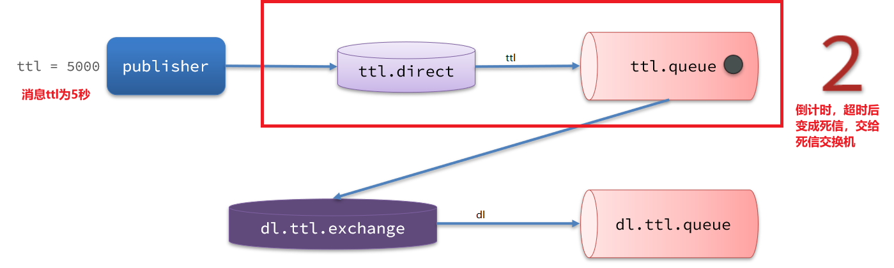


也可以使用 **DelayExchange插件**


# Kafka

## 简述kafka架构设计是什么样

**broker**
Kafka 集群包含一个或多个服务器，服务器节点称为broker。

broker存储topic的数据。如果某topic有N个partition，集群有N个broker，那么每个broker存储该topic的一个partition。

如果某topic有N个partition，集群有(N+M)个broker，那么其中有N个broker存储该topic的一个partition，剩下的M个broker不存储该topic的partition数据。

如果某topic有N个partition，集群中broker数目少于N个，那么一个broker存储该topic的一个或多个partition。在实际生产环境中，尽量避免这种情况的发生，这种情况容易导致Kafka集群数据不均衡。


**Topic**
每条发布到Kafka集群的消息都有一个类别，这个类别被称为Topic。（物理上不同Topic的消息分开存储，逻辑上一个Topic的消息虽然保存于一个或多个broker上但用户只需指定消息的Topic即可生产或消费数据而不必关心数据存于何处）


**Partition**
topic中的数据分割为一个或多个partition。每个topic至少有一个partition。每个partition中的数据使用多个**segment文件**存储。partition中的数据是有序的，不同partition间的数据丢失了数据的顺序。如果topic有多个partition，消费数据时就不能保证数据的顺序。在需要严格保证消息的消费顺序的场景下，需要将partition数目设为1。


**Producer**
生产者即数据的发布者，该角色将消息发布到Kafka的topic中。broker接收到生产者发送的消息后，broker将该消息追加到当前用于追加数据的segment文件中。生产者发送的消息，存储到一个partition中，生产者也可以指定数据存储的partition。


**Consumer**
消费者可以从broker中读取数据。消费者可以消费多个topic中的数据。


**Consumer Group**
每个Consumer属于一个特定的Consumer Group（可为每个Consumer指定group name，若不指定group name则属于默认的group）。一个topic可以有多个CG。topic的消息会复制给consumer。**如果需要实现广播，只要每个consumer有一个独立的CG就可以了。要实现单播（任播）只要所有的consumer在同一个CG。**用CG还可以将consumer进行自由的分组而不需要多次发送消息到不同的topic。


**Leader**
每个partition有多个副本，其中有且仅有一个作为Leader，Leader是当前负责数据的读写的partition。


**Follower**
Follower跟随Leader，所有写请求都通过Leader路由，数据变更会广播给所有Follower，Follower与Leader保持数据同步。如果Leader失效，则从Follower中选举出一个新的Leader。当Follower与Leader挂掉、卡住或者同步太慢，leader会把这个follower从“in sync replicas”（ISR）列表中删除，重新创建一个Follower。


**Offset**

分区中的每条记录（消息）都被分配一个名为偏移量（offset）的顺序标识符，该标识符对应分区中的每条记录都是唯一的。

偏移量（offset）是一个递增的、不可变的数字，由Kafka维护。当记录被写入分区时，它被追加到日志的末尾，并分配下一个顺序偏移量。

kafka的存储文件都是按照offset.kafka来命名，用offset做名字的好处是方便查找。例如你想找位于2049的位置，只要找到2048.kafka的文件即可。当然the first offset就是00000000000.kafka


## Kafka是pull？push？以及优劣势分析

Kafka遵循了一种大部分消息系统共同的传统的设计：**producer将消息推送到broker，consumer从broker拉取消息。**

**push模式**:将消息推送到下游的consumer。这样做有好处也有坏处：由broker决定消息推送的速率，对于不同消费速率的consumer就不太好处理了。push模式下，当broker推送的速率远大于consumer消费的速率时，consumer恐怕就要崩溃了。

Pull模式的另外一个好处是consumer可以自主决定是否批量地从broker拉取数据。

Push模式为了避免consumer崩溃而采用较低的推送速率，将可能导致一次只推送较少的消息而造成浪费。

Pull模式下，consumer就可以根据自己的消费能力去决定这些策略。

Pull有个缺点是，如果broker没有可供消费的消息，将导致consumer不断在循环中轮询，直到新消息到达。

为了避免这点，Kafka有个参数可以让consumer阻塞知道新消息到达(当然也可以阻塞直到消息的数量达到某个特定的量这样就可以批量pull）


## Kafka中zk的作用是什么

Zookeeper是分布式协调，注意它不是数据库

**kafka中使用了zookeeper的分布式锁和分布式配置及统一命名的分布式协调解决方案**

在kafka的broker集群中的controller的选择，是通过zk的临时节点争抢获得的

brokerID等如果自增的话也是通过zk的节点version实现的全局唯一

kafka中broker中的状态数据也是存储在zk中，不过这里要注意，zk不是数据库，所以存储的属于元数据

而，新旧版本变化中，就把曾经的offset从zk中迁移出了zk


## kafka的rebalance机制是什么

Rebalance 本质上是一种协议，规定了一个 Consumer Group 下的所有 consumer 如何达成一致，来分配订阅 Topic 的每个分区。


例如：某 Group 下有 20 个 consumer 实例，它订阅了一个具有 100 个 partition 的 Topic 。正常情况下，kafka 会为每个 Consumer 平均地分配 5 个分区。这个分配的过程就是 Rebalance。

### 触发 Rebalance 的时机

Rebalance 的触发条件有3个。

- 组成员个数发生变化。例如有新的 consumer 实例加入该消费组或者离开组。
- 订阅的 Topic 个数发生变化。
- 订阅 Topic 的分区数发生变化。


# ZooKeeper

## zk的数据模型和节点类型有哪些

### ZooKeeper数据模型

ZooKeeper的数据模型，在结构上和标准文件系统的非常相似，拥有一个层次的命名空间，都是采用**树形层次**结构，ZooKeeper树中的每个节点被称为—**Znode**。

和文件系统的目录树一样，ZooKeeper树中的每个节点可以拥有子节点。但也有不同之处：

​	Znode兼具文件和目录两种特点。既像文件一样维护着数据、元信息、ACL、时间戳等数据结构，又像目录一样可以作为路径标识的一部分，并可以具有子Znode。用户对Znode具有增、删、改、查等操作（权限允许的情况下）
​	
​	Znode具有原子性操作，读操作将获取与节点相关的所有数据，写操作也将替换掉节点的所有数据。另外，每一个节点都拥有自己的ACL(访问控制列表)，这个列表规定了用户的权限，即限定了特定用户对目标节点可以执行的操作
​	
​	Znode存储数据大小有限制。ZooKeeper虽然可以关联一些数据，但并没有被设计为常规的数据库或者大数据存储，相反的是，它用来管理调度数据，比如分布式应用中的配置文件信息、状态信息、汇集位置等等。这些数据的共同特性就是它们都是很小的数据，通常以KB为大小单位。ZooKeeper的服务器和客户端都被设计为严格检查并限制每个Znode的数据大小至多1M，当时常规使用中应该远小于此值
​	
​	Znode通过路径引用，如同Unix中的文件路径。路径必须是绝对的，因此他们必须由斜杠字符来开头。除此以外，他们必须是唯一的，也就是说每一个路径只有一个表示，因此这些路径不能改变。在ZooKeeper中，路径由Unicode字符串组成，并且有一些限制。字符串"/zookeeper"用以保存管理信息，比如关键配额信息。


### 节点类型

Znode有两种，分别为临时节点和永久节点。

节点的类型在创建时即被确定，并且不能改变。

**临时节点**：该节点的生命周期依赖于创建它们的会话。一旦会话结束，临时节点将被自动删除，当然可以也可以手动删除。临时节点不允许拥有子节点。

**永久节点**：该节点的生命周期不依赖于会话，并且只有在客户端显示执行删除操作的时候，他们才能被删除。
　　
Znode还有一个序列化的特性，如果创建的时候指定的话，该Znode的名字后面会自动追加一个不断增加的序列号。序列号对于此节点的父节点来说是唯一的，这样便会记录每个子节点创建的先后顺序。它的格式为“%10d”(10位数字，没有数值的数位用0补充，例如“0000000001”)

在ZooKeeper中，每个数据节点都是有生命周期的，其生命周期的长短取决于数据节点的节点类型。

1、持久节点（PERSISTENT）

该数据节点别创建后，就会一直存在于ZooKeeper服务器上，直到有删除操作来主动删除该节点。

2、持久顺序节点（PERSISTENT_SEQUENTIAL）

持久顺序节点的基本特性和持久节点是一致的，额外的特性表现在顺序性上。在ZooKeeper中，每个父节点都会为它的第一级子节点维护一份顺序，用于记录每个子节点创建的先后顺序。

3、临时节点（EPHEMERAL）

临时节点的生命周期和客户端的回话绑定在一起，如果客户端会话失效，那么这个节点就会被自动地清理掉。

ZooKeeper规定了不能基于临时节点来创建子节点，即临时节点只能作为叶子节点。

4、临时顺序节点（EPHEMERAL_SEQUENTIAL）


## Zookeeper watch机制是什么

ZooKeeper是用来协调（同步）分布式进程的服务，提供了一个简单高性能的协调内核，用户可以在此之上构建更多复杂的分布式协调功能。

多个分布式进程通过ZooKeeper提供的API来操作共享的ZooKeeper内存数据对象ZNode来达成某种一致的行为或结果，这种模式本质上是基于状态共享的并发模型，与Java的多线程并发模型一致，他们的线程或进程都是”共享式内存通信“。

Java没有直接提供某种响应式通知接口来监控某个对象状态的变化，只能要么浪费CPU时间毫无响应式的轮询重试，或基于Java提供的某种主动通知（Notif）机制（内置队列）来响应状态变化，但这种机制是需要循环阻塞调用。

而ZooKeeper实现这些分布式进程的状态（ZNode的Data、Children）共享时，基于性能的考虑采用了类似的异步非阻塞的主动通知模式即Watch机制，使得分布式进程之间的“共享状态通信”更加实时高效，其实这也是ZooKeeper的主要任务决定的—协调。Consul虽然也实现了Watch机制，但它是阻塞的长轮询。

### ZooKeeper的Watch特性

1. Watch是一次性的，每次都需要重新注册，并且客户端在会话异常结束时不会收到任何通知，而快速重连接时仍不影响接收通知。
2. Watch的回调执行都是顺序执行的，并且客户端在没有收到关注数据的变化事件通知之前是不会看到最新的数据，另外需要注意不要在Watch回调逻辑中阻塞整个客户端的Watch回调
3. Watch是轻量级的，WatchEvent是最小的通信单元，结构上只包含通知状态、事件类型和节点路径。ZooKeeper服务端只会通知客户端发生了什么，并不会告诉具体内容。

### Zookeeper状态

Disconnected：客户端是断开连接的状态，不能连接服务集合中的任意一个
SyncConnected：客户端是连接状态，连接其中的一个服务
AuthFailed：鉴权失败
ConnectedReadOnly：客户端连接只读的服务器
SaslAuthenticated：SASL认证
Expired：服务器已经过期了该客户端的Session

### Zookeeper事件类型

None：无
NodeCreated：节点创建
NodeDeleted：节点删除
NodeDataChanged：节点数据改变
NodeChildrenChanged：子节点改变（添加/删除）

### Watcher使用的注意事项

Watcher是一次触发器，假如需要持续监听数据变更，需要在每次获取时设置Watcher
会话过期：当客户端会话过期时，该客户端注册的Watcher会失效
事件丢失：在接收通知和注册监视点之间，可能会丢失事件,但Zookeeper的状态变更和数据变化，都会记录在状态元数据信息和ZK数据节点上，所以能够获取最终一致的ZK信息状态
避免Watcher过多：服务器会对每一个注册Watcher事件的客户端发送通知，通知通过Socket连接的方式发送，当Watcher过多时，会产生一个尖峰的通知


## zk的命名服务、配置管理、集群管理分别是什么

### 分布式协调

大于等于一的情况下，才会有协调，在协调的事务进行分类得到一些名词，语义能够接受就可以

### 命名服务

通过使用有序节点的特性做到协调命名规则

通过zk的事务ID递增，做到有序行命名规则

通过使用自己点做map映射，做到1:N的命名映射，比如DNS

顺序关系、映射关系

### 配置管理

配置、元数据、状态等语义可以通过ZK的节点1MB存储，或者通过zk的节点目录结构特性存储

并且通过watch机制，满足配置变化的全局通知能力

### 集群管理

通过zk的排他性，有序性

满足分布式锁、分布式选主、队列锁

串行化回调调度

分布式调度等


