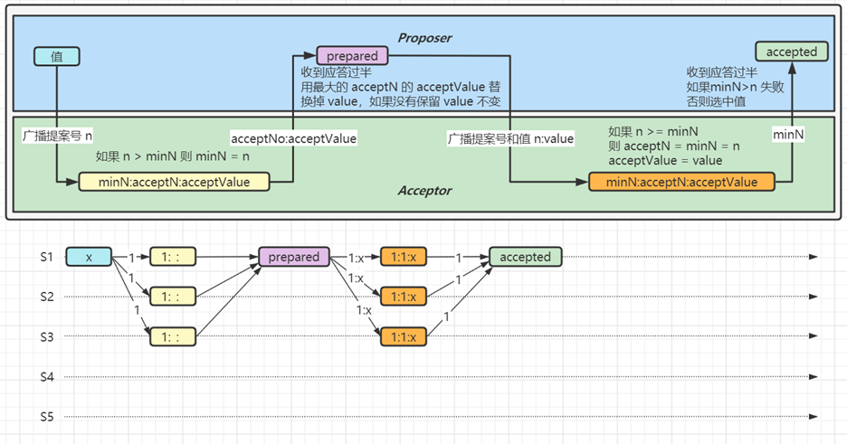
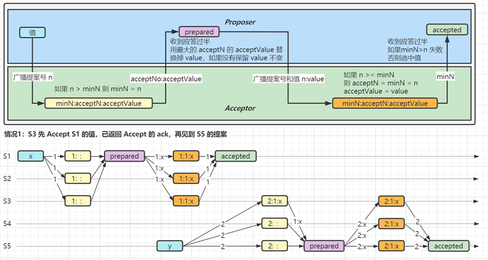
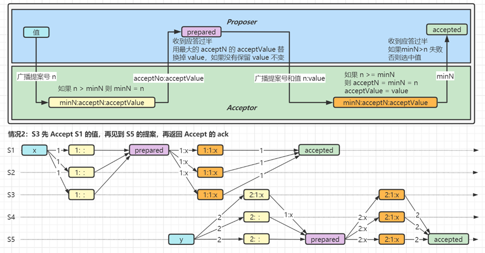
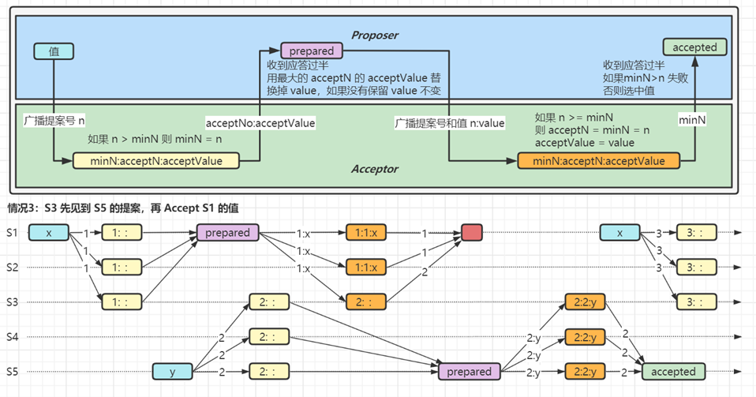
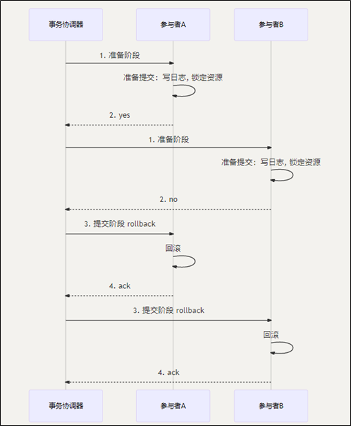
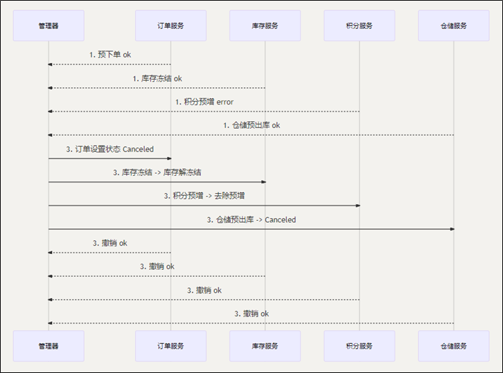

# 分布式篇

# 1. CAP 定理

**CAP 定理**

* **Consistency 一致性**：访问分布式系统中任意节点，总能返回一致的结果
  * Every read receives the most recent write or an error
* **Availability 可用性**：分布式系统总能向客户端返回响应
  * Every request receives a (non-error) response, without the guarantee that it contains the most recent write
* **Partition tolerance 分区容忍**：当分布式系统节点间通信发生了消息丢失或消息延迟，仍然允许系统继续运行
  * The system continues to operate despite an arbitrary number of messages being dropped (or delayed) by the network between nodes

CAP 定理：最多三选二，无法兼得，通常在 CP 或者 AP 之间做出选择

**不一致的产生**

1. client 向 Node1 写入新值 v1

2. 写入成功 Node1 更新成 v1

3. Node1 在没有将变更同步到 Node2 时，就向客户端返回了应答

4. client 发起向 Node2 的读操作

5. 返回了旧值 v0（不一致）的结果

**保证一致性**

1. client 向 Node1 写入新值 v1

2. 写入成功 Node1 更新成 v1，此时不能立刻向 client 返回应答，而是需要将 v1 同步到 Node2

3. 同步 v1 成功

4. 此时才能向 client 返回应答

5. 如果此时 client 再去访问 Node2，不会出现不一致的情况

**保 CP 失 A**

1. 当发生了网络分区，Node1 与 Node2 已经失去了联系，这时仍想对外提供服务（保 P）

2. client 向 Node1 写入新值 v1

3. 写入 Node1 成功，但无法同步至 Node2

4. 这时为了保证一致性，Node1 不能向 client 返回应答，造成操作挂起无法完成（失去可用性）

**保 AP 失 C**

1. 当发生了网络分区，Node1 与 Node2 已经失去了联系，这时仍想对外提供服务（保 P）

2. client 向 Node1 写入新值 v1

3. 写入 Node1 成功，但无法同步至 Node2

4. 为了保证可用性，向 client 返回了应答（但牺牲了一致性）

**一致性级别**

CP 和 AP 之间需要做权衡，其实根据需求不同，也可以将一致性划分成几个级别，在这些级别里做一个权衡。

* **强一致性**：系统写入什么，读出来的也会是什么，但实现起来往往对性能影响较大，例如之前 CP 的例子
  * 例如：火车站售票，有就是有，没有就是没有，不能出现不一致的情况
  * 典型算法：Paxos、Raft、ZAB
* **弱一致性**：系统写入成功后，不承诺立刻可以读到写入的值，也不承诺具体多久后数据能达到一致，还可以细分为：
  * 会话一致性，同一个客户端会话中可以保证一致，其它会话不能保证
  * 用户一致性，同一个用户中可以保证一致，其它用户不能保证
  * 例如：网上购物，在商品详情页看到库存量还有好多，下单的瞬间才被提示“库存量不足”，实际上商品详情页展示的库存并不是最新的数据，只是在某个流程上才会做准确的检查
* **最终一致性**：是弱一致性的特例，保证在一定时间内，能够达到一个一致的状态
  * 例如：转账，转账完成后，会有一个提示，您的转账会在 24 小时内到账，一般用户也能接受，但最终必须是一致的
  * 典型协议：Gossip

# 2. Paxos 算法

**问题提出**

1. 集群中有 N 个节点，如果一个节点写入后要求同步到剩余 N-1 个节点后再向客户端返回 ok，虽然看起来最保险，但其中任意一个节点同步失败，势必造成整个集群不可用，能否在此基础上稍微提高可用性呢？

2. 答案是 **（写）多数派**，集群节点设置为奇数，同步超过集群中 N/2 个节点成功，则向客户端返回 ok，但存在顺序性问题，如 3 描述
3. 多数派写操作成功后的读一致性暂不考虑，思考下图中的两项操作，都满足了多数派通过，但 S3 这台服务器并没有与 S1，S2 达成一致，要**达到多数派内部一致性**

**Paxos**

Paxos 是一种共识算法，目的是解决之前提到的写多数派时的顺序性问题

Paxos 角色划分：集群中的每个节点都可以充当

1. **Proposer**：负责生成提案
   * 注意：Paxos 算法允许有多个 Proposer 同时提案，但可能会引起活锁问题

2. **Acceptor**：负责批准提案
   * Acceptor 如果只有一个的话，存在单点问题，因此应当有多个

3. Learner：负责获取提案，Acceptor 批准提案后，会将提案发送给所有 Learner

执行一个修改操作，不是一上来就能执行，分成两个阶段：

1. 准备阶段：Proposer负责接收 client 请求并产生提案，必须由多数派 Acceptor 批准通过提案
2. 接受阶段：提案通过后，再将要执行的修改操作广播给 Acceptor，这次仍然多数派通过，此修改才能生效，可以返回响应给客户端

算法要点：

* 整个算法分成两个阶段：预备阶段，前两个箭头，接受阶段，后两个箭头。
  * 预备阶段的目的是：第一拦截掉旧的提案，第二找到最新的 acceptValue
* 对于 Proposer
  * 预备阶段只发送`提案号`，接受阶段发送`提案号 + 值`
  * `提案号` n 唯一且全局递增，大的`提案号`有更高优先级
  * 如果见到最新`已接受值`，就会替换掉 Proposer 自己原来的值，保证一致性
* 对于 Acceptor 会持久化以下信息
  * minN（最小提案号），会在预备阶段和接受阶段被更新为更大提案号，会用来决定 Proposer 是否能选中提案
  * acceptN（已接受提案号）和 acceptValue（已接受值），会在接受阶段被更新，如果 minN > n 则不会更新

**例1**

1. P 广播提案号 1

2. 有 3 个 A 接到提案，此时满足 n > minN，将 minN 更新为 1

3. 3个 A 成功返回，P 收到的应答过半，但没有遇到更大的 acceptNo 和 acceptValue，因此使用自己的 value X

4. P 广播提案号和值 1:X

5. 3 个 A 接到提案号和值，更新状态，返回 minN 值 1 给 P

6. P 收到过半应答，并检查发现没有出现 minN > 1，便选中提案值 X

**例2**

1. S1 广播提案号 1，想把值更新为 X

2. S5 广播提案号 2，想把值更新为 Y

3. S1、S2、S3 已经经历了 Accept 阶段并选中值 X

4. **关键点**，S3 也接到了 S5 的prepare 提案，这时是否会有不一致的情况呢？

5. 此时 S3 状态已将 acceptN 和 acceptValue 分别更新为 1:X；再返回 S5 的 ack 时就会将 1:X 返回给 S5

6. S5 用返回的 X 替换掉了自己原有的值 Y，并执行后续流程，后续都会同步为 X

**例3**

1. S1 广播提案号 1，想把值更新为 X

2. S5 广播提案号 2，想把值更新为 Y

3. S1、S2、S3 已经经历了 Accept 阶段，**与例2 不同的是，值 X 还未选中**

4. **关键点**，S3 也接到了 S5 的prepare 提案，这时是否会有不一致的情况呢？

5. 此时 S3 状态将 acceptN 和 acceptValue 分别更新为 1:X；再返回 S5 的 ack 时就会将 1:X 返回给 S5

6. S5 用返回的 X 替换掉了自己原有的值 Y，并执行后续流程，后续都会同步为 X

**例4**

1. S1 广播提案号 1，想把值更新为 X

2. S5 广播提案号 2，想把值更新为 Y

3. **关键点**，S3 还未经历 Accept 阶段时，就拿到了 S5 的 prepare 提案，这时是否会有不一致的情况呢？

4. S3 在接到 S1 的 accept 请求时，n>=minN 条件不成立，因此没有更新 acceptN 和 acceptValue，并且返回的 minN 是 2

5. 对 S1 来说，S3 返回的 minN 大于 n，选中失败；想更新 X 需要发起新一轮提案

6. 对 S5 来说，accept 阶段发送的是它自己的 2:Y，后续会把值同步为 Y

**例5**

回顾最早提到的顺序性问题，看 Paxos 能否解决它

下图演示了 Paxos 是如何解决顺序性问题的，分析步骤参考例3

**Paxos 缺点**

1. 效率较低，两轮操作只能选中一个值

2. 难于理解

3. 活锁问题

* Paxos 是允许多个 Proposer 的，因此如果按上图所示运行，则后一个提案总会让前面提案选中失败，显然死循环

> ***参考资料***
>
> * https://www.youtube.com/watch?v=JEpsBg0AO6o&t=41s Raft 作者讲解 Paxos

# 3. Raft 算法

**要求**

* 理解 Raft 算法

**Raft 算法**

另一种共识算法，目的是比 Paxos 更易理解

整个 Raft 算法分解为三部分：

1. **Leader 选举**

   ① 只有一个 Server 能作为 Leader

   ② 一旦此 Server 崩溃，选举新 Leader

2. **执行操作，以日志复制为例（Log replication）**

   ① 由 Leader 执行自己的日志记录

   ② 将日志复制到其它 Server，会覆盖掉不一致的部分

   ③ 多数派记录日志成功，Leader 才能执行命令，向客户端返回结果

3. **确保安全**

   ① 保证日志记录的一致性

   ② 拥有最新日志的 Server 才能成为 Leader

**Leader 选举**

1. **Leader** 会不断向**选民**发送 AppendEntries 请求，证明自己活着

2. **选民**收到 **Leader** AppendEntries 请求后会重置自己的 timeout 时间

3. **选民**收不到 AppendEntries 请求超时后，转换角色为**候选者**，并将**任期**加1，发送 RequestVote 请求，推选自己

4. **选民**收到第一个 RequestVote，会向该**候选者**投一票，这样即使有多个**候选者**，必定会选出一个 **Leader**，选票过半即当选，如果落选会变回**选民**

5. 每一**任期**最多有一个 **Leader**，但也可能没有（选票都不过半的情况，需要再进行一轮投票，timeout 在 T~2T 间随机）

6. **任期**由各个 server 自己维护即可，无需全局维护，在超时后加1，在接收到任意消息时更新为更新的**任期**，遇到更旧的**任期**，视为错误

**执行操作（以日志复制为例）**

1. **客户端**发送命令至 **Leader**

2. **Leader** 将命令写入日志（S1虚框），并向所有**选民**发送 AppendEntries 请求

3. 多数派通过后，执行命令（即提交，S1虚框变实），此时就可以向**客户端**返回结果

4. 在后续的 AppendEntries 请求中通知**选民**，**选民**执行命令（即提交，S2,S3,S4,S5虚框变实）

5. 如果**选民**挂了，则 **Leader** 会不断尝试，待到**选民**重启，会将其缺失的日志陆续补齐

**确保安全**

Leader 日志的完整性

1. Leader 被认为拥有最完整的日志

2. 一旦 Leader 完成了某条命令提交，那么未来的 Leader 也必须存有该条命令提交信息

3. 投票时，会将候选者最新的 `<Term，Index>` 随 RequestVote 请求发送，如果候选者的日志还没选民的新，则投否决票

* 图中 S2 如果超时，发起选举请求，其它服务器只会对它投否决票，因为它的 Index 比其它人都旧
* 图中 S5 如果超时，发起选举请求，其它服务器也不会选它，因为他的 Term 太旧

选民日志的一致性

1. 以 Leader 为准，对选民的日志进行补充或覆盖

2. AppendEntries 请求发送时会携带最新的 `<Term,Index,Command>` 以及上一个的 `<Term,Index>`

3. 如果选民发现上一个的 `<Term,Index>` 能够对应上则成功，否则失败，继续携带更早的信息进行比对

* 图中 Leader 发送了 `<3,4,Command>` 和 `<2,3>` 给 follower，follower 发现 `<2,3>` 能够与当前最新日志对应，这时直接执行 `<3,4,Command>` 即可

* 图中 Leader 发送了 `<3,4,Command>` 和 `<2,3>` 给 follower，follower 发现 `<2,3>` 不能与当前最新日志对应，会央求 Leader 发送更早日志

* Leader 这次发送了 `<3,4,Command>` ， `<2,3,Command>` ，`<1,2>` 给 follower，follower 发现 `<1,2>` 能够与当前最新日志对应，这时补全 `<3,4,Command>` ， `<2,3,Command>`  即可

> ***参考资料***
>
> * https://www.youtube.com/watch?v=vYp4LYbnnW8 Raft 作者讲解 Raft
> * https://raft.github.io/ Raft 资源
> * https://raft.github.io/raftscope/index.html Raft 可视化

# 4. Gossip 协议

**要求**

* 掌握 Gossip 协议

**Gossip 协议**

与 Paxos 和 Raft 目标是强一致性不同，Gossip 达到的是最终一致性

* A gossip protocol is a procedure or process of computer peer-to-peer communication that is based on the way epidemics spread.

它可以快速地将信息散播给集群中每个成员，散播速度为 $𝑙𝑜𝑔_𝑓 (𝑁)$ （f为底 N的对数），其中 f 术语称为 fanout，代表每次随机传播的成员数，而 N 代表总共成员数。例如：

* $𝑙𝑜𝑔_4 (40)≈2.66$ ，也就是大约三轮传播，就可以让集群达到一致
* 实际传播次数可能会高于此结果，因为随机时会随到一些重复的成员

**Gossip 协议工作流程**

1. 例如，图中红色节点有其它节点不知道的信息，它的传播方式如下

2. 在红色节点能连通的节点中随机挑选 fanout 个（粗线所示）

3. 把信息传播给它们（感染）

4. 在这些已被【感染】的节点中，重复 2. 3. 两步，直至全部感染，即达到最终一致性

**Gossip 协议优点**

* 扩展性高，传播次数不会受集群成员增长而增长过快
  * 例如： $𝑙𝑜𝑔_4 (80)≈3.16$ ，集群实际成员翻了一倍，但传播次数几乎不变
* 容错性好，即使某些节点间发生了故障无法通信，也不会影响最终的一致性
  * 例如：A 与 B 之间发生故障无法通信，但只要 A 与其他能连通 B 的节点通信，那么信息就一定会散播到 B 
* Robust（鲁棒性），即皮实，集群中的节点是对等的，即便一些节点挂了，一些节点新添加进来，也不会影响其它节点的信息传播

> ***参考资料***
>
> * [https://flopezluis.github.io/gossip-simulator/#](https://flopezluis.github.io/gossip-simulator/) Gossip 可视化

# 5. 分布式通用设计

## **如何检测节点活着**

答案：通过心跳

* 向节点周期性发送心跳请求，如果能收到心跳回应，表示该节点还活着
* 但如果收不到心跳回应，却不能证明该节点死了，可能由于网络抖动、回应延时等原因没能及时收到回应。有如下解决思路：
  1. 如 Redis 哨兵模式中，如果 sentinel 向 master 发送 PING 而没有收到 PONG，只能判定主观下线，必须采纳其它 sentinel 的意见，达到多数派后才能判定客观下线，进入主备切换流程
  2. 将周期心跳检测升级为累计心跳检测机制，即记录统计该节点的历史响应时间，如果超过警戒，则发起有限次的重试作为进一步判定

## **如何实现高可用**

建议阅读《大型网站技术架构 – 核心原理与案例分析》一书，李智慧著，优点是条理清晰，不像另一些东拼西凑的文章
节录、概要如下：

* 应用层高可用

  * 关键是做到：**无状态**，即所有节点地位平等，去 session 化。利用**负载均衡**将请求发送到任意一台节点进行处理，如果有某个节点宕机，把该节点从服务列表中移除，不会影响业务运行

* 服务层高可用

  * 同样要做到：无状态，此外还应当考虑：

    ① 核心服务和非核心服务隔离部署，分级管理，方便非核心服务降级

    ② 对于即时性没有要求的服务可以考虑采用异步调用优化

    ③ 合理设置超时时间，在超时后应当有相应的处理策略，如：重试、转移、降级等

* 数据层高可用

  * 需要有**数据备份**机制与**故障转移**机制

  * 缓存服务是否需要高可用，两种观点：

    ① 缓存服务不可用会让数据库失去保护，因此需要保证缓存服务高可用

    ② 缓存服务不是数据存储服务，缓存宕机应当通过其他手段解决，如扩大缓存规模，一个缓存服务器的宕机只会影响局部

## **全局 ID 生成**

1. 数据库 id 表
   * Oracle 数据库，直接使用序列作为 id
   * MySQL 数据库，采用自增主键作为 id，如果想避免单点故障，用多台 MySQL 使用不同的起始值和步长来设置 auto_increment
   * 缺点：数据库并发不高，属于集中式的解决方案
2. Redis 
   * 使用 incr 生成 id，由于 redis 的单线程特性，能保证它不会重复
   * 缺点：仍然属于集中式的解决方案，有网络消耗
3. UUID
   * UUID 有多种实现，典型的 UUID 实现会包含时间信息、MAC 地址信息、随机数
   * 优点：属于本地解决方案，无网络消耗
   * 缺点：MAC 地址提供了唯一性的保证，但也带来安全风险，最糟的是它是字符串形式，占用空间大，查询性能低，无法保证趋势递增
4. Snowflake
   * 通常的实现是 41 位时间信息、精确到毫秒，10 位的机器标识、12 位 的序列号，还有 1 位没有使用，共 8 个字节
   * 理解思想后，可以根据自己实际情况对原有算法做调整
   * 优点：本地解决方案，无网络消耗。长整型避免了字符串的缺点，并能保证趋势递增

## **负载均衡策略**

负载均衡：即使用多台服务器共同分担计算任务，把网络请求和计算按某种算法均摊到各个服务器上

* 可以使用硬件实现（如 F5），也可以使用软件实现（如 Nginx、Dubbo、 Ribbon 等诸多软件均有自己的负载均衡实现）
* 常见负载均衡算法有：
  * 轮询，轮流来（Nginx、Ribbon）
  * 加权轮询，在轮询的基础上考虑权重，权重高的，分到请求的机会更多（Nginx 、Dubbo）
  * 最少连接，指谁的活跃连接数少，就把请求分发给谁，因为活跃多意味着响应慢（Nginx、Dubbo）
  * 最少响应时间，指谁的响应快，且活跃连接数少，就把请求发给谁（Nginx、Ribbon）
  * 随机，随便发给谁（Nginx、Dubbo、Ribbon）
  * hash，例如根据 ip 的hash 值分配请求，ip 相同的请求总会由同一台服务器处理（Nginx）
  * 一致性 hash，比 hash 好处在于添加、移除节点对请求分发影响较小（Dubbo）

> ***参考文档***
>
> * https://nginx.org/en/docs/http/load_balancing.html
> * https://dubbo.apache.org/zh/docsv2.7/user/references/xml/dubbo-provider/

## **数据分片策略**

所谓分片就是指数据量较大时，对数据进行水平切分，让数据分布在多个节点上。

1. Hash
   * 按照 key 的 hash 值将数据映射到不同的节点上
   * 优点：实现简洁、数据分布均匀
   * 缺点1：如果直接 hash 与节点数取模，节点变动时就会造成数据大规模迁移，可以使用一致性 hash 改进
   * 缺点2：查询某一类热点数据时，由于它们是用 hash 分散到了不同节点上，造成查询效率不高
2. Range
   * 可以将 key 按照进行 range 划分，让某一范围的数据都存放在同一节点上
   * 优点1：按 range 查询，性能更高
   * 优点2：如果配合动态 range 分片，可以将较小的分片合并、将热点数据分散，有很多有用的功能
3. 静态调度与动态调度
   * 静态意味着数据分片后分布固定，即使移动也需要人工介入
   * 动态意味着通过管理器基于调度算法在各节点之间自由移动数据

## **分布式事务 - 方案1：2PC 两阶段提交**

* 在准备阶段所有参与者都返回 yes，则提交阶段通知参与者提交事务
* 在准备阶段有一个参与者返回 no，或是返回响应超时，则提交阶段通知所有参与者回滚事务

存在问题

* 阻塞型协议：所有参与者在等待接到下一步操作前，都处于阻塞，占用的资源也一直被锁定
* 过于保守：任一个节点失败都将导致事务回滚
* 数据不一致：在阶段二，如果只有部分参与者收到了提交请求，则会造成数据不一致
* 协调者单点问题：如果协调者故障在阶段二出现问题，会导致所有参与者（不会超时）始终处于阻塞状态，资源也被锁定得不到释放

## **分布式事务 - 方案2：TCC 事务补偿**

* Try：对数据校验、资源预留
* Confirm：执行业务确认
* Cancel：实现与 try 相反的操作

要点

* 本质上还是两阶段提交，不过无需借助数据库驱动，在应用层完成，业务侵入比较深
* 需要每个节点上配置 TCC 框架，记录操作日志和状态，以便在宕机时恢复
* TCC 操作必须要考虑幂等

## **分布式事务 - 方案3：基于可靠性消息的最终一致性方案**

要点

* 2PC 和 TCC 都属于同步方案，实际开发中更多采用的是异步方案

  * 例如：**下单**后的支付、扣减库存、增加积分等操作对实时性要求并不高。此时将**下单成功的消息**写入消息中间件，利用消息中间件实现最终一致性

* 问题转换成保证**本地事务与消息投递的原子性**

  * 例如：RocketMQ 的解决方案如下

    ① 发送消息到 broker ，只是此时消息称为**半消息**，无法消费

    ② 执行本地事务，如果成功，则半消息转换为正式消息，允许被消费；如果失败，删除 broker 上的半消息

    ③ 对于 broker 这端，如果迟迟不能收到半消息的 commit 或 rollback 信息，则会**回查**本地事务是否完成，根据状态确定如何处理

# 6. 一致性 Hash（补充）

前面讲负载均衡和数据分片时，都提到了一致性 Hash，它是为了解决在服务器增、删时普通 hash 算法造成数据大量迁移问题的

**普通 hash 算法**

* 假设有 3 台服务器，10 个 key 在服务器上的分布如下图所示

* 添加一台服务器后，数据分布变成下图，可以看到除了一个 key（上下颜色相同的）以外，其它 key 都得迁移

**一致性 hash 算法**

* 假设有 3 台服务器，10 个 key 在服务器上的分布如下图所示

* 添加一台服务器后，数据分布变成下图，发现仅有 3 个key 需要迁移（上下颜色不同的）

